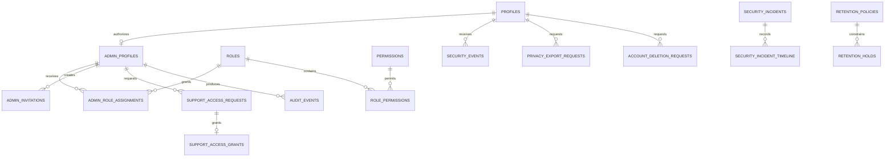

# Data Model: Admin RBAC, RLS, Audit & Security Foundation

**Phase / Spec**: Phase 03 / SPEC-BE-003
**Database**: Supabase PostgreSQL 17 conventions established by SPEC-BE-001
**Consumed baseline**: `public.profiles`, `private.set_updated_at_and_version()`,
`private.enqueue_outbox_event()`, runtime roles, and private `report-exports` bucket

## Shared Column Conventions

- `M`: `id uuid primary key default gen_random_uuid()`, `created_at timestamptz
not null default now()`, `updated_at timestamptz not null default now()`, and
  `version bigint not null default 1 check (version >= 1)`.
- `U`: `user_id text not null references public.profiles(id) on delete restrict`.
- `I`: immutable row with `id uuid primary key default gen_random_uuid()` and its
  documented occurrence/creation timestamp; no update/delete runtime privilege.
- Mutable `M` tables attach the existing updated-at/version trigger. API DTOs may
  supply `expectedVersion`; clients never set timestamps or versions.
- Identifiers and keys are NFC-normalized, trimmed, bounded, and checked against
  their documented lowercase/safe-token patterns.

## Entity Catalog

### `public.security_events` (immutable)

| Column        | Type / nullability                       | Rule                                                |
| ------------- | ---------------------------------------- | --------------------------------------------------- |
| `id`          | uuid PK                                  | generated                                           |
| `user_id`     | text nullable FK `profiles(id)` RESTRICT | nullable for system/Admin-only events               |
| `event_type`  | text not null                            | 1–80 safe lowercase dotted key                      |
| `severity`    | text not null                            | `info/low/medium/high/critical`                     |
| `ip_hash`     | text nullable                            | keyed digest only; never raw IP                     |
| `user_agent`  | text nullable                            | normalized, redacted, maximum 256 code points/1 KiB |
| `metadata`    | jsonb not null default `{}`              | object, at most 20 allowlisted scalar entries/4 KiB |
| `occurred_at` | timestamptz not null default now()       | not materially future-dated                         |

Indexes: `(user_id, occurred_at desc, id desc)`, `(severity, occurred_at desc,
id desc)`, and `(event_type, occurred_at desc, id desc)`.

### `public.admin_profiles` (mutable)

`user_id text primary key references profiles(id) on delete restrict`, `status
text not null default 'invited'`, `department text null`, `last_admin_login_at
timestamptz null`, `created_at`, `updated_at`, `version`.

Status is `invited/active/suspended/revoked`. An Admin profile cannot be active
unless its customer profile is active. Index `(status,user_id)`.

### `public.roles` (mutable)

Shared `M` plus `key text not null unique`, `name text not null`, `description text
null`, `system_role boolean not null default false`, `enabled boolean not null
default true`. Key matches `^[a-z][a-z0-9-]{1,63}$`; name/description are bounded.
System rows cannot be deleted. Index `(key)` unique and partial `(key,id) where
enabled`.

### `public.permissions` (mutable reference data)

Shared `M` plus `key text not null unique`, `resource text not null`, `action text
not null`, `description text null`; unique `(resource,action)`. Keys use exact
lowercase dotted/snake/hyphen spelling from the recorded manifest. Permission
definitions are never disabled or deleted; replacement is additive and old keys
remain unassigned until retired. Index `(resource,action,id)`.

### `public.role_permissions` (immutable mapping rows)

`role_id uuid not null references roles(id) on delete cascade`, `permission_id
uuid not null references permissions(id) on delete cascade`, `created_at
timestamptz not null default now()`, primary key `(role_id,permission_id)`. Reverse
index `(permission_id,role_id)`. Mapping replacement occurs only through guarded
role commands and is audited as one logical change.

### `public.admin_role_assignments` (mutable, one-way revocation)

Shared `M` plus `user_id text not null references admin_profiles(user_id) on
delete restrict`, `role_id uuid not null references roles(id) on delete restrict`,
`assigned_by text not null references admin_profiles(user_id) on delete restrict`,
`starts_at timestamptz not null default now()`, `ends_at timestamptz null`,
`revoked_at timestamptz null`, and `reason text not null`.

Checks: `ends_at > starts_at` when present; `revoked_at >= created_at` when present;
bounded reason. Unique partial `(user_id,role_id) where revoked_at is null` plus
`(user_id,starts_at,ends_at,revoked_at)` and
`(role_id,starts_at,ends_at,revoked_at)`.

### `public.admin_invitations` (mutable lifecycle)

Shared `M` plus `email text not null`, `role_id uuid not null references roles(id)
on delete restrict`, `token_hash text not null unique`, `invited_by text not null
references admin_profiles(user_id) on delete restrict`, `expires_at timestamptz not
null`, `department text null`, `accepted_at timestamptz null`, and `revoked_at
timestamptz null`.

Email is normalized lowercase; expiry follows creation; accepted/revoked are
mutually exclusive. Unique active `lower(email)` where both terminal timestamps are
null; indexes `(role_id,expires_at)` and `(invited_by,created_at desc,id desc)`.
Only the hash is persisted. Acceptance requires token-hash match, unexpired state,
and the same Clerk-verified email.

### `audit.audit_events` (immutable)

`id uuid primary key default gen_random_uuid()`, `actor_id text null`, `actor_type
text not null`, `action text not null`, `resource_type text not null`, `resource_id
text null`, `before_hash text null`, `after_hash text null`, `reason text null`,
`request_id text not null`, `metadata jsonb not null default '{}'`, `occurred_at
timestamptz not null default now()`.

Actor type is `user/admin/system/provider`. Identifiers and reason are bounded;
metadata is an allowlisted scalar object and hashes cannot contain raw values.
Indexes: `(resource_type,resource_id,occurred_at desc,id desc)`,
`(actor_id,occurred_at desc,id desc)`, `(action,occurred_at desc,id desc)`, and
`(request_id)`.

### `private.support_access_requests` (mutable lifecycle)

Shared `M` plus `user_id text not null references profiles(id) on delete restrict`,
`requested_by text not null references admin_profiles(user_id) on delete restrict`,
`assignee text not null references admin_profiles(user_id) on delete restrict`,
`support_ticket_id text not null`, `purpose text not null`, `scope jsonb not null`,
`customer_approval_required boolean not null default false`, `status text not null
default 'pending'`, `customer_approved_at timestamptz null`, `expires_at timestamptz
not null`, `approved_by text null references admin_profiles(user_id)`, and
`decided_at timestamptz null`.

Status is `pending/approved/denied/expired/revoked`. Scope is the closed array
defined in [contracts/internal-contracts.md](contracts/internal-contracts.md).
Expiry is after creation, current API duration is 5–60 minutes, and the database
hard maximum is 24 hours. Requester cannot approve. Indexes:
`(user_id,status,created_at desc,id desc)`, `(requested_by,created_at desc,id desc)`,
`(assignee,status,expires_at)`, and `(status,expires_at,id)`.

### `private.support_access_grants` (immutable except revocation)

`id uuid primary key default gen_random_uuid()`, `request_id uuid not null references
support_access_requests(id) on delete restrict`, `admin_id text not null references
admin_profiles(user_id) on delete restrict`, `scope jsonb not null`, `starts_at
timestamptz not null`, `ends_at timestamptz not null`, `revoked_at timestamptz null`,
`created_at timestamptz not null default now()`.

End follows start and duration is at most 24 hours. Scope is a subset of the locked
request. Unique partial `(request_id) where revoked_at is null`; indexes
`(admin_id,starts_at,ends_at,revoked_at)` and `(request_id)`.

### `private.security_incidents` (mutable)

Shared `M` plus `title text not null`, `severity text not null`, `status text not
null default 'open'`, `detected_at timestamptz not null`, `owner_id text null
references admin_profiles(user_id) on delete restrict`, `contained_at timestamptz
null`, `resolved_at timestamptz null`, `summary_redacted text null`.

Severity uses the standard five values. Status is
`open/investigating/contained/resolved`; allowed transitions are explicit and
timeline timestamps cannot precede detection. Indexes
`(status,severity,detected_at desc,id desc)` and
`(owner_id,status,detected_at desc,id desc)`.

### `private.security_incident_timeline` (immutable)

`id uuid primary key default gen_random_uuid()`, `incident_id uuid not null
references security_incidents(id) on delete cascade`, `actor_id text null`,
`event_type text not null`, `details_redacted text not null`, `occurred_at
timestamptz not null default now()`. Index `(incident_id,occurred_at,id)`.

### `private.privacy_export_requests` (mutable + owner)

Shared `M+U` plus `status text not null default 'requested'`, `scope jsonb not null
default '[]'`, `requested_at timestamptz not null default now()`, `verified_at
timestamptz null`, `storage_ref text null`, `expires_at timestamptz null`,
`completed_at timestamptz null`, and `error_code text null`.

Status is `requested/verified/processing/ready/expired/failed`. Ready requires a
server-generated storage reference, checksum, nonnegative size, completion, and
future expiry. Checksum and size live in immutable Storage object metadata and the
package manifest rather than duplicate columns. One active row per user where status is requested/verified/
processing/ready. Indexes `(status,requested_at,id)` and partial `(expires_at,id)
where status='ready'`.

### `private.account_deletion_requests` (mutable + owner)

Shared `M+U` plus `status text not null default 'requested'`, `requested_at
timestamptz not null default now()`, `verified_at timestamptz null`,
`cooling_off_ends_at timestamptz not null`, `completed_at timestamptz null`,
`retention_result jsonb not null default '{}'`, and `error_code text null`.

Status is `requested/verified/cancelled/processing/completed/failed`. Cooling-off
cannot precede request time. `retention_result` contains only handler version,
policy ID, safe counts/outcomes, and completion markers. One active row per user
for requested/verified/processing. Indexes `(status,cooling_off_ends_at,id)` and
`(completed_at,id)`.

### `private.retention_policies` (mutable)

Shared `M` plus `resource_type text not null unique`, `retention_days integer not
null`, `deletion_mode text not null`, `legal_basis text not null`, `enabled boolean
not null default true`. Days are nonnegative; mode is
`delete/anonymize/archive`; text is bounded. Partial index
`(resource_type,retention_days) where enabled`.

### `private.retention_holds` (mutable, one-way end)

Shared `M` plus `resource_type text not null references
retention_policies(resource_type) on delete restrict`, `resource_id text not null`,
`reason text not null`, `starts_at timestamptz not null default now()`, `ends_at
timestamptz null`, and `created_by text not null references
admin_profiles(user_id) on delete restrict`.

End follows start. Because `now()` cannot appear in an index predicate, the guarded
command takes an advisory lock derived from `(resource_type,resource_id)` and
rejects an overlapping current/future hold before insert. Indexes
`(resource_type,resource_id,starts_at,ends_at)` and `(ends_at,id)` keep that check
bounded without adding a state column or extension.

## Permission and Alias Seeds

- Seven immutable system role keys: `super-admin`, `support-agent`,
  `billing-operator`, `import-operator`, `ai-operator`, `content-manager`, and
  `security-administrator`.
- The seed contains all 151 current Admin keys and the canonical Phase 03 keys.
- Aliases are a migration/test mapping, not runtime fallback:

| Client key                       | Canonical server key       |
| -------------------------------- | -------------------------- |
| `roles.read`                     | `access.roles.read`        |
| `roles.manage`                   | `access.roles.write`       |
| `admin-team.invite`              | `access.invites.write`     |
| `admin-team.roles.assign`        | `access.assignments.write` |
| `support.request_access`         | `support.access.request`   |
| `audit.logs.read`                | `audit.read`               |
| `data_requests.exports.read`     | `privacy.exports.read`     |
| `data_requests.exports.manage`   | `privacy.exports.manage`   |
| `data_requests.deletions.read`   | `privacy.deletions.read`   |
| `data_requests.deletions.manage` | `privacy.deletions.manage` |
| `data_retention.read`            | `retention.read`           |
| `data_retention.manage`          | `retention.write`          |

Each client key maps exactly once. System role mappings are replaced atomically by
deterministic seed content; unknown keys fail migration/CI.

## Relationships

## Authorization and RLS Matrix

| Resource                 | Customer owner          | Other customer | Admin API role                 | Worker role                 | Direct browser/Admin |
| ------------------------ | ----------------------- | -------------- | ------------------------------ | --------------------------- | -------------------- |
| `security_events`        | safe SELECT own         | deny           | guarded redacted SELECT        | append/alert claim only     | deny                 |
| privacy/deletion status  | guarded safe SELECT own | deny           | guarded redacted SELECT/action | guarded lifecycle           | deny                 |
| Admin/RBAC public tables | deny                    | deny           | guarded API SQL only           | bootstrap/reconcile minimum | deny                 |
| audit/private tables     | deny                    | deny           | guarded functions/queries only | job-specific minimum        | deny                 |
| audit/timeline/history   | deny mutation           | deny           | append function only           | append function only        | deny                 |

All public identity-bearing tables enable and force RLS. Default `PUBLIC`, `anon`,
and `authenticated` privileges are revoked before explicit policy/grant creation.
The production connection role is not owner/superuser/BYPASSRLS. `audit` and
`private` have no client schema usage. Functions are `SECURITY DEFINER` only where
required, have fixed `search_path`, validate caller context, and receive narrow
execute grants.

## Atomic Command Rules

1. Begin transaction; set verified minimal Clerk claims and `SET LOCAL ROLE
masarifi_api` (or worker role).
2. Assert active customer profile and exact Admin permission; assert recent MFA in
   application input derived only from the verified token when required.
3. Lock target/invariant rows in stable order and verify `expectedVersion`.
4. Apply state change; append immutable audit/timeline/security evidence.
5. Enqueue the safe outbox event in the same transaction.
6. Commit; external Clerk/Storage delivery occurs afterward through a retryable
   worker step unless the provider operation is a prerequisite for local commit.

Last-super-admin continuity locks active super-admin assignment candidates before
disable/revoke/change. Support approval locks the request before subset/time checks.
Privacy/deletion workers claim with `FOR UPDATE SKIP LOCKED`; a crash rolls back the
claim or leaves a recoverable processing state reconciled by age/version.

## Migration Order

1. `20260827001400_admin_access_tables.sql`
2. `20260827001500_admin_permission_role_seeds.sql`
3. `20260827001600_audit_security_events.sql`
4. `20260827001700_support_access_incidents.sql`
5. `20260827001800_privacy_retention.sql`
6. `20260827001900_admin_security_functions_rls_grants.sql`

Generate actual files through `supabase migration new`; if a slot is occupied,
take the next timestamp rather than renaming history. Companion pgTAP files begin
at `009_admin_rbac_structure.test.sql` and remain ordered through authorization,
immutability, support, privacy/retention, and Admin-denial matrices. Update
`supabase/migration-checksums.sha256` after final SQL.

## Rollback and Retention

- Disable new routes and stop the security worker before application rollback.
- Run only N-1-compatible images against this additive schema.
- Correct defects with a new forward migration; never drop or rewrite owned
  history, permission seeds, invitations, assignments, grants, audit, security,
  privacy, deletion, or retention rows.
- Remove unsafe permissions from role mappings or leave them unassigned.
- Delete expired Storage objects through the worker while retaining only safe
  request/checksum/status evidence according to approved policy.
