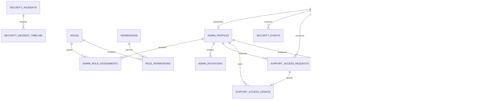

# Backend Feature Specification: Admin RBAC, RLS, Audit & Security Foundation

**Phase / Spec**: Phase 03 / SPEC-BE-003 of 014
**Working Branch**: `main`
**Feature Directory**: `apps/api/specs/003-admin-rbac-security`
**Base Revision**: `ecaa54a7291d8cd06b0e44e871a84790a19f3d4c`
**Created**: 2026-08-29
**Status**: Draft
**Input**: "Read the complete Backend Master Plan and specify Phase 03 - SPEC-BE-003: Admin RBAC, RLS, Audit & Security Foundation"

## Objective and Scope

Establish the single deny-by-default authorization and security-policy foundation
for every privileged Masarifi backend operation. This Spec owns administrator
profiles, invitations, roles, permission definitions, time-bounded assignments,
exact permission evaluation, immutable audit and security evidence, controlled
support access, security-incident handling, customer privacy export and account
deletion orchestration, retention policies, and retention holds.

The outcome is a backend in which Clerk authenticates administrators but never
grants application privilege; only active database-backed administrator state and
an exact effective permission authorize an Admin action. Customer ownership RLS,
Admin permission checks, recent-auth/MFA evidence, support grants, and immutable
audit evidence remain independent mandatory controls.

This Spec defines the shared permission, audit, support-access, privacy, and
retention contracts consumed by later domain Specs. Later Specs MUST call these
contracts and MUST NOT create a second role system, role header, permission cache,
audit sink, support-access mechanism, privacy orchestrator, or retention-policy
store.

This Spec does not implement later domain data, change Mobile or Admin production
adapters, grant administrators unrestricted customer-data access, or make Clerk
metadata authoritative for roles. Client cutover remains SPEC-BE-014.

## Dependencies and Repository Baseline

- **Prior Specs**: SPEC-BE-001 platform, SQL migration conventions, API/worker,
  outbox, Storage, safe errors, correlation IDs, and runtime controls; SPEC-BE-002
  Clerk JWT verification, `profiles`, active-profile checks, devices, sessions,
  and recent-auth/MFA evidence.
- **Downstream dependencies**: SPEC-BE-004 through SPEC-BE-013 register their
  permissions, privileged actions, audit calls, privacy export/delete handlers,
  and retention resource types through the contracts owned here.
- **Current repository facts**: `apps/api` is an initialized NestJS backend on
  synchronized `main`; SPEC-BE-001 and SPEC-BE-002 packages exist; no Phase 03
  package, migration, table, policy, endpoint, seed, or job exists at this base
  revision.
- **Current Admin facts**: Admin exposes seven simulated role concepts and 151
  executable permission keys in
  `apps/admin-web/src/core/permissions/permissions.ts`, with role mappings in
  `role-map.ts`; role simulation, query-string roles, and role headers are client
  test behavior only and cannot grant backend access.
- **Current Admin contracts reviewed**: user/device/session views and actions,
  administrator governance and invitations, roles and permission matrix,
  temporary support access, security overview/events/incidents, audit explorer,
  privacy export/deletion, and retention repositories and schemas.
- **Current Mobile contracts reviewed**: session listing/revocation, security
  event listing, and `data_export` / `account_deletion` privacy requests through
  the existing Settings service boundary.
- **External prerequisites**: the one Clerk application from SPEC-BE-002 must
  provide verified asymmetric session claims and authoritative recent-auth/MFA
  evidence. No Clerk role metadata is trusted.
- **Governing documents**: Backend Constitution 2.0.0 and the complete Backend
  Master Plan, especially Sections 4-6, 8-13, Phase 03, the ownership index, and
  the Definition of Done for every Spec.

## Owned Resources

This Spec exclusively owns:

- **Public tables**: `security_events`, `admin_profiles`, `roles`, `permissions`,
  `role_permissions`, `admin_role_assignments`, and `admin_invitations`.
- **Audit table**: `audit.audit_events`.
- **Private tables**: `support_access_requests`, `support_access_grants`,
  `security_incidents`, `security_incident_timeline`,
  `privacy_export_requests`, `account_deletion_requests`, `retention_policies`,
  and `retention_holds`.
- **Database functions**: `private.admin_has_permission`,
  `private.assert_admin_permission`, `private.assert_support_grant`, and
  `audit.append_event`, plus bounded guarded commands needed to create or advance
  owned support, incident, privacy, deletion, retention, invitation, role, and
  assignment records.
- **Triggers**: shared version trigger attachments for mutable owned tables;
  immutable-row rejection for security, audit, grant, and incident-timeline
  evidence; lifecycle and no-self-approval constraints that require cross-row
  checks.
- **API namespaces**: `/api/v1/admin/access`, `/api/v1/admin/audit`,
  `/api/v1/admin/security`, `/api/v1/admin/privacy`,
  `/api/v1/admin/retention`, customer security-event reads, and customer privacy
  export/deletion requests under `/api/v1/me`.
- **Jobs**: `privacy.export.generate`, `account.deletion.execute`,
  `retention.apply`, `support-grants.expire`, and `security-alert.dispatch`.
- **Events**: `admin.*`, `security.*`, and `privacy.*` event names listed below.
- **Reference seeds**: the seven current Admin role concepts, the normalized
  permission manifest derived from the 151 current client keys, and initial
  retention-policy rows approved for resources known at this phase.
- **Operational contracts**: bootstrap of the first super administrator,
  permission-drift detection, OWASP traceability, support-access approval and
  revocation, audit append failure handling, privacy/deletion reconciliation,
  retention-hold handling, alerts, and rollback runbooks.

Resources explicitly owned elsewhere:

- Clerk identities, customer profiles, user preferences, devices, push tokens,
  and Clerk webhook records remain SPEC-BE-002 resources.
- Customer financial, planning, import, AI, report, notification, support-ticket,
  billing, job, provider-health, settings, feature-flag, and maintenance data stay
  with their owning Specs.
- The `report-exports` bucket is created by SPEC-BE-001. This Spec owns privacy
  package authorization, lifecycle, object references, and expiry, not the bucket.
- Domain export/delete implementations remain with their domain owners. This
  Spec owns orchestration, status, retry, evidence, retention decisions, and the
  final customer-visible privacy outcome.
- Admin application changes, production mock removal, and live adapter selection
  remain SPEC-BE-014.

## User Scenarios and Testing

### User Story 1 - Authorize Every Admin Action Exactly (Priority: P1)

An authenticated administrator can perform only operations granted by active,
time-valid database role assignments and exact permissions. A missing, expired,
revoked, unavailable, or differently named permission denies the request.

**Why this priority**: Every later Admin domain relies on this trust boundary;
failure creates unrestricted access to financial and private customer data.

**Independent Test**: Exercise the complete route/permission matrix with active,
inactive, expired, revoked, wrong-role, missing-MFA, anonymous, customer, worker,
and service contexts and prove that only the exact allowed combinations succeed.

**Acceptance Scenarios**:

1. **Given** an active administrator with an active assignment containing the
   exact permission, **When** the administrator invokes the matching route,
   **Then** authorization succeeds and the action remains subject to object,
   property, MFA, RLS, and audit checks.
2. **Given** an authenticated administrator whose roles grant a related but not
   exact permission, **When** the action is attempted, **Then** the backend returns
   a safe forbidden error and records a security denial without the target data.
3. **Given** a role, permission, administrator profile, or assignment that is
   disabled, expired, future-dated, suspended, or revoked, **When** authorization
   is evaluated, **Then** access fails closed immediately.
4. **Given** a client-supplied role query, header, Clerk metadata value, or UI
   state, **When** no matching active database permission exists, **Then** the
   value has no authorization effect.

### User Story 2 - Manage Administrators, Roles, and Invitations Safely (Priority: P1)

An authorized administrator can invite an administrator, manage custom roles,
assign or revoke roles for bounded periods, revoke Admin sessions, or disable an
administrator without removing the last effective super administrator or
approving their own elevation.

**Why this priority**: Privilege lifecycle mistakes can create permanent lockout
or silent privilege escalation.

**Independent Test**: Seed the seven system role concepts, invite a new Admin,
accept the invitation through verified identity, assign and revoke a role, and
verify version, MFA, self-approval, last-super-admin, audit, and replay controls.

**Acceptance Scenarios**:

1. **Given** an authorized inviter with recent MFA, **When** a valid invitation is
   created, **Then** only a token hash is stored, the response masks the email and
   never returns the token, and duplicate active invitations are rejected.
2. **Given** a system role, **When** deletion or unsafe disablement is attempted,
   **Then** the operation is rejected; a disable may occur only when active
   assignments are absent or replaced atomically.
3. **Given** an administrator attempts to approve their own role elevation,
   **When** assignment authorization runs, **Then** it fails without changing
   effective permissions.
4. **Given** a stale `expectedVersion` or replayed request, **When** a role or
   assignment mutation runs, **Then** the original result is replayed only for an
   identical request and conflicting input is rejected.

### User Story 3 - Grant Purpose-Bound Temporary Support Access (Priority: P1)

A support administrator can request narrowly scoped access to one customer for a
documented ticket and purpose; a different authorized administrator can approve a
scope no broader than requested, and every data access is checked, masked,
time-bounded, revocable, and audited.

**Why this priority**: Support workflows must help customers without becoming a
general bypass of ownership or financial controls.

**Independent Test**: Create, approve, use, revoke, and expire a support request;
attempt self-approval, widened scope, wrong customer/resource/action, early use,
late use, and post-revocation use.

**Acceptance Scenarios**:

1. **Given** a pending request with purpose, support ticket, customer, explicit
   scopes, and duration, **When** a different approver with recent MFA approves a
   subset, **Then** one time-bounded grant is created and audited.
2. **Given** a valid grant, **When** the assigned administrator reads an approved
   object and action, **Then** only the minimum masked/status/aggregate projection
   is returned and an access audit event is appended.
3. **Given** an expired, revoked, future, wrong-admin, wrong-user, wrong-resource,
   or wrong-action grant, **When** access is attempted, **Then** access fails closed.
4. **Given** the current Admin temporary-workspace contract, **When** a request is
   used, **Then** the response contains only approved sections and no raw
   financial record, token, secret, internal note, or unrestricted query result.

### User Story 4 - Investigate Security and Audit Evidence (Priority: P1)

Authorized security administrators can review redacted authentication/security
events, immutable audit events, permission changes, support accesses, and
security incidents; they can advance incident state through guarded actions
without rewriting history.

**Why this priority**: Audit history and actionable incident evidence are required
to detect, investigate, contain, and prove response to security failures.

**Independent Test**: Generate authentication denial, permission change, support
grant, incident, and privacy events; query them with bounded cursors; attempt
mutation/deletion and verify immutable evidence and safe redaction.

**Acceptance Scenarios**:

1. **Given** a privileged mutation, **When** it commits, **Then** its audit event
   commits in the same transaction with actor, action, resource, reason,
   before/after hashes, request ID, and safe metadata.
2. **Given** an audit or incident-timeline row, **When** any role attempts update
   or delete, **Then** database privileges and immutability enforcement reject it.
3. **Given** an authorized incident action with recent MFA and current version,
   **When** it is accepted, **Then** the incident state changes, an immutable
   timeline item is appended, and an audit/outbox event is committed atomically.
4. **Given** a list or detail request, **When** results are returned, **Then** PII,
   IP addresses, provider payloads, tokens, descriptions, and unrestricted
   before/after content are redacted or represented by safe hashes/metadata.

### User Story 5 - Review Personal Security Events (Priority: P1)

A customer can list only their own safe security events and use the event's safe
recovery destination without seeing another customer's activity or raw network
evidence.

**Why this priority**: Customers need actionable account-security awareness while
RLS must prevent cross-user disclosure.

**Independent Test**: Use two Clerk subjects to list security events and verify
owner visibility, non-owner denial, cursor behavior, redaction, and Mobile
`SecurityEvent` projection compatibility.

**Acceptance Scenarios**:

1. **Given** security events for two users and system-level events, **When** one
   user lists events, **Then** only that user's safe events are returned.
2. **Given** a missing `user_id`, raw IP, or sensitive metadata, **When** a customer
   reads events, **Then** the row is hidden or the field is excluded from the DTO.
3. **Given** more events than one page, **When** the customer follows the cursor,
   **Then** each event appears once in deterministic reverse chronological order.

### User Story 6 - Export a Customer's Data Safely (Priority: P1)

A recently authenticated customer can request one active point-in-time privacy
export, monitor its state, and obtain a short-lived private download only after
all registered domain exporters finish and the package passes integrity checks.

**Why this priority**: Export is a core privacy right and exposes a concentrated
copy of sensitive data if authorization or expiry fails.

**Independent Test**: Request and replay an export, run registered domain
handlers, produce the package, issue and expire the signed download, and test
non-owner, stale-auth, duplicate-active, partial-domain, and failed-package paths.

**Acceptance Scenarios**:

1. **Given** recent authentication and an idempotency key, **When** a customer
   requests an export, **Then** the backend returns `202`, creates at most one
   active request, and does not hold the request open for generation.
2. **Given** every domain handler completed for a fixed evidence/version point,
   **When** the package is finalized, **Then** it becomes immutable, privately
   stored, integrity-checked, and available through a minutes-lived signed URL.
3. **Given** an expired, failed, incomplete, or non-owned export, **When** download
   is requested, **Then** no URL or package content is returned.

### User Story 7 - Delete or Retain Data Under Explicit Policy (Priority: P1)

A recently authenticated customer can request account deletion, cancel during the
cooling-off period, and receive a reconciled completion result after each domain
handler deletes, anonymizes, or retains only what an active policy and hold
requires.

**Why this priority**: Deletion must satisfy customer control without destroying
legally retained, audit, security, or financial-integrity evidence.

**Independent Test**: Request, verify, cancel, and execute deletion with and
without active holds; prove domain-handler idempotency, minimized retention,
session revocation, profile status, reconciliation, and recoverable failure.

**Acceptance Scenarios**:

1. **Given** recent authentication and explicit confirmation, **When** deletion is
   requested, **Then** one active request is created with a non-past cooling-off
   end and the profile enters the approved deletion lifecycle.
2. **Given** a request still before processing, **When** the owner cancels it,
   **Then** status becomes cancelled and no domain deletion handler runs.
3. **Given** cooling-off completion, **When** deletion executes, **Then** every
   registered domain returns evidence for delete, anonymize, or retained-under-
   hold and the reconciled result contains no sensitive payload.
4. **Given** an active retention hold, **When** deletion or retention cleanup
   reaches that resource, **Then** physical deletion is skipped, the reason is
   recorded, and access remains minimized and policy-controlled.

### User Story 8 - Preserve Current Client Contract Boundaries (Priority: P2)

Mobile and Admin contract owners can map current mocks to the Phase 03 APIs
without treating simulated roles, prefixed fixture IDs, or mock action tokens as
production authority.

**Why this priority**: Backend security cannot ship if current client behavior is
silently discarded or if mock-only authority survives production cutover.

**Independent Test**: Run OpenAPI-to-Zod/service parity for current Admin access,
governance, security, privacy, retention, user/device/session, and Mobile settings
contracts using adapter mappings and prove production rejects role query/header
authorization.

**Acceptance Scenarios**:

1. **Given** the seven Admin role concepts and 151 current permission keys,
   **When** deterministic seeds and adapter aliases are generated, **Then** every
   current key is mapped exactly once and drift fails CI.
2. **Given** current fixture IDs such as `ADM-*`, `ROLE-*`, and `AUD-*`, **When**
   adapters exchange backend UUID/Clerk-sub resources, **Then** identifiers remain
   opaque and no fixture prefix becomes a database authorization rule.
3. **Given** production mode, **When** a request includes current `role` query
   simulation or mock confirmation tokens, **Then** they are ignored as authority
   and database permission plus real recent-auth/MFA evidence is required.

### Edge Cases

- An administrator is authenticated by Clerk but lacks `admin_profiles`, has a
  non-active customer profile, or has an invited/suspended/revoked Admin state.
- An assignment starts in the future, ends at the exact request time, is revoked
  during a request, overlaps a duplicate assignment, or references a disabled role.
- The last active super-admin would be disabled, have sessions revoked in a way
  that prevents recovery, or lose the last effective super-admin permission set.
- An invitation is duplicated by normalized email, expires during acceptance,
  is replayed, or is accepted by a different Clerk identity than the verified
  invitation address.
- A custom role contains unknown, duplicate, unmapped, or deprecated permission
  keys; a system role is edited outside its permitted fields.
- A permission is added by a downstream Spec but the seed, current client
  manifest, OpenAPI, route guard, and role map do not agree.
- Audit append fails while the protected mutation would otherwise succeed; the
  complete mutation MUST roll back.
- Hash input is absent, too large, or unstable; no raw before/after sensitive
  payload is stored as a fallback.
- Audit or security-event filters attempt unbounded time ranges, wildcard search,
  expensive metadata queries, or enumeration of another customer.
- A support request has no ticket, vague purpose, duplicate scopes, widened
  approved scope, self-approval, customer-approval mismatch, start in the past,
  or duration over the client limit or 24-hour server ceiling.
- A support grant expires or is revoked between authorization and data retrieval;
  access is rechecked at the protected operation and fails closed.
- An incident is concurrently updated, closed without containment evidence,
  reopened from an invalid state, or receives an unsafe/free-form payload.
- A privacy export is replayed, partially generated, exceeds output limits,
  contains a failed domain, has an unavailable object, or expires while a URL is
  being requested.
- Account deletion is cancelled as processing starts, a downstream handler is
  unavailable, a provider cannot delete immediately, or an active hold changes
  during execution. State transitions and handler operations remain idempotent.
- A retention policy is disabled, set below an approved minimum, set to zero,
  changed while cleanup runs, or conflicts with an active hold.
- Security alert delivery fails. Evidence remains durable and retryable; failure
  never rolls back the originating security event after it has committed.
- Service-role, worker, anonymous, customer, Admin, and migration-owner contexts
  are each denied every grant not explicitly required for that context.

## Database Design

The notation and global columns follow Backend Master Plan Section 13.1. `M`
means UUID primary key, `created_at`, `updated_at`, and positive `version`; `I`
means UUID primary key plus `created_at`; `U` means required `user_id` referencing
`public.profiles(id)` with restricted deletion. All timestamps are UTC.

### Owned Table: `public.security_events`

- Columns: `id uuid primary key default gen_random_uuid()`, `user_id text null
  references public.profiles(id) on delete restrict`, `event_type text not null`,
  `severity text not null`, `ip_hash text null`, `user_agent text null`,
  `metadata jsonb not null default '{}'`, `occurred_at timestamptz not null default
  now()`, and `created_at timestamptz not null default now()`.
- Constraints: severity is `info`, `low`, `medium`, `high`, or `critical`;
  metadata is an object; event type and safe text are bounded; immutable after
  insert; raw IP addresses, tokens, secrets, and provider payloads are forbidden.
- Indexes: `(user_id, occurred_at desc, id desc)` and
  `(severity, occurred_at desc, id desc)`.

### Owned Table: `public.admin_profiles`

- Columns: `user_id text primary key references public.profiles(id) on delete
  restrict`, `status text not null default 'active'`, `department text null`,
  `last_admin_login_at timestamptz null`, `created_at timestamptz not null default
  now()`, `updated_at timestamptz not null default now()`, and `version bigint not
  null default 1`.
- Constraints: status is `invited`, `active`, `suspended`, or `revoked`; version
  is positive; department is bounded safe text.
- Indexes: `(status, user_id)`.

### Owned Table: `public.roles`

- Columns: `M`, `key text not null`, `name text not null`, `description text
  null`, `system_role boolean not null default false`, and `enabled boolean not
  null default true`.
- Constraints: unique lowercase `key` matching the approved role-key pattern;
  safe bounded name/description; system roles cannot be deleted.
- Indexes: unique `(key)` and partial `(key, id)` where enabled.

### Owned Table: `public.permissions`

- Columns: `M`, `key text not null`, `resource text not null`, `action text not
  null`, and `description text null`.
- Constraints: lowercase bounded key/resource/action; unique `key`; unique
  `(resource, action)`; seeded permissions are replaced through an additive
  compatibility process and are never silently renamed or deleted in place.
- Indexes: unique `(key)`, unique `(resource, action)`, and `(resource, action,
  id)` for permission-matrix reads.

### Owned Table: `public.role_permissions`

- Columns: `role_id uuid not null references public.roles(id) on delete cascade`,
  `permission_id uuid not null references public.permissions(id) on delete
  cascade`, and `created_at timestamptz not null default now()`.
- Constraints: primary key `(role_id, permission_id)`; duplicate permission
  membership is impossible.
- Indexes: primary-key index plus `(permission_id, role_id)`.

### Owned Table: `public.admin_role_assignments`

- Columns: `M`, `user_id text not null references public.admin_profiles(user_id)
  on delete restrict`, `role_id uuid not null references public.roles(id) on
  delete restrict`, `assigned_by text not null references
  public.admin_profiles(user_id) on delete restrict`, `starts_at timestamptz not
  null default now()`, `ends_at timestamptz null`, `revoked_at timestamptz null`,
  and `reason text not null`.
- Constraints: `ends_at` is after `starts_at`; reason is bounded and required;
  one non-revoked active assignment per user/role; assignment cannot make its
  own approver the sole beneficiary of an elevation.
- Indexes: unique partial `(user_id, role_id)` where `revoked_at is null`,
  `(user_id, starts_at, ends_at, revoked_at)`, and
  `(role_id, starts_at, ends_at, revoked_at)`.

### Owned Table: `public.admin_invitations`

- Columns: `M`, `email text not null`, `role_id uuid not null references
  public.roles(id) on delete restrict`, `token_hash text not null`, `invited_by
  text not null references public.admin_profiles(user_id) on delete restrict`,
  `department text null`, `expires_at timestamptz not null`, `accepted_at
  timestamptz null`, and `revoked_at timestamptz null`.
- Constraints: normalized email; expiry after creation; unique token hash; one
  active invitation per normalized email; plaintext invitation tokens are never
  stored or returned.
- Indexes: unique `(token_hash)`, unique partial `(lower(email))` where
  `accepted_at is null and revoked_at is null` (the guarded creation command
  expires or revokes a stale invitation before replacement), plus
  `(role_id, expires_at)` and `(invited_by, created_at desc)`.

### Owned Table: `audit.audit_events`

- Columns: `I`, `actor_id text null`, `actor_type text not null`, `action text not
  null`, `resource_type text not null`, `resource_id text null`, `before_hash text
  null`, `after_hash text null`, `reason text null`, `request_id text not null`,
  `metadata jsonb not null default '{}'`, and `occurred_at timestamptz not null
  default now()`.
- Constraints: actor type is `user`, `admin`, `system`, or `provider`; metadata is
  an allowlisted JSON object; action/resource/request identifiers and optional
  reason are bounded; rows are immutable; hashes cannot be replaced with raw PII.
- Indexes: `(resource_type, resource_id, occurred_at desc, id desc)`,
  `(actor_id, occurred_at desc, id desc)`, `(action, occurred_at desc, id desc)`,
  and `(request_id)`.

### Owned Table: `private.support_access_requests`

- Columns: `M`, `user_id text not null references public.profiles(id) on delete
  restrict`, `requested_by text not null references public.admin_profiles(user_id)
  on delete restrict`, `assignee text not null references
  public.admin_profiles(user_id) on delete restrict`, `support_ticket_id text not
  null`, `purpose text not null`, `scope jsonb not null`,
  `customer_approval_required boolean not null default false`,
  `customer_approved_at timestamptz null`, `status text not null default
  'pending'`, `expires_at timestamptz not null`, `approved_by text null references
  public.admin_profiles(user_id) on delete restrict`, and `decided_at timestamptz
  null`.
- Constraints: status is `pending`, `approved`, `denied`, `expired`, or `revoked`;
  scope is a validated non-empty object/array of resource-action entries; expiry
  is after creation and no more than 24 hours; requester cannot be approver.
- Indexes: `(user_id, status, created_at desc)`, `(requested_by, created_at desc)`,
  and `(status, expires_at)`.

### Owned Table: `private.support_access_grants`

- Columns: `I`, `request_id uuid not null references
  private.support_access_requests(id) on delete restrict`, `admin_id text not null
  references public.admin_profiles(user_id) on delete restrict`, `scope jsonb not
  null`, `starts_at timestamptz not null`, `ends_at timestamptz not null`, and
  `revoked_at timestamptz null`.
- Constraints: end after start; duration at most 24 hours; approved scope cannot
  exceed requested scope; one active grant per request; immutable except the
  one-way revocation timestamp controlled by the owned guarded command.
- Indexes: unique partial `(request_id)` where `revoked_at is null`,
  `(admin_id, starts_at, ends_at, revoked_at)`, and `(request_id)`.

### Owned Table: `private.security_incidents`

- Columns: `M`, `title text not null`, `severity text not null`, `status text not
  null default 'open'`, `detected_at timestamptz not null`, `owner_id text null
  references public.admin_profiles(user_id) on delete restrict`, `contained_at
  timestamptz null`, `resolved_at timestamptz null`, and `summary_redacted text
  null`.
- Constraints: standard severity; status is `open`, `investigating`, `contained`,
  or `resolved`; lifecycle timestamps cannot precede detection; text is bounded
  and redacted.
- Indexes: `(status, severity, detected_at desc, id desc)` and
  `(owner_id, status, detected_at desc)`.

### Owned Table: `private.security_incident_timeline`

- Columns: `I`, `incident_id uuid not null references
  private.security_incidents(id) on delete cascade`, `actor_id text null`,
  `event_type text not null`, `details_redacted text not null`, and `occurred_at
  timestamptz not null default now()`.
- Constraints: bounded event type and redacted details; immutable after insert.
- Indexes: `(incident_id, occurred_at, id)`.

### Owned Table: `private.privacy_export_requests`

- Columns: `M+U`, `status text not null default 'requested'`, `requested_at
  timestamptz not null default now()`, `scope jsonb not null default '[]'`,
  `verified_at timestamptz null`,
  `storage_ref text null`, `expires_at timestamptz null`, `completed_at timestamptz
  null`, and `error_code text null`.
- Constraints: status is `requested`, `verified`, `processing`, `ready`, `expired`,
  or `failed`; one active request per user; ready requires storage reference,
  completion, and future expiry; failed state uses a stable safe error code.
- Indexes: unique partial `(user_id)` for active states, `(status, requested_at,
  id)`, and `(expires_at)` where ready.

### Owned Table: `private.account_deletion_requests`

- Columns: `M+U`, `status text not null default 'requested'`, `requested_at
  timestamptz not null default now()`, `verified_at timestamptz null`,
  `cooling_off_ends_at timestamptz not null`, `completed_at timestamptz null`,
  `retention_result jsonb not null default '{}'`, and `error_code text null`.
- Constraints: status is `requested`, `verified`, `cancelled`, `processing`,
  `completed`, or `failed`; one active request per user; cooling-off end is not
  before request; retention result is an object containing safe resource counts,
  policy identifiers, and outcomes but no deleted payload.
- Indexes: unique partial `(user_id)` for active states,
  `(status, cooling_off_ends_at, id)`, and `(completed_at)`.

### Owned Table: `private.retention_policies`

- Columns: `M`, `resource_type text not null`, `retention_days integer not null`,
  `deletion_mode text not null`, `legal_basis text not null`, and `enabled boolean
  not null default true`.
- Constraints: unique resource type; nonnegative retention days; deletion mode is
  `delete`, `anonymize`, or `archive`; legal basis is bounded and required.
- Indexes: unique `(resource_type)` and partial `(resource_type, retention_days)`
  where enabled.

### Owned Table: `private.retention_holds`

- Columns: `M`, `resource_type text not null references
  private.retention_policies(resource_type) on delete restrict`, `resource_id text
  not null`, `reason text not null`, `starts_at timestamptz not null default now()`,
  `ends_at timestamptz null`, and `created_by text not null references
  public.admin_profiles(user_id) on delete restrict`.
- Constraints: end after start; one active hold per resource; bounded reason;
  hold creation/change requires recent MFA, exact permission, and audit.
- Indexes: unique partial `(resource_type, resource_id)` for active holds and
  `(ends_at)` for expiring holds.

### Relationships and ERD

### RLS, Grants, and Authorization

- Enable and force RLS on every owned `public` table containing customer or Admin
  identity. Revoke default `anon`, `authenticated`, and `public` grants before
  adding minimum explicit grants.
- Customers may select only their own safe `security_events` and owner-visible
  privacy/deletion request status. Customers cannot insert/update/delete raw
  security evidence or directly mutate privacy lifecycle state.
- `admin_profiles`, roles, permissions, mappings, assignments, and invitations are
  API-only despite their `public` schema location. No browser or customer token
  receives direct table write authority.
- The `audit` and `private` schemas have no client grants. Audit/timeline/grant
  evidence is append-only; mutation is available only through narrowly owned
  functions and worker commands.
- Admin API authorization requires, in order: valid Clerk JWT, active SPEC-BE-002
  profile, active `admin_profiles`, exact effective permission, recent-auth/MFA
  when required, object/property authorization, and any support-grant check.
- `private.admin_has_permission` resolves current time against Admin profile,
  enabled role, active assignment, and exact permission. Role keys, names,
  wildcards, client claims, and UI visibility never substitute for an exact key.
- Permission and support-grant decisions are evaluated against authoritative
  database state on every protected operation. Request-scoped memoization may
  avoid duplicate checks within one request but cannot survive it.
- Worker/service access is separated by job and function. A worker that generates
  exports cannot assign roles; an incident worker cannot read export bodies; a
  retention worker cannot bypass active holds.
- pgTAP and E2E matrices cover owner/non-owner, Admin role, inactive Admin,
  expired/revoked assignment, anonymous, customer, worker, service, and migration
  owner for select/insert/update/delete/execute as applicable.

## API Contracts

All endpoints inherit `/api/v1`, request/correlation IDs, standard safe error
envelopes, DTO allowlists, body limits, rate limits, `Idempotency-Key` for every
mutation, `expectedVersion` for versioned updates, and cursor rules from the
Master Plan. Admin lists default to 50 and permit at most 200; current Admin
adapters may request 25, 50, or 100. Append-heavy lists use opaque cursors.

### Canonical Admin Access and RBAC

| Method | Path | Auth | Request | Success response | Errors |
|---|---|---|---|---|---|
| GET | `/api/v1/admin/access/admins` | `admin-team.read` | bounded status/search/cursor | masked Admin summaries, active role summaries, MFA/session/risk status, `nextCursor` | `FORBIDDEN`, `INVALID_CURSOR` |
| GET | `/api/v1/admin/access/admins/:userId` | `admin-team.read` | opaque ID | masked detail, assignments, eligible actions, version | `NOT_FOUND`, `FORBIDDEN` |
| POST | `/api/v1/admin/access/invitations` | `access.invites.write`, recent MFA | `{email,name?,roleId,department?,expiresInHours,message?}` | masked invitation status/version; never token | `DUPLICATE_ACTIVE_INVITATION`, `MFA_REQUIRED` |
| GET | `/api/v1/admin/access/invitations` | `admin-team.read` | cursor/status | masked invitation page | `FORBIDDEN`, `INVALID_CURSOR` |
| POST | `/api/v1/admin/access/invitations/accept` | authenticated invited identity, recent MFA | `{token}` plus idempotency | active Admin profile and assigned role; never echoes token | `INVITATION_INVALID`, `INVITATION_EXPIRED`, `EMAIL_MISMATCH` |
| POST | `/api/v1/admin/access/admins/:userId/disable` | `admin-team.disable`, recent MFA | `{reason,revokeEligibleSessions,replacementAdminId?,expectedVersion}` | disabled Admin summary/version | `LAST_SUPER_ADMIN`, `STALE_VERSION` |
| POST | `/api/v1/admin/access/admins/:userId/sessions/revoke` | `admin-team.sessions.revoke`, recent MFA | `{sessionIds?,revokeAllEligible,reason,expectedVersion}` | revoked safe session references and Admin version | `INELIGIBLE_SESSION`, `STALE_VERSION` |
| GET | `/api/v1/admin/access/roles` | `access.roles.read` | bounded cursor/filter | role items with permission keys, assignment count, version | `FORBIDDEN` |
| POST | `/api/v1/admin/access/roles` | `access.roles.write`, recent MFA | `{key,name,description?,permissionKeys[],reason}` | created custom role/version | `UNKNOWN_PERMISSION`, `ROLE_KEY_EXISTS` |
| GET | `/api/v1/admin/access/roles/:id` | `access.roles.read` | role ID | role detail/version | `NOT_FOUND` |
| PATCH | `/api/v1/admin/access/roles/:id` | `access.roles.write`, recent MFA | explicit fields, `reason`, `expectedVersion` | updated role/version | `SYSTEM_ROLE_PROTECTED`, `ACTIVE_ASSIGNMENTS_EXIST` |
| POST | `/api/v1/admin/access/assignments` | `access.assignments.write`, recent MFA | `{userId,roleId,startsAt?,endsAt?,reason}` | assignment/version | `SELF_ELEVATION_FORBIDDEN`, `DUPLICATE_ASSIGNMENT` |
| DELETE | `/api/v1/admin/access/assignments/:id` | `access.assignments.write`, recent MFA | `{reason,expectedVersion}` | `204` | `LAST_SUPER_ADMIN`, `STALE_VERSION` |
| GET | `/api/v1/admin/access/permissions` | `permissions.read` | resource/search/cursor | grouped permission manifest and drift version | `FORBIDDEN` |

The current Admin repository paths (`/admin/admin-users`, `/admin/admin-invitations`,
`/admin/roles`, `/admin/permissions`) are adapter inputs, not alternate
authorization systems. SPEC-BE-014 maps them to the canonical endpoints. The
current aliases `roles.read`, `roles.manage`, `admin-team.invite`,
`admin-team.roles.assign`, and `support.request_access` map deterministically to
`access.roles.read`, `access.roles.write`, `access.invites.write`,
`access.assignments.write`, and `support.access.request`;
all other current permission keys retain exact spelling unless a later owning
Spec documents an additive alias and drift migration.

### Controlled Support Access

| Method | Path | Auth | Request | Success response | Errors |
|---|---|---|---|---|---|
| GET | `/api/v1/admin/support-access/requests` | `support.access.read` | cursor/status/assignee/search | redacted request page | `FORBIDDEN` |
| GET | `/api/v1/admin/support-access/requests/:id` | `support.access.read` | request ID | masked request, scope, timeline, version | `NOT_FOUND` |
| POST | `/api/v1/admin/support-access/requests` | `support.access.request` | `{userId,supportTicketId,assignee,purpose,resourceScopes[],durationMinutes,customerApprovalRequired}` | pending request/version | `INVALID_SCOPE`, `DURATION_EXCEEDED` |
| POST | `/api/v1/admin/support-access/requests/:id/decision` | `support.access.approve`, recent MFA | `{decision,reason,approvedScope?,durationMinutes?,startsAt?,expectedVersion}` | grant or denial state | `SELF_APPROVAL_FORBIDDEN`, `SCOPE_WIDENING` |
| POST | `/api/v1/admin/support-access/requests/:id/revoke` | `support.access.revoke`, recent MFA | `{reason,expectedVersion}` | revoked state/audit reference | `ALREADY_TERMINAL` |
| GET | `/api/v1/admin/support-access/requests/:id/workspace` | `support.access.use` plus valid grant | none | only approved masked/status/aggregate sections | `GRANT_EXPIRED`, `SCOPE_FORBIDDEN` |
| POST | `/api/v1/admin/support-access/requests/:id/end` | `support.access.use` | `{reason?,expectedVersion}` | revoked state/audit reference | `ALREADY_TERMINAL` |
| GET | `/api/v1/me/support-access/requests` | owner | cursor/status | owner-safe request status page | `INVALID_CURSOR` |
| POST | `/api/v1/me/support-access/requests/:id/decision` | owner, recent auth | `{decision}` plus idempotency | owner-safe approval/denial status | `ALREADY_TERMINAL`, `RECENT_AUTH_REQUIRED` |

Current Admin scopes are `profile-contact`, `account-status`,
`device-diagnostics`, `session-diagnostics`, `subscription-summary`, and
`import-summary`; current requests allow 5-60 minutes. The database model supports
the Master Plan's absolute 24-hour ceiling, but no current client request may
exceed its 60-minute contract.

### Security, Incidents, and Audit

| Method | Path | Auth | Request | Success response | Errors |
|---|---|---|---|---|---|
| GET | `/api/v1/me/security/events` | owner | cursor/type/severity, max 100 | Mobile-safe events and `nextCursor` | `INVALID_CURSOR` |
| GET | `/api/v1/admin/security/overview` | `security.events.read` | platform/period | redacted metrics, freshness, partial flag | `FORBIDDEN` |
| GET | `/api/v1/admin/security/events` | `security.events.read` | bounded cursor/filter | redacted security event page | `FORBIDDEN` |
| GET | `/api/v1/admin/security/incidents` | `security.incidents.manage` | cursor/status/severity/owner | incident summaries | `FORBIDDEN` |
| POST | `/api/v1/admin/security/incidents` | `security.incidents.manage`, recent MFA | `{title,severity,detectedAt,ownerId?,summaryRedacted?}` | incident/version | `MFA_REQUIRED` |
| GET | `/api/v1/admin/security/incidents/:id` | `security.incidents.manage` | incident ID | incident, derived client state, timeline, audit refs | `NOT_FOUND` |
| PATCH | `/api/v1/admin/security/incidents/:id` | `security.incidents.manage`, recent MFA | allowlisted action/note, reason, `expectedVersion` | incident/version and audit reference | `INVALID_TRANSITION`, `STALE_VERSION` |
| GET | `/api/v1/admin/audit/events` | `audit.read` | cursor, actor/action/resource/result/severity/time | redacted audit page | `INVALID_FILTER`, `FORBIDDEN` |
| GET | `/api/v1/admin/audit/events/:id` | `audit.read` | event ID | redacted detail, safe metadata, hash evidence | `NOT_FOUND` |

The Admin adapter may project canonical incident state and timeline into the
current title-case `Open`, `Contained`, `Monitoring`, `Resolved`, and `Closed`
view states; it may not add a state transition or privilege. Current mock action
confirmation tokens are never recent-auth/MFA evidence in production.

### Customer and Admin Privacy / Retention

| Method | Path | Auth | Request | Success response | Errors |
|---|---|---|---|---|---|
| POST | `/api/v1/me/privacy/exports` | owner, recent auth | `Idempotency-Key`; optional approved scope | `202 {requestId,status}` | `ACTIVE_REQUEST_EXISTS`, `RECENT_AUTH_REQUIRED` |
| GET | `/api/v1/me/privacy/exports/:id` | owner; recent auth when ready | request ID | status, expiry, safe failure, short-lived URL only when ready | `NOT_FOUND`, `EXPORT_EXPIRED`, `RECENT_AUTH_REQUIRED` |
| POST | `/api/v1/me/deletion-requests` | owner, recent auth | `{confirmation,reason?}` plus idempotency | request and cooling-off date | `ACTIVE_REQUEST_EXISTS` |
| GET | `/api/v1/me/deletion-requests/:id` | owner | request ID | status, cooling-off/completion, safe retained categories | `NOT_FOUND` |
| DELETE | `/api/v1/me/deletion-requests/:id` | owner before processing | idempotency | `204` | `CANCELLATION_WINDOW_CLOSED` |
| GET | `/api/v1/admin/privacy/exports` | `privacy.exports.read`, recent MFA | cursor/status/time | redacted status page; no package body | `FORBIDDEN` |
| POST | `/api/v1/admin/privacy/exports/:id/actions` | `privacy.exports.manage`, recent MFA | allowlisted action, reason, `expectedVersion` | status/audit reference | `INVALID_TRANSITION` |
| GET | `/api/v1/admin/privacy/deletions` | `privacy.deletions.read`, recent MFA | cursor/status/hold | redacted deletion page | `FORBIDDEN` |
| POST | `/api/v1/admin/privacy/deletions/:id/actions` | `privacy.deletions.manage`, recent MFA | allowlisted action, reason, `expectedVersion` | status/audit reference | `HOLD_ACTIVE`, `INVALID_TRANSITION` |
| GET | `/api/v1/admin/retention/policies` | `retention.read`, recent MFA | cursor/resource/status | policy page/version | `FORBIDDEN` |
| PATCH | `/api/v1/admin/retention/policies/:id` | `retention.write`, recent MFA | `{retentionDays,deletionMode?,legalBasis?,enabled?,reason,expectedVersion}` | policy/version/audit reference | `POLICY_BOUND_VIOLATION` |
| POST | `/api/v1/admin/retention/holds` | `retention.write`, recent MFA | `{resourceType,resourceId,reason,startsAt?,endsAt?}` | hold/version | `ACTIVE_HOLD_EXISTS` |
| DELETE | `/api/v1/admin/retention/holds/:id` | `retention.write`, recent MFA | `{reason,expectedVersion}` | `204` | `STALE_VERSION` |

Current Admin permission aliases `audit.logs.read`,
`data_requests.exports.read/manage`, `data_requests.deletions.read/manage`, and
`data_retention.read/manage` map to canonical `audit.read`,
`privacy.exports.read/manage`, `privacy.deletions.read/manage`, and
`retention.read/write` during adapter cutover.

## Functions, Views, and Triggers

### `private.admin_has_permission(admin_id, permission_key, at)`

- Returns boolean only after checking active customer profile, active Admin
  profile, enabled role, assignment start/end/revocation, role-permission mapping,
  and exact permission key at the supplied authoritative time.
- Uses fixed `search_path`, bounded inputs, invoker identity isolation, stable
  query shape, and no client execute grant.
- Never interprets wildcards, role names, Clerk metadata, client roles, headers,
  or absent permission mappings.

### `private.assert_admin_permission(permission_key)`

- Resolves the verified Clerk subject and current authoritative time, calls the
  permission evaluator, and raises the stable forbidden error on any uncertainty.
- Supports request-scoped reuse of the resolved subject/effective permission set
  only within one transaction/request.

### `private.assert_support_grant(user_id, resource, action)`

- Verifies active Admin, target user, assigned administrator, approved
  resource/action scope, documented purpose, start/end, customer-approval state
  when required, and revocation immediately before protected data access.
- Appends a support-access audit event in the same transaction as each protected
  read command's evidence record; failed access creates only safe security
  evidence and never exposes object existence.

### `audit.append_event(...)`

- Accepts bounded allowlisted actor/action/resource/request metadata and stable
  before/after hashes; inserts exactly one immutable audit row in the caller's
  transaction.
- Privileged mutations MUST fail atomically if their required audit append fails.
- No direct client execute grant exists; domain functions and authorized API
  transactions receive minimum execute privilege.

### Owned Guarded Commands

- Role, permission mapping, invitation, assignment, support-access, incident,
  privacy, deletion, policy, and hold mutations use explicit commands that
  reauthorize, enforce current version, append audit, and enqueue outbox before
  commit. Generic table CRUD and dynamic SQL are forbidden.
- Privacy orchestrator commands register named, versioned domain handlers and
  reject unknown or duplicate ownership. They do not read domain tables directly.
- No public view is required. Owner and Admin response models are explicit queries
  or security-invoker projections that expose only documented fields.

### Trigger Attachments

- Shared updated-at/version trigger attaches to every mutable owned table that
  has those columns; clients cannot set timestamps or versions.
- Security events, audit events, incident timeline entries, and historical grants
  reject update/delete. Grant revocation is the only controlled one-way exception
  and runs through the owned command.
- Constraint triggers or guarded commands enforce no-self-approval, last-super-
  admin continuity, active-assignment uniqueness, scope subset, and lifecycle
  timestamp consistency when a row-local check is insufficient.

## Queues, Jobs, and Events

### Jobs

- **`privacy.export.generate`**: claims one verified request, records a fixed
  evidence point, invokes each registered domain exporter in deterministic order,
  streams a bounded package, validates manifest/checksum, stores it privately,
  marks ready atomically, and expires/retries idempotently. A missing domain
  handler fails the request rather than silently omitting data.
- **`account.deletion.execute`**: after verification and cooling-off, locks the
  request, rechecks cancellation and holds, invokes each registered owner handler,
  revokes sessions, advances profile lifecycle through SPEC-BE-002, records safe
  retention outcomes, reconciles completion, and retries without repeating
  irreversible work.
- **`retention.apply`**: processes bounded resource batches by enabled policy,
  rechecks active holds per object, calls the owning domain's delete/anonymize/
  archive handler, records counts/evidence, and never performs generic dynamic SQL.
- **`support-grants.expire`**: marks requests/grants expired in bounded batches,
  emits revocation evidence, and invalidates no authorization cache because none
  persists beyond a request.
- **`security-alert.dispatch`**: publishes alert notifications for configured
  high/critical security events, permission anomalies, audit append failures,
  suspicious enumeration, support misuse, privacy failures, and retention backlog.

All jobs use SPEC-BE-001 worker/outbox primitives, bounded claims, leases,
idempotent retries, exponential backoff with jitter, safe terminal failures,
correlation IDs, and operator alerts. They never drop work silently.

### Published Event Contracts

- `admin.role_assigned` / `admin.role_revoked`:
  `{schemaVersion,adminId,roleId,assignmentId,occurredAt,requestId}`.
- `support_access.requested` / `granted` / `revoked`:
  `{schemaVersion,requestId,grantId?,adminId,userId,scopeKeys,occurredAt}`; purpose
  text and customer data are excluded.
- `security.incident_opened`:
  `{schemaVersion,incidentId,severity,occurredAt,requestId}`.
- `privacy.export_ready` / `privacy.export_expired`:
  `{schemaVersion,requestId,userId,expiresAt?,occurredAt}`; no URL or storage key.
- `privacy.deletion_requested` / `privacy.deletion_completed`:
  `{schemaVersion,requestId,userId,occurredAt}`; no reason or retained payload.

Every event is appended through the SPEC-BE-001 outbox in the same transaction as
the owned state change. Consumers are idempotent and payloads contain IDs plus
safe state only.

## Business Rules

- Clerk authenticates; database Admin profile, assignment, role, and exact
  permission authorize. These responsibilities never merge.
- Authorization is deny by default. Unknown permissions, evaluator failure,
  stale/uncertain state, and missing recent-auth/MFA evidence deny access.
- The seven seeded system role concepts are `super-admin`, `support-agent`,
  `billing-operator`, `import-operator`, `ai-operator`, `content-manager`, and
  `security-administrator`. Seeds are deterministic and idempotent.
- All 151 current Admin permission keys have exactly one recorded canonical key
  or explicit adapter alias. Unmapped, duplicated, or permission-drifted keys
  fail CI and bootstrap.
- System roles and permission definitions cannot be deleted. Additive aliases and
  staged replacement preserve N-1 compatibility.
- At least one verified active super administrator with the required effective
  permission set must remain. Bootstrap and replacement require owner-approved,
  documented, audited procedure.
- No administrator approves their own support request or role elevation. The
  requester and approver are distinct verified Admin subjects.
- Support access requires customer, ticket, purpose, assignee, resource/action
  scopes, start, end, and approval. Approval cannot widen scope or duration.
- Current Admin support requests are limited to 5-60 minutes; the server absolute
  ceiling is 24 hours. Grants are revocable and rechecked per object operation.
- Support access returns only masked, aggregate, or status fields registered for
  the approved scope. It never grants financial mutation or raw table browsing.
- Every privileged mutation and support access has actor, action, resource,
  reason, request ID, and before/after evidence in immutable audit history.
- Audit failure rolls back the privileged mutation. Alert-delivery failure does
  not delete committed security/audit evidence.
- Security and incident evidence uses redacted bounded text and safe metadata.
  Raw IP values are hashed according to approved rotation policy; labels and logs
  never contain PII or financial descriptions.
- Privacy exports are immutable point-in-time packages, private, encrypted in
  transit and at rest, integrity-checked, accessed only through short-lived signed
  URLs, and automatically expired.
- One active privacy export and one active deletion request are allowed per user.
  Identical idempotent retries return the original request.
- Deletion observes recent authentication, cooling-off, cancellation, domain
  ownership, retention policy, active holds, and reconciliation. Retained records
  are minimized or anonymized where allowed.
- Audit, security, financial-integrity, provider, and legally held records are not
  physically deleted merely because the customer account is deleted; their
  customer linkage is minimized according to the registered policy.
- Retention cleanup calls the owning domain contract and cannot invent a generic
  table name, arbitrary SQL statement, or cascade deletion.

## Security and Privacy Requirements

### Authorization and Session Boundary

- Satisfy OWASP ASVS 5.0.0 Level 2 and applicable Level 3 controls for Admin,
  privacy, deletion, support access, role changes, and incident operations.
- Cover OWASP API Security Top 10:2023 object, property, function, resource,
  business-flow, SSRF, inventory, and unsafe-consumption risks; OWASP Top 10:2025
  access, misconfiguration, supply-chain, integrity, logging, and exceptional
  condition risks; and applicable MASVS client token/privacy boundaries.
- Verify Clerk JWT and SPEC-BE-002 active-profile state before Admin lookup. Role,
  privacy, support, retention, and incident changes require authoritative recent
  MFA. A client timestamp or mock token is never sufficient.
- Admin cookie flows, when used by the Admin client, require `Secure`, `HttpOnly`,
  appropriate `SameSite`, and CSRF/origin protection. Bearer flows require strict
  CORS allowlists and never permit credentialed wildcard origins.
- Apply separate abuse/rate limits for role/invitation/assignment, support access,
  audit/security enumeration, privacy export, deletion, retention, and incident
  operations. Limits cannot be bypassed by changing client role headers.

### Data Minimization and Secret Isolation

- API responses use explicit property allowlists and masked references. Raw
  database rows, support purpose, invitation tokens, Clerk tokens, service keys,
  export storage keys, signed URLs in list responses, raw IPs, user agents where
  unnecessary, and provider payloads are excluded.
- Request/error/log content is bounded and redacted. Stack traces, SQL details,
  existence hints, raw before/after values, export content, deletion details,
  support workspace fields, and retention-held payloads never enter logs.
- Export objects use server-generated keys in the private `report-exports`
  bucket. Signed links are issued only after owner/recent-auth recheck and expire
  in minutes; stored package expiry is automatic and independently enforced.
- Invitation tokens are cryptographically random, single-use, short-lived, and
  hashed at rest. Email normalization and rate limits prevent enumeration.

### Release Blockers

Release is blocked by any exploitable Critical/High finding; cross-user RLS
access; Admin action without exact permission; role/header/Clerk-metadata trust;
missing recent MFA; self-approval; loss of last super-admin; mutable audit or
timeline evidence; audit bypass; over-broad/unbounded support access; export or
signed-URL leakage; deletion that bypasses policy/hold; secrets/PII in logs; an
unsigned provider callback; missing negative tests; or an alert/runbook gap for a
critical security workflow.

## Performance and Caching Requirements

- Exact permission evaluation database P95 MUST be at most 25 ms under
  production-like role/assignment cardinality. Admin list endpoints MUST be at
  most 500 ms P95 and 1 second P99 with compressed payload at most 300 KB.
- Customer security-event and privacy-status reads MUST be at most 300 ms P95 and
  600 ms P99 with payload at most 200 KB. Async privacy/deletion acceptance MUST
  be at most 300 ms P95 and 600 ms P99 with payload at most 50 KB.
- Audit, security, invitation, assignment, support, incident, privacy, deletion,
  and retention lists use bounded cursor/filter plans and required composite
  indexes. No N+1 query, unbounded scan, unrestricted metadata search, or whole
  dataset load is permitted.
- Permission and support-grant decisions MUST NOT use shared or cross-request
  caching. Request-scoped memoization is allowed only for identical subject,
  permission, target, and authoritative snapshot within one request.
- Admin reference-list caching may use the global five-minute key only after
  SPEC-BE-013 and must include permission-version hash and resource version; it
  never caches authorization itself. Cache failure falls back to authoritative
  denial-safe evaluation.
- Audit/security/privacy/export/download/support-grant state is private and
  `no-store`. Immutable export package metadata may use validators without
  extending authorization or expiry.
- Performance evidence includes permission checks under role fan-out and expiry,
  one million audit/security rows, concurrent support accesses, privacy/deletion
  backlog, retention batches, cold state, and invalidation/role-change storms.

## Mobile and Admin Integration

- Existing clients remain on mocks in this Spec. No Mobile or Admin production
  adapter, route, component, repository, fixture, or MSW handler is changed.
- Mobile Settings contracts map `listSecurityEvents` to owner-scoped cursor
  events, `requestPrivacyAction('data_export')` to privacy export creation, and
  `requestPrivacyAction('account_deletion')` to deletion creation. Session
  listing/revocation continues to consume SPEC-BE-002 resources.
- Mobile event projections preserve `new_session`, `session_revocation`,
  `access_protection_change`, and `other` types; `android`, `ios`, and `web`
  platforms; safe status; and protected recovery destination. Epoch conversion
  occurs at the adapter boundary; server timestamps remain UTC.
- Admin user/device/session read models consume SPEC-BE-002 data through Phase 03
  exact permission and audit adapters. Profile/device ownership and storage do
  not move to this Spec.
- Admin governance maps Admin users, invitations, role lists/details/mutations,
  assignment, session revocation, and permission matrix to canonical access APIs.
- Admin temporary access maps current request/detail/decision/revoke/workspace/end
  repositories to controlled-support APIs. Current role query simulation and
  `__scenario` are development/test-only and absent from live authority.
- Admin security maps overview, authentication events, suspicious activity,
  Admin security, permission changes, support grants, incidents, audit, exports,
  deletions, and retention to bounded redacted backend projections.
- Current Admin prefixed IDs are presentation/test identifiers. The live adapter
  maps opaque API resource IDs without exposing raw Clerk subjects where the
  current contract expects `USR-*`, `ADM-*`, `ROLE-*`, or other prefixes.
- SPEC-BE-014 removes production role/sessionStorage headers and MSW only after
  OpenAPI/Zod parity, exact permission matrix, RLS/security E2E, observability,
  rollback, and mock-off production checks pass.

## Functional Requirements

- **FR-001**: The backend MUST use one database-backed Admin authorization system
  for all privileged routes and MUST reject client roles, headers, query values,
  UI state, and Clerk metadata as authorization evidence.
- **FR-002**: The backend MUST require an active customer profile, active Admin
  profile, active time-valid assignment, enabled role, and exact permission for
  every Admin action.
- **FR-003**: The backend MUST expose one owned permission evaluator and assertion
  contract for later domain Specs and MUST forbid separate domain role systems.
- **FR-004**: Permission evaluation MUST fail closed on missing or unknown
  permissions and on disabled-role, expired, revoked, future, or ambiguous state.
- **FR-005**: Permission decisions MUST NOT be shared-cached; any request-scoped
  reuse MUST remain bound to the same authoritative request snapshot.
- **FR-006**: The backend MUST deterministically seed seven system role concepts
  and map all 151 current Admin permission keys exactly once, with drift failure.
- **FR-007**: System roles and permission definitions MUST be undeletable and use
  additive compatibility for rename or replacement.
- **FR-008**: Role, permission, assignment, invitation, Admin-disable, and Admin-
  session mutations MUST require exact permission, recent MFA, idempotency,
  reason, and version where applicable.
- **FR-009**: The backend MUST prevent self-approval of role elevation and support
  access and MUST preserve at least one effective active super administrator.
- **FR-010**: Invitations MUST store only token hashes, be single-use and bounded,
  mask email responses, and enforce one active invitation per normalized email.
- **FR-011**: Role assignments MUST support future start, optional end, explicit
  revocation, required reason, and one active user/role assignment.
- **FR-012**: Every owned public user/Admin table MUST use forced RLS and minimum
  explicit grants; audit/private schemas MUST have no client grants.
- **FR-013**: The backend MUST publish and test the complete owner/non-owner/Admin/
  worker/service/anonymous/migration-owner access matrix.
- **FR-014**: Customers MUST read only their own redacted security events through
  bounded cursor pagination.
- **FR-015**: Security-event rows MUST be immutable and MUST exclude raw IPs,
  tokens, secrets, provider payloads, and unnecessary PII.
- **FR-016**: Every privileged mutation MUST append immutable audit evidence in
  the same database transaction and MUST roll back if audit append fails.
- **FR-017**: Audit evidence MUST include actor, actor type, exact action,
  resource type/ID, reason when required, request ID, timestamp, safe metadata,
  and stable before/after hashes.
- **FR-018**: Audit and incident-timeline update/delete privileges MUST be absent
  for every runtime role.
- **FR-019**: Audit/security/Admin lists MUST use bounded filters/cursors and
  return only redacted allowlisted fields.
- **FR-020**: Support access requests MUST identify customer, requester,
  assignee, support ticket, purpose, explicit resource/action scopes, duration,
  and customer-approval requirement.
- **FR-021**: Support approval MUST be performed by a different authorized Admin,
  require recent MFA, and never widen requested scope or duration.
- **FR-022**: Current support requests MUST be limited to 5-60 minutes and every
  grant MUST remain below the absolute 24-hour ceiling.
- **FR-023**: Every protected support read MUST recheck Admin, customer, scope,
  action, purpose, time, approval, and revocation before returning data.
- **FR-024**: Support workspaces MUST contain only registered masked, aggregate,
  or status projections and MUST never grant financial mutation.
- **FR-025**: Support request, grant, use, expiry, end, denial, and revocation MUST
  be auditable and observable.
- **FR-026**: Incident creation and transition MUST use explicit allowed states,
  version checks, reason, recent MFA, immutable timeline, audit, and outbox.
- **FR-027**: Incident and security workflows MUST produce actionable alerts and
  retain durable evidence when delivery fails.
- **FR-028**: A recently authenticated customer MUST create at most one active
  privacy export and receive an idempotent `202` status resource.
- **FR-029**: Privacy export generation MUST invoke every registered domain owner,
  fix an evidence point, stream bounded output, validate integrity, and fail if a
  required domain is missing.
- **FR-030**: Export packages MUST be immutable, private, encrypted, short-
  retained, automatically expired, and downloadable only by the recently
  reauthorized owner through a minutes-lived signed URL.
- **FR-031**: Admin privacy list/action endpoints MUST expose status and safe
  evidence only; they MUST NOT expose export body or persistent download links.
- **FR-032**: A recently authenticated customer MUST create at most one active
  deletion request with explicit confirmation and non-past cooling-off end.
- **FR-033**: The owner MUST be able to cancel before processing and MUST be
  unable to cancel once irreversible processing starts.
- **FR-034**: Deletion execution MUST invoke every registered domain owner
  idempotently, recheck holds, revoke sessions, update profile lifecycle, and
  reconcile a safe completion result.
- **FR-035**: Retention policies MUST declare resource type, days, delete/
  anonymize/archive mode, legal basis, enabled state, and version.
- **FR-036**: Retention holds MUST be purpose-bound, time-valid where bounded,
  unique per active resource, recent-MFA protected, versioned, and audited.
- **FR-037**: Retention cleanup MUST process bounded batches, recheck holds per
  resource, call only the owning domain handler, and never use generic dynamic SQL.
- **FR-038**: Retained records MUST be minimized or anonymized where policy
  permits, and `retention_result` MUST contain only safe counts/policy outcomes.
- **FR-039**: Every owned mutation MUST accept `Idempotency-Key`; every mutable
  resource update MUST enforce `expectedVersion` and safe conflict responses.
- **FR-040**: All inputs and outputs MUST use strict allowlists, bounded text,
  safe Unicode handling, and no mass assignment.
- **FR-041**: Sensitive actions MUST enforce authoritative recent-auth/MFA and
  MUST reject mock confirmation tokens or client timestamps.
- **FR-042**: The backend MUST enforce distinct abuse/rate limits for RBAC,
  support, audit/security, privacy, deletion, retention, and incident operations.
- **FR-043**: The backend MUST meet the defined permission, list, owner read, and
  async acceptance performance/payload budgets without Redis.
- **FR-044**: OpenAPI, current Admin Zod contracts, Mobile service contracts, and
  canonical server contracts MUST have a documented adapter mapping with no
  silently discarded security or privacy field.
- **FR-045**: Production MUST ignore current Admin role query/header simulation,
  `__scenario`, fixture IDs, and mock confirmation tokens as authority.
- **FR-046**: Migrations MUST be ordered, immutable, checksum-verified, additive,
  N-1 compatible, and preserve audit/privacy/security history during rollback.
- **FR-047**: The first super-admin assignment MUST use an owner-approved,
  verified, audited bootstrap procedure before Admin APIs are enabled.
- **FR-048**: Metrics, alerts, dashboards, and runbooks MUST cover permission
  denial/change, support access, audit failure, MFA failure, privacy/deletion age
  and failure, incident severity, retention backlog, and enumeration anomalies.
- **FR-049**: The Spec MUST provide OWASP traceability and zero unresolved
  exploitable Critical/High findings before release.
- **FR-050**: Later Specs MUST register permissions, privileged audit actions,
  privacy handlers, and retention resources without mutating Phase 03 ownership.

## Tests and Verification Evidence

Verification artifacts MUST record exact commands, environment, fixture/seed
version, result, and evidence path. This section defines required evidence; it
does not claim execution during specification.

### Authorization and RBAC Tests

- Unit/table tests for exact permission evaluation, role/assignment time windows,
  disabled roles, active Admin/profile state, alias normalization, and fail-closed
  errors.
- pgTAP positive/negative grant and RLS matrix for all 16 tables and four owned
  functions across owner, non-owner, Admin roles, worker, service, anonymous, and
  migration owner.
- E2E matrix for every protected route against exact, related, missing, disabled,
  expired, revoked, wrong-role, and client-asserted permissions.
- Deterministic seed and drift tests for seven role concepts and all 151 current
  permission keys, including duplicate, missing, unmapped, and unexpected keys.
- Invitation, acceptance, duplicate normalized email, hash-only token, expiry,
  replay, Admin disable, session revoke, self-elevation, and last-super-admin tests.

### Audit, Support, and Incident Tests

- Audit same-transaction success/failure, stable hash, metadata allowlist,
  immutability, cursor, redaction, request correlation, and append-failure rollback.
- Support request/approve/deny/use/end/revoke/expire tests for 5/60-minute client
  bounds, 24-hour ceiling, scope subset, customer approval, self-approval, wrong
  user/resource/action/Admin, exact-time expiry, concurrent revoke, and masking.
- Incident create/assign/contain/resolve/reopen projection, stale version,
  concurrent action, immutable timeline, unsafe text, alert failure/retry, and
  current Admin client-state mapping.
- BOLA/BFLA/property-authorization, enumeration, mass-assignment, injection,
  CORS/CSRF, rate-limit, safe-error, and log-redaction tests.

### Privacy, Deletion, and Retention Tests

- Export create/replay/one-active/recent-auth/owner/non-owner, domain registration,
  partial failure, fixed snapshot, bounded streaming, checksum/manifest, private
  object, signed URL, expiry, purge, retry, and recovery tests.
- Deletion request/verify/cancel/cooling-off/process/retry/complete tests with
  session revocation, profile lifecycle, every domain result, concurrent cancel,
  provider delay, failed handler, and idempotent resume.
- Retention policy bounds, modes, legal basis, disabled policy, active/expired
  hold, concurrent hold change, batch limits, owner handler dispatch, safe result,
  reconciliation, and no-generic-SQL tests.
- Backup/restore checks prove audit, security, privacy, deletion, retention, and
  hold records survive recovery with grants/RLS intact.

### Contract, Performance, and Client Tests

- OpenAPI snapshot/drift tests for every canonical endpoint and standard error.
- Contract parity against current Admin access, governance subset, security,
  users/devices/sessions, and Mobile Settings schemas, including identifier,
  timestamp, pagination, state, and permission alias adapters.
- Production-mode tests prove role query/header, sessionStorage role,
  `__scenario`, fixture ID semantics, mock confirmation tokens, and MSW cannot
  grant authority or trigger a silent fallback.
- Query-plan evidence for permission evaluation, active assignment, audit,
  security events, support grants, incidents, privacy/deletion queues, and
  retention holds against production-like cardinality.
- Load/concurrency evidence covers P95/P99/payload budgets, permission change
  storms, audit million-row lists, support grant revoke races, export/deletion
  backlog, retention batches, worker recovery, and alert delivery failure.
- Secret, SAST, dependency, image, and log scans plus OWASP traceability and
  manual authorization review have no release-blocking finding.

## Migration and Rollback Strategy

1. Verify synchronized `main`, SPEC-BE-001/002 migration checksums, profile/device
   prerequisites, and an owner-approved bootstrap Admin identity.
2. Create the `audit` schema/grants if not already present, then Admin profiles,
   roles, permissions, role-permission mappings, assignments, and invitations.
3. Seed deterministic permission definitions and seven system roles; compare the
   151-key client manifest and fail on unmapped drift.
4. Create immutable security/audit tables and permission/audit helper functions;
   attach constraints, version and immutability triggers, explicit grants, forced
   RLS, and pgTAP assertions.
5. Create support-access and incident tables/functions, followed by privacy,
   deletion, retention-policy, and hold tables/functions.
6. Register owned jobs/events and downstream handler interfaces; seed only
   approved retention rows for resources whose owners already exist.
7. Execute the owner-approved first-super-admin bootstrap, verify at least one
   effective active super administrator, then enable Admin routes.
8. Run shadow contract and permission evaluation against existing Admin mocks;
   clients remain on mocks until SPEC-BE-014.

All migrations are ordered, immutable, checksum-verified, additive, and N-1
compatible. Large backfills use bounded resumable batches with counts and hashes.
No migration creates customer fixtures, plaintext tokens, raw export contents, or
client role authority.

Rollback revokes newly exposed routes first, stops owned jobs, and uses the
previous immutable image plus forward corrective SQL. It never drops or rewrites
audit, security, support, privacy, deletion, retention, invitation, or assignment
history. Additive permissions remain compatible; unsafe new permissions are
removed from roles or left unassigned before application rollback. Bootstrap recovery, privacy
jobs, and retention actions have explicit pause/resume/reconciliation procedures.

## Observability and Operations

### Structured Logs

- Include request/correlation ID, safe actor type/opaque ID, permission key,
  decision category, resource type/opaque ID, job/request ID, duration, and stable
  error code where applicable.
- Exclude JWTs, cookies, invitation tokens/hashes, raw IPs, emails, support
  purpose/workspace fields, audit before/after values, export/deletion content,
  signed URLs, storage keys, provider payloads, secrets, and financial data.

### Metrics

- Permission checks/denials by safe permission and reason, evaluator latency,
  active/expired/revoked assignments, role/permission drift, invitations, Admin
  status/session changes, and recent-MFA failures.
- Support request/grant/use/revoke/expiry counts and age, denied scope/time checks,
  audit append latency/failure, security events by safe severity/type, incident
  state/age/severity, and suspicious enumeration.
- Privacy export/deletion request age/state/failure/retry, package size and expiry,
  domain handler duration/failure, retention backlog/processed/held/error counts,
  and worker queue depth/oldest age/attempts.
- Labels use bounded low-cardinality values; no user, resource, request, email,
  permission reason text, or storage reference appears as a metric label.

### Alerts and Runbooks

- Alert on audit append failure, repeated exact-permission denial/enumeration,
  last-super-admin risk, invitation anomaly, role/permission drift, high/critical
  security events, overdue incident, suspicious support access, failed expiry,
  privacy/deletion backlog or terminal failure, retention backlog/hold conflict,
  signed URL anomaly, and security-alert delivery failure.
- Runbooks cover permission denial/drift, super-admin recovery, invitation/token
  incident, support grant emergency revocation, immutable-audit failure,
  incident handling, export leak/expiry, deletion pause/resume, retention hold,
  worker replay, migration failure, rollback, restore, and reconciliation.
- Every alert has owner, severity, threshold, evidence link, safe diagnostic
  procedure, escalation, remediation, and closure verification.

## Assumptions

- SPEC-BE-001 and SPEC-BE-002 contracts are present and accepted before Phase 03
  implementation begins; specification/planning may proceed from their current
  packages.
- Clerk recent-auth/MFA evidence is authoritative and available without storing
  local MFA secrets. Missing evidence fails closed.
- The current seven Admin roles are business concepts, not immutable privilege
  bundles. Their deterministic server mappings are versioned and may gain later
  domain permissions only through that domain's owned registration and drift test.
- The current 151 permission keys are the complete executable client manifest at
  the recorded base revision. Canonical Phase 03 aliases listed here preserve
  current behavior without making legacy spelling a second authorization system.
- Current Admin support scopes and 5-60 minute requests are sufficient for the
  present client; the 24-hour ceiling is a hard server safety maximum, not a UI
  default.
- Privacy export package retention and signed URL duration use deployment-approved
  short periods recorded in the plan/runbook; URLs expire in minutes and packages
  expire automatically.
- Account deletion uses a configured cooling-off period approved before release;
  the database prevents a value earlier than request time. The exact duration is
  operational policy, not a client-controlled field.
- Downstream Specs provide idempotent versioned export/delete/retention handlers
  before their data is eligible for production privacy orchestration.
- No visual design or client workflow change is required in this Spec.

## Out of Scope

- Authentication provider setup, customer profiles, devices, session storage,
  and Clerk webhook synchronization owned by SPEC-BE-002.
- Domain-specific Admin reads/writes, tables, permission semantics, audit payloads,
  export content, deletion logic, and retention handlers owned by SPEC-BE-004
  through SPEC-BE-013.
- Financial mutation through support or Admin tooling. No such operation is
  introduced.
- Billing entitlements, AI authorization, support tickets, provider incidents,
  system settings, feature flags, maintenance windows, and operational job tables.
- Admin or Mobile implementation, route redesign, mock removal, role-header
  cleanup, or production adapter cutover owned by SPEC-BE-014.
- Redis, a distributed permission cache, a policy engine, microservices, Prisma,
  Supabase Edge Functions, arbitrary SQL consoles, or generic retention deletion.
- Legal-policy invention. Retention days, legal bases, hold authority, and
  cooling-off duration require approved organizational policy before production.

## Acceptance Criteria

- **AC-001**: All 16 owned tables, columns, types, nullability, defaults, keys,
  constraints, indexes, RLS, grants, lifecycle, and ownership tests match this
  Spec and the Master Plan.
- **AC-002**: The complete exact-permission route matrix passes for active,
  missing, related, disabled, expired, revoked, customer, anonymous, worker, and
  service contexts with zero unauthorized success.
- **AC-003**: Seven system role concepts and all 151 current permission keys seed
  idempotently; every key has one canonical mapping and drift blocks CI.
- **AC-004**: Client role query/header/sessionStorage values, fixture IDs, Clerk
  metadata, `__scenario`, and mock confirmation tokens grant zero privileges in
  production-mode tests.
- **AC-005**: Invitation, Admin disable/session revoke, role and assignment
  workflows pass exact permission, MFA, reason, idempotency, version,
  self-approval, and last-super-admin tests.
- **AC-006**: Every privileged mutation produces one immutable correlated audit
  event with actor/reason/resource/request/before-after evidence, and forced audit
  failure rolls back the mutation.
- **AC-007**: Support request/decision/use/revoke/expiry tests prove scope subset,
  5-60 minute client limits, 24-hour absolute ceiling, no self-approval, per-object
  recheck, masking, revocation race safety, and no financial mutation.
- **AC-008**: Customer security-event RLS and Admin redacted audit/security lists
  pass owner/non-owner, BOLA/BFLA, cursor, filter, immutable, and log-leak tests.
- **AC-009**: Incident lifecycle, concurrent version checks, immutable timeline,
  audit/outbox, redaction, alert retry, and current Admin projection contracts pass.
- **AC-010**: Privacy export tests prove one active/idempotent request, every
  registered domain included, immutable integrity-checked package, private
  storage, owner recent-auth, minutes-lived signed URL, expiry, purge, and retry.
- **AC-011**: Deletion tests prove cooling-off/cancellation, every registered
  domain outcome, active-hold enforcement, minimized retention, session/profile
  lifecycle, idempotent recovery, and reconciled completion.
- **AC-012**: Retention tests prove policy bounds, delete/anonymize/archive modes,
  active/expired holds, bounded owner-handler batches, no generic SQL, safe result,
  and alerting.
- **AC-013**: Permission checks remain at or below 25 ms P95; Admin lists remain at
  or below 500 ms P95 and 1 second P99/300 KB; owner reads and async acceptance
  meet their defined budgets on production-like data.
- **AC-014**: Query-plan evidence shows bounded indexed access with no N+1 or
  unbounded scan at required audit, assignment, support, privacy, deletion, and
  retention cardinality.
- **AC-015**: OpenAPI and current Admin/Mobile contract parity pass for all mapped
  Phase 03 flows without silently discarded security/privacy data.
- **AC-016**: Ordered migrations, deterministic seeds, verified super-admin
  bootstrap, N-1 compatibility, previous-image rollback, forward fix, backup
  restore, and reconciliation rehearsals pass without history loss.
- **AC-017**: Required logs, metrics, alerts, dashboards, runbooks, and owners are
  complete and alert tests fire for every critical workflow.
- **AC-018**: OWASP ASVS/API/Top 10/MASVS traceability is reviewed, every negative
  authorization/RLS test passes, and zero exploitable Critical/High finding remains.

## Success Criteria

- **SC-001**: 100% of privileged-route test cases require the exact effective
  database permission; zero client assertion or related permission grants access.
- **SC-002**: 100% of owner/non-owner/Admin/worker RLS and grant combinations
  produce the expected decision with zero cross-user or cross-role disclosure.
- **SC-003**: 100% of privileged mutations sampled in E2E evidence have one
  immutable, correlated actor/reason/resource/request audit record.
- **SC-004**: 100% of expired, revoked, widened, self-approved, wrong-target, or
  wrong-action support-access attempts are denied, including concurrent revoke.
- **SC-005**: Customers can submit an export or deletion request in one protected
  action and receive a status resource within 300 ms P95 without waiting for
  background completion.
- **SC-006**: 100% of ready export downloads require current owner authorization,
  use a minutes-lived link, and fail after expiry; zero list response exposes a URL.
- **SC-007**: 100% of completed deletion fixtures account for every registered
  domain as deleted, anonymized, archived, or retained under an identified hold,
  with no unexplained result.
- **SC-008**: Permission evaluation is at most 25 ms P95 and Admin list pages are
  at most 500 ms P95 / 1 second P99 under production-like load.
- **SC-009**: A release reviewer can trace every Phase 03 table, function, route,
  job, event, permission, client contract, test, alert, migration, and rollback
  artifact to exactly one requirement and owner.
- **SC-010**: Zero production request depends on Admin mock state, role headers,
  Clerk role metadata, shared permission cache, plaintext invitation token, raw
  audit payload, or unrestricted support access.

## Definition of Done

- [ ] The specification has no unresolved production-critical decision and is
      approved before planning.
- [ ] `plan.md`, `tasks.md`, data model, contracts, quickstart, OWASP traceability,
      permission manifest/mapping, runbooks, and required checklists are complete
      and mutually consistent before implementation.
- [ ] All 16 owned tables, functions, triggers, RLS/grants, seeds, APIs, jobs,
      events, client mappings, and operational contracts are implemented without
      creating another Spec's resource.
- [ ] Every required unit, contract, integration, E2E, pgTAP, security,
      concurrency, performance, migration, rollback, restore, reconciliation,
      alert, and scan gate passes with current evidence.
- [ ] No unresolved exploitable Critical/High finding, cross-user access, missing
      exact permission, audit gap, support bypass, privacy leak, deletion/hold
      error, secret leak, unsafe mock, or missing runbook remains.
- [ ] After local pre-push gates pass, the verified Spec is committed and pushed
      directly to `main` so remote-only CI, image, SBOM, signature, provenance,
      and security evidence can run.
- [ ] The Spec is complete only after all local and remote release blockers pass;
      remote failures are corrected by forward-fix commits on `main`.

Verification listed in this document is required evidence, not a claim that it
has already been executed.
