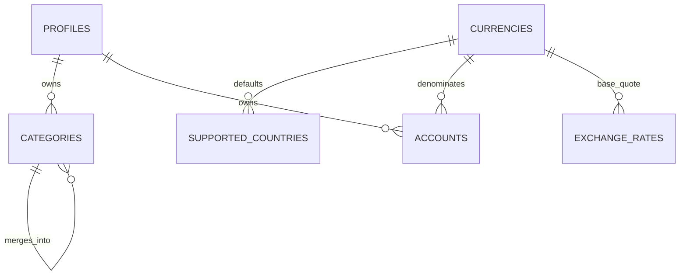

# Backend Feature Specification: Reference Data, Categories & Accounts

**Phase / Spec**: Phase 04 / SPEC-BE-004 of 014
**Working Branch**: `main`
**Feature Directory**: `apps/api/specs/004-reference-data-categories-accounts`
**Base Revision**: `2cd8432`
**Created**: 2026-08-29
**Status**: Ready for planning
**Input**: "Fully complete Phase 04 — SPEC-BE-004: Reference Data, Categories & Accounts without implementing later Specs."

## Objective and Scope

Provide the stable reference and account foundation required by every later
financial domain: currencies, supported countries, system and user categories,
user accounts, and approved exchange-rate metadata. Customers can read reference
data and manage only their own categories and accounts. Authorized administrators
can manage shared reference records with immutable audit evidence.

Account creation accepts the existing opening-balance request contract, but a
non-zero opening balance MUST fail atomically with `LEDGER_NOT_AVAILABLE` until
SPEC-BE-005 supplies the ledger command. This Spec never stores a mutable balance
on an account and never creates transaction, posting, or balance-projection rows.

## Dependencies and Repository Baseline

- **Prior Specs**: SPEC-BE-001 platform/outbox/API conventions; SPEC-BE-002
  profiles, active-user checks, Clerk ownership, and preference currency shape;
  SPEC-BE-003 exact Admin permissions, immutable audit, and authorization guards.
- **Verified baseline**: `main` equals `origin/main` at `2cd8432`; the only
  unrelated working-tree entry is untracked `.agents/plugins/` and is excluded.
- **Executable dependency evidence**: API typecheck, lint, performance-script
  syntax, 251 unit tests, 105 contract tests, 16 non-database integration tests,
  11 non-database E2E tests, builds, migration checksums, dependency audit, and 67
  security tests pass. Database-backed tests require the local Supabase workflow.
- **Known upstream release evidence**: SPEC-BE-002 still records external
  Clerk/Apple/hosted-Supabase/release-attestation gates. No unavailable provider
  secret or manual provider action is treated as passing.
- **Current Mobile contracts reviewed**:
  `src/services/contracts/core-finance-service.ts`,
  `src/domain/core-finance.ts`, `src/domain/core-finance-seeds.ts`, account and
  category mock/service tests, and account/category forms.
- **Current Admin contracts reviewed**: governance supported-country/currency
  projections, exchange-rate provider health projections, and the SPEC-BE-003
  permission manifest.
- **Governing documents**: Backend Constitution 2.0.0 and the complete Backend
  Master Plan.

## Owned Resources

- Tables: `public.currencies`, `public.supported_countries`,
  `public.categories`, `public.accounts`, and `public.exchange_rates`.
- Dependency correction: the validated FK from
  `public.user_preferences.default_currency` to `public.currencies(code)`.
- Functions: `private.resolve_category` and
  `private.resolve_exchange_rate`.
- Shared triggers: reuse SPEC-BE-001's
  `private.set_updated_at_and_version()`; add only the category-cycle,
  account-currency, default-account, and immutable-exchange-rate guards needed by
  this scope.
- APIs: `/api/v1/reference`, `/api/v1/categories`, `/api/v1/accounts`,
  `/api/v1/exchange-rates`, and `/api/v1/admin/reference`.
- Jobs: deterministic reference seeding. Exchange-rate refresh is not enabled
  until a provider is approved and configured.
- Events: `reference.updated`, `category.created`, `category.updated`, `category.deleted`,
  `category.merged`, `account.created`, `account.updated`, `account.archived`,
  `account.closed`, and `exchange-rate.refreshed`.
- Cache contract: locale/version reference reads only; no user financial shared
  cache and no new cache infrastructure.
- Operational artifacts: reference/account alerts, seed-drift check, migration
  and rollback runbook, query-plan/performance evidence, and OWASP traceability.

SPEC-BE-004 does not own ledger tables or commands, account balances, sync and
idempotency storage, provider-health tables, Mobile/Admin production cutover,
Redis, materialized views, Storage buckets, or a generic job registry.

## User Scenarios and Testing

### User Story 1 - Read Stable Reference Data (Priority: P1)

An authenticated customer receives enabled currencies, supported countries, and
active system categories with a stable version so the client can cache and
refresh them safely.

**Why this priority**: All account and later financial input validation depends
on trusted reference data.

**Independent Test**: Seed twice, read each reference endpoint as an authenticated
user, verify deterministic rows and ETags, then verify anonymous and disabled-row
access is denied or omitted as specified.

**Acceptance Scenarios**:

1. **Given** the same seed version, **When** seeding runs repeatedly, **Then**
   natural keys and user-visible values remain identical with no duplicate row.
2. **Given** a matching `If-None-Match`, **When** a reference collection is read,
   **Then** the response is `304` with no body.
3. **Given** a disabled reference record, **When** a customer reads reference
   data, **Then** that record is absent.

### User Story 2 - Manage Personal Categories (Priority: P1)

An authenticated customer can create, list, update, archive, restore, and merge
only their own categories while active system categories remain read-only.

**Why this priority**: Category ownership and compatibility are prerequisites for
safe transaction classification.

**Independent Test**: Exercise every lifecycle action with owner, non-owner,
anonymous, Admin, and service contexts and verify version, RLS, audit, and outbox
effects.

**Acceptance Scenarios**:

1. **Given** an active profile, **When** the user creates a valid category,
   **Then** exactly one owned category and one matching audit/outbox effect exist.
2. **Given** another user's or a system category, **When** a customer attempts a
   mutation, **Then** the operation fails without observable change.
3. **Given** a stale version, **When** a category is updated, archived, restored,
   or merged, **Then** the operation returns `VERSION_CONFLICT` atomically.
4. **Given** a parent change that creates any direct or indirect cycle, **When**
   it is submitted, **Then** the operation returns `CATEGORY_CYCLE`.

### User Story 3 - Manage Personal Accounts (Priority: P1)

An authenticated customer can create, order, read, update, archive, restore, and
close only their own accounts without exposing credentials or storing balances.

**Why this priority**: Accounts are the ownership boundary for all later ledger
postings.

**Independent Test**: Perform the lifecycle with owner/non-owner contexts,
validate account type/currency/last-four rules, and prove no balance or financial
source row is created.

**Acceptance Scenarios**:

1. **Given** a supported enabled currency, **When** an owner creates an account
   with zero opening balance, **Then** the account is returned at version 1.
2. **Given** a non-zero opening balance before SPEC-BE-005, **When** account
   creation is requested, **Then** `LEDGER_NOT_AVAILABLE` is returned and no
   account row, audit row, or outbox row is committed.
3. **Given** one existing default account, **When** another account is made the
   default, **Then** the change is atomic and exactly one active default remains.
4. **Given** another user's account, **When** read or mutation is attempted,
   **Then** the resource is indistinguishable from absent.

### User Story 4 - Resolve Approved Exchange Rates (Priority: P2)

An authenticated customer can resolve the closest approved historical rate at
or before a requested instant, subject to an explicit maximum age, and receives
an unavailable result instead of fabricated conversion.

**Why this priority**: Multi-currency display must never invent financial values.

**Independent Test**: Insert approved rate metadata as worker/Admin, query exact,
historical, stale, same-currency, missing, anonymous, and cross-permission cases.

**Acceptance Scenarios**:

1. **Given** an eligible historical rate, **When** it is requested, **Then** the
   closest rate at or before the instant is returned with provider and timestamp.
2. **Given** no eligible rate or an expired maximum age, **When** it is requested,
   **Then** `FX_UNAVAILABLE` is returned and no fallback number is invented.
3. **Given** equal base and quote currencies, **When** a rate is requested,
   **Then** the deterministic identity rate is returned without persisting a row.

### User Story 5 - Govern Shared Reference Data (Priority: P2)

An active administrator with the exact reference permission can make bounded,
version-aware shared-reference changes that are audited; all other administrators
are denied.

**Why this priority**: Shared changes affect every customer and require stronger
governance than owner-scoped data.

**Independent Test**: Run every Admin action with exact permission, missing
permission, stale version, inactive Admin, missing reason, and recent-MFA cases.

**Acceptance Scenarios**:

1. **Given** `reference.read`, **When** an Admin lists shared records, **Then** a
   bounded server-side page is returned.
2. **Given** `reference.write`, recent MFA, and a reason, **When** a shared record
   changes, **Then** the version changes and immutable before/after audit evidence
   is committed with the outbox effect.
3. **Given** only a client role header or a near-match permission, **When** an
   Admin action is attempted, **Then** the operation is denied.

### Edge Cases

- Lowercase or whitespace-padded ISO codes are rejected, not silently normalized
  after validation.
- Currency minor unit is limited to 0..4; exchange rates are positive, non-self,
  bounded decimal values.
- Labels/names reject empty, control, bidi-control, and over-limit values; `lastFour`
  accepts exactly four ASCII digits or null.
- Duplicate system keys, duplicate active user category labels per locale/kind, and
  duplicate exchange-rate natural keys fail deterministically.
- A category cannot parent itself, a descendant, a deleted row, a category of a
  different owner, a system/user-incompatible row, or a different financial kind.
- Merge source and target must differ, have compatible owner and financial kind,
  and remain traceable; system categories cannot be merge sources.
- Soft delete is idempotent. Restoring a row rechecks uniqueness and ownership.
- Account currency changes fail `ACCOUNT_CURRENCY_LOCKED` until SPEC-BE-005 can
  prove no committed posting exists; Phase 04 never queries a speculative table.
- Closing requires a close date and cannot precede the opening date. Archiving is
  reversible; closing is not silently converted to archive.
- Unknown, disabled, stale, future-dated, or unapproved exchange metadata never
  becomes an authoritative rate.
- Pagination limits are clamped by rejection, not silently expanded.

## Database Design

### Owned Tables

#### `public.currencies`

`code char(3)` primary key; `name text not null`; `minor_unit smallint not null`;
`enabled boolean not null default true`; `created_at timestamptz not null default
now()`; `updated_at timestamptz not null default now()`; `version bigint not null
default 1`. Enforce uppercase ASCII code, minor unit 0..4, nonempty bounded name,
positive version, and indexed enabled/code reads.

#### `public.supported_countries`

`code char(2)` primary key; `name text not null`; `default_currency char(3) not
null references public.currencies(code) on update restrict on delete restrict`;
`enabled boolean not null default true`; timestamps and positive version. Enforce
uppercase ASCII code, bounded name, and indexed enabled/code reads.

#### `public.categories`

Standard mutable UUID/timestamps/version columns; nullable `user_id text
references public.profiles(id) on delete restrict`; nullable `parent_id uuid
references public.categories(id) on delete restrict`; `kind text not null` in
`income|expense|transfer`; `label_ar text not null`; `label_en text not null`;
nullable bounded `icon` and
`color`; nullable `system_key text`; `sort_order integer not null default 0`;
`active boolean not null default true`; nullable `merged_into_id uuid references
public.categories(id) on delete restrict`; nullable `deleted_at timestamptz`.
Enforce a unique non-null system key only for system rows and a case-insensitive
separate case-insensitive unique active user label/kind constraints for Arabic and
English. Index owner/kind/active/sort, parent, merge target, and active system reads.

The API exposes `scope: system|custom`; scope is derived from `user_id`, never a
client-writable column. Both Arabic and English labels are stored and returned so
the executable Mobile category contract is lossless.

#### `public.accounts`

Standard mutable UUID/timestamps/version plus required owner; `name text not
null`; `type text not null` in `bank|debit_card|credit_card|wallet|cash|savings|
other`; `currency_code char(3) not null references public.currencies(code)`;
nullable bounded `institution_name`; nullable `last_four char(4)`; nullable
nonnegative `credit_limit_minor bigint`; `is_default boolean not null default
false`; nullable bounded `icon_key`, `color_key`, and `notes`; `status text not
null default active` in `active|archived|closed`; `sort_order integer not null
default 0`; `include_in_totals boolean not null default true`; nullable
`opened_at date`, `closed_at date`, and `deleted_at timestamptz`.

Enforce four ASCII digits, close date ordering, credit limit only for credit-card
accounts, one active default per user, and indexes on owner/status/sort,
owner/currency, and active owner rows. No balance or opening-balance column exists.

#### `public.exchange_rates`

Immutable UUID/created-at columns; `base_currency char(3)` and `quote_currency
char(3)` reference currencies; `rate numeric(24,12) not null`; `effective_at
timestamptz not null`; `provider text not null`; nullable `provider_ref text`.
Enforce positive rate, different currencies, bounded provider fields, unique
base/quote/effective/provider, and pair/effective descending lookup index.

### Relationships and ERD

### RLS, Grants, and Authorization

- Enable and force RLS on all five tables.
- Revoke default `public`, `anon`, and broad `authenticated` writes before adding
  explicit grants.
- Authenticated users may select enabled currencies/countries, active system
  categories, approved exchange rates, and their own category/account rows.
- Users never insert/update/delete system categories, reference rows, or rates.
- User category/account mutations run through guarded API operations under the
  verified Clerk subject; direct broad table mutation grants are absent.
- Admin routes require active Admin profile plus exact `reference.read` or
  `reference.write`; shared mutations additionally require recent MFA and reason.
- Worker access is limited to exchange-rate insert and seed verification; it may
  not mutate user accounts/categories.
- pgTAP includes positive and negative owner, non-owner, anonymous, exact Admin,
  wrong Admin, and worker cases for every applicable operation.

## API Contracts

Successful responses use the platform's raw DTO or `{items,nextCursor}` page
shape and `X-Request-Id` header. Errors use the safe `{code,message,requestId,
fieldErrors?}` envelope. Mutations require `Idempotency-Key`, and updates require
`expectedVersion`.

| Method | Path | Auth | Request | Success response | Errors |
|---|---|---|---|---|---|
| GET | `/api/v1/reference/currencies` | active user | `If-None-Match?` | enabled `{code,name,minorUnit}` and ETag | `UNAUTHORIZED`, `PROFILE_INACTIVE` |
| GET | `/api/v1/reference/countries` | active user | `If-None-Match?` | enabled `{code,name,defaultCurrency}` and ETag | same |
| GET | `/api/v1/exchange-rates` | active user | `base`, `quote`, `at?`, `maxAgeSeconds?` | approved rate metadata | `INVALID_CURRENCY`, `FX_UNAVAILABLE` |
| GET | `/api/v1/categories` | active user | `kind?`, `includeInactive?`, cursor, limit<=100 | merged system/user page | bounded validation errors |
| POST | `/api/v1/categories` | active user | allowlisted category fields | created category/version | duplicate, cycle, ownership |
| PATCH | `/api/v1/categories/:id` | owner | explicit patch + expected version | updated category/version | not found, conflict, immutable system |
| DELETE | `/api/v1/categories/:id` | owner | expected version | `204` idempotent soft delete | conflict, immutable system |
| POST | `/api/v1/categories/:id/restore` | owner | expected version | restored category/version | duplicate, conflict |
| POST | `/api/v1/categories/:id/merge` | owner | target ID + expected version | merged source and target refs | incompatible, conflict, later-ledger guard |
| GET | `/api/v1/accounts` | active user | status?, cursor, limit<=100 | bounded owner summaries; balance omitted until 005 | validation |
| POST | `/api/v1/accounts` | active user | allowlisted account fields + openingBalanceMinor? | account and optional opening transaction ID | `LEDGER_NOT_AVAILABLE`, validation |
| GET | `/api/v1/accounts/:id` | owner | none | owner-safe detail/version | not found |
| PATCH | `/api/v1/accounts/:id` | owner | explicit patch + expected version | updated detail/version | conflict, currency locked |
| DELETE | `/api/v1/accounts/:id` | owner | expected version | `204` archive | pending-operation guard, conflict |
| POST | `/api/v1/accounts/:id/restore` | owner | expected version | restored detail/version | conflict |
| POST | `/api/v1/accounts/:id/close` | owner | close date + expected version | closed detail/version | invalid lifecycle, pending-operation guard |
| GET/PATCH | `/api/v1/admin/reference/...` | exact Admin permission | bounded query or full versioned replacement | redacted reference resource | permission, MFA, conflict |

## Functions, Views, and Triggers

- `private.resolve_category(p_user_id,p_category_id,p_kind)` returns an active
  compatible system category or the caller's active compatible category and
  otherwise raises the stable invalid-category error. Execute is server-only.
- `private.resolve_exchange_rate(p_base,p_quote,p_at,p_max_age)` returns the
  closest eligible rate at or before `p_at`; same-currency returns 1; absence or
  staleness raises `FX_UNAVAILABLE`. Execute is server-only.
- Reuse the shared version trigger for mutable rows. Trigger guards reject
  protected timestamp/version edits, any category cycle, invalid merge target,
  and account currency changes once the future posting predicate reports activity.
- No public view or materialized view is created.

## Queues, Jobs, and Events

- Deterministic reference seed data is applied idempotently during deployment and
  verified by a drift command; no demo/customer rows are seeded.
- `exchange-rate.refresh` remains disabled and unregistered until an approved
  provider and runtime secret exist. Demo, seed, or otherwise unapproved fake
  rates are forbidden; a guarded Admin insert is approved metadata, not a
  provider simulation.
- Each successful customer mutation appends one immutable audit event and one
  owned outbox event in the same transaction. Admin shared mutations additionally
  record reason and before/after hashes.
- Events carry only safe IDs, owner subject where required for routing, version,
  and changed-field names; names, last four, notes, and rates are not logged in
  event labels.

## Business Rules

- ISO reference codes are immutable natural keys. Referenced seeded codes are
  disabled rather than deleted.
- The deterministic initial seed inserts the currencies/countries required by
  current clients and all current system category keys. It never overwrites an
  audited Admin change; drift alerts and blocks release. Production demo accounts
  and transactions are forbidden.
- System categories are shared/read-only; user categories are private and may not
  become system rows.
- Category hierarchy and merge graphs are acyclic. Merge never mutates a future
  committed ledger row directly; later ledger integration must resolve through
  the owning SPEC-BE-005 command.
- Account currency updates are rejected in Phase 04. SPEC-BE-005 may later permit
  a change only after proving that no posting exists.
- Account creation and an opening transaction are one future atomic orchestration.
  Before SPEC-BE-005, non-zero opening balance fails before insertion.
- No full bank/card number, credential, token, or mutable balance is stored.
- Exchange rates are metadata, never customer-authoritative input, and never used
  to imply that cross-currency transfer is supported.

## Security and Privacy Requirements

- Deny by default at route, object, property, function, RLS, and grant layers.
- Apply ASVS 2.1, 4.1-4.3, 5.1-5.3, 7.1-7.4, 8.2, 9.2, 11.1, 12.1-12.4,
  13.1-13.4 and API1/API3/API4/API5/API8/API9/API10 controls as applicable.
- DTO allowlists reject unknown fields and mass assignment of owner, status,
  version, timestamps, audit, cache, and provider authority.
- Object absence and cross-user denial use indistinguishable safe errors.
- Names and notes are treated as private; logs/traces/metrics never contain raw
  account names, category labels, last four, or Admin reasons.
- Exact Admin permissions and recent authentication, measured from the verified
  MFA age and mapped to `RECENT_AUTH_REQUIRED`, are evaluated server-side; client role
  headers, support grants, or feature flags cannot grant reference write access.
- Missing security, auth, audit, RLS, or permission configuration fails closed.

## Performance and Caching Requirements

- Each indexed SQL statement P95 MUST remain <=50 ms and a complete reference/
  category/account data-access operation P95 <=100 ms. Account endpoint P95
  <=300 ms/P99 <=600 ms and compressed payload <=150 KiB.
- Customer and Admin list queries are bounded, cursor-based where user growth can
  exceed one page, and use the documented indexes without unbounded scans or N+1.
- Reference/system-category responses use ETag plus a process-local
  `{locale}:{version}` cache with 24-hour maximum TTL. Every request first reads a
  bounded canonical collection hash/version from PostgreSQL, so another replica's
  mutation cannot leave stale cached content active. Owned events also invalidate
  local entries. No new dependency is added.
- User category/account data and exchange-rate freshness decisions are not shared
  cached. Cache failure falls back to authorized database reads.
- Performance evidence covers cold/warm cache, 100k user categories/accounts,
  reference invalidation, stale FX, and production-like query plans.

## Mobile and Admin Integration

- No Mobile/Admin source is modified; production cutover remains SPEC-BE-014.
- Contract tests document future adapter mapping for account types, opening
  balance, default account, credit limit, last four, icon/color/notes, category
  scope/hierarchy/status/merge, bilingual system/custom labels, and exchange-rate
  availability. Current Mobile objects lack resource versions/idempotency headers
  and current mocks permit system-category mutation, so production parity changes
  remain SPEC-BE-006/014 rather than weakening the backend.
- System `systemKey` values match the existing Mobile seed keys. Mobile local
  SQLite remains a projection and retains device-only display preferences.
- Admin governance reads supported country/currency codes through bounded
  reference projections; provider-health implementation remains SPEC-BE-013.
- Production seeds never import Mobile demo accounts, transactions, or fixture
  balances.

## Functional Requirements

- **FR-001**: Reference seeds MUST be deterministic, idempotent, and free of demo
  or customer data.
- **FR-002**: All five owned tables MUST have complete constraints, indexes, RLS,
  and minimum grants before any route is enabled.
- **FR-003**: Authenticated customers MUST read only enabled shared reference
  records and active system categories.
- **FR-004**: Customers MUST manage only their own categories and accounts.
- **FR-005**: System categories and ISO natural keys MUST be server-managed and
  immutable to customers.
- **FR-006**: Category hierarchy and merge operations MUST prevent direct and
  indirect cycles and incompatible ownership/kinds.
- **FR-007**: Category/account updates MUST enforce expected version and append
  audit/outbox effects atomically.
- **FR-008**: Account records MUST NOT contain or directly change a balance.
- **FR-009**: Non-zero opening balance MUST fail atomically until SPEC-BE-005's
  owned command is available.
- **FR-010**: Account currency updates MUST fail closed in Phase 04 and may be
  relaxed only when SPEC-BE-005 can prove no committed posting exists.
- **FR-011**: At most one active default account per user MUST be enforceable
  atomically; zero is allowed when no active account is selected as default.
- **FR-012**: Exchange-rate resolution MUST return approved historical metadata
  or `FX_UNAVAILABLE`; it MUST never invent a rate.
- **FR-013**: Admin shared-reference mutations MUST require exact permission,
  recent MFA, reason, expected version, audit, and outbox evidence.
- **FR-014**: Reference responses MUST support stable validators and explicit
  invalidation without shared user-data caching.
- **FR-015**: Every collection MUST enforce its documented filters, cursor, and
  maximum page size.
- **FR-016**: All errors MUST use stable safe codes and preserve absence privacy.
- **FR-017**: The migration MUST add and validate the currency FK on SPEC-BE-002
  preferences after deterministic seed/backfill verification.
- **FR-018**: Current Mobile/Admin contract mappings MUST be executable contract
  tests without client implementation changes.
- **FR-019**: No worker/provider refresh path MUST be enabled without an approved
  provider and runtime configuration.
- **FR-020**: No resource owned by SPEC-BE-005 or later may be created or mutated.

## Tests and Verification Evidence

- Unit: DTO validation, cursor/ETag parsing, lifecycle transitions, error mapping,
  seed hashing, cache invalidation, and unavailable opening/FX behavior.
- Contract: OpenAPI drift, Mobile account/category/exchange shapes, Admin
  permission/reference projections, stable errors, ETag/304, and event envelopes.
- Integration/E2E: authenticated reads; owner CRUD; category archive/restore/
  merge/cycles; account default/order/archive/restore/close; Admin reference CRUD;
  audit/outbox atomicity; stale versions; no partial opening-balance creation.
- pgTAP: migration order, seed determinism, constraints, FK validation, triggers,
  functions, grants, RLS positive/negative matrix, immutability, and index presence.
- Security: BOLA/BFLA, mass assignment, invalid identifiers/text, permission
  near-match, inactive profile/Admin, missing MFA/reason, unsafe error/log scan.
- Performance: production-like rows, `EXPLAIN (ANALYZE, BUFFERS, FORMAT JSON)`,
  P95/P99/payload, cold/warm reference cache, invalidation, and concurrency.
- Recovery: repeated seed, failed migration plus forward fix, previous-image
  compatibility, cache loss, unavailable provider, audit/outbox failure rollback,
  and retained account/category history.

## Migration and Rollback Strategy

1. Create currencies and countries, constraints, indexes, triggers, and minimum
   grants; seed deterministic codes.
2. Validate/backfill existing preference currency codes, add its FK as `NOT
   VALID`, then validate it.
3. Create categories and accounts with constraints/indexes/guards.
4. Create immutable exchange-rate metadata and resolver functions.
5. Enable/force RLS, install policies/grants, then add pgTAP coverage.
6. Update migration checksums and run clean-reset/order/replay verification.

Migrations are additive, ordered, immutable, and N-1 compatible. Rollback uses
the previous image and a forward corrective migration; it never drops referenced
seeds or account/category history. A failed step must leave routes disabled and
produce reconciliation counts for tables, constraints, policies, and seed hashes.

## Observability and Operations

- Metrics: reference/account/category route latency and payload, result counts,
  ownership/permission denials, version conflicts, category cycle/merge failures,
  seed drift, cache hit/miss/invalidation, FX age/unavailability, opening-balance
  rejection, and audit/outbox failures.
- Metrics use bounded labels only; no user/resource/name/code pair is a metric
  label when cardinality is unbounded.
- Structured logs carry request/correlation IDs and stable error/action codes,
  with all private field values redacted.
- Alerts cover seed drift, audit/outbox failure, abnormal ownership denial,
  elevated API latency/error rate, stale/unavailable configured FX provider, and
  cache invalidation failure.
- A single SPEC-BE-004 runbook covers seed/recovery, reference disablement,
  category/account incident handling, cache invalidation, unavailable FX, forward
  migration correction, and rollback.

## Assumptions

- The current repository's account type and bilingual category values are the
  factual client contract;
  the Master Plan's narrower type list is corrected before implementation.
- `reference.read` and `reference.write` are backend-only canonical Admin
  permission keys added without changing the pinned Admin client-key list; Super
  Admin receives both and Security Administrator receives read only.
- User-created categories default to `expense` when the current client omits a
  financial kind; adapters may submit an explicit kind when available.
- Seed currencies are the 12 executable Mobile codes (`EGP`, `USD`, `EUR`, `GBP`,
  `AED`, `SAR`, `OMR`, `KWD`, `QAR`, `BHD`, `JOD`, `JPY`) with current minor units;
  country rows cover the corresponding ISO countries where one exists.
- Same-currency FX resolution returns identity rate 1 without an exchange row.
- No approved exchange-rate provider or secret exists, so refresh remains off.
- Balance projection fields are omitted until SPEC-BE-005; no synthetic zero is
  presented as an authoritative ledger balance.

## Out of Scope

- Transactions, postings, balances, opening ledger entries, reconciliation, and
  financial mutation commands (SPEC-BE-005).
- Durable client idempotency/sync/conflicts/tombstones (SPEC-BE-006).
- Planning, tracking/imports, AI, reports, notifications, billing, operational job
  inventory/provider health, and client production cutover (SPEC-BE-007..014).
- Cross-currency transfers, provider procurement, Redis, materialized views,
  direct client database writes, and production demo data.

## Acceptance Criteria

- **AC-001**: A clean database applies all Phase 04 migrations in order and a
  second seed run changes zero deterministic rows.
- **AC-002**: Every owned table passes owner/non-owner/anonymous/Admin/worker RLS
  and grant tests applicable to it with zero cross-user access.
- **AC-003**: All category hierarchy, uniqueness, lifecycle, merge, and system-row
  invariants pass positive and negative tests.
- **AC-004**: All account ownership, type, currency, default, lifecycle,
  last-four, and date invariants pass; no account balance column exists.
- **AC-005**: A non-zero opening-balance request before SPEC-BE-005 creates zero
  rows/effects and returns the stable unavailable error.
- **AC-006**: Exchange resolution returns the closest eligible metadata or the
  stable unavailable error and never fabricates a value.
- **AC-007**: All successful customer/Admin mutations commit resource, audit, and
  outbox effects atomically; injected failure commits none.
- **AC-008**: Exact Admin permissions, recent MFA, reason, and version checks pass
  every positive/negative contract and E2E case.
- **AC-009**: Current Mobile/Admin mappings and OpenAPI drift tests pass without
  modifying either client.
- **AC-010**: Reference/category/account query P95 <=100 ms; account API P95 <=300
  ms/P99 <=600 ms and payload <=150 KiB on production-like data.
- **AC-011**: Cache validators/invalidation work across cold/warm/failure cases and
  never cross user or permission boundaries.
- **AC-012**: Migration checksum, lint, typecheck, unit, contract, integration,
  E2E, pgTAP, security, performance, recovery, and dependency gates pass with no
  skip represented as success.
- **AC-013**: Required metrics, alerts, runbook, rollback, reconciliation, OWASP,
  and Definition-of-Done evidence are complete and current.
- **AC-014**: The diff contains no later-Spec table, endpoint, worker, event, cache,
  client cutover, or unrelated-file change.

## Success Criteria

- **SC-001**: 100% of users can retrieve enabled reference data consistently
  across repeated reads and receive an unchanged response when their version is
  current.
- **SC-002**: 100% of tested cross-user and unauthorized Admin operations are
  denied without revealing resource existence.
- **SC-003**: 100% of accepted category/account changes are versioned and
  traceable to one audit and one delivery event, with zero partial effects.
- **SC-004**: 95% of category/account reads complete within 100 ms at the data
  layer and account screens receive their bounded response within 300 ms.
- **SC-005**: Reference seeds remain identical over repeated deployments and
  contain zero production demo/customer records.
- **SC-006**: 100% of unavailable/stale exchange-rate requests show an explicit
  unavailable outcome rather than an estimated or fabricated conversion.
- **SC-007**: Zero account rows contain a balance, and zero non-zero opening
  balance requests succeed before the ledger dependency is available.

## Definition of Done

- [ ] All owned migrations, schema objects, indexes, constraints, RLS, grants,
      seed data, functions, permissions, audit/outbox flows, API endpoints, tests,
      budgets, alerts, runbook, and rollback/reconciliation evidence pass.
- [ ] The preference currency FK is validated after deterministic seed/backfill.
- [ ] The optional provider worker remains disabled unless approval/configuration
      exists; absence is verified as a safe unavailable state.
- [ ] No later Spec or client cutover is implemented.
- [ ] All locally executable pre-push gates pass, then the verified Spec is
      committed and pushed directly to `main` for remote-only evidence.
- [ ] Completion is claimed only after every local and remote release blocker has
      current evidence; external or skipped gates remain explicitly incomplete.

Verification listed here is required evidence, not a claim that it has already
been executed.

## 2026-09-05 Client Remediation Addendum — Category Usage

- `GET /api/v1/categories/{categoryId}/usage` returns only the authenticated
  owner's custom category `linkedTransactionCount` and current `version`.
- Archive and merge require that server preview. Execution serializes with
  owner ledger writes and recomputes the count; a changed count returns
  `409 CATEGORY_USAGE_CHANGED` and makes no change.
- Missing, foreign, and system categories are indistinguishable `404` outcomes.
  Merged or otherwise invalid lifecycle states return `409 CATEGORY_INVALID`.
- Archive changes category state only. Merge requires an active same-owner,
  same-kind custom target and atomically reassigns every owned transaction
  header before the source is marked merged.
- Separate archive undo and bulk lifecycle actions remain out of scope.
