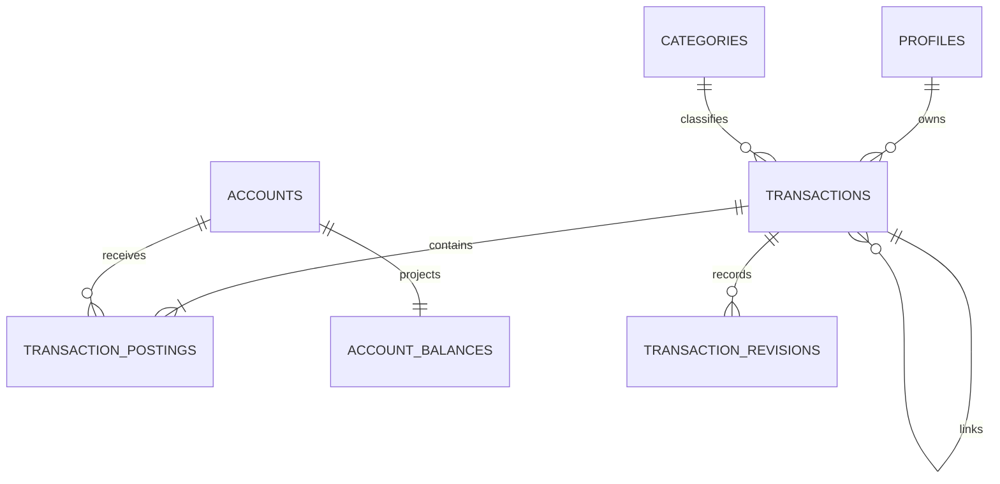

# Data Model: Transactions, Ledger, Transfers & Financial Integrity

**Spec**: SPEC-BE-005
**Database**: Supabase PostgreSQL
**Money**: signed `BIGINT` minor units; API values must be JavaScript-safe integers

## Entity map



`profiles`, `categories`, and `accounts` are consumed dependencies. The four
entities below are Phase 05-owned. `private.idempotency_keys` is delivered as a
temporary prerequisite but remains Phase 06-owned.

## `public.transactions`

### Fields

| Field | Type / nullability | Rules |
|---|---|---|
| `id` | `uuid NOT NULL` | PK, generated |
| `user_id` | `text NOT NULL` | FK `profiles(id)` restrict; immutable owner |
| `kind` | `text NOT NULL` | `income|expense|transfer|opening|refund|reversal|adjustment`; immutable after create |
| `status` | `text NOT NULL` | default `confirmed`; `draft|pending|confirmed|reversed|deleted` |
| `amount_minor` | `bigint NOT NULL` | positive declared amount within JavaScript-safe range; postings remain financial truth |
| `fee_minor` | `bigint NOT NULL` | default 0, nonnegative and JavaScript-safe |
| `currency_code` | `char(3) NOT NULL` | FK enabled `currencies(code)`; immutable |
| `category_id` | `uuid NULL` | FK `categories(id)`; compatible owner/system and kind when required |
| `title` | `text NOT NULL` | trimmed, 1..160, no control characters |
| `merchant` | `text NULL` | trimmed, 1..160 when present, no control characters |
| `payment_method` | `text NULL` | trimmed, 1..80 when present; display metadata, not credentials |
| `note` | `text NULL` | trimmed, 1..500 when present, no control characters |
| `occurred_at` | `timestamptz NOT NULL` | bounded accepted history/future policy; UTC |
| `source` | `text NOT NULL` | default `manual`; bounded approved source key |
| `external_ref` | `text NULL` | bounded; unique with owner/source while present |
| `reverses_transaction_id` | `uuid NULL` | FK self restrict; original link for refund/reversal; never self |
| `deleted_at` | `timestamptz NULL` | set only when status `deleted` |
| `undo_expires_at` | `timestamptz NULL` | exactly delete commit + 30 seconds when deleted |
| `created_at` | `timestamptz NOT NULL` | immutable creation time |
| `updated_at` | `timestamptz NOT NULL` | guarded command-maintained |
| `version` | `bigint NOT NULL` | starts 1, positive, increments once per accepted header command |

### Indexes

- PK `id`.
- `(user_id, occurred_at DESC, id DESC)` and partial active variant where
  `deleted_at IS NULL`.
- `(user_id, status, occurred_at DESC, id DESC)`.
- `(category_id, occurred_at DESC, id DESC)`.
- `(reverses_transaction_id)`.
- Partial unique `(user_id, source, external_ref)` where `external_ref IS NOT NULL`.
- Native full-text expression GIN index for simple-token title/merchant search.

### State transitions

```text
create confirmed -> confirmed
confirmed --full reversal--> reversed
confirmed --soft delete--> deleted
deleted --restore before deadline--> confirmed
```

- `pending` is supported by the internal posting contract for future owned callers
  but no Phase 05 public manual endpoint creates it.
- `draft` is reserved for later server workflows; Mobile drafts remain local.
- A refund does not change an expense's status; linked active refund totals are
  derived.
- A reversal is itself a confirmed linked transaction. Reversal of a reversal is
  denied.
- Deleting a record with active dependent refund/reversal is denied.

## `public.transaction_postings`

### Fields

| Field | Type / nullability | Rules |
|---|---|---|
| `id` | `uuid NOT NULL` | PK, generated |
| `transaction_id` | `uuid NOT NULL` | FK `transactions(id)` restrict |
| `account_id` | `uuid NOT NULL` | FK `accounts(id)` restrict |
| `amount_minor` | `bigint NOT NULL` | nonzero, checked against API-safe reconstructed totals |
| `clearing_state` | `text NOT NULL` | default `confirmed`; `pending|confirmed` |
| `posting_role` | `text NOT NULL` | `source|destination|fee|opening|refund|reversal|adjustment` |
| `occurred_at` | `timestamptz NOT NULL` | command effect date |
| `created_at` | `timestamptz NOT NULL` | insertion order/evidence |

### Indexes and lifecycle

- PK `id`.
- `(transaction_id, created_at, id)`.
- `(account_id, occurred_at DESC, id DESC)`.
- Partial `(account_id, occurred_at DESC, id DESC)` where state is `pending`.
- UPDATE and DELETE always fail; no cascade can physically remove a committed row.

### Posting shapes

| Command | Required appended postings |
|---|---|
| Income | destination `+amount` |
| Expense | source `-amount` |
| Transfer no fee | source `-amount`, destination `+amount` |
| Transfer with fee | transfer pair plus fee account `-fee` |
| Opening | account signed opening amount; zero creates no transaction |
| Refund | selected account `+refund` |
| Reversal | exact negative of every current active original account/state effect |
| Financial revision | per affected account/state delta from old active effect to new effect |
| Delete | exact negative of current active effect |
| Restore | exact restoration of the pre-delete effect |

The effective contribution of one header is the checked sum of all its postings
by account and clearing state. Revision snapshots explain why each delta exists.

## `audit.transaction_revisions`

### Fields

| Field | Type / nullability | Rules |
|---|---|---|
| `id` | `uuid NOT NULL` | PK, generated |
| `transaction_id` | `uuid NOT NULL` | FK transactions restrict |
| `revision_no` | `integer NOT NULL` | positive; unique per transaction |
| `actor_id` | `text NOT NULL` | authenticated customer or system actor |
| `reason` | `text NOT NULL` | 1..500; mandatory for correction/delete/reversal/refund; system reason for create/opening |
| `before_snapshot` | `jsonb NOT NULL` | versioned allowlisted object; `{}` for creation |
| `after_snapshot` | `jsonb NOT NULL` | versioned allowlisted object |
| `created_at` | `timestamptz NOT NULL` | immutable |

### Snapshot schema

Snapshots contain `schemaVersion`, transaction ID/kind/status/currency,
category ID, safe metadata hashes or allowlisted values, occurred time, version,
deleted/undo state, linked original ID, and the sorted current effect as owning
account UUID, clearing state, and signed minor units. That protected effect is
required for deterministic detail reconstruction and restore, but is never
returned as revision metadata or copied to operational payloads. Snapshots
exclude JWT/session data, raw idempotency values/hashes, account credentials,
provider payloads, request headers, and internal database errors.

Rows are immutable and have no customer/Admin direct grant. Customer detail may
return revision number/time/reason category only, never raw snapshots.

## `public.account_balances`

### Fields

| Field | Type / nullability | Rules |
|---|---|---|
| `account_id` | `uuid NOT NULL` | PK/FK accounts restrict |
| `confirmed_minor` | `bigint NOT NULL` | default 0; sum confirmed effective postings |
| `pending_minor` | `bigint NOT NULL` | default 0; sum pending effective postings |
| `ledger_version` | `bigint NOT NULL` | default 0, nonnegative, monotonic for owner commands |
| `reconciled_at` | `timestamptz NULL` | set only after an exact comparison match |
| `updated_at` | `timestamptz NOT NULL` | guarded command time |

### Projection rules

- A row is created at account creation with zero values and version 0, or in the
  same transaction as the first posting if upgrading an existing account.
- Each command computes one next per-user ledger version while holding the user
  advisory lock, applies checked posting deltas, and writes that version to every
  touched account.
- API `ledgerVersion` is the maximum owner balance version. The per-user lock
  guarantees it advances for every committed financial command.
- Direct customer/Admin/worker mutation is denied. The reconciliation worker may
  update `reconciled_at` only on an exact match; it may not change amounts/version.

## `public.v_account_balance_summary`

Security-invoker owner-safe projection:

```text
accountId, currencyCode, accountStatus, confirmedMinor, pendingMinor,
availableMinor, ledgerVersion, reconciledAt, updatedAt
```

`availableMinor` initially equals confirmed plus pending because no separate hold
or credit-availability model is owned here. Clients must not interpret it as bank
provider availability. The view exposes no other user's row and no write path.

## `private.idempotency_keys` (SPEC-BE-006 owned prerequisite)

### Fields

| Field | Type / nullability | Rules |
|---|---|---|
| `id` | `uuid NOT NULL` | PK |
| `actor_id` | `text NOT NULL` | verified customer subject; immutable |
| `scope` | `text NOT NULL` | normalized command scope; immutable |
| `key_hash` | `text NOT NULL` | `sha256:` plus 64 lowercase hex characters; raw key never stored |
| `request_hash` | `text NOT NULL` | `sha256:` plus 64 lowercase hex characters over the normalized command; immutable |
| `response_status` | `integer NULL` | 100..599 when completed |
| `response_body` | `jsonb NULL` | safe bounded exact replay body |
| `resource_ref` | `text NULL` | safe primary resource reference |
| `state` | `text NOT NULL` | `claimed|completed|failed` |
| `locked_until` | `timestamptz NOT NULL` | bounded claim lease |
| `expires_at` | `timestamptz NOT NULL` | later Phase 06 cleanup horizon |
| `created_at` | `timestamptz NOT NULL` | immutable |

Unique `(actor_id,scope,key_hash)`; indexes on expiry and active lease. No Phase
05 cleanup job or client read exists.

### State transitions

```text
absent -> claimed -> completed
absent -> claimed -> failed
claimed expired -> claimed by retry -> completed|failed
completed -> completed replay only
```

- Same request hash on `completed` returns stored status/body.
- Different request hash always returns `hash_mismatch`, including after expiry
  until cleanup in Phase 06.
- Active unexpired claim returns `in_progress` and a bounded retry hint.
- Financial validation/authorization failures before a durable claim may return
  without a row. Failures after claim either roll back the new claim or store a
  stable safe failure when the command policy declares that response replayable.

## Command transaction flow

```text
normalize/validate HTTP DTO
lookup completed idempotency response without mutation
if no replay: consume durable per-user abuse allowance and enforce recent-auth
BEGIN
  set verified Clerk request context; SET LOCAL ROLE masarifi_api
  claim/replay idempotency tuple (resolves lookup races)
  acquire per-user ledger advisory lock
  lock accounts and transaction/dependents in ascending UUID order
  revalidate active profile, ownership, state, version, currency, category
  create/update header through guarded command
  append postings and revision
  apply checked balance projection + next ledger version
  append immutable audit and safe outbox event(s)
  store safe idempotency response
COMMIT
```

Any error before commit rolls back every item inside the block. A completed replay
returns without reacquiring money locks or appending evidence.

## Invariants

1. Every nonzero active effect has one or more immutable postings.
2. Every touched projection equals the sum of effective postings after commit.
3. One command advances each touched account to one next owner ledger version.
4. Account/transaction/posting currency is identical; transfer accounts differ.
5. One active opening exists per account and is created only with the account.
6. Active refunds of an expense sum to at most the original amount.
7. At most one active full reversal exists per original.
8. Deleted/restored/reversed history is never physically removed or rewritten.
9. Existing-resource commands use exact expected version; Last Write Wins is
   impossible.
10. Audit, outbox and completed replay response exist if and only if the financial
    command committed.
11. No Admin/support/worker/direct client can write money; no Admin can read raw
    Phase 05 ledger rows.
12. Reconciliation detects differences and never silently changes a balance.

## Retention and recovery

- Transactions, postings and revisions are retained as financial history subject
  only to future approved retention/legal policy; Phase 05 defines no purge.
- Idempotency expiry is recorded now but cleanup belongs to Phase 06.
- Rollback never drops or rewinds owned rows. Previous images tolerate additive
  objects; forward corrective migrations preserve history.
- Backup/restore validation recomputes all projections from postings and verifies
  forced RLS/minimum grants before traffic reopens.
