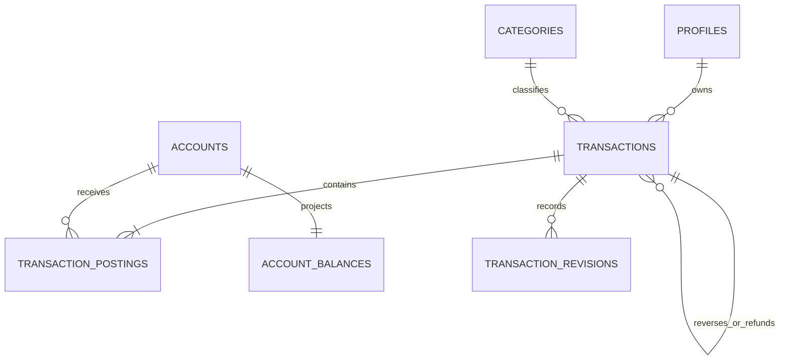

# Backend Feature Specification: Transactions, Ledger, Transfers & Financial Integrity

**Phase / Spec**: Phase 05 / SPEC-BE-005 of 014
**Working Branch**: `codex/spec-be-005` (explicit user-directed isolation; product
and release requirements remain unchanged)
**Feature Directory**: `apps/api/specs/005-transactions-ledger-integrity`
**Base Revision**: `dfed012743ca0c3c5f760e7b2439dbc0dae9c825`
**Created**: 2026-08-30
**Status**: Complete; released as immutable `backend-v0.5.0`
**Input**: "Fully complete Phase 05 — SPEC-BE-005: Transactions, Ledger,
Transfers & Financial Integrity, including the temporary forward-compatible
SPEC-BE-006 idempotency prerequisite and all required implementation, testing,
operations, and release evidence."

## Objective and Scope

Create the only authoritative financial mutation boundary for Masarifi. Customers
can record income and expenses, move funds between same-currency accounts, apply
fees, create account-opening entries, revise eligible records, refund expenses,
reverse completed entries, soft-delete them, and restore them during the fixed
undo window. Every operation is replay-safe, version-aware, concurrency-safe,
atomic, auditable, reconstructable from immutable postings, and visible through
bounded owner-scoped reads.

This Spec owns transaction headers, append-only postings, revision evidence,
account-balance projections, ledger commands, financial reads, reconciliation,
and ledger operational evidence. It integrates the account-opening handoff
defined by SPEC-BE-004. It also delivers the minimum SPEC-BE-006 idempotency
table and lookup/claim/complete contract before any financial write is enabled. The
idempotency resource remains owned by SPEC-BE-006; no sync cursor, client
mutation, tombstone, or conflict feature is implemented here.

## Dependencies and Repository Baseline

### Verified dependency contracts

| Dependency | Required contract | Verification result at base revision |
|---|---|---|
| SPEC-BE-001 | NestJS API/worker processes, ordered checksum migrations, request/JWT database context, safe exception envelope, outbox enqueue/dispatch, metrics, Docker, CI and release evidence | Available. Fresh baseline `npm run verify` passed typecheck, lint, performance-script syntax, 287 unit tests, 112 contract tests, 16 non-live integration tests, 18 non-live E2E tests, build, checksums, dependency audit, and 71 security tests. Environment-gated suites remained explicit skips. |
| SPEC-BE-002 | Clerk principal, active-profile enforcement, profile ownership and Clerk-sub RLS | Locally available and executable. Apple Team ID, two protected Phone identities, hosted canonical-schema owner/non-owner proof, deployed webhook secret/URL, some provider outage/rotation rehearsal, and tag-only signed evidence remain external-only gaps. They do not block local Phase 05 commands or fixture-backed negative authorization tests. |
| SPEC-BE-003 | Exact Admin permission checks, purpose-bound support access, immutable audit append, Admin/customer denial boundaries | Available, fully released, and executable. The current support resource allowlist contains no ledger detail scope, so Phase 05 keeps direct Admin ledger rows denied and does not mutate the Phase 03 authorization contract. |
| SPEC-BE-004 | Currencies, categories, accounts, owner RLS, category resolver, account lifecycle/currency rules, atomic audit/outbox pattern, opening-balance handoff | Available, fully released, and executable. Nonzero account opening currently fails with `LEDGER_NOT_AVAILABLE`; Phase 05 replaces only this planned handoff with atomic account-plus-opening orchestration. |

### Repository and governance facts

- The base is the released SPEC-BE-004 `origin/main` revision and contains no
  Phase 05 ledger table, endpoint, worker, or migration.
- The user explicitly required isolated-worktree execution when the task was not
  already isolated. This conflicts with Constitution 2.0.0's main-only workflow;
  the explicit instruction is recorded as a process deviation. It does not waive
  any ownership, security, financial, verification, push, tag, or release gate.
- Existing dirty and untracked files in the primary `main` checkout are outside
  this worktree and must remain untouched.
- Current Mobile code is factual contract authority: the live service boundary
  requires account balance projections, deterministic transaction pages,
  create/update/delete/undo, transfer/refund/reversal relationships, `title`,
  optional `paymentMethod`, signed minor units, operation IDs, and no client-side
  direct ledger write. Sync conflict resolution remains SPEC-BE-006.
- Current Admin code exposes only aggregate transaction counts and explicitly
  rejects raw financial rows in its user summary. Phase 05 defines protected
  read contracts for future adapters but changes no Admin source.

## Owned Resources

### Phase 05 owned

- Tables: `public.transactions`, `public.transaction_postings`,
  `audit.transaction_revisions`, `public.account_balances`.
- Functions/RPCs: `private.post_transaction`, `private.transfer_funds`,
  `private.revise_transaction`, `private.refund_transaction`,
  `private.reverse_transaction`, `private.soft_delete_transaction`,
  `private.restore_transaction`, `private.post_opening_transaction`, and
  `private.reconcile_account_balance`.
- Triggers: posting/revision immutability, transaction posting-shape validation,
  protected balance projection, and transaction version/timestamp control.
- View: `public.v_account_balance_summary` as an owner-safe security-invoker read.
- API namespaces: `/api/v1/transactions`, `/api/v1/transfers`, and
  `/api/v1/accounts/:id/summary`.
- Job: `ledger.reconcile` using bounded deterministic batches.
- Events: `transaction.created`, `transaction.revised`,
  `transaction.deleted`, `transaction.restored`, `transaction.reversed`,
  `transaction.refunded`, `transfer.created`, `balance.changed`, and
  `ledger.reconciliation_failed`.
- Migrations, pgTAP tests, performance evidence, alerts, and ledger runbooks for
  these resources.

### Temporary prerequisite delivered here but owned by SPEC-BE-006

- Table: `private.idempotency_keys` with the complete Phase 06-compatible shape.
- Functions: `private.lookup_idempotency_key`, `private.claim_idempotency_key`, and
  `private.complete_idempotency_key` with Phase 06-compatible outcomes.
- The migration creating these objects MUST precede every Phase 05 ledger table
  or write enablement. SPEC-BE-006 later consumes and extends the contract without
  replacing it or migrating existing keys.

### Consumed or excluded resources

- Profiles/Clerk auth (002), RBAC/audit/support access (003), accounts,
  currencies and categories (004), and foundation outbox/runtime (001) are
  consumed through their published contracts and remain owned by those Specs.
- No sync state, client mutation, conflict, delta cursor, tombstone, cleanup job,
  planning, tracking, AI, report, billing, notification, client adapter, Redis,
  materialized view, or cross-currency resource is created.

## User Scenarios and Testing

### User Story 1 - Record income or expense (Priority: P1)

An authenticated customer records a confirmed income or expense and immediately
receives the resulting transaction and balance without duplicate or partial
effects.

**Why this priority**: This is the foundational money-mutation path used by all
other financial workflows.

**Independent Test**: Submit the same valid request twice with one idempotency
key and verify one header/posting/revision/audit effect, one lifecycle plus one
balance-change outbox record, and an identical
replayed response; reuse the key with a different body and verify safe rejection.

**Acceptance Scenarios**:

1. **Given** an active owner account and compatible category, **When** the owner
   records income or expense, **Then** the header, immutable posting, opening
   revision, balance projection, audit, and outbox events commit together.
2. **Given** any validation, authorization, audit, outbox, or projection failure,
   **When** the command runs, **Then** no financial or idempotency completion
   effect commits.
3. **Given** another user, archived/closed account, incompatible category,
   currency mismatch, unsafe amount, or unknown field, **When** the command is
   attempted, **Then** it fails with a stable non-enumerating error.

### User Story 2 - Transfer same-currency funds with a fee (Priority: P1)

An authenticated customer moves money between two owned active accounts in the
same currency, optionally charging a fee to an owned account, in one atomic
operation.

**Why this priority**: Multi-account concurrency and atomicity are the highest
risk ledger behavior.

**Independent Test**: Run simultaneous opposite-direction transfers and
duplicate-key transfers; verify deterministic completion, no deadlock-induced
partial state, one transfer effect per key, and reconciled balances.

**Acceptance Scenarios**:

1. **Given** distinct active same-currency accounts, **When** a transfer commits,
   **Then** one transaction contains negative source, positive destination, and
   optional negative fee postings and updates all affected projections together.
2. **Given** identical source/destination, cross-currency accounts, an invalid fee
   account, or ownership mismatch, **When** transfer is requested, **Then** the
   entire command fails without a header or projection change.

### User Story 3 - Revise a transaction without rewriting history (Priority: P1)

An owner corrects eligible income/expense metadata, amount, account, category, or
date using the current expected version and a reason.

**Why this priority**: Corrections must preserve history and never use Last Write
Wins.

**Independent Test**: Revise amount and account, then reconstruct the current
effect from all append-only postings and revisions; a concurrent stale version
must fail while the winner remains intact.

**Acceptance Scenarios**:

1. **Given** a current eligible transaction version, **When** a financial field
   changes, **Then** immutable compensating/delta postings replace the active
   effect, a revision stores before/after evidence, and touched balances change
   atomically.
2. **Given** a metadata-only change, **When** it commits, **Then** no unnecessary
   posting is added, but version, revision, audit, and outbox evidence advance.
3. **Given** a stale expected version, deleted/reversed record, forbidden field,
   or invalid new account/category, **When** revision is requested, **Then** it
   fails with no side effect.

### User Story 4 - Refund or reverse a confirmed record (Priority: P1)

An owner creates a linked compensating transaction rather than editing historical
postings.

**Why this priority**: Refund and reversal correctness protects both customer
balances and historical auditability.

**Independent Test**: Apply multiple partial refunds up to the refundable amount,
reject the next minor unit, and create one full reversal under concurrent retry;
all balances must reconcile.

**Acceptance Scenarios**:

1. **Given** an active confirmed expense, **When** a partial/full refund is
   accepted, **Then** a linked refund transaction credits the selected compatible
   account and cumulative active refunds never exceed the original amount.
2. **Given** an active confirmed reversible transaction, **When** full reversal
   commits, **Then** one linked reversal negates its complete active posting
   effect and the original becomes reversed.
3. **Given** a duplicate full reversal or excess refund, **When** attempted
   concurrently, **Then** only one eligible effect commits and the loser receives
   a stable conflict.

### User Story 5 - Delete and undo safely (Priority: P1)

An owner soft-deletes an eligible transaction and may restore it for exactly 30
seconds using server time.

**Why this priority**: Delete/undo is current Mobile behavior but cannot weaken
ledger immutability.

**Independent Test**: Delete, restart the caller, restore before expiry, delete
again, and reject restore after expiry; projections and posting reconstruction
must remain correct in every state.

**Acceptance Scenarios**:

1. **Given** an eligible current version, **When** it is deleted, **Then** the
   server appends compensating postings, records a revision, sets `deleted_at`
   and a nonextendable `undo_expires_at`, and leaves history physically present.
2. **Given** a deleted transaction within the window, **When** restore commits,
   **Then** the prior effect returns through new append-only postings.
3. **Given** expiry, active dependent refund/reversal, or stale version, **When**
   delete/restore is attempted, **Then** it fails atomically.

### User Story 6 - Create an account opening entry (Priority: P1)

Account creation with a nonzero opening amount creates the account and one linked
opening transaction atomically; zero opening creates no fake ledger row.

**Why this priority**: This closes SPEC-BE-004's explicit fail-closed handoff and
removes the last non-ledger opening-balance path.

**Independent Test**: Inject posting/audit/outbox failure during account creation
and verify neither account nor ledger row remains; retry with the same key replays
the completed response.

### User Story 7 - Read owner-safe ledger and balances (Priority: P2)

Customers retrieve bounded transaction pages, details, account summaries, and
current confirmed/pending projections. Admins remain unable to retrieve raw
ledger rows or perform any financial mutation; the existing Admin aggregate-count
contract remains unchanged.

**Independent Test**: Exercise owner, nonowner, anonymous, every Admin role,
worker, and direct-client matrices and verify only the owner receives financial
rows while every Admin financial read/write attempt is denied.

### User Story 8 - Detect ledger projection drift (Priority: P2)

The worker scans a bounded account batch, compares immutable postings with the
projection, emits safe metrics and an alert/event on any difference, and never
silently repairs unexplained variance.

**Independent Test**: Corrupt a disposable projection, run one bounded batch,
verify discrepancy evidence/alerting and no automatic balance correction, then
follow the runbook to an explicit reconciled resolution.

### Edge Cases

- Minimum one-minor-unit and maximum JavaScript-safe integer amounts; overflow in
  any posting sum or projection fails the entire transaction.
- Zero, negative where unsigned, noninteger, binary-floating, wrong-scale,
  lowercase/disabled/unknown currency, invalid timestamp, unsafe control text,
  overlong merchant/title/note/reason, and unknown DTO fields.
- Same account transfer, duplicate fee account posting, zero fee, fee larger than
  transfer, account state changes during a command, and opposite transfers.
- Account or transaction UUID ordering differences, lock waits, serialization
  conflicts, deadlock retry ceiling, client disconnect after commit, and replay
  after an ambiguous response.
- Key replay after completion, same key/different canonical request, active claim,
  expired abandoned claim, and response replay after application rollback.
- Multiple refunds, reversed refund, reversal of a transfer with fee, attempted
  reversal of a reversal, second opening entry, and dependent delete.
- Equal timestamps/IDs at cursor boundaries, Unicode search normalization,
  deleted filtering, empty histories, and maximum permitted page sizes.
- Reconciliation with no posting, pending-only posting, large history, concurrent
  mutation, worker crash, batch retry, and alert delivery failure.

## Database Design

### Owned Tables

#### `public.transactions`

`id uuid PK default gen_random_uuid()`, `user_id text NOT NULL FK profiles ON
DELETE RESTRICT`, `kind text NOT NULL`, `status text NOT NULL default
'confirmed'`, `amount_minor bigint NOT NULL`, `fee_minor bigint NOT NULL default
0`, `currency_code char(3) NOT NULL FK currencies`, `category_id uuid NULL FK
categories`, `title text NOT NULL`, `merchant text NULL`,
`payment_method text NULL`, `note text NULL`, `occurred_at timestamptz NOT NULL`,
`source text NOT NULL default 'manual'`, `external_ref text NULL`,
`reverses_transaction_id uuid NULL FK transactions ON DELETE RESTRICT`,
`deleted_at timestamptz NULL`, `undo_expires_at timestamptz NULL`, timestamps,
and `version bigint NOT NULL default 1`.

Kinds are `income`, `expense`, `transfer`, `opening`, `refund`, `reversal`, and
`adjustment`; states are `draft`, `pending`, `confirmed`, `reversed`, and
`deleted`. Declared amount is positive and both money fields stay within the
JavaScript-safe integer range; postings remain the signed financial truth.
Constraints cover version positivity, compatible kind/category,
non-self reversal, deletion/undo consistency, bounded safe text, and source/
external-reference integrity. Required indexes are active owner cursor
`(user_id,occurred_at DESC,id DESC)`, owner/status cursor, category/time,
reversal link, and partial unique `(user_id,source,external_ref)` where present.

`title` and optional `payment_method` preserve the current executable Mobile
record contract. The plan MUST synchronize these Phase 05-owned columns into the
Master Plan before implementation; no value may be silently folded into notes or
discarded.

#### `public.transaction_postings`

`id uuid PK`, `created_at timestamptz`, `transaction_id uuid NOT NULL FK
transactions ON DELETE RESTRICT`, `account_id uuid NOT NULL FK accounts ON DELETE
RESTRICT`, `amount_minor bigint NOT NULL`, `clearing_state text NOT NULL default
'confirmed'`, `posting_role text NOT NULL`, and `occurred_at timestamptz NOT
NULL`. Amount is nonzero; state is `pending|confirmed`; role is
`source|destination|fee|opening|refund|reversal|adjustment`. Indexes cover
transaction, account/time/id, and pending account rows. No update/delete grant or
physical lifecycle exists.

#### `audit.transaction_revisions`

`id uuid PK`, `created_at timestamptz`, `transaction_id uuid NOT NULL FK
transactions ON DELETE RESTRICT`, `revision_no integer NOT NULL`, `actor_id text
NOT NULL`, `reason text NOT NULL`, `before_snapshot jsonb NOT NULL`, and
`after_snapshot jsonb NOT NULL`; revision is positive and unique per transaction.
Snapshots use a versioned allowlisted schema and contain no token, full account
credential, raw request, or provider data. They retain the owning account UUID,
clearing state, and signed minor-unit effect required to reconstruct reads and
restore a deleted effect; these protected fields never enter customer revision
metadata, logs, metrics, or outbox payloads. Rows are immutable and client-hidden.

#### `public.account_balances`

`account_id uuid PK FK accounts ON DELETE RESTRICT`, `confirmed_minor bigint NOT
NULL default 0`, `pending_minor bigint NOT NULL default 0`, `ledger_version bigint
NOT NULL default 0`, `reconciled_at timestamptz NULL`, and `updated_at timestamptz
NOT NULL`. Only guarded ledger functions and the reconciliation worker may write.
`ledger_version` is a per-user monotonic command version assigned while the
user's ledger mutation lock is held and copied to every touched account.

### Forward-compatible `private.idempotency_keys`

The Phase 06-owned table is created now with `id uuid PK`, `created_at`,
`actor_id text`, `scope text`, `key_hash text`, `request_hash text`, nullable
`response_status integer`, nullable `response_body jsonb`, nullable
`resource_ref text`, `state text default 'claimed'`, `locked_until timestamptz`,
and `expires_at timestamptz`; state is `claimed|completed|failed`, status is
100..599 when present, and `(actor_id,scope,key_hash)` is unique. Expiry and
state/lease indexes are required. Both text hashes are constrained to `sha256:`
plus exactly 64 lowercase hexadecimal characters. Request identity, hash, and
completed response are immutable. No client table grant exists.

### Relationships and ERD

### RLS, Grants, and Authorization

- Enable and force RLS on all public owned tables. Revoke default/public/anon/
  authenticated direct writes and all direct client access to audit/private
  resources before minimum grants.
- Customer API reads require an active profile and exact `user_id = verified
  Clerk sub`; cross-user access returns `NOT_FOUND` without existence hints.
- All customer financial writes run only through the API and guarded functions;
  no authenticated/browser/mobile direct INSERT/UPDATE/DELETE/EXECUTE path exists.
- Admin and support access receive no direct/read function/table grant for Phase
  05 ledger rows and no financial mutation authority. The existing aggregate
  user contract remains outside the ledger tables and is not expanded here.
- Worker access is limited to bounded reconciliation reads and safe discrepancy
  recording/event emission. It cannot post, revise, refund, reverse, delete, or
  restore customer money.
- Positive and negative pgTAP/integration/E2E matrices cover owner, nonowner,
  anonymous, direct authenticated, API, worker, migration, and every Admin role.

## API Contracts

All writes require `Idempotency-Key` (8..128 characters from the existing
platform-safe `[A-Za-z0-9._:-]` set). Updates to
an existing transaction require `expectedVersion`. Responses use the platform
request ID and safe error envelope. Money is a JavaScript-safe integer number of
minor units with an uppercase enabled currency.

| Method | Path | Auth | Request | Success response | Errors |
|---|---|---|---|---|---|
| GET | `/api/v1/transactions` | active owner | bounded cursor; `accountId?`, `categoryId?`, `kind?`, `status?`, `source?`, `from?`, `to?`, `query?`, `limit<=100` | `{items:[TransactionSummary],nextCursor,ledgerVersion}` | `VALIDATION_FAILED`, `FORBIDDEN` |
| GET | `/api/v1/transactions/:id` | owner | UUID | header, owner-safe postings, revision metadata, version, ledgerVersion | `NOT_FOUND` |
| POST | `/api/v1/transactions` | owner | key; income/expense amount, currency, account, category, title, merchant/paymentMethod/note/date/source/externalRef | `201` transaction plus affected balance | validation/ownership/currency/idempotency errors |
| PATCH | `/api/v1/transactions/:id` | owner | key; expectedVersion, allowlisted patch, mandatory reason | revised transaction and affected balances | `VERSION_CONFLICT`, state/dependency conflicts |
| DELETE | `/api/v1/transactions/:id` | owner | key; expectedVersion, reason | deletedAt, undoExpiresAt, balances | version/state/dependency conflicts |
| POST | `/api/v1/transactions/:id/restore` | owner | key; expectedVersion | restored transaction/balances | `UNDO_EXPIRED`, version/state conflicts |
| POST | `/api/v1/transactions/:id/reverse` | owner | key; expectedVersion, reason, optional occurredAt | linked reversal/original state/balances | `REVERSAL_EXISTS`, ineligible/version conflicts |
| POST | `/api/v1/transactions/:id/refunds` | owner | key; expectedVersion, amountMinor, optional accountId, occurredAt, reason | linked refund and balances | `REFUND_EXCEEDS_AVAILABLE`, ineligible/version conflicts |
| POST | `/api/v1/transfers` | owner | key; source/destination IDs, amount, currency, optional fee/fee account, date, title/note | transfer, postings, affected balances | `TRANSFER_ACCOUNTS_INVALID`, `CURRENCY_MISMATCH` |
| GET | `/api/v1/accounts/:id/summary` | owner | UUID; optional bounded period | account, projection, recent transactions, ledgerVersion | `NOT_FOUND`, validation errors |

`TransactionSummary` preserves the future adapter fields: `id`, `type`, `status`,
absolute `amountMinor`, wire `currency`, membership `accountIds`, explicit
`sourceAccountId`/`destinationAccountId`, `feeMinor`, `categoryId`, `title`, `merchant`, `paymentMethod`, `occurredAt`,
`source`, `originalTransactionId`, `version`, `deletedAt`, and
`undoExpiresAt`. The future Mobile adapter maps wire `currency` to its existing
`currencyCode` field. Signed postings remain detail/internal financial truth.

Stable financial error codes include `IDEMPOTENCY_KEY_REQUIRED`,
`IDEMPOTENCY_KEY_REUSED`, `IDEMPOTENCY_IN_PROGRESS`, `VERSION_CONFLICT`,
`ACCOUNT_NOT_POSTABLE`, `CATEGORY_INVALID`, `CURRENCY_MISMATCH`,
`AMOUNT_OUT_OF_RANGE`, `TRANSACTION_NOT_EDITABLE`, `TRANSACTION_HAS_DEPENDENTS`,
`REVERSAL_EXISTS`, `REFUND_EXCEEDS_AVAILABLE`, `UNDO_EXPIRED`, `NOT_FOUND`,
`FORBIDDEN`, `RATE_LIMITED`, `LEDGER_BUSY`, and `LEDGER_UNAVAILABLE`.

## Functions, Views, and Triggers

- `lookup_idempotency_key(actor,scope,key,request_hash)` performs no write and
  returns a completed replay before mutable business gates;
  `claim_idempotency_key(actor,scope,key,request_hash,ttl)` returns exactly
  `new|replay|in_progress|hash_mismatch`; an expired abandoned claim may be
  reclaimed under row lock, completed responses never change, and raw keys are
  never stored or logged.
- `complete_idempotency_key(...)` records the safe response/status/resource in
  the same database transaction as the ledger command. Rollback leaves no
  completed replay. Phase 05 adds no cleanup worker.
- Every money command takes a user-scoped transaction lock, then affected account
  and transaction rows in ascending UUID order. It rechecks ownership, active
  profile, state, currency, category, expected version, and command invariants
  after locks are held.
- `post_transaction` creates income/expense headers and initial postings.
- `transfer_funds` creates one transfer header and source/destination/fee postings.
- `revise_transaction` appends only the net compensating/delta postings needed to
  replace the active effect; it never edits prior postings.
- `refund_transaction` and `reverse_transaction` create linked headers and new
  postings. Active linked effects are locked and summed before eligibility.
- `soft_delete_transaction` appends the inverse active effect and sets the fixed
  undo deadline. `restore_transaction` appends the restoring effect before the
  deadline; neither physically removes history.
- `post_opening_transaction` is callable only inside the authenticated atomic
  account-create orchestration and enforces one active opening per account.
- A deferred constraint trigger validates the final posting shape/effect for each
  committed command. Immutability triggers reject posting/revision update/delete;
  balance triggers reject writes outside guarded command/reconciliation context.
- `v_account_balance_summary` exposes owner-safe confirmed/pending balances,
  currency, account state, ledger version and reconciliation time; it is
  `security_invoker` and never grants mutation authority.

## Queues, Jobs, and Events

- `ledger.reconcile` claims at most the configured batch (default 100, maximum
  500) ordered by `account_id`, compares confirmed/pending posting sums with the
  projection under a bounded statement timeout, checkpoints safely, and retries
  without duplicate discrepancy events.
- The worker never silently repairs unexplained drift. A documented operator
  investigation and explicit forward correction are required.
- Ledger mutation events are inserted through the SPEC-BE-001 outbox helper in
  the same transaction as the command and idempotency completion.
- Event envelopes include schema version, event/aggregate IDs, user-safe resource
  IDs, transaction kind/status/version, touched account IDs, ledger version,
  occurred/request/correlation time and request ID. They exclude amounts, titles,
  merchants, payment methods, notes, reasons, idempotency keys/hashes, JWTs, and
  revision snapshots.
- `balance.changed` may be one event containing the sorted touched account IDs;
  consumers re-read authorized projections. At-least-once delivery is safe.

## Business Rules

- `transaction_postings` is historical financial truth; balances are disposable
  transactionally maintained projections.
- Opening balance is one opening posting, never an account field. Zero opening
  creates no posting.
- Income is positive, expense negative, transfer source negative/destination
  positive, and fee an additional negative posting. Same-currency transfer sums
  to zero without a fee and negative fee with one.
- Header/account/posting currency must agree. Cross-currency transfer is rejected.
- Financial postings and revisions are append-only. Metadata headers are changed
  only through a command that appends a revision and advances version.
- Refunds are linked to eligible confirmed expenses; cumulative active refunds
  cannot exceed the original expense. A reversed refund no longer consumes the
  refundable remainder.
- One active full reversal per original is allowed. A reversal negates the
  original's complete active posting effect, including a transfer fee.
- Deletion cannot bypass active dependents. The undo window is exactly 30 seconds
  from server commit time and is never extended by retry, restart, or replay.
- Last Write Wins is forbidden. A stale expected version returns current safe
  version metadata and requires an explicit corrected command with a new
  idempotency key.
- The same actor/scope/key and same canonical request returns the original safe
  status/body. Reuse with any semantic request difference is rejected.
- Account balance and transaction effects use checked `BIGINT` arithmetic; API
  values remain within JavaScript's safe integer range.
- High-value recent-auth thresholds use the bounded optional
  `MASARIFI_LEDGER_RECENT_AUTH_THRESHOLDS` manifest (`CURRENCY:positiveMinor`
  pairs, unique uppercase currency codes). A configured currency requires the
  existing Clerk factor age to satisfy `MASARIFI_RECENT_AUTH_MAX_AGE_SECONDS`
  when the command's absolute active effect reaches the threshold. Malformed
  configuration fails startup; configured checks fail closed and cannot be
  bypassed by a feature flag.

## Security and Privacy Requirements

- Meet OWASP ASVS 5.0.0 Level 2 and applicable Level 3 financial/Admin controls,
  OWASP API Security Top 10:2023, OWASP Top 10:2025, and applicable MASVS 2.1.0
  client-integration boundaries with explicit traceability.
- Deny BOLA/BFLA/property authorization, mass assignment, SQL injection, integer
  overflow, replay/key probing, conflict/version oracle, excessive mutation,
  unsafe pagination/search, log/metric disclosure, and exceptional-condition
  partial commit.
- Use strict DTO allowlists, request/body/query bounds, per-user financial rate
  and concurrency limits, interactive timeouts, and recent-auth policy for
  configured high-value commands.
- No amount, balance, merchant, title, payment method, note, reason, raw posting,
  idempotency value/hash, account identifier, user ID, or revision snapshot enters
  logs or metric labels. Safe IDs may exist only in authorized responses,
  correlation/audit records, and bounded evidence.
- Audit stores hashes of before/after snapshots plus allowlisted safe metadata;
  outbox payloads contain no sensitive financial content.
- Release is blocked by any duplicate/partial mutation, projection drift without
  alert, cross-user/Admin bypass, missing negative RLS test, mutable posting,
  unsafe error/log, exploitable Critical/High finding, or secret exposure.

## Performance and Caching Requirements

- P95/P99/payload: transaction list 300/600 ms and <=200 KiB; account detail
  300/600 ms and <=150 KiB; create transaction 350/800 ms and <=50 KiB;
  transfer 500/1000 ms and <=50 KiB; critical database mutation P95 <=150 ms.
- Indexed query DB P95 is <=50 ms on production-like owner cardinality. Required
  `EXPLAIN (ANALYZE, BUFFERS, FORMAT JSON)` evidence shows bounded index-backed
  cursor scans with no N+1 or unbounded sequential scan.
- Concurrency/load evidence covers same account, opposite transfers, duplicate
  keys, hot user, many independent users, worker overlap, lock wait, deadlock/
  serialization retry, recovery, and stress. A critical budget regression over
  20 percent blocks release.
- Raw transactions, postings, idempotency, pending balances, authorization and
  support grants are never shared cached. `account_balances` is the supported
  fast projection. Owner clients may cache encrypted summaries keyed by the
  returned ledger version and invalidate on ledger events.
- No Redis, materialized view, distributed cache, or new infrastructure is added.

## Mobile and Admin Integration

- No Mobile/Admin source file, production adapter, mock removal, SQLite migration,
  or cutover flag is changed; those belong to SPEC-BE-006/014.
- Backend contract tests map current Mobile `CoreFinanceService` transaction
  pages, create/update/delete/undo, account balances, transfer, refund, reversal,
  fields, safe error states, 30-second persisted undo, and operation IDs.
- Mobile-only drafts, sync status/conflicts, review status, local SQLite records,
  and visual/presentation fields remain local or later-adapter concerns. Phase 05
  does not implement `keep_local`, `keep_later`, or `keep_both`.
- `title` and `paymentMethod` are represented explicitly in backend contracts so
  later adapters do not discard executable client fields. `adjustmentSign`,
  obligation links, automatic/voice batch creation, and offline sync execution
  remain owned by their later Specs unless a Phase 05 endpoint already requires
  them.
- Admin compatibility is deny-by-default. The current aggregate user contract
  remains unchanged; no raw ledger detail endpoint, Admin financial write,
  revision snapshot, amount export, support-scope extension, or client-asserted
  role is added.

## Functional Requirements

- **FR-001**: The backend MUST make immutable postings the sole historical source
  of truth and MUST never directly overwrite an account balance.
- **FR-002**: The backend MUST create the forward-compatible Phase 06 idempotency
  table/functions before any financial write can be enabled.
- **FR-003**: Every financial write MUST require, claim, verify, and atomically
  complete an idempotency key scoped to actor and command.
- **FR-004**: Same-key/same-request replay MUST return the original safe response;
  same-key/different-request reuse MUST fail without side effects.
- **FR-005**: Income, expense, transfer, fee, opening, refund, reversal, revision,
  delete, and restore effects MUST be represented by new immutable postings.
- **FR-006**: All affected rows MUST be locked deterministically and every
  invariant MUST be rechecked after locks are held.
- **FR-007**: Existing-resource commands MUST enforce exact expected version and
  MUST never use Last Write Wins.
- **FR-008**: Header, postings, balance projection, revision, audit, outbox, and
  idempotency completion MUST commit or roll back as one transaction.
- **FR-009**: Amount/currency/account/category/profile/status/source/text/date
  validation MUST run server-side with checked integer arithmetic.
- **FR-010**: Same-currency transfer MUST update source, destination, and optional
  fee account atomically and MUST reject cross-currency or same-account requests.
- **FR-011**: Account creation with nonzero opening amount MUST atomically create
  exactly one opening transaction; zero opening MUST create none.
- **FR-012**: Revision MUST preserve all prior postings and revision snapshots
  while replacing only the current active effect.
- **FR-013**: Refund totals and full reversal uniqueness MUST remain correct under
  concurrent requests and retries.
- **FR-014**: Delete and restore MUST use immutable compensating effects and a
  server-enforced nonextendable 30-second window.
- **FR-015**: Customer reads MUST be owner-scoped, cursor-bounded, deterministic,
  and include a ledger version suitable for invalidation.
- **FR-016**: Every Admin/support role MUST be denied raw Phase 05 ledger reads and
  all financial writes; the existing aggregate Admin contract MUST remain
  unchanged.
- **FR-017**: Direct client/anonymous/worker/Admin financial writes MUST be denied
  independently by grants, RLS, API authorization, and function checks.
- **FR-018**: Reconciliation MUST compare posting truth with both confirmed and
  pending projections in bounded batches and MUST never silently repair drift.
- **FR-019**: Every owned event, metric, log, alert, and audit entry MUST use safe
  bounded fields and MUST not disclose financial content in labels/payloads.
- **FR-020**: Runtime DTOs, OpenAPI, written contracts, Mobile mappings, event
  schemas, and database function signatures MUST remain drift-tested.
- **FR-021**: Migrations MUST be ordered, immutable, checksummed, N-1 compatible,
  forward-correctable, and safe to retry after partial deployment failure.
- **FR-022**: Tests MUST cover unit, contract, pgTAP, integration, E2E, security,
  concurrency, performance, migration, rollback, recovery, container, and release
  evidence appropriate to the ledger risk.
- **FR-023**: No SPEC-BE-006 feature beyond the temporary idempotency store and
  lookup/claim/complete contract, and no later-Spec/client feature, may be implemented.

## Tests and Verification Evidence

- Unit: canonical request hashing, DTO allowlists, safe integer/date/text limits,
  posting-effect calculation, revision deltas, refund/reversal/delete eligibility,
  cursors, safe errors, event schemas, metrics labels, and worker batching.
- Contract: runtime OpenAPI and checked-in Phase 05 contract; Mobile mapping;
  Admin redaction/denial; stable errors; idempotency replay body/status; event and
  reconciliation-job schemas.
- pgTAP: ordered structure, complete constraints/indexes/FKs, functions/triggers,
  immutable rows, forced RLS, minimum grants, role matrix, all posting shapes,
  atomic audit/outbox/idempotency, reconciliation, migration ownership, and no
  alternate write path.
- Integration/E2E: every command/state, owner/nonowner/Admin/worker/anonymous,
  account-opening orchestration, failure injection at every atomic boundary,
  idempotency ambiguity/replay/mismatch/in-progress, expected-version conflicts,
  refund/reversal/delete/restore relationships, cursor/search/filter, and worker
  recovery.
- Concurrency: simultaneous same-account commands, opposite transfers, duplicate
  keys, refund/reversal races, stale versions, deterministic locks, deadlock/
  serialization retry ceilings, and rollback under connection loss.
- Performance: production-like ledger sizes, query plans, list/create/transfer/
  account P95/P99/payload, many-user and hot-user load, peak/stress/recovery,
  reconciliation throughput, and no N+1/unbounded scan.
- Migration/recovery: clean reset, upgrade from released Phase 04, idempotency-
  first write gate, checksum/order, failed migration plus forward fix, N-1 image,
  write disable, worker restart, queue replay, projection drift incident, backup
  restore, ledger reconciliation, and previous immutable image rollback.
- Container/release: API/worker/migration image, non-root/read-only/no-secret/
  graceful drain, dependency/SAST/secret/image scans, SBOM, signature,
  provenance/attestation, immutable tag, CI and retained artifact evidence.
- A skipped, unavailable, partial, stale, or external-only check is recorded as
  such and never counted as passing evidence.

## Migration and Rollback Strategy

1. Synchronize the Master Plan Phase 05 transaction columns/contracts.
2. Add the Phase 06-compatible private idempotency table, constraints, indexes,
   grants, and lookup/claim/complete functions. Verify before any ledger route can bind.
3. Create transaction headers, revisions, postings, balance projection and view
   in dependency order, with all writes still disabled.
4. Add immutable/protected triggers, ledger functions, indexes, forced RLS,
   minimum grants, pgTAP, and migration checksums.
5. Deploy read contracts and worker reconciliation in dark/read-only mode; run
   clean/upgrade/reconciliation and query-plan evidence.
6. Enable financial writes only after idempotency, atomicity, authorization,
   concurrency, rollback, alert, and runbook gates pass.
7. Enable the SPEC-BE-004 nonzero opening handoff last and verify zero partial
   account/opening state.

Rollback uses the previous immutable application image, disables Phase 05 writes,
leaves every ledger/idempotency row intact, stops reconciliation claims safely,
and applies only forward corrective SQL. No posting, revision, transaction,
balance history, idempotency response, or migration is deleted/rewound. Emergency
correction requires backup, explicit owner approval, tested forward migration,
and post-change reconciliation.

## Observability and Operations

- Metrics: command/list duration and outcomes, safe error class, idempotency new/
  replay/mismatch/in-progress, lock wait/deadlock/serialization retry, posting
  count, touched-account count, projection update, revision/delete/restore/
  refund/reversal, reconciliation scan/difference/age, worker batch/retry/failure,
  outbox/audit failure, payload size and rate-limit denial. No user/resource ID or
  financial value is a label.
- Alerts: any reconciliation difference; atomicity/constraint failure; repeated
  deadlock/retry exhaustion; idempotency mismatch spike; mutation error/latency
  budget breach; worker backlog/oldest-account age; audit/outbox append failure;
  unauthorized/BOLA burst; and migration/write-gate failure. Each alert has
  severity, threshold/window, owner, dashboard and runbook.
- Runbooks: ledger discrepancy investigation/explicit repair; financial write
  disable/reenable; duplicate/ambiguous idempotency response; deadlock/load;
  failed migration/forward fix; N-1 application rollback; worker/queue replay;
  backup restore and ledger validation; security/authorization incident; and
  release evidence collection.
- Structured traces propagate request/correlation IDs through API, database,
  audit, outbox and worker without recording sensitive attributes.

## Assumptions

- The fixed undo window is 30 seconds because that is the current executable
  Mobile behavior; retries return the original deadline.
- Manual API creates are confirmed. Pending posting/projection support exists for
  future owned callers, but no offline sync or import path is enabled here.
- A user-scoped mutation lock plus deterministic UUID row locks is the minimal
  safe concurrency design. It may be relaxed only after measured same-user
  throughput proves it misses the stated budget without weakening correctness.
- Refund eligibility is limited to confirmed active expenses in Phase 05.
- `paymentMethod` is safe user-entered metadata, not a bank credential or payment
  authorization value, and is bounded/redacted accordingly.
- External Phase 02 provider evidence remains a production release concern but
  does not prevent local fixture-backed Clerk principal/RLS implementation.

## Out of Scope

- Cross-currency transfers, FX execution, split transactions, scheduled/
  recurring/obligation payments, salary/budget/savings links, cash reconciliation,
  import confirmation, voice/AI execution, reports, billing, notifications, or
  provider integrations.
- SPEC-BE-006 client sync state, mutations, cursors, deltas, tombstones,
  conflicts, cleanup jobs, offline-window policy, or client SQLite migration.
- Mobile/Admin live adapters, mock removal, UI changes, production cutover, demo
  data migration, and conflict UI.
- Admin ledger detail or financial mutation, bulk ledger export, balance repair endpoint, direct
  SQL console action, automatic reconciliation repair, Redis, or materialized
  views.

## Acceptance Criteria

- **AC-001**: The Phase 06-compatible idempotency migration and lookup/claim/complete
  contract are installed and verified before any Phase 05 write route is enabled.
- **AC-002**: Every owned table/column/constraint/index/function/trigger/view,
  forced-RLS policy and minimum grant passes positive/negative pgTAP and live
  database tests.
- **AC-003**: Income, expense, transfer, fee, opening, revision, refund, reversal,
  delete and restore golden cases reconstruct exactly from immutable postings and
  equal every balance projection.
- **AC-004**: Failure injected at header, posting, balance, revision, audit,
  outbox, and idempotency completion boundaries leaves zero partial effect.
- **AC-005**: Duplicate replay, request-hash mismatch, active/expired claim,
  ambiguous response and rollback cases produce one effect and stable responses.
- **AC-006**: Same-account, opposite-transfer, refund/reversal race, expected-
  version, deadlock/serialization and retry tests pass without duplicate, lost,
  partial or Last-Write-Wins effects.
- **AC-007**: Owner/nonowner/anonymous/direct-client/worker/every-Admin-role
  matrices pass; no Admin ledger row read or financial write path exists.
- **AC-008**: Runtime OpenAPI, DTO/error/event/job/function contracts and current
  Mobile/Admin compatibility manifests pass drift tests with zero client source
  change.
- **AC-009**: Bounded reconciliation detects every seeded confirmed/pending
  variance, alerts once per incident policy, survives retry/restart, and performs
  no silent repair.
- **AC-010**: Production-like query plans, P95/P99/payload, load/stress/recovery
  and critical DB mutation budgets pass with no N+1 or unbounded scan.
- **AC-011**: OWASP traceability, dependency/SAST/secret/container/image scans,
  safe errors/logs/metrics/events, and zero exploitable Critical/High findings
  have fresh evidence.
- **AC-012**: Clean Phase 04 upgrade, migration failure/forward fix, checksum,
  N-1 rollback, backup restore, write-disable, worker/queue replay and full ledger
  reconciliation procedures pass without history loss.
- **AC-013**: Metrics, alerts, dashboards, owners and operational/security/
  rollback/recovery runbooks are complete and tested.
- **AC-014**: CI, immutable image, SBOM, vulnerability, signature, provenance,
  attestation, pushed commit and release-tag evidence all pass for the exact final
  revision; external-only gaps remain explicit.
- **AC-015**: No Phase 06 resource beyond idempotency and no later-Spec/client/
  unrelated change exists in the final diff.

## Success Criteria

- **SC-001**: A customer retry, concurrent tap, network timeout, or process
  restart results in exactly one intended financial effect and the same confirmed
  outcome for 100 percent of tested cases.
- **SC-002**: One hundred percent of confirmed/pending account projections match
  recomputed immutable posting totals across golden, randomized, concurrent,
  migration, restore, and production-like datasets.
- **SC-003**: One hundred percent of stale-version financial updates are rejected
  without overwriting the accepted server state.
- **SC-004**: Customers complete normal income/expense writes within 350 ms P95
  and transfers within 500 ms P95 under production-like load, with the stated P99
  and payload ceilings.
- **SC-005**: No unauthorized customer, anonymous caller, worker, or Admin can
  read or mutate another customer's ledger in the complete authorization matrix.
- **SC-006**: Every seeded ledger discrepancy is detected within one bounded
  reconciliation cycle and produces actionable evidence without automatic repair.
- **SC-007**: A failed deployment or previous-image rollback preserves 100
  percent of committed ledger history, replay outcomes, and customer balances.

## Definition of Done

- [ ] The specification, plan, tasks and required supporting artifacts are
      complete, mutually consistent, analyzed, and contain no unresolved
      production-critical decision.
- [ ] The temporary SPEC-BE-006 idempotency prerequisite is forward compatible,
      precedes write enablement, and no other Phase 06/later functionality exists.
- [ ] All owned code, migrations, constraints, indexes, functions, triggers,
      views, RLS, grants, APIs, DTOs, events, jobs, audit/outbox and worker behavior
      satisfy FR-001 through FR-023.
- [ ] Unit, contract, pgTAP, integration, E2E, security, concurrency, performance,
      migration, rollback, recovery, container and acceptance evidence passes
      without counting skips or external gaps as pass.
- [ ] All financial invariants reconcile, no alternative write path exists, and
      every release-blocking security/atomicity/concurrency finding is closed.
- [ ] Mobile/Admin compatibility contracts pass with no unrelated client feature
      or source modification.
- [ ] Operational metrics, alerts, dashboards and runbooks are implemented and
      exercised; rollback/restore/reconciliation evidence meets the Master Plan.
- [ ] All locally executable pre-push gates pass for the exact final diff; the
      Spec-identifying commits are pushed without rewriting history.
- [ ] Remote CI, image, SBOM, vulnerability, signature, provenance and attestation
      gates pass for the exact immutable release tag, and retained evidence is
      recorded with external-only gaps explicit.

Verification listed in this document is required evidence, not a claim that it
has already been executed.

## 2026-09-05 Category Merge Addendum

Category merge is a metadata-only ledger revision: it changes transaction
headers, never immutable postings or amounts. The command uses the existing
per-owner ledger serialization, appends one immutable revision/audit/outbox event
per moved transaction, advances affected account ledger versions once, and
rolls back the whole merge if any category or evidence precondition fails.
