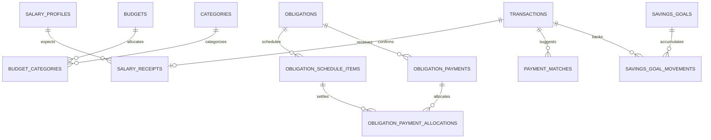

# Backend Feature Specification: Financial Planning

**Phase / Spec**: Phase 07 / SPEC-BE-007 of 014
**Working Branch**: `main`
**Feature Directory**: `apps/api/specs/007-financial-planning`
**Base Revision**: `2eeb00bdc6687602c2fb807b88eeb1f71bfc5807`
**Created**: 2026-08-31
**Status**: Complete
**Input**: "Fully complete Phase 07 — SPEC-BE-007: Financial Planning."

## Objective and Scope

Deliver the server-side financial-planning source of truth for salary cycles,
multiple budgets and category allocations, obligations and their deterministic
schedules, ledger-backed payment allocation and matching, savings goals and
movements, and one bounded planning summary. Planning references the Phase 05
ledger and Phase 06 sync contracts; it never duplicates balances or permits a
planning record to mutate ledger truth outside the owned ledger commands.

This Spec owns the database resources, `/api/v1` contracts, worker jobs,
planning events, observability, recovery, and contract-parity evidence listed
below. It does not own transaction posting, import/parser behavior, notification
delivery, report generation, AI/voice execution, billing, or the Phase 14 client
production cutover. Mobile/Admin changes are limited to contract fixtures or
strictly necessary adapters and may not replace the active client provider.

## Dependencies and Repository Baseline

- **Prior Specs**: SPEC-BE-001 through SPEC-BE-006 are committed locally on
  `main`; Phase 05 owns financial commands and Phase 06 owns idempotency, sync,
  conflicts, and mutation receipts.
- **Current repository facts**: local `main` is at `2eeb00b`, two scoped commits
  ahead of `origin/main`; the only unrelated untracked path is
  `.agents/plugins/`, which remains untouched. No Phase 07 branch or worktree is
  permitted.
- **Client facts**: the executable Mobile contract in
  `apps/mobile/src/services/contracts/financial-planning-service.ts`, its domain
  types, SQLite repository, and planning journeys define the current field and
  behavior inventory. Admin receives read-only planning summaries through its
  report/analytics boundary.
- **Governing documents**: Backend Constitution 2.0.0 and the Phase 07 section
  of `docs/Back end/BACKEND_MASTER_PLAN.md`.
- **Delivery constraint**: the user explicitly prohibited push, merge, rebase,
  PR, branch, and worktree actions. Local gates and commits are required;
  remote-only gates remain explicitly pending and are never reported as passed.

## Owned Resources

| Kind | Owned resources |
|---|---|
| Public tables | `salary_profiles`, `salary_receipts`, `budgets`, `budget_categories`, `obligations`, `obligation_schedule_items`, `obligation_payments`, `obligation_payment_allocations`, `payment_matches`, `savings_goals`, `savings_goal_movements` |
| Views | `v_salary_cycle_summary`, `v_budget_utilization`, `v_obligation_status` |
| Private functions | `generate_obligation_schedule`, `allocate_obligation_payment`, `record_savings_movement`, plus minimum owned command/read helpers required by the API |
| API | `/api/v1/salary-profiles`, `/api/v1/budgets`, `/api/v1/obligations`, `/api/v1/payment-matches`, `/api/v1/savings-goals`, `/api/v1/planning/summary`, `/api/v1/admin/planning/summary`, and documented children |
| Jobs | `planning.salary-cycle.generate`, `planning.obligation-schedule.generate`, `planning.payment-match.propose`, `planning.overdue.mark`, `planning.reminders.emit` |
| Events | `planning.salary_*`, `planning.budget_*`, `planning.obligation_*`, `planning.savings_*` |
| Cache | Optional process-local planning-summary cache keyed by user, period, and ledger version; maximum TTL 60 seconds |
| Migration family | Ordered Phase 07 planning schema, functions/views, access, and job registration migrations |
| Operations | Planning reconciliation, migration/rollback, worker recovery, alert, and local acceptance procedures |

Phase 05 retains ownership of `transactions`, postings, balances, and ledger
commands. Phase 06 retains ownership of generic idempotency, sync cursors,
mutations, tombstones, and conflicts. Phase 08 owns import/parser proposals;
Phase 10 owns reports; Phase 11 owns notification delivery.

## User Scenarios and Testing

### User Story 1 - Track Salary Cycles (Priority: P1)

An authenticated owner configures one or more salary profiles, sees expected
cycles, links a confirmed income transaction, and can correct or undo the link
without fabricating income.

**Why this priority**: salary-cycle boundaries drive the primary planning
summary while remaining optional for every other planning workflow.

**Independent Test**: create a monthly profile for day 31, generate February's
expectation, link an owned confirmed income transaction, read the updated cycle,
then unlink it and observe the original projection restored.

**Acceptance Scenarios**:

1. **Given** a monthly profile on a day absent from the month, **When** receipts
   are generated, **Then** the expected date is the month's last calendar day.
2. **Given** a confirmed owned income transaction with matching currency,
   **When** it is linked idempotently, **Then** exactly one receipt becomes
   received and the cycle derives from ledger values.
3. **Given** an ambiguous, foreign, non-income, reversed, or already-linked
   transaction, **When** linking is attempted, **Then** no cycle changes and a
   stable safe error or review state is returned.

### User Story 2 - Manage Multiple Budgets (Priority: P1)

An owner creates overlapping budgets, replaces the complete category allocation
set with optimistic concurrency, and reads ledger-derived spend and remaining
amount without double counting transfers, refunds, or obligation links.

**Independent Test**: create two overlapping budgets, set different category
limits, post eligible and excluded ledger activity, and prove each summary is
isolated, exact, and recalculated after a reversal.

**Acceptance Scenarios**:

1. **Given** category limits whose sum does not exceed the budget total,
   **When** the allocation set is replaced with the expected version, **Then**
   the complete set is atomically applied and one event is emitted.
2. **Given** an allocation sum above the budget total or a category owned by
   another user, **When** replacement is attempted, **Then** the whole command
   fails without partial rows.
3. **Given** multiple budgets covering the same dates, **When** summaries are
   requested, **Then** they remain separate and are never silently merged.

### User Story 3 - Schedule Obligations (Priority: P1)

An owner creates payable or receivable obligations and obtains deterministic,
bounded, idempotent schedule items, overdue state, and obligation summaries.

**Independent Test**: generate a monthly fixed-term obligation through a bounded
horizon twice and prove stable sequence/date/amount rows, then advance time and
mark only eligible due items overdue.

**Acceptance Scenarios**:

1. **Given** the same obligation and horizon, **When** generation retries,
   **Then** no duplicate sequence item is inserted.
2. **Given** month-end, partial final-installment, open-ended, paused, or ended
   obligations, **When** generation runs, **Then** dates, amounts, and stopping
   conditions follow the documented deterministic rules.
3. **Given** another user's obligation, **When** it is read or mutated, **Then**
   API authorization and RLS independently deny access.

### User Story 4 - Allocate And Match Payments (Priority: P1)

An owner links one confirmed expense transaction to an obligation, explicitly
allocates its amount across schedule items or prepayment, and reviews proposed
matches without confidence ever authorizing a financial mutation.

**Independent Test**: allocate partial, multi-installment, and explicit
prepayment cases; retry the same key; race a duplicate transaction; reverse the
ledger transaction; and prove allocation, status, outbox, and derived summaries
remain atomic and reconcilable.

**Acceptance Scenarios**:

1. **Given** a confirmed owned same-currency expense transaction, **When** the
   allocation sum equals the payment amount and does not overfill a schedule,
   **Then** exactly one payment and its allocations commit atomically.
2. **Given** a duplicate transaction, stale version, sum mismatch, cross-user
   row, currency mismatch, or implicit excess, **When** payment is attempted,
   **Then** it fails with no partial effects.
3. **Given** a proposed match, **When** the owner accepts or rejects it with the
   current version, **Then** one terminal decision is stored; acceptance still
   uses the validated payment command.

### User Story 5 - Track Savings Goals (Priority: P1)

An owner manages savings goals and records ledger-backed contributions,
withdrawals, and adjustments while progress remains a derived sum rather than a
mutable counter.

**Independent Test**: create a goal, record a contribution and withdrawal
against owned confirmed transactions, retry both operations, reverse one ledger
transaction, and prove current/remaining/progress values reconcile exactly.

**Acceptance Scenarios**:

1. **Given** a same-currency confirmed transaction with the signed effect
   required by the movement kind, **When** it is recorded, **Then** one movement
   is stored and progress is derived from confirmed movements.
2. **Given** a withdrawal above tracked progress, duplicate link, stale goal,
   foreign transaction, or wrong sign, **When** it is submitted, **Then** no
   movement is added.
3. **Given** a target reached or a movement later invalidated by ledger state,
   **When** reconciliation runs, **Then** lifecycle and progress are corrected
   idempotently with an auditable event.

### User Story 6 - Read And Operate Planning (Priority: P2)

Mobile reads one bounded planning summary while workers generate schedules,
propose matches, mark overdue items, emit reminder intents, and reconcile ledger
changes safely under retries and crashes.

**Independent Test**: seed representative salary, budget, obligation, savings,
and ledger data; call the aggregate; run each worker twice including lease
recovery; and verify stable output, bounded payload/latency, no cross-user data,
and zero unexplained reconciliation drift.

**Acceptance Scenarios**:

1. **Given** a period and authenticated owner, **When** the aggregate is read,
   **Then** salary, budgets, obligations, savings, and ledger version arrive in
   one bounded response.
2. **Given** ledger or planning change, **When** cached data exists, **Then** the
   cache key/version or event invalidation prevents stale cross-version output.
3. **Given** worker retry, crash, or poison input, **When** processing resumes,
   **Then** deterministic keys and bounded claims prevent duplicate effects.

### Edge Cases

- Monthly dates clamp to the actual last day, including leap years; weekly and
  biweekly generation stays timezone-aware and custom frequency is explicit.
- Budget periods are inclusive, valid, and bounded; zero total allows only zero
  active category allocation; deleted/closed budgets cannot accept allocation.
- Missing FX data returns an explicit unavailable/partial state, never silent
  exclusion or floating-point conversion.
- Fixed schedules handle residual final amounts; open-ended schedules stop at
  the requested bounded horizon; end dates stop generation.
- Partial payments do not mark an item paid; implicit overpayment is rejected;
  explicit prepayment is recorded without inventing future schedule amounts.
- Payables and receivables remain distinct; a receivable is not counted as debt.
- Savings withdrawals cannot exceed confirmed derived progress; negative values
  are represented only by the validated movement kind/effect contract.
- Deleted, reversed, or ownership-changed ledger references cause idempotent
  reconciliation, not destructive history edits.
- Every list is cursor-bounded; arbitrary periods, unbounded horizons, oversized
  allocation arrays, and high-cardinality telemetry labels are rejected.

## Database Design

### Owned Tables

All mutable user-owned rows include `id uuid`, `user_id text`, `created_at`,
`updated_at`, and `version bigint`; immutable user-owned rows include `id`,
`user_id`, and `created_at`. Money is `bigint` minor units and all user-visible
money references an enabled three-letter currency.

The authoritative column-level model is `data-model.md`. It includes the eleven
Master Plan tables and the minimum client-parity fields needed for direction,
schedule kind, lifecycle, alert thresholds, explicit allocation intent,
transaction ownership, matching review, opening tracked savings, and safe
correction/undo references. Additions correct the Master Plan's compressed table
inventory without changing Phase ownership.

### Relationships and ERD

### RLS, Grants, and Authorization

Every owned public table enables and forces RLS. Owner reads are scoped by
`user_id`; root writes occur through the API/private commands; dependent direct
client writes are revoked. Policies and functions independently re-check root
ownership and every referenced account, category, transaction, schedule item,
and currency. Anonymous and cross-owner access is denied. Admin read requires
`planning.read`; no Admin planning or money mutation is introduced.

Security-definer functions use a fixed `search_path`, explicit role checks,
bounded arrays/periods, row locks in deterministic order, and no public execute
grant. Service-role access is limited to named jobs and reconciliation paths.

## API Contracts

All paths are under `/api/v1`, require an active Clerk owner unless noted, use
the standard error envelope/request ID, return string-encoded minor amounts at
the HTTP boundary, and enforce allowlisted DTOs. Mutations require
`Idempotency-Key`; updates require `expectedVersion`.

| Method | Path | Purpose |
|---|---|---|
| GET/POST | `/salary-profiles` | List/create profiles |
| GET/PATCH/DELETE | `/salary-profiles/:id` | Read/update/archive a profile |
| GET | `/salary-profiles/:id/receipts` | Cursor-list expected/received receipts |
| POST/DELETE | `/salary-profiles/:id/receipts` | Link or unlink a confirmed transaction |
| GET/POST | `/budgets` | Cursor-list/create budgets |
| GET/PATCH/DELETE | `/budgets/:id` | Read/update/archive a budget |
| PUT | `/budgets/:id/categories` | Atomically replace the complete allocation set |
| GET | `/budgets/:id/summary` | Ledger-derived utilization and ledger version |
| GET/POST | `/obligations` | Cursor-list/create obligations |
| GET/PATCH/DELETE | `/obligations/:id` | Read/update/archive an obligation |
| GET | `/obligations/:id/schedule` | Cursor-list deterministic schedule items |
| POST | `/obligations/:id/payments` | Validate and allocate a ledger-backed payment |
| GET/PATCH | `/payment-matches` and `/payment-matches/:id` | List and decide proposals |
| GET/POST | `/savings-goals` | Cursor-list/create goals |
| GET/PATCH/DELETE | `/savings-goals/:id` | Read/update/archive a goal |
| POST | `/savings-goals/:id/movements` | Record a validated ledger-backed movement |
| GET | `/planning/summary?period=YYYY-MM` | Read the bounded Mobile aggregate |
| GET | `/admin/planning/summary?userId=&period=YYYY-MM` | Permission-gated read-only Admin aggregate |

Exact request, response, pagination, error, and OpenAPI schemas live under
`contracts/` and must remain compatible with the executable Mobile service
contract through an explicit adapter mapping.

## Functions, Views, and Triggers

- `private.generate_obligation_schedule(obligation_id, through_date)` locks the
  obligation, validates ownership/status/horizon, calculates stable sequence
  dates and residual amounts, and inserts missing rows idempotently.
- `private.allocate_obligation_payment(...)` validates the Phase 05 transaction,
  locks obligation/schedule rows deterministically, enforces exact allocation
  totals and explicit prepayment, writes payment/allocations, updates derived
  schedule statuses, and emits one outbox event atomically.
- `private.record_savings_movement(...)` validates transaction ownership,
  currency, status, sign/effect, duplicate use, and available progress before
  inserting one immutable movement and one outbox event.
- Owned root commands use the Phase 06 durable idempotency receipt and optimistic
  version contract; direct table mutation cannot bypass them.
- `v_salary_cycle_summary`, `v_budget_utilization`, and
  `v_obligation_status` are `security_invoker`, owner-filterable, bounded, and
  ledger-version aware. They never store mutable balance counters.
- Shared `private.set_updated_at_and_version()` is reused for mutable roots;
  owned lifecycle guards forbid client-selected metadata/version changes.

## Queues, Jobs, and Events

Jobs reuse the existing outbox/worker process and bounded claim/fence pattern; no
new queue framework or dependency is added. Schedule and salary generators use
stable natural keys. Match proposals are advisory only. Overdue marking and
reminder emission are replay-safe. Reconciliation repairs only derived planning
state and emits safe diagnostic events; it never edits immutable ledger rows.

Events use the existing envelope and contain IDs, versions, safe states,
currency, and ledger version only—no names, notes, provider keywords, salary
amounts, debt details, or raw transaction payloads.

## Business Rules

- Planning never changes balances directly and never treats expected salary as
  received income.
- Active category limits sum to no more than the budget total; overlapping
  budgets are legal and independent.
- Spend is derived once from eligible confirmed ledger activity; transfers are
  excluded and refunds/reversals reduce spend.
- Obligation payment amount equals its allocations. Schedule overfill requires
  an explicit prepayment allocation and cannot be inferred from confidence.
- One transaction can back at most one active obligation payment and one
  compatible savings movement per documented kind; duplicate retries replay.
- Savings progress is the signed sum of valid movements, never a mutable counter.
- Last Write Wins and keep-both are forbidden for planning/financial conflicts.
- Every derived response includes the ledger version or an explicit unavailable
  reason so clients can identify stale/partial data.

## Security and Privacy Requirements

The implementation must prove BOLA/property-authorization denial, mass-assignment
rejection, SQL/JSON injection resistance, bounded periods/arrays/cursors, rate
limits, safe errors, RLS isolation, security-definer privilege safety, and audit
coverage. Logs/metrics/events must not contain salary, debt, savings, notes,
keywords, transaction descriptions, or user-selected names. No secret or service
role reaches a client or image. Any cross-user read/write, direct dependent-row
write, financial double effect, or missing RLS negative test is release-blocking.

## Performance and Caching Requirements

- Planning summary: P95 <= 400 ms, P99 <= 800 ms, payload <= 250 KiB.
- Root/list/detail/schedule endpoints: P95 <= 300 ms, P99 <= 600 ms, bounded
  cursor pages (default 50, maximum 100).
- Payment/movement mutations: P95 <= 500 ms, P99 <= 900 ms with 100-item
  allocation hard limit and no N+1 query path.
- Schedule generation uses a maximum 18-month horizon and bounded batches.
- A process-local summary cache may be used only if keyed by user, period, and
  ledger version, TTL <= 60 seconds, invalidated by ledger/planning events, safe
  on failure, and measured. No Redis is introduced without evidence.
- Production-like performance evidence includes at least 100k ledger rows, 12
  overlapping budgets, 100 obligations with 24 schedule items, and 50 goals.

## Mobile and Admin Integration

Contract parity maps current Mobile salary, multiple-budget, obligation payment,
matching, savings, conflict, and reporting types to the API without changing the
active provider or copying calculations into the client. Phase 07 may add a
strict adapter/fixture needed to prove parity; Phase 14 owns live cutover and
offline rollout. Admin receives read-only aggregate fields through its existing
analytics/report boundary and permission `planning.read`; no Admin mutation UI,
duplicate calculation, or direct table access is added.

## Functional Requirements

- **FR-001**: The implementation MUST create exactly the eleven owned public tables, three views, owned private functions, indexes, triggers, policies, grants, jobs, events, and migration records documented by this Spec.
- **FR-002**: Every user-owned table MUST force RLS and deny anonymous, cross-user, and unauthorized direct dependent-row writes.
- **FR-003**: All money MUST use exact integer minor units with enabled currency compatibility; HTTP money MUST be encoded without JavaScript precision loss.
- **FR-004**: Every mutation MUST use the Phase 06 durable idempotency contract and every update/decision MUST enforce an expected version.
- **FR-005**: Planning MUST reference Phase 05 ledger truth and MUST NOT write postings or balances directly.
- **FR-006**: Owners MUST manage optional salary profiles with amount, currency, frequency, expected day, account/source, automatic-detection preference, lifecycle, and next expected-cycle data.
- **FR-007**: Salary generation MUST clamp absent month days, support documented frequencies, and insert deterministic expected receipts idempotently.
- **FR-008**: Linking a salary receipt MUST require one owned confirmed compatible income transaction and MUST reject ambiguous, duplicate, reversed, foreign, or incompatible transactions.
- **FR-009**: Salary cycle summaries MUST derive received income, expenses, obligations, remaining and daily suggestion from ledger/planning data and expose unavailable reasons when incomplete.
- **FR-010**: Unlink/correction MUST preserve history, restore the projection, and recalculate the cycle idempotently.
- **FR-011**: Expected or late salary MUST never fabricate income or silently update future expectations.
- **FR-012**: Owners MUST manage multiple overlapping budgets with valid inclusive periods, exact totals, lifecycle, rollover configuration, and optional copy provenance.
- **FR-013**: Replacing budget categories MUST be atomic, complete-set, ownership checked, and version checked.
- **FR-014**: Active category limits MUST not exceed total; zero total permits no positive active allocation; a category is unique per budget.
- **FR-015**: Budget utilization MUST derive eligible spend exactly once, exclude transfers, apply refunds/reversals, respect category changes, and include a ledger version.
- **FR-016**: Budget summaries MUST remain separate for overlapping periods and expose spent, remaining, utilization, forecast/data-state, and original currency.
- **FR-017**: Missing conversion data MUST produce an explicit partial/unavailable state, not silent exclusion or floating-point estimation.
- **FR-018**: Closed/deleted budgets MUST reject further allocation and preserve auditable history/tombstones for sync.
- **FR-019**: Budget list/detail/summary MUST meet the bounded pagination, payload, and latency contracts.
- **FR-020**: Owners MUST manage payable and receivable obligations with supported type, schedule kind/frequency, exact amounts, dates, account, matching metadata, reminders, notes, lifecycle, and soft deletion.
- **FR-021**: Deterministic schedule generation MUST be idempotent, bounded, month-end safe, residual-aware, and stopped by lifecycle/end/horizon rules.
- **FR-022**: Schedule items MUST preserve stable positive sequence numbers and distinguish due, partial, paid, overdue, skipped/cancelled states.
- **FR-023**: Payable and receivable totals MUST remain separate and lifecycle rules MUST control current aggregate contribution.
- **FR-024**: Overdue marking MUST be retry-safe, clock-controlled in tests, and unable to alter paid/skipped/future items.
- **FR-025**: Obligation reads MUST expose bounded schedule/payment history and ledger-derived status without mutable total counters.
- **FR-026**: Pause, close, complete, archive/delete transitions MUST be allowlisted, version checked, and auditable.
- **FR-027**: Reconciliation MUST detect and safely repair only derived schedule/status drift without changing ledger truth.
- **FR-028**: Obligation generation and list/detail endpoints MUST meet bounded performance contracts and avoid N+1 queries.
- **FR-029**: A payment MUST link one owned confirmed compatible expense transaction and one obligation, with globally unique active transaction use.
- **FR-030**: Allocation amount MUST equal payment amount and each allocation MUST reference a same-obligation schedule item; all rows commit atomically.
- **FR-031**: Partial allocation MUST retain the unpaid remainder; implicit overpayment/excess MUST fail; explicit prepayment intent MUST be retained.
- **FR-032**: Duplicate keys MUST replay the original response while same-key/different-request and concurrent duplicate transaction use fail deterministically.
- **FR-033**: Ledger reversal/deletion MUST invalidate or reverse linked planning effects idempotently while preserving payment history.
- **FR-034**: Match proposals MUST retain bounded confidence/evidence but MUST never mutate planning or ledger state without an owner decision and validated command.
- **FR-035**: Match decisions MUST be version checked, terminal, auditable, and safe under concurrent/repeated decisions.
- **FR-036**: Payment allocation MUST emit one safe outbox event in the same transaction and expose the resulting ledger/planning versions.
- **FR-037**: Payment/match errors MUST use stable safe codes for stale version, duplicate, ownership, currency, ledger state, allocation sum, schedule overfill, and invalid lifecycle.
- **FR-038**: Payment and match contracts MUST cover manual, automatic, voice/platform-assisted provenance without granting those sources authority.
- **FR-039**: Owners MUST manage savings goals with exact target, opening tracked amount, currency, optional target/account/icon metadata, emergency status, lifecycle, and soft deletion.
- **FR-040**: Savings progress MUST derive from opening amount plus valid signed movements and expose current, remaining, percentage, required monthly, state, and ledger version.
- **FR-041**: Contribution, withdrawal, adjustment/correction, and reversal effects MUST validate owned confirmed transaction state, currency, sign, uniqueness, and available progress.
- **FR-042**: A withdrawal MUST not exceed derived confirmed progress and a target below progress MUST require an explicit lifecycle decision.
- **FR-043**: Repeated/concurrent movement submission and later ledger reversal MUST remain idempotent and reconcilable without double counting.
- **FR-044**: Goal and movement history MUST remain auditable after pause, completion, archive, deletion, correction, or reversal.
- **FR-045**: The planning summary MUST return salary, independent budgets, obligation payable/receivable aggregates, savings progress, data-state, and ledger version in one bounded request.
- **FR-046**: Jobs MUST use bounded claims, deterministic natural keys, retries/fences, graceful shutdown, and poison-item handling through existing worker infrastructure.
- **FR-047**: Reminder work MUST emit intents only; Phase 11 retains delivery ownership and user privacy settings remain authoritative.
- **FR-048**: Sync handlers MUST expose owned planning roots/dependents and tombstones through Phase 06 without Last Write Wins or keep-both financial resolution.
- **FR-049**: Mobile/API contract parity MUST cover all current planning workflows and fields without activating the production client cutover.
- **FR-050**: Admin access MUST be read-only, permission-gated by `planning.read`, and use owned summaries rather than duplicate calculations.
- **FR-051**: Structured metrics MUST cover API/job latency, schedule generation, overdue counts, match decisions, allocation failures, cache behavior, reconciliation differences, and reminder backlog without sensitive/high-cardinality labels.
- **FR-052**: Alerts and runbooks MUST cover worker backlog/failure, allocation failure, reconciliation drift, stale summaries, migration failure, and recovery.
- **FR-053**: Migrations MUST be ordered, checksum-verifiable, N-1 compatible, forward-correctable, and proven by reset/apply/backup/restore tests.
- **FR-054**: Mobile planning data import MUST preserve stable IDs, integer money, ownership, lifecycle, and link mappings through Phase 06, with quarantine for invalid/unsafe records.
- **FR-055**: Security, contract, database, integration, E2E, concurrency, performance, recovery, container/image, and client-parity evidence MUST pass before local completion.
- **FR-056**: No Phase 08+ resource, new infrastructure/dependency, Admin mutation, direct client secret, or unrelated remediation may be introduced.

## Tests and Verification Evidence

Required evidence includes DTO/service unit tests; OpenAPI and Mobile parity
contract tests; live integration tests for every API and worker; pgTAP structure,
constraint, RLS/grant, function, view, outbox, and concurrency coverage; E2E
migration/recovery/reconciliation tests; security boundary tests; representative
performance/load/query-plan tests; Mobile adapter/migration preservation checks;
worker crash/retry/shutdown tests; format, typecheck, lint, build, dependency,
workflow, container/image, SBOM/signature/provenance gate accounting; clean-code,
test-quality, and independent code review; and acceptance/DoD matrices with exact
commands and fresh results.

## Migration and Rollback Strategy

1. Add root/dependent tables and indexes in FK order with RLS forced and no broad
   grants; keep application compatibility while no Phase 07 routes are mounted.
2. Add functions/views/triggers and test privilege/atomicity before API exposure.
3. Add explicit grants, job registration, sync handlers, and API/worker modules.
4. Import representative/current Mobile planning rows through a stable mapping,
   quarantine invalid ownership/currency/precision records, and compare shadow
   summaries to the source without switching the active client provider.
5. Rollback disables Phase 07 routes/jobs/writes and reverts the adapter while
   preserving planning rows and leaving the ledger untouched. Failed migration
   repair is forward-only; backup/restore and N-1 behavior are rehearsed.

## Observability and Operations

Metrics use bounded route/job/status labels and request/job correlation IDs.
Logs record IDs, versions, durations, counts, and safe error codes only. Runbooks
provide non-production-by-default commands, thresholds, owners, diagnosis,
replay/reclaim, reconciliation, migration recovery, and escalation. Alerts cover
P95/P99 breaches, backlog/lease age, repeated allocation/reconciliation failure,
summary staleness, and reminder-intent backlog.

## Success Criteria

- **SC-001**: 100% of owned tables force RLS and pass positive owner plus negative cross-owner, Admin-without-permission, worker, and anonymous tests as applicable.
- **SC-002**: 100% of tested salary month-end, late, link, correction, duplicate, and reversal cases produce one deterministic ledger-derived cycle result.
- **SC-003**: 100% of tested overlapping-budget, allocation-total, transfer, refund, reversal, category-change, and missing-FX cases produce exact isolated outcomes.
- **SC-004**: Re-running schedule generation for the same obligation/horizon produces zero duplicate rows and correct dates/residuals for every supported frequency case.
- **SC-005**: 100% of tested partial, multiple, explicit-prepayment, duplicate, stale, reversed, and conflicting payments leave payment/allocation/schedule/outbox state atomic and reconcilable.
- **SC-006**: 100% of match proposals require an explicit valid decision before any financial effect; repeated/concurrent decisions produce at most one terminal result.
- **SC-007**: 100% of tested savings contributions, withdrawals, corrections, duplicate retries, and reversals derive exact progress once and reject overdraft/currency/ownership violations.
- **SC-008**: Planning summary P95 is <=400 ms, P99 <=800 ms, and payload <=250 KiB on the specified production-like dataset.
- **SC-009**: List/detail P95 is <=300 ms and P99 <=600 ms; payment/movement P95 <=500 ms and P99 <=900 ms with required indexes used.
- **SC-010**: Killing and reclaiming each Phase 07 job produces no duplicate effect, stale completion, or unbounded retry, and graceful shutdown leaves recoverable leases.
- **SC-011**: Mobile parity covers every current service method/field or records an explicit Phase 14 mapping; representative data migrates with zero unexplained loss or precision drift.
- **SC-012**: Reconciliation reports zero unexplained ledger/planning differences after normal, retry, crash, reversal, restore, and rollback rehearsals.
- **SC-013**: Fresh local format/type/lint/test/build/database/security/performance/recovery/container gates complete with zero failures and no unresolved Critical/High review finding.
- **SC-014**: Every accepted mutation produces one safe audit/outbox trail and no tested log, metric, event, error, or response leaks sensitive planning fields.
- **SC-015**: Every external-only gate prohibited by the no-push instruction is listed as pending and none is represented as passing.

## Assumptions

- Calendar-month budgets remain distinct from salary-cycle summaries.
- Positive unused rollover is supported only when explicitly enabled; deficit
  carryover is excluded.
- The current Mobile preview screens may calculate a non-authoritative preview,
  but the confirm request is fully revalidated server-side.
- Custom schedules require explicit dates/amounts through the bounded contract;
  no expression language or arbitrary recurrence engine is introduced.
- Currency conversion consumes existing reference data when available; Phase 07
  does not own exchange-rate ingestion.
- Opening paid/tracked values are migration inputs retained explicitly and do not
  create ledger entries; new progress is ledger-backed.

## Acceptance Criteria and Definition of Done

- [x] All owned schema, constraints, indexes, RLS, grants, functions, views,
  triggers, APIs, jobs, events, and observability contracts are implemented.
- [x] Salary, budgets, obligations, payments/matches, savings, summaries, sync,
  reconciliation, and recovery satisfy all scenarios and FRs.
- [x] Exact-money, ownership, idempotency, concurrency, version, atomicity,
  outbox/audit, and no-LWW invariants have positive and negative evidence.
- [x] Mobile/Admin parity is proven without unauthorized production cutover.
- [x] Performance/payload/query-plan, migration/rollback/backup/restore, container,
  security, and full repository quality gates pass locally.
- [x] Clean-code, test-quality, and independent review findings are resolved.
- [x] `tasks.md`, acceptance evidence, and DoD contain no unchecked locally
  executable work; remote-only gates remain explicit pending due to no push.
- [x] Scoped Phase 07 changes are committed directly on local `main`; unrelated
  `.agents/plugins/` remains untouched; no branch/worktree/push/merge/rebase/PR.

## Exclusions

- Phase 08 imports/parsers/deduplication and automatic source ingestion.
- Phase 10 report generation/export/email and Phase 11 notification delivery.
- AI/voice execution, billing, providers, investments, bank integrations, and
  mutable Admin planning operations.
- Redis, microservices, Prisma, Supabase Edge Functions, new queue frameworks,
  arbitrary recurrence DSLs, or speculative caches.
- Phase 14 activation of live Mobile/Admin providers.
