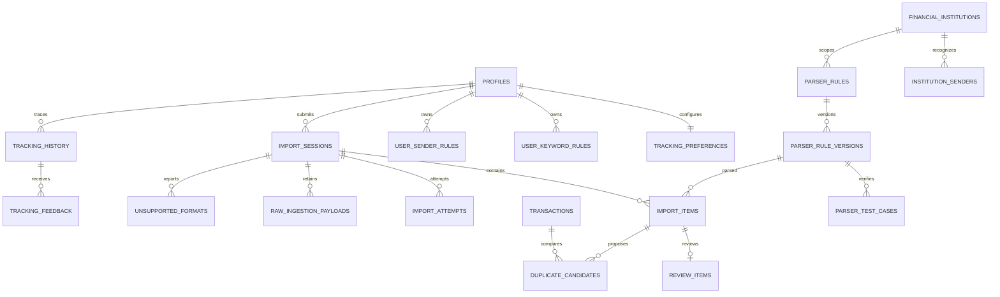

# Phase 08 Data Model

## Conventions

- Mutable entity (`M`): `id uuid primary key default gen_random_uuid()`,
  `created_at timestamptz not null default now()`, `updated_at timestamptz not
  null default now()`, `version bigint not null default 1 check (version > 0)`.
- Immutable entity (`I`): UUID primary key plus `created_at`; update/delete is
  revoked and rejected by trigger except through a named retention function.
- Owner entity (`U`): `user_id text not null references public.profiles(user_id)`;
  child/root ownership consistency is enforced, not inferred from caller input.
- Text lengths are UTF-8 byte limits at the HTTP/parser boundary and character
  checks in PostgreSQL. Timestamps are UTC instants; money is signed/positive
  `bigint` minor units according to the field contract.
- Every public table has enabled and forced RLS. Default table/function/public
  schema privileges are revoked before narrow policies/grants are added.

## Reference And Parser Resources

### `public.financial_institutions` (`M`)

| Column | Type / default | Rule |
|---|---|---|
| `country_code` | `char(2)` | FK to active/supported country reference |
| `name` | `text` | trimmed, 1..120 |
| `code` | `text` | lowercase ASCII slug 2..40, globally unique |
| `active` | `boolean default true` | inactive institutions cannot be newly selected |

Indexes: unique lowercase `code`; `(country_code,active,name,id)`.

### `public.institution_senders` (`M`)

| Column | Type / default | Rule |
|---|---|---|
| `institution_id` | `uuid` | FK institution, restrict delete |
| `sender_pattern` | `text` | normalized safe pattern 1..256 |
| `display_label` | `text` | 1..120; safe client label |
| `priority` | `integer default 100` | 0..10000; lower wins |
| `active` | `boolean default true` | inactive ignored |

Indexes: unique `(institution_id,lower(sender_pattern))`;
`(active,priority,id)` partial active; `(institution_id,active,priority,id)`.

### `public.parser_rules` (`M`)

| Column | Type / default | Rule |
|---|---|---|
| `institution_id` | `uuid null` | optional institution scope |
| `name` | `text` | 1..120 |
| `source_type` | `text` | `sms`, `file`, `manual`, `provider` |
| `active_version_id` | `uuid null` | deferred FK to a version of this rule |
| `status` | `text default 'draft'` | `draft`, `active`, `disabled` |

Indexes: `(institution_id,status,source_type,id)` and one active rule per
institution/source/name scope. Active version and status change together.

### `public.parser_rule_versions` (`I`)

| Column | Type / default | Rule |
|---|---|---|
| `parser_rule_id` | `uuid` | FK rule cascade |
| `version_no` | `integer` | positive, monotonically allocated under root lock |
| `definition` | `jsonb` | strict parser DSL, encoded size <=8192 bytes |
| `definition_hash` | `text` | lowercase SHA-256 hex of canonical definition |
| `created_by` | `text` | FK active Admin profile at creation |
| `published_at` | `timestamptz null` | set once by guarded publish |

Indexes: unique `(parser_rule_id,version_no)`, unique
`(parser_rule_id,definition_hash)`, `(parser_rule_id,published_at desc)`.
Definition/creator/hash never change; publish time changes from null once.

### `public.parser_test_cases` (`M`)

| Column | Type / default | Rule |
|---|---|---|
| `parser_version_id` | `uuid` | FK version cascade |
| `name` | `text` | 1..120 |
| `input_fixture` | `text` | synthetic, <=4096 bytes, no real customer content |
| `expected_output` | `jsonb` | strict safe normalized partial output, <=8192 bytes |
| `enabled` | `boolean default true` | disabled cases excluded from publish gate |

Indexes: unique `(parser_version_id,lower(name))` and
`(parser_version_id,enabled,id)`. Cases are mutable only while their version is
unpublished; a published version freezes its cases.

### `public.merchant_rules` (`M`)

| Column | Type / default | Rule |
|---|---|---|
| `user_id` | `text null` | null is global; non-null is owner-specific |
| `pattern` | `text` | safe normalized pattern 1..256 |
| `normalized_merchant` | `text` | 1..160 |
| `priority` | `integer default 100` | 0..10000; lower wins |
| `active` | `boolean default true` | inactive ignored |

Indexes: unique global `lower(pattern)` where owner null; unique
`(user_id,lower(pattern))` where owner present; active owner/global priority
indexes. User rules cannot be managed through Admin global endpoints.

### `public.category_rules` (`M`)

| Column | Type / default | Rule |
|---|---|---|
| `user_id` | `text null` | null global, otherwise owner-specific |
| `pattern` | `text` | safe normalized pattern 1..256 |
| `category_id` | `uuid` | FK category; owner-specific targets same owner/system |
| `priority` | `integer default 100` | 0..10000; lower wins |
| `active` | `boolean default true` | inactive ignored |

Indexes mirror merchant rules plus `(category_id,active)`. Compatibility and
ownership are rechecked at rule application and final acceptance.

## Customer Configuration

### `public.tracking_preferences` (`M+U`, owner PK)

| Column | Type / default | Rule |
|---|---|---|
| `user_id` | `text primary key` | FK profile cascade/restrict per profile policy |
| `enabled` | `boolean default false` | explicit tracking consent |
| `review_required` | `boolean default true` | automatic acceptance disabled by default |
| `duplicate_window_seconds` | `integer default 86400` | 60..2592000 |
| `source_retention_days` | `integer default 30` | 1..365 |

The standard timestamps/version apply. A customer row is created lazily or with
profile provisioning and cannot be omitted to imply consent.

### `public.user_keyword_rules` (`M+U`)

| Column | Type / default | Rule |
|---|---|---|
| `keyword` | `text` | NFKC/trim normalized, 1..120 |
| `group_key` | `text` | one of the 11 current Mobile semantic groups |
| `language_code` | `char(2)` | `ar` or `en` |
| `origin` | `text default 'custom'` | `default` or `custom`; default rows come only from restore/provisioning |
| `match_type` | `text default 'contains'` | `exact`, `contains`, `regex` |
| `category_id` | `uuid null` | eligible owned/system category |
| `priority` | `integer default 100` | 0..10000 |
| `enabled` | `boolean default true` | inactive ignored |

Indexes: unique `(user_id,lower(keyword),match_type)` and partial
`(user_id,priority,id) where enabled`. Regex form is restricted by the safe
pattern validator; exact/contains is preferred. Recent-use metadata is derived
from owner history rather than mutable counters.

### `public.user_sender_rules` (`M+U`)

| Column | Type / default | Rule |
|---|---|---|
| `sender_pattern` | `text` | normalized safe pattern 1..256 |
| `display_label` | `text` | 1..120 |
| `institution_id` | `uuid null` | optional active institution |
| `trusted` | `boolean default false` | affects confidence only, never authorization |
| `enabled` | `boolean default true` | inactive ignored |

Indexes: unique `(user_id,lower(sender_pattern))`; partial
`(user_id,id) where enabled`; `(institution_id,enabled)`. Usage counts are
derived from history rather than mutable rule counters.

## Intake And Processing

### `public.import_sessions` (`M+U`)

| Column | Type / default | Rule |
|---|---|---|
| `source_type` | `text` | `sms`, `file`, `manual`, `provider` |
| `source_name` | `text null` | safe/redacted display name <=120; never a path |
| `schema_version` | `integer default 1` | supported positive version |
| `request_hash` | `text` | SHA-256 of canonical normalized request |
| `status` | `text default 'received'` | `received`, `processing`, `review`, `complete`, `failed` |
| `item_count` | `integer default 0` | 0..10000 |
| `accepted_count` | `integer default 0` | 0..item count |
| `rejected_count` | `integer default 0` | 0..item count |
| `started_at` | `timestamptz default now()` | not future beyond clock tolerance |
| `completed_at` | `timestamptz null` | required only terminal; >= start |

Indexes: `(user_id,status,started_at desc,id desc)`, worker partial index on
received/processing state, and `(user_id,request_hash)`. Counts satisfy accepted
+ rejected <= item count and are maintained/reconciled only by guarded functions.

Transitions:

```text
received -> processing | failed
processing -> review | complete | failed
review -> processing | complete | failed
failed -> received (explicit retry only)
complete -> terminal
```

### `public.import_items` (`M+U`)

| Column | Type / default | Rule |
|---|---|---|
| `session_id` | `uuid` | FK session cascade; same owner |
| `source_item_key` | `text` | 1..160, unique in session |
| `normalized_hash` | `text` | SHA-256 of canonical normalized financial fields |
| `source_hash` | `text` | non-reversible stable source fingerprint |
| `parser_version_id` | `uuid null` | exact parser version used |
| `applied_rule_ids` | `uuid[] default '{}'` | max 32, stable applied order |
| `occurred_at` | `timestamptz null` | bounded supported financial date |
| `amount_minor` | `bigint null` | nonzero if present; absolute limit documented in ledger |
| `currency_code` | `char(3) null` | enabled currency FK |
| `merchant` | `text null` | normalized <=160 |
| `normalized_payload` | `jsonb` | strict allowlisted fields <=8192 bytes |
| `confidence_basis_points` | `integer default 0` | 0..10000 |
| `status` | `text default 'parsed'` | `parsed`, `review`, `accepted`, `rejected`, `duplicate`, `failed` |
| `transaction_id` | `uuid null` | same-owner transaction; set only accepted/duplicate |
| `operation_id` | `uuid null` | Phase 06 operation used for ledger acceptance |

Indexes: unique `(session_id,source_item_key)`, `(user_id,normalized_hash)`,
`(session_id,status,id)`, `(user_id,occurred_at desc,id desc)`, partial unique
`operation_id`, and partial `(user_id,status,occurred_at,id)` for reviewable rows.

Transitions:

```text
parsed -> review | accepted | rejected | duplicate | failed
review -> accepted | rejected | duplicate | failed
failed -> parsed (explicit retry with new immutable attempt)
accepted | rejected | duplicate -> terminal
```

### `private.import_attempts` (`I`)

| Column | Type / default | Rule |
|---|---|---|
| `session_id` | `uuid` | FK session cascade |
| `attempt_no` | `integer` | >0, unique per session |
| `worker_id` | `text` | 1..128 |
| `fence_token` | `uuid` | completion must match current claim |
| `status` | `text` | `running`, `succeeded`, `failed` |
| `started_at` | `timestamptz default now()` | immutable |
| `completed_at` | `timestamptz null` | terminal only, >= start |
| `lease_until` | `timestamptz` | bounded claim expiry |
| `error_code` | `text null` | allowlisted stable code only |

Indexes: unique `(session_id,attempt_no)`, unique `fence_token`, partial
`(status,lease_until,session_id) where status='running'`, `(status,started_at)`.

### `private.raw_ingestion_payloads` (`I`)

| Column | Type / default | Rule |
|---|---|---|
| `session_id` | `uuid` | FK session cascade |
| `item_id` | `uuid null` | FK item set null on item retention removal |
| `storage_ref` | `text` | generated opaque key <=300; never a caller path |
| `payload_hash` | `text` | lowercase SHA-256 hex |
| `content_type` | `text` | allowlisted normalized media type |
| `size_bytes` | `bigint` | 1..6291456 |
| `scan_status` | `text default 'pending'` | `pending`, `clean`, `rejected`, `unavailable` |
| `expires_at` | `timestamptz` | 1..365 days from receipt policy |

Indexes: unique `(session_id,payload_hash)`, unique `storage_ref`,
`(expires_at,id)`, partial `(scan_status,created_at,id)` for quarantine processing.

### `public.unsupported_formats` (`M+U`)

| Column | Type / default | Rule |
|---|---|---|
| `session_id` | `uuid` | FK session cascade; same owner |
| `content_hash` | `text` | SHA-256; never returned to customer/Admin UI |
| `reason` | `text` | allowlisted stable reason <=80 |
| `sample_redacted` | `text null` | synthetic/redacted <=4096; no formula execution |
| `status` | `text default 'open'` | `open`, `covered`, `ignored` |
| `reviewed_at` | `timestamptz null` | terminal only |
| `reviewed_by` | `text null` | Admin subject for terminal state |

Indexes: unique `(session_id,content_hash)`, `(status,updated_at desc,id)`, and
`(user_id,created_at desc,id)`. Customer responses expose only safe reason/status.

## Review, Duplicate, History, And Feedback

### `public.review_items` (`M+U`)

| Column | Type / default | Rule |
|---|---|---|
| `import_item_id` | `uuid` | FK item cascade; same owner |
| `reason` | `text` | allowlisted reason code <=80 |
| `proposed_values` | `jsonb` | strict allowlisted proposal <=8192 bytes |
| `original_values` | `jsonb` | immutable safe pre-edit proposal |
| `accepted_values` | `jsonb null` | exact accepted allowlisted fields |
| `status` | `text default 'pending'` | `pending`, `accepted`, `rejected`, `edited` |
| `reviewed_at` | `timestamptz null` | terminal only |
| `reviewed_by` | `text null` | must equal owner for customer decision |

Indexes: unique partial `(import_item_id) where status='pending'`,
`(user_id,status,created_at desc,id desc)`. `edited` is a terminal accepted
decision, not a second mutable review state.

### `public.duplicate_candidates` (`M+U`)

| Column | Type / default | Rule |
|---|---|---|
| `left_item_id` | `uuid` | FK item cascade; same owner |
| `right_transaction_id` | `uuid` | owned transaction FK |
| `score` | `numeric(5,4)` | 0..1 |
| `score_version` | `integer default 1` | positive documented scoring contract |
| `reasons` | `text[]` | 1..8 ordered allowlisted codes |
| `status` | `text default 'proposed'` | `proposed`, `duplicate`, `not_duplicate` |
| `decided_at` | `timestamptz null` | terminal only |

Indexes: unique `(left_item_id,right_transaction_id)`,
`(user_id,status,score desc,id)`, `(left_item_id,status,score desc,id)`.

V1 score uses hand-documented basis points: exact amount/currency 5000; time
within 5 minutes 2000, within configured window linearly down to 0; canonical
merchant exact 1500; source/normalized hash exact 1500. A candidate requires
amount/currency equality and score >=0.6000; review duplicate alert begins at
0.8500. Reasons expose only factors that contributed.

### `public.tracking_history` (`I+U`)

| Column | Type / default | Rule |
|---|---|---|
| `source_type` | `text` | `sms`, `file`, `manual`, `provider` |
| `source_ref` | `text` | opaque safe session/item reference <=160 |
| `outcome` | `text` | `received`, `parsed`, `reviewed`, `accepted`, `rejected`, `duplicate`, `failed` |
| `reason_codes` | `text[] default '{}'` | max 8 allowlisted codes |
| `parser_version_id` | `uuid null` | trace only |
| `applied_rule_ids` | `uuid[] default '{}'` | max 32 |
| `review_item_id` | `uuid null` | same-owner trace |
| `duplicate_candidate_id` | `uuid null` | same-owner trace |
| `operation_id` | `uuid null` | acceptance operation trace |
| `transaction_id` | `uuid null` | owned transaction trace |
| `occurred_at` | `timestamptz default now()` | immutable ordering instant |

Indexes: `(user_id,occurred_at desc,id desc)`, `(user_id,source_ref)`, and
partial transaction/operation indexes. Compaction may replace old nonfinancial
detail with a bounded summary but cannot erase accepted/duplicate/audit linkage.

### `public.tracking_feedback` (`I+U`)

| Column | Type / default | Rule |
|---|---|---|
| `history_id` | `uuid` | FK owned history restrict |
| `feedback_type` | `text` | `correct`, `incorrect`, `duplicate`, `not_duplicate`, `category` |
| `corrected_category_id` | `uuid null` | required only category; owned/system eligible |
| `comment` | `text null` | private 1..1000, never evented/logged |

Indexes: unique `(user_id,history_id,feedback_type)` and
`(user_id,created_at desc,id)`. Feedback is evidence only; it never mutates
rules, parsers, confidence, duplicates, or ledger automatically.

## Relationships



## Deterministic Rule And Acceptance Locks

- Rule selection: owner rules before null-owner global rules, then priority,
  then UUID. Sender selection uses owner sender, institution sender priority,
  then UUID. Applied IDs are retained in that exact order.
- Review/duplicate command lock order: import session, import item, pending review,
  candidates sorted by UUID, referenced account/category/transaction, then Phase
  06 operation. The SPEC-BE-005 command retains its own documented ledger lock
  order; Phase 08 does not pre-lock postings/balances.
- Parser publication locks parser root, verifies the version belongs to it,
  verifies an enabled nonempty corpus passed for the same definition hash, then
  changes root active version/status and records audit/outbox atomically.
- Retry locks session, verifies version/state and no active unexpired attempt,
  transitions failed to received, and schedules one idempotent job.

## RLS And Grant Matrix

| Resource | Owner | Authenticated reference read | Worker | Admin | Anonymous |
|---|---|---|---|---|---|
| preferences/user rules | own read; guarded own mutate | no | rule read only while processing owner | no direct customer-rule mutation | none |
| sessions/items/reviews/candidates/history/feedback | own bounded read; guarded allowed decisions/feedback | no | narrow claim/transition functions | redacted permission/purpose views | none |
| attempts/raw | none | none | narrow claim/read/update/purge | exact detail permission + purpose via redacted function | none |
| institutions/senders | active safe read | active safe read | read | exact parser permissions mutate | none |
| parser roots/versions/cases/global rules | safe active metadata only | safe active metadata only | active definition read through function | exact parser permissions; recent auth/reason for publish | none |
| unsupported formats | own safe status | no | create/update through function | permissioned redacted list/decision | none |

Security-definer functions have a fixed `search_path`, migration owner, revoked
public execute, explicit role grants, caller/context validation, and no dynamic
SQL. Service role does not receive direct ledger table mutation.

## Seed Contract

- Seed the finite current Mobile default keyword set as deterministic IDs and
  global/category-safe rules only where each target category exists.
- Seed only institutions/senders represented by explicitly fictional current
  Admin fixtures, using stable codes/countries and no real customer sender body.
- Seed parser roots/versions/cases as `draft`; a later migration may publish a
  version only by invoking the same corpus gate and recording audit/outbox.
- Seed operations are insert-only/idempotent by stable key. Existing audited
  values are never overwritten on repeated apply.

## Retention And Recovery

- Raw expiry is receipt time plus the owner's current 1..365 day policy captured
  on the session; later preference changes affect new content only unless the
  owner explicitly requests earlier purge.
- Terminal attempt metadata and accepted/duplicate trace survive raw deletion.
- Purge deletes/quarantines Storage first through the existing adapter and marks
  database evidence only after success; retries are safe. Orphan reconciliation
  compares both sides without revealing keys.
- Backups/restores include all Phase 08 tables and existing Storage recovery
  procedure. Parser rollback changes active pointer, never rewrites parsed rows.
