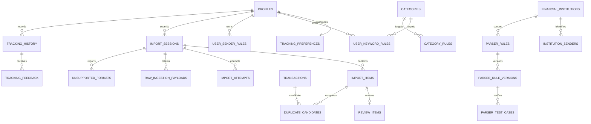

# Backend Feature Specification: Tracking, Imports, Parsers & Deduplication

**Phase / Spec**: Phase 08 / SPEC-BE-008 of 014  
**Working Branch**: `main`  
**Feature Directory**: `apps/api/specs/008-tracking-imports-deduplication`  
**Base Revision**: `49f38b72f230a317a6b271dde6612030eeaa7d55`  
**Created**: 2026-09-02  
**Status**: Ready for Planning  
**Input**: "Fully complete Phase 08 — SPEC-BE-008: Tracking, Imports, Parsers & Deduplication without implementing SPEC-BE-009 or later."

## Objective and Scope

Turn hostile file, provider, manual, and Mobile-normalized inputs into safe,
traceable transaction proposals. Users can control tracking, review or edit
proposals, understand duplicate suggestions, accept exactly once through the
existing ledger command boundary, inspect history, and provide feedback. Import
operators can diagnose bounded failures; parser administrators can maintain
institutions, senders, constrained parser versions, corpus tests, and global
merchant/category rules.

This Spec owns ingestion after a normalized event or uploaded file reaches the
backend. It does not capture device SMS, execute arbitrary parser code, treat raw
content as financial truth, write ledger tables directly, replace the sync
protocol, or implement voice/AI capabilities from SPEC-BE-009.

## Dependencies and Repository Baseline

- **SPEC-BE-001**: API/worker processes, ordered checksum migrations, request
  context, safe errors, outbox, queues, Storage, telemetry, Docker, and CI are
  present. Historical PR/tag evidence gaps do not remove these contracts.
- **SPEC-BE-002**: verified Clerk principal, active profile, preferences,
  devices, and owner RLS are present. Apple Team ID, two controlled Phone
  identities, hosted canonical-schema proofs, deployed provider secrets, and
  live provider/alert evidence remain external and do not block local Phase 08.
- **SPEC-BE-003**: exact Admin permissions, recent-auth/reason controls,
  purpose-bound inspection, immutable audit, privacy retention, and denial
  boundaries are present.
- **SPEC-BE-004**: currencies, countries, categories, accounts, category
  ownership/compatibility, and guarded account/reference commands are present.
- **SPEC-BE-005**: transaction creation/update commands, posting invariants,
  balance reconciliation, audit/outbox atomicity, and external-reference
  uniqueness are the only ledger write boundary Phase 08 may call.
- **SPEC-BE-006**: durable idempotency receipts, operation hashes, replay,
  worker fences, cursors, mutation mapping, and conflict behavior are present.
- **SPEC-BE-007**: obligation matching and planning read models are available
  only for proposal enrichment; Phase 08 cannot mutate planning truth directly.
- **Current repository facts**: `main` matched `origin/main` before work;
  `.agents/plugins/` is unrelated and untracked; existing worktrees remain
  untouched. The preceding Outbox tail-latency correction is additive and keeps
  the claim P99 threshold at 100 ms.
- **Governing documents**: the complete Backend Constitution and Backend Master
  Plan, especially Phase 08, are authoritative.

## Owned Resources

Phase 08 owns these resources and no later-Spec resources:

- Public tables: `tracking_preferences`, `user_keyword_rules`,
  `user_sender_rules`, `import_sessions`, `import_items`, `review_items`,
  `duplicate_candidates`, `tracking_history`, `tracking_feedback`,
  `financial_institutions`, `institution_senders`, `parser_rules`,
  `parser_rule_versions`, `parser_test_cases`, `merchant_rules`,
  `category_rules`, and `unsupported_formats`.
- Private tables: `import_attempts` and `raw_ingestion_payloads`.
- Deterministic private functions for normalization, rule application,
  duplicate scoring, bounded claims, parser publication, review decisions,
  purging, compaction, and recovery. No function accepts executable code.
- Customer tracking/import/review/duplicate endpoints and Admin
  import/parser/rule endpoints under `/api/v1`.
- Jobs: `import.process`, `parser.corpus.run`, `duplicate.detect`, conditional
  `review.auto-accept`, `raw-ingestion.purge`, and
  `tracking-history.compact`.
- Events: `import.received`, `import.processed`, `import.failed`,
  `tracking.review_required`, `tracking.accepted`,
  `tracking.duplicate_detected`, `parser.version_published`, and
  `tracking.feedback_received`.
- The Phase 08 fixture-to-contract replacement needed by the existing Mobile
  automatic-tracking service boundary and Admin imports/parsers repository.

Existing profiles, categories, accounts, transactions, postings, balances,
idempotency receipts, sync state, planning resources, audit records, outbox,
queues, Storage buckets, and platform telemetry remain owned by earlier Specs.

## User Scenarios and Testing

### User Story 1 - Control Automatic Tracking (Priority: P1)

A customer enables or disables tracking, chooses whether review is mandatory,
sets duplicate and raw-source retention windows, and manages keyword/sender
rules without exposing another customer's data.

**Why this priority**: No ingestion may occur contrary to the customer's current
consent and review policy.

**Independent Test**: Two owners exercise preferences and rule CRUD; each sees
only their own records, invalid regexes and foreign categories are rejected,
and disabling tracking prevents new automatic processing.

**Acceptance Scenarios**:

1. **Given** a new active profile, **When** preferences are read, **Then**
   tracking is disabled and review is required by default.
2. **Given** a valid owned category, **When** an enabled keyword rule is added,
   **Then** the normalized unique rule is returned with a new version.
3. **Given** another owner's category or an unsafe expression, **When** a rule
   is submitted, **Then** the request fails without any partial write.

### User Story 2 - Submit and Track an Import (Priority: P1)

A customer submits normalized events or a supported file once and immediately
receives a session identifier while processing continues asynchronously.

**Why this priority**: Safe, durable intake is the root of every later review,
duplicate, and acceptance flow.

**Independent Test**: Submit valid JSON and file inputs, replay the same
idempotency key, and submit hostile/oversized inputs; valid intake returns one
session in at most 300 ms and invalid input leaves no usable raw artifact.

**Acceptance Scenarios**:

1. **Given** a supported normalized event, **When** it is submitted with a new
   idempotency key, **Then** one received session is returned with the accepted
   count and safe source metadata.
2. **Given** the same owner, key, and request hash, **When** the request is
   replayed, **Then** the exact session result is returned without new work.
3. **Given** conflicting content for a used key, **When** submitted, **Then** it
   is rejected as an idempotency conflict.
4. **Given** executable content, a spoofed media type, unsafe archive, invalid
   encoding, traversal path, entity expansion, formula payload, or configured
   size/item limit breach, **When** intake is attempted, **Then** processing
   fails closed and records only bounded redacted evidence where permitted.

### User Story 3 - Review and Accept a Proposal (Priority: P1)

A customer inspects parsed proposals, edits allowed financial fields, rejects
bad proposals, or accepts a safe proposal exactly once.

**Why this priority**: Human confirmation is the financial safety boundary for
ambiguous input and the default for all new customers.

**Independent Test**: Review an ambiguous item, edit it, accept it twice, and
verify one transaction exists through the SPEC-BE-005 command with full source,
parser, rule, review, idempotency, audit, event, and history traceability.

**Acceptance Scenarios**:

1. **Given** a pending review item, **When** the customer accepts it, **Then**
   ownership, currency, date, amount, category/account, and duplicate checks are
   rerun immediately before one ledger command.
2. **Given** an accepted/rejected or stale-version item, **When** a second
   decision is submitted, **Then** the original terminal outcome is replayed or
   a version conflict is returned without a second transaction.
3. **Given** an allowed patch, **When** the proposal is accepted as edited,
   **Then** original and accepted safe values remain traceable and feedback can
   reference the reviewed history.

### User Story 4 - Resolve a Duplicate Transparently (Priority: P1)

A customer sees a bounded duplicate candidate with score factors, compares it
to an owned transaction, and marks it duplicate or not duplicate.

**Why this priority**: Duplicate prevention protects balances while explicit
reasons preserve user trust and enable feedback.

**Independent Test**: Seed candidates immediately below, at, and above each
threshold and prove deterministic scores/reasons, owner isolation, idempotent
decisions, and zero direct or duplicate ledger writes.

**Acceptance Scenarios**:

1. **Given** a high-scoring owned candidate, **When** details are requested,
   **Then** amount, currency, time, merchant, and source-hash reasons are shown
   without raw payload or another owner's data.
2. **Given** a candidate marked duplicate, **When** processing continues,
   **Then** the item links to the existing owned transaction and no create
   command runs.
3. **Given** a candidate marked not duplicate, **When** the proposal is accepted,
   **Then** the same ledger acceptance path runs once and the decision is
   retained for feedback and future scoring analysis.

### User Story 5 - Maintain Safe Parsers and Rules (Priority: P2)

Authorized operators maintain institutions and senders; parser administrators
create immutable constrained versions, run an enabled test corpus, and publish
only a passing version. Rule administrators maintain global merchant/category
rules with exact permissions and audit reasons.

**Why this priority**: Versioned, tested rules allow coverage to improve without
executing arbitrary code or silently changing past interpretations.

**Independent Test**: Create a draft version, include passing/failing/hostile
corpus cases, prove publication is blocked until every enabled test passes,
publish atomically, roll back to a previous passing version, and verify old
items retain their recorded version.

**Acceptance Scenarios**:

1. **Given** a constrained valid rule definition, **When** a version is created,
   **Then** it is immutable, inactive, attributable to an Admin, and testable.
2. **Given** any enabled failing corpus case, **When** publication is requested,
   **Then** the active version is unchanged.
3. **Given** all enabled cases pass, **When** an authorized recent-authenticated
   Admin publishes with a reason, **Then** activation and audit/event records
   commit atomically.

### User Story 6 - Operate and Recover Imports (Priority: P2)

An authorized import operator views bounded redacted sessions, attempts,
failures, low-confidence items, duplicates, and unsupported formats, then
retries or cancels eligible work without impersonating the customer.

**Why this priority**: Operations must recover safely without broad raw-data or
ledger access.

**Independent Test**: Exercise purpose-bound detail access, retry/cancel races,
worker crash/reclaim, parser rollback, Storage loss, and purge/compaction; prove
bounded views, immutable attempts, audit, and no data loss or duplicate posting.

**Acceptance Scenarios**:

1. **Given** `imports.read` without detail permission, **When** sessions are
   listed, **Then** only aggregate safe fields are returned.
2. **Given** exact detail permission and a valid purpose, **When** an item is
   inspected, **Then** redacted normalized data is bounded and access is audited.
3. **Given** a retryable failed session, **When** retry is requested twice,
   **Then** one new attempt is scheduled and the same operation result replays.

### Edge Cases

- Empty files, BOMs, mixed line endings, malformed UTF-8/UTF-16, huge fields,
  excessive columns, duplicate headers, scientific notation, localized digits,
  negative/refund amounts, zero values, extreme dates, daylight-saving changes,
  and unsupported currencies fail or normalize deterministically.
- File name, archive entry, XML entity, URL, sender, merchant, keyword, regex,
  metadata, and formula-like values are treated as hostile at every boundary.
- Archive nesting, entry count, decompression ratio, expanded bytes, parser time,
  file count, row count, and normalized item count have hard limits.
- A source item repeated within one session, across sessions, after a worker
  crash, or through sync replay cannot create a second ledger transaction.
- Concurrent parser publication, review decisions, duplicate decisions, retries,
  purge, and compaction use versions/locks so exactly one terminal transition wins.
- A category or account archived between parsing and acceptance is rejected on
  the final ledger validation rather than silently substituted.
- Raw content can expire while its safe normalized item/history remains; reads
  then report that source evidence expired without reconstructing it.
- Unsupported formats never become generic server errors; operators receive a
  bounded reason and customers receive a safe actionable status.

## Database Design

### Owned Tables

Every mutable public row has `id uuid`, `created_at timestamptz`,
`updated_at timestamptz`, and `version bigint default 1` unless the table uses
its owner key as the primary key. Every owner-bound table stores `user_id text`
referencing `profiles`; derived child rows redundantly retain `user_id` where it
is needed for forced-RLS ownership without unsafe joins.

| Table | Required fields and constraints | Required indexes |
|---|---|---|
| `tracking_preferences` | `user_id` PK/FK; `enabled=false`; `review_required=true`; `duplicate_window_seconds=86400` in 60..2592000; `source_retention_days=30` in 1..365 | PK and updated/version trigger |
| `user_keyword_rules` | owner; bounded normalized `keyword`; Mobile group/language/default-or-custom origin; `match_type` exact/contains/regex; optional owned/system `category_id`; `enabled=true`; safe-expression validation; unique owner/lower keyword/type | enabled owner/priority lookup |
| `user_sender_rules` | owner; bounded normalized `sender_pattern`; optional active `institution_id`; `enabled=true`; safe-expression validation; unique owner/pattern | enabled owner lookup |
| `import_sessions` | owner; `source_type` sms/file/manual/provider; optional safe source name; status received/processing/review/complete/failed; nonnegative item/accepted/rejected counts; start/completion consistency | owner/status/time cursor and worker claim |
| `import_items` | owner/session cascade; bounded `source_item_key`; canonical `normalized_hash`; optional occurred time, amount, currency, merchant; bounded validated normalized payload; status parsed/review/accepted/rejected/duplicate/failed; optional owned `transaction_id`; parser/rule/version trace | unique session/source key, owner hash, session/status, owner/time cursor, acceptance idempotency |
| `private.import_attempts` | session; positive attempt number; bounded worker ID; running/succeeded/failed; start/completion/error consistency; safe stable error only | unique session/attempt and status/time claim/recovery |
| `private.raw_ingestion_payloads` | session; optional item; opaque Storage reference; cryptographic payload hash; allowlisted content type; size within configured limit; expiry | unique session/hash and expiry purge |
| `review_items` | owner/import item; bounded reason; validated proposed/original/accepted safe values; pending/accepted/rejected/edited; reviewer/time/version consistency | one active review per item and owner/status/time cursor |
| `duplicate_candidates` | owner; item and owned transaction; score 0..1; ordered allowlisted reasons; proposed/duplicate/not_duplicate; decision metadata/version | unique item/transaction and owner/status/score cursor |
| `tracking_history` | owner; source type/ref; received/parsed/reviewed/accepted/rejected/duplicate/failed; optional owned transaction; safe summary and occurred time | owner/time cursor and source lookup |
| `tracking_feedback` | owner/history; correct/incorrect/duplicate/not_duplicate/category; optional owned/system corrected category; bounded comment | unique owner/history/type and owner/time cursor |
| `financial_institutions` | supported country; bounded name; globally unique lowercase code; `active=true` | country/active/code lookup |
| `institution_senders` | institution; bounded safe sender pattern; nonnegative priority; `active=true` | unique institution/pattern and active/priority lookup |
| `parser_rules` | optional institution; bounded name; supported source type; draft/active/disabled; optional active version after version table exists | institution/status/source lookup |
| `parser_rule_versions` | rule; positive version number; constrained validated definition; Admin creator; optional publish time; immutable | unique rule/version and rule/published lookup |
| `parser_test_cases` | parser version; bounded hostile-safe fixture; validated expected output; `enabled=true`; immutable input/expectation after publication | version/enabled lookup |
| `merchant_rules` | nullable owner for global rules; safe pattern; bounded normalized merchant; nonnegative priority; `active=true` | unique owner/global pattern and active owner/priority lookup |
| `category_rules` | nullable owner for global rules; safe pattern; valid owned/system category; nonnegative priority; `active=true` | unique owner/global pattern and active owner/priority lookup |
| `unsupported_formats` | session; hash; bounded reason; optional redacted sample; open/covered/ignored; reviewer/time/version consistency | unique session/hash and status/time cursor |

Counters on `import_sessions` are maintained atomically and reconciled against
items. Terminal financial links require an existing owned transaction and are
not writable by customers. Raw payload and attempt rows are never client-readable.

### Relationships and ERD

### RLS, Grants, and Authorization

- Forced RLS applies to every public Phase 08 table, including reference/rule
  tables. Anonymous access is denied.
- Customers may read/update only their preference row; manage only their own
  keyword/sender rules; submit and read only their sessions/items; read and
  decide only their reviews/candidates; and read/create only their history
  feedback. Direct status, counters, parser trace, score, transaction links,
  review terminal fields, and history outcome writes are denied.
- Authenticated customers may read active institutions/senders and safe active
  rule metadata, but never parser definitions, corpus inputs, global rule
  internals, raw payloads, attempts, Admin attribution, or operator errors.
- `masarifi_worker` gets only narrow execute/select/update rights needed by each
  claimed job. It receives no broad public-table or ledger write grant.
- Admin actions require the exact existing `imports.*` or `parsers.*` permission,
  active Admin profile, recent authentication and reason for sensitive mutation
  or detail inspection, and immutable audit. Read permission never implies write.
- Customer-specific rules override global rules only for that owner and can
  target only an owned or eligible system category. Admins cannot create a
  customer-owned rule through global endpoints.
- Service-role access is denied by default and enabled only through explicit
  private functions using transaction-local identity/operation context; the
  service role is not a universal RLS bypass for application flows.

## API Contracts

All mutation requests use `Idempotency-Key`, reject unknown fields, validate
schema version and bounded discriminated unions, and return the shared safe
error envelope. Lists use stable `(time,id)` or `(score,id)` cursors and a
maximum page size of 100.

| Method | Path | Auth | Request | Success response | Stable errors |
|---|---|---|---|---|---|
| GET | `/api/v1/tracking/preferences` | active owner | none | preference/version | profile errors |
| PUT | `/api/v1/tracking/preferences` | active owner | enabled, reviewRequired, windows, expectedVersion | updated preference | validation/version conflict |
| GET/POST | `/api/v1/tracking/keyword-rules` | active owner | cursor or rule | bounded rules / created rule | validation/category conflict |
| PATCH/DELETE | `/api/v1/tracking/keyword-rules/{ruleId}` | owner | patch, expectedVersion | updated rule / 204 | not found/version conflict |
| GET/POST | `/api/v1/tracking/sender-rules` | active owner | cursor or rule | bounded rules / created rule | validation/institution conflict |
| PATCH/DELETE | `/api/v1/tracking/sender-rules/{ruleId}` | owner | patch, expectedVersion | updated rule / 204 | not found/version conflict |
| GET | `/api/v1/tracking/history` | owner | cursor, outcome/source filters | bounded safe history | cursor validation |
| POST | `/api/v1/tracking/feedback` | owner | historyId, type, correctedCategoryId?, comment? | feedback | history/category conflict |
| POST | `/api/v1/imports` | active owner | one raw `text/csv` body or normalized-event JSON union, source/schema version | 202 sessionId/status/receivedCount | unsupported/unsafe/limit/idempotency errors |
| GET | `/api/v1/imports` | owner | cursor/status/source | bounded sessions | cursor validation |
| GET | `/api/v1/imports/{sessionId}` | owner | none | safe session summary | not found |
| GET | `/api/v1/imports/{sessionId}/items` | owner | cursor/status | bounded safe items | not found/cursor validation |
| GET | `/api/v1/reviews` | owner | cursor/status | bounded review queue | cursor validation |
| GET | `/api/v1/reviews/{reviewId}` | owner | none | safe proposal and trace summary | not found |
| POST | `/api/v1/reviews/{reviewId}/decision` | owner | accept/reject/edit, patch?, expectedVersion | terminal review/item and transaction link if accepted | validation/version/duplicate/ledger conflict |
| GET | `/api/v1/duplicates` | owner | cursor/status/minScore | bounded candidates | validation |
| GET | `/api/v1/duplicates/{candidateId}` | owner | none | safe comparison/reasons | not found |
| POST | `/api/v1/duplicates/{candidateId}/decision` | owner | keep_existing/keep_new/keep_both/merge_details, expectedVersion | terminal candidate/item result | version/ownership conflict |
| GET | `/api/v1/admin/imports/sessions` | `imports.read` | bounded filters/cursor | redacted sessions | forbidden |
| GET | `/api/v1/admin/imports/sessions/{sessionId}` | `imports.detail.read` + purpose | none | redacted detail/items/attempt summary | forbidden/purpose required |
| GET | `/api/v1/admin/imports/failures` | `imports.read` | bounded filters/cursor | safe failures | forbidden |
| POST | `/api/v1/admin/imports/{sessionId}/retry` | `imports.failures.manage` + recent auth/reason | expectedVersion | accepted retry | invalid state/version conflict |
| POST | `/api/v1/admin/imports/{sessionId}/cancel` | `imports.failures.manage` + recent auth/reason | expectedVersion | terminal session | invalid state/version conflict |
| GET/POST/PATCH | `/api/v1/admin/parsers/institutions[/{id}]` | parser read/manage permission | typed resource/version | typed resource | validation/version conflict |
| GET/POST/PATCH | `/api/v1/admin/parsers/senders[/{id}]` | `parsers.senders.manage` for writes | typed resource/version | typed resource | validation/version conflict |
| GET/POST/PATCH | `/api/v1/admin/parsers/rules[/{id}]` | `parsers.rules.read/manage` | typed rule/version | typed rule | validation/version conflict |
| POST | `/api/v1/admin/parsers/rules/{id}/versions` | `parsers.versions.manage` + reason | constrained definition | immutable version | DSL validation |
| POST | `/api/v1/admin/parsers/versions/{id}/corpus-runs` | `parsers.tests.run` | none | 202 run result reference | invalid state |
| POST | `/api/v1/admin/parsers/versions/{id}/publish` | `parsers.versions.manage` + recent auth/reason | expected rule version | active version | corpus failed/version conflict |
| GET/POST/PATCH | `/api/v1/admin/parsers/test-cases[/{id}]` | tests read/run or versions manage | bounded fixture/output/version | typed case | validation/published immutable |
| GET/POST/PATCH | `/api/v1/admin/parsers/merchant-rules[/{id}]` | `parsers.merchants.manage` | typed global rule/version | typed rule | unsafe pattern/version conflict |
| GET/POST/PATCH | `/api/v1/admin/parsers/category-rules[/{id}]` | `parsers.categories.manage` | typed global rule/version | typed rule | category/version conflict |
| GET/PATCH | `/api/v1/admin/imports/unsupported[/{id}]` | `imports.unsupported.manage` for writes | bounded filters or status/version | redacted format / updated status | forbidden/version conflict |

Raw payloads, Storage paths, credentials, parser definitions in customer
responses, unredacted samples, internal exceptions, SQL, and worker identifiers
never cross public response boundaries.

## Functions, Views, and Triggers

- `private.normalize_ingestion_item` validates the versioned normalized-event
  contract, canonicalizes safe fields, produces a stable hash, and records the
  parser/source version without trusting caller-provided code or ownership.
- `private.apply_tracking_rules` resolves user rules before global rules using
  deterministic priority and ID tie-breaks and returns applied rule/version IDs.
- `private.compute_duplicate_candidates` compares only the same owner's eligible
  items/transactions inside the configured window and returns a score plus
  allowlisted reasons derived from versioned weights/thresholds.
- Guarded commands create intake sessions/items, claim/finish attempts, update
  unsupported formats, decide review/duplicates, publish parser versions, and
  reconcile counters. Each sets transaction-local owner/Admin/operation context,
  checks versions, writes audit/outbox/history atomically, and grants only execute.
- Updated/version triggers protect mutable records. Immutable version, attempt,
  history, audit, and accepted trace fields reject update/delete unless a narrow
  documented retention/compaction function owns the transition.
- Safe Admin projections redact source names, samples, normalized fields, and
  error details before purpose-bound reads; no view weakens base-table RLS.

## Queues, Jobs, and Events

- Intake commits `import.received` and schedules `import.process` only after the
  session/raw-reference transaction commits.
- Every job uses bounded claims, lease expiry, attempt numbers, idempotency
  operation hashes, exponential backoff with jitter, retry ceilings, dead-letter
  state, graceful shutdown, and deterministic replay. Concurrent claims are
  disjoint and stale workers cannot complete a reclaimed attempt.
- `import.process` streams bounded content, identifies the sender/institution,
  selects the active parser version, normalizes items, applies rules, records
  unsupported/failed items, and schedules duplicate/review work.
- `parser.corpus.run` executes the constrained DSL under time/size limits and
  records per-case results; it cannot publish by itself.
- `duplicate.detect` produces deterministic candidates and explanations without
  mutating ledger data.
- `review.auto-accept` exists only when the owner's current preference permits,
  confidence and duplicate thresholds pass, all final validations pass, and the
  same SPEC-BE-005 command used by manual acceptance succeeds. Default is off.
- Purge and compaction jobs are resumable, owner-policy aware, auditable, and
  retain the minimum trace needed to explain financial outcomes.
- Event payloads contain stable IDs, schema version, safe state/reason enums and
  counts only; no raw body, file name, merchant text, comment, token, Storage
  reference, parser definition, or high-cardinality telemetry label is emitted.

## Business Rules

- Tracking consent is checked at intake and again before automatic acceptance.
- The normalized event shape is `{sourceItemKey, sourceType, receivedAt,
  sender?, body?, amountMinor?, currency?, merchant?, occurredAt?, metadata?}`;
  source-specific limits and schema versions are mandatory.
- Monetary values use integer minor units and enabled currency metadata; dates
  are explicit instants. Floats, locale-dependent implicit parsing, and caller
  balance values are forbidden.
- Parser rules use a constrained, validated declarative DSL with bounded tokens,
  captures, operations, and time. Dynamic code, SQL, network access, filesystem
  access, environment access, and unbounded backtracking are forbidden.
- User rules override global rules only when enabled and valid; priority then
  stable ID resolves ties. Historical items retain applied rule/version IDs.
- Duplicate scoring uses versioned amount, currency, time, merchant, and source
  hash factors. Thresholds and explanations are explicit; score alone never
  creates or confirms a transaction.
- A normalized item reaches the ledger once through the existing SPEC-BE-005
  command and a unique Phase 06 operation/external reference. No Phase 08 SQL or
  repository writes transactions, postings, balances, or ledger versions.
- Review acceptance reruns current ownership, lifecycle, category compatibility,
  amount, currency, date, duplicate, and idempotency checks. Edited acceptance
  permits only allowlisted proposal fields.
- An item marked duplicate links only to an owned existing transaction. A
  not-duplicate decision prevents that pair from being reproposed unless a
  documented scoring-version migration explicitly re-evaluates it.
- Raw content expires per owner policy within 1..365 days; legal/security holds
  require the earlier privacy/audit boundary and never make raw content public.

## Security and Privacy Requirements

- All source bytes, archives, names, headers, senders, message bodies, metadata,
  parser fixtures, regexes, comments, and provider URLs are hostile.
- Intake verifies media allowlist and magic bytes, uses generated Storage names,
  blocks traversal/symlinks/executables/polyglots/entity expansion/external
  entities/remote includes, and enforces compressed plus expanded limits.
- Provider retrieval uses allowlisted HTTPS origins, DNS/IP revalidation, no
  redirects to private/link-local/loopback networks, bounded response size/time,
  and no caller-supplied credentials, preventing SSRF.
- CSV/spreadsheet-like cells beginning with `=`, `+`, `-`, `@`, tab, or carriage
  return are neutralized in any export/operator rendering. Imported values are
  data only and are never evaluated.
- Regex/pattern validation rejects unsafe constructs and enforces length,
  execution budget, and corpus adversarial cases to prevent denial of service.
- Phase 08 scanning is the deterministic allowlist itself: one uncompressed
  UTF-8 text payload, strict signature/encoding/grammar/size limits, and rejection
  before storage of archives, executable or active content, XML/HTML, PDF, images,
  Office documents, NUL/control/bidi payloads, and declared-type mismatches.
- OWASP API1/3/4/5/6/8/9/10, ASVS input/file/access/logging controls, and MASVS
  storage/network/privacy controls have positive and negative evidence.
- Errors/logs/traces/metrics/audit/events are redacted and bounded. Customer
  content, raw identifiers, credentials, payload hashes usable as correlators,
  and exception strings are not metric labels or public errors.

## Performance and Caching Requirements

- Valid import intake returns `202` at P95 <=300 ms and P99 <=750 ms for the
  documented maximum request envelope without waiting for parsing.
- Customer/Admin status and list requests return at P95 <=500 ms and P99 <=1 s
  with <=100 rows and <=256 KiB response payload.
- A representative 10,000-row import runs asynchronously with recorded
  throughput, P95/P99 item latency, bounded worker memory, bounded connections,
  no active sequential scan on large owner/session/history paths, and no N+1.
- Duplicate detection over representative owner histories has a documented
  throughput and P95 <=250 ms per bounded candidate batch.
- Parser corpus runs enforce per-case and per-version time limits and report
  regression relative to the active version; publication blocks on any failure.
- Reference/parser rules may use the existing bounded version-checked cache.
  Owner/session/review/history/raw data is never put in a shared cross-user cache.
- Workers stream or batch input and never load an unbounded file, archive, corpus,
  history, or candidate set into memory.

## Mobile and Admin Integration

- The Mobile automatic-tracking service contract replaces its production mock
  for preferences, keyword/sender rules, normalized intake, session/status,
  review, duplicate, history, and feedback operations while retaining explicit
  offline/error/loading states and Phase 06 mutation/idempotency behavior.
- Native SMS permission/capture remains a platform capability. Phase 08 accepts
  a normalized event only after Mobile capture exists; iOS continues to present
  its existing non-SMS fallback rather than claiming unsupported capability.
- Default keyword fixtures become server/reference seed data. Test fixtures may
  remain in test-only paths; production service selection cannot route to mocks.
- The Admin imports/parsers repository replaces production mock handlers for the
  Phase 08 routes while retaining exact client permission boundaries, recent-auth
  and reason prompts, redacted detail states, pagination, and optimistic versions.
- No client embeds service-role/provider credentials, parser definitions, raw
  Storage references, or private error information. Contract fixtures are
  generated/validated against the authoritative OpenAPI schema.

## Functional Requirements

- **FR-001**: The system MUST create default-deny tracking preferences for every
  active customer with tracking disabled and review required.
- **FR-002**: Customers MUST manage only their own bounded keyword and sender rules.
- **FR-003**: Unsafe patterns, duplicates, foreign/ineligible categories, inactive
  institutions, unknown fields, and stale versions MUST fail atomically.
- **FR-004**: Intake MUST support the documented normalized JSON union and
  allowlisted file formats with explicit source and schema versions.
- **FR-005**: Intake MUST return a durable asynchronous session within the stated
  budget and MUST replay by Phase 06 idempotency key/request hash.
- **FR-006**: File count, file bytes, rows/items, fields, encoding, archive
  expansion, parser duration, and response sizes MUST be hard bounded.
- **FR-007**: Hostile files/payloads MUST be quarantined or rejected before parser
  execution and MUST leave no public raw artifact.
- **FR-008**: Raw bytes MUST live only behind opaque private Storage references
  with hashes, expiry, narrow worker/Admin access, and purge recovery.
- **FR-009**: Import sessions/items/attempts MUST use valid state transitions,
  reconciled counters, disjoint leases, retry ceilings, and stale-worker fences.
- **FR-010**: Sender/institution identification MUST be deterministic by active
  priority and stable tie-break, with owner rules before global mappings.
- **FR-011**: Parser definitions MUST be constrained declarative data and MUST
  never execute code, SQL, network, filesystem, or environment access.
- **FR-012**: Parser versions and published corpus cases MUST be immutable and
  attributable; past items MUST retain the exact used version.
- **FR-013**: A parser version MUST publish only after every enabled corpus case,
  including hostile/boundary cases, passes in one recorded run.
- **FR-014**: Publication/rollback MUST atomically switch one active version and
  MUST preserve existing sessions, items, traceability, and raw retention.
- **FR-015**: User rules MUST override global merchant/category rules only for
  that owner using deterministic priority and stable tie-breaks.
- **FR-016**: Unsupported formats MUST produce a safe customer outcome and a
  bounded redacted operator record rather than an internal-error leak.
- **FR-017**: Ambiguous, invalid, policy-required, or duplicate-risk items MUST
  enter review; auto-accept MUST default off and satisfy every explicit guard.
- **FR-018**: Review details MUST expose safe original/proposed values, reasons,
  parser/rule version summaries, and duplicate explanations without raw content.
- **FR-019**: Edited acceptance MUST allow only account, category, amount,
  currency, merchant/title, date, note, and planning-link fields validated by
  their owning earlier-Spec boundaries.
- **FR-020**: Every acceptance MUST rerun current validation and invoke exactly
  one SPEC-BE-005 ledger command with one Phase 06 idempotency operation.
- **FR-021**: Phase 08 MUST have no direct transaction, posting, balance, ledger
  version, or planning mutation path.
- **FR-022**: Duplicate candidates MUST be owner-local, bounded, deterministic,
  versioned, explained, and scored from the approved factor set.
- **FR-023**: Duplicate/not-duplicate decisions MUST be optimistic, idempotent,
  terminal per version, and traceable without creating a second transaction.
- **FR-024**: Tracking history MUST trace source, safe outcome, parser/rule
  versions, review, duplicate decision, ledger operation, and transaction link.
- **FR-025**: Customers MUST submit bounded feedback only for their own history;
  corrected categories MUST be eligible and comments MUST be private/redacted.
- **FR-026**: Forced RLS and least grants MUST deny anonymous, cross-owner,
  over-permissioned Admin, direct status/link mutation, raw, and attempt access.
- **FR-027**: Admin mutation/detail actions MUST enforce exact permission,
  active Admin, recent authentication, reason/purpose, version, audit, and event.
- **FR-028**: Service-role/worker execution MUST use narrow functions and MUST not
  become a general RLS or ledger bypass.
- **FR-029**: Customer and Admin lists MUST be cursor-paginated, stably ordered,
  filter bounded, query bounded, and response bounded.
- **FR-030**: All public operations MUST be documented in authoritative OpenAPI
  with strict schemas, stable operation IDs, safe errors, and drift tests.
- **FR-031**: All jobs MUST be lease/retry/idempotency/dead-letter/shutdown safe
  and emit only bounded low-cardinality telemetry.
- **FR-032**: Outbox events and audit/history MUST commit atomically with their
  owning state transition and exclude raw/sensitive/high-cardinality content.
- **FR-033**: Purge/compaction MUST honor policy, be resumable/idempotent, and
  preserve minimum financial/audit traceability.
- **FR-034**: Reconciliation MUST detect session counter, attempt, orphan raw,
  item/review/candidate, and accepted-transaction drift without silent repair.
- **FR-035**: Mobile production tracking services MUST use backend contracts and
  preserve offline/idempotent behavior; SMS capture claims remain platform-true.
- **FR-036**: Admin production imports/parsers services MUST use backend contracts
  with exact permissions, redaction, reasons, versions, and no raw fixture path.
- **FR-037**: Unit, contract, OpenAPI, integration, E2E, pgTAP, RLS, security,
  parser-corpus, migration, recovery, performance, stress, and client tests MUST
  cover positive, negative, boundary, concurrent, replay, and failure behavior.
- **FR-038**: The migration family MUST apply cleanly from empty and N-1 states,
  reject checksum drift, support forward correction, and demonstrate parser
  rollback and data-preserving restore.
- **FR-039**: Metrics, alerts, dashboards/runbooks, retention, backup/restore,
  provider/Storage outage, worker crash, and backlog recovery MUST have
  executable local evidence or an explicit genuinely external gate.
- **FR-040**: SPEC-BE-009 and later tables, routes, jobs, events, clients, AI,
  voice, notification, subscription, report, support, and deployment features
  MUST NOT be introduced by this Spec.

## Tests and Verification Evidence

- pgTAP proves the full table/column/default/check/FK/index/trigger/function/view,
  owner, grant, forced-RLS, immutability, state, and negative-access inventory.
- Unit tests prove validation, DSL parsing, safe regexes, canonical hashes,
  sender/rule priority, duplicate boundaries/reasons, transitions, retry math,
  event redaction, observability cardinality, and service orchestration.
- Contract/OpenAPI tests prove every route, DTO union, error, permission, cursor,
  idempotency/version header, Mobile/Admin mapping, and absence of private fields.
- Integration tests use the live local database for transaction context, RLS,
  audit/outbox atomicity, command-only ledger acceptance, concurrent decisions,
  claims/recovery, retention, reconciliation, and cross-owner negatives.
- E2E tests cover normalized/file intake, session polling, review edited acceptance,
  duplicate decisions, feedback, operator retry/cancel, parser corpus/publish/
  rollback, unsupported formats, and client-visible recovery.
- Security tests cover BOLA/BFLA/mass assignment, service-role/grant boundaries,
  traversal, symlink/archive bombs, media spoofing/polyglots, XXE, SSRF, CSV
  injection, regex denial, malformed encoding, log/error/event leakage, and scans.
- Performance/stress evidence uses representative one-million-history lookup,
  10,000-row import, concurrent claims/decisions, parser corpus, duplicate history,
  Storage/provider slowdown/outage, restart/replay, backlog recovery, memory,
  connections, query plans, P95/P99, payload size, and cleanup.
- Migration/recovery evidence covers clean reset, lint, checksums, apply,
  concurrency, N-1 compatibility, failed migration plus forward fix, parser
  rollback, backup/restore with RPO/RTO, Storage loss, worker crash, purge,
  compaction, reconciliation, and no duplicate ledger write.
- Client validation runs Mobile and Admin typecheck/lint/tests plus production-
  service selection and contract-fixture drift checks.
- Final evidence records exact pass/fail/skip counts; a skipped database-backed or
  remotely executable gate is never counted as pass.

## Migration and Rollback Strategy

1. Add institutions, senders, global/user rules, and permissions before runtime
   access; add parser rules before versions/corpus, then add the active-version FK.
2. Add sessions before items/attempts/raw/unsupported, then reviews/candidates,
   then history/feedback, functions, RLS/grants, jobs, APIs, and clients.
3. Seed only stable institution/reference data and current client fixture rules
   as draft immutable versions. Run their corpus before a separate explicit
   forward migration publishes any version.
4. Each migration is immutable, checksum-recorded, additive, and compatible with
   the previous image until the documented cutover. Large validation/backfill is
   bounded and separated from schema creation where required.
5. Operational rollback switches a rule to a previous passing version atomically;
   schema defects are corrected only by a new forward migration. Sessions, raw
   expiry, items, decisions, audit, history, idempotency, and ledger links survive.
6. Recovery proves clean apply, N-1 operation, failed apply rollback, forward fix,
   restore, reconciliation, and safe continuation without rewriting history.

## Observability and Operations

- Metrics cover intake result/latency/size class, queue depth/oldest age,
  processing throughput/duration/result, attempt/retry/dead-letter, parser
  version/corpus pass rate/regression, unsupported rate, duplicate score band/
  decision, review age/outcome, auto-accept outcome, raw storage/expiry/purge,
  worker memory/connections, reconciliation drift, and ledger acceptance error.
- Labels are fixed enums such as source type, result, stage, reason code, score
  band, parser status, and job name. User/session/item/transaction/rule IDs,
  sender, merchant, file name, comment, hash, payload, exception, and URL are
  forbidden metric labels.
- Alerts cover intake failure/security rejection spikes, oldest queue age,
  worker retry/dead-letter, parser corpus regression, unsupported-format rise,
  duplicate/review backlog, unexpected auto-accept, raw purge lag/storage growth,
  reconciliation drift, and ledger acceptance errors with severity/windows.
- Runbooks cover hostile upload, provider/Storage outage, parser rollback,
  stuck/replayed worker, duplicate/review correction, idempotency conflict,
  purge/compaction, reconciliation, backup/restore, and emergency tracking disable.
- Operator actions are auditable and cannot expose raw data in dashboards, alerts,
  logs, traces, events, support output, or screenshots.

## Assumptions

- Existing Mobile normalized-event and Admin imports/parser contracts are the
  authoritative client field baseline unless they violate the Master Plan.
- Initial file support is limited to the formats already represented by current
  client fixtures and safely implementable with installed platform capabilities;
  other formats enter `unsupported_formats` instead of adding speculative parsers.
- Complex or binary document scanning is intentionally absent because Phase 08
  rejects those formats before storage. If a later Spec admits them, it must add
  an evidenced malware/CDR boundary without weakening this text-only path.
- Provider imports require deployment-owned allowlisted credentials and URLs;
  normalized/manual/file flows and all provider-independent work proceed without
  them. Missing real provider credentials are an external gate, not a reason to
  embed secrets or skip local behavior.
- Owner intake cannot self-assert a trusted `provider` source. Provider acquisition
  uses a separate internal authenticated adapter; the owner route accepts only
  manual, Mobile-normalized, and file inputs.
- The existing ledger create command and Phase 06 idempotency receipt are
  sufficient; Phase 08 adds no alternate financial store or cache service.

## Out of Scope

- Native Android SMS capture and every iOS capability claim; Mobile owns capture.
- Direct confirmed ledger writes, posting/balance mutation, alternate money math,
  or bypass of SPEC-BE-005/006.
- Arbitrary executable parsers, user-uploaded scripts, model-generated parsing,
  or silent learning from feedback.
- Voice capture, OpenRouter/AI assistant, conversations, evidence snapshots, and
  action previews from SPEC-BE-009.
- Notification orchestration, subscriptions/entitlements, reporting, support/
  data-rights expansion, and production deployment cutover from later Specs.
- New infrastructure vendors, cache services, queues, or Storage buckets unless
  fresh measured evidence proves the existing platform cannot satisfy Phase 08.

## Acceptance Criteria

- **AC-001**: All 19 public/private tables, complete constraints/indexes/triggers,
  reference seeds, ownership, and checksums pass clean reset and pgTAP inventory.
- **AC-002**: Anonymous and cross-owner access is denied; customer, worker,
  service-role, and each Admin permission matrix passes with least grants.
- **AC-003**: Valid JSON/file intake returns one durable session at P95 <=300 ms;
  replay returns the same session and conflict creates no second session.
- **AC-004**: Every hostile-file/payload corpus case fails closed within its
  resource budget and leaks no raw/sensitive content.
- **AC-005**: Every published parser version passes 100% of enabled normal,
  boundary, malformed, and adversarial corpus cases before activation.
- **AC-006**: Sender, user/global merchant/category, and keyword rule precedence
  is deterministic for all ties and preserves applied version traceability.
- **AC-007**: Duplicate cases immediately below/at/above thresholds produce the
  expected score bands and reasons with zero cross-owner candidates.
- **AC-008**: Concurrent review/duplicate/retry/replay tests produce exactly one
  terminal decision and at most one ledger transaction.
- **AC-009**: Every accepted item reaches one SPEC-BE-005 command with one Phase
  06 operation; tests prove no direct Phase 08 ledger write path exists.
- **AC-010**: Edited acceptance rejects every unknown/forbidden/foreign/stale
  field and preserves original plus accepted traceability.
- **AC-011**: History and feedback are owner-safe, bounded, retained per policy,
  and trace source through parser/rules/review/duplicate/idempotency/transaction.
- **AC-012**: Import and parser workers pass disjoint claim, retry, dead-letter,
  shutdown, crash/reclaim, backlog recovery, and bounded memory/connection tests.
- **AC-013**: Customer/Admin list/status P95 <=500 ms and P99 <=1 s; the 10,000-
  row import and large-history duplicate tests meet recorded throughput/query-plan
  budgets with no N+1 or active sequential scan on critical paths.
- **AC-014**: Parser rollback, failed migration plus forward fix, N-1 compatibility,
  backup/restore, purge/compaction, and reconciliation preserve decisions and
  prevent duplicate financial writes.
- **AC-015**: Every Phase 08 API appears in OpenAPI with strict schemas, stable
  errors/operation IDs, bounded cursors, and no raw/private field exposure.
- **AC-016**: Mobile production automatic-tracking calls and Admin production
  imports/parsers calls use Phase 08 contracts; their typecheck/lint/tests pass
  and test-only fixtures remain isolated.
- **AC-017**: Metrics/alerts/runbooks cover every documented failure/recovery path
  with fixed labels and no sensitive/high-cardinality values.
- **AC-018**: Unit, contract, OpenAPI, integration, E2E, pgTAP, RLS, security,
  corpus, migration, recovery, performance, stress, client, scan, build, and CI
  gates pass with exact evidence and no unjustified skip.
- **AC-019**: All SPEC-BE-001–007 programmatic dependencies are evidenced; only
  genuine provider/account/secret/manual external gates remain explicitly open.
- **AC-020**: The final diff and resource inventory contain no SPEC-BE-009 or later
  implementation and preserve `.agents/plugins/`, worktrees, and unrelated work.

## Success Criteria

- **SC-001**: 100% of accepted items are traceable from safe source reference to
  one financial transaction and one human/policy decision.
- **SC-002**: Replays, retries, crashes, concurrent decisions, and duplicate
  candidates create zero duplicate confirmed transactions in the test matrix.
- **SC-003**: 100% of published parser versions pass their enabled corpus and can
  be rolled back to a previous passing version without losing import history.
- **SC-004**: 100% of adversarial input cases are rejected/quarantined within
  documented bounds with zero raw/sensitive leakage.
- **SC-005**: Customers can submit, inspect, decide, and give feedback through
  bounded owner-safe flows; operators can recover failures without impersonation.
- **SC-006**: Intake and read latency, 10,000-row throughput, duplicate detection,
  worker memory/connections, and backlog recovery meet all recorded budgets.
- **SC-007**: Cross-owner, anonymous, wrong-permission, stale-version, and direct-
  ledger attempts are denied in every database and HTTP authorization matrix.
- **SC-008**: Raw payload expiry/purge and safe history retention complete without
  orphaned data or loss of minimum financial/audit traceability.
- **SC-009**: Mobile and Admin production service boundaries validate against the
  same Phase 08 contract with no production mock routing or embedded secret.
- **SC-010**: Local and remote required gates pass on the pushed `main` commit;
  genuinely external provider/account evidence is listed, never inferred.

## Definition of Done

- [x] Specification, plan, tasks, research, data model, contracts, quickstart,
      checklists, dependency evidence, and analyze/converge results are complete.
- [x] Every owned database resource, seed, constraint, index, trigger, function,
      RLS policy, grant, permission, API, job, event, and audit flow is implemented.
- [x] Tracking preferences/rules, intake, parsing, unsupported handling, review,
      edited acceptance, deduplication, explanations, history, and feedback pass.
- [x] Hostile input, raw retention, parser corpus/publication/rollback, retries,
      idempotency, SPEC-BE-005/006 integration, and no-bypass proofs pass.
- [x] Mobile/Admin production fixture replacement required by Phase 08 passes
      contract, typecheck, lint, unit, integration, and journey tests.
- [x] Observability, alerts, retention, recovery, reconciliation, and runbooks are
      implemented and exercised wherever no genuine external dependency exists.
- [x] All verification categories and acceptance criteria pass from fresh exact
      evidence; skipped/partial/stale/external results are not counted as pass.
- [x] Clean/repeat/N-1/failed-forward/rollback/restore migrations and checksums pass.
- [x] Changed code/tests pass clean-code, security, test-quality, scope, and final
      review with zero unresolved release-blocking finding.
- [x] Scoped commits are pushed directly to `origin/main`; the required workflow,
      image, vulnerability, SBOM, signature, provenance, and branch gates pass or
      are proven genuinely external and impossible without unavailable authority.
- [x] SPEC-BE-009 and later implementation is absent and unrelated work/worktrees
      remain preserved.

Verification listed here is required evidence, not a claim that it has run.

## 2026-09-06 Client Remediation Addendum — Per-Account Gate

- Effective tracking requires global preference enabled AND an active,
  same-owner, supported account with `automatic_tracking_enabled = true`.
- Supported account types are `bank`, `debit_card`, `credit_card`, `wallet`, and
  `savings`. Missing, foreign, archived, disabled, unsupported, and unresolved
  accounts share the non-disclosing `TRACKING_ACCOUNT_BLOCKED` outcome.
- The shared database assertion runs before parser materialization/finalization
  and at `tracking-import` posting insertion. Blocked work creates no proposal,
  review item, transaction, posting, or other committed financial effect.
- Existing import claims, fence tokens, retry semantics, and global consent stay
  authoritative. No second parser/tracking subsystem or Phase 14 cutover exists.
