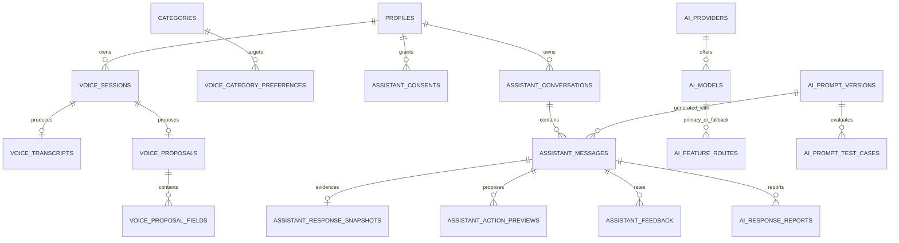

# Phase 09 Data Model

All identifiers are UUIDs generated by the existing database default unless a
consumed table uses a text identity. `I` means the standard immutable columns
`id uuid primary key` and `created_at timestamptz not null default now()`. `M`
adds `updated_at`, positive `version`, and nullable `deleted_at`; `U` adds
`user_id text not null references public.profiles(id)`. Mutable resources update
through guarded functions using expected versions.

## Relationships

## Public owner resources

### `public.voice_sessions` (`M+U`)

| Column         | Type / rule                                                                 |
| -------------- | --------------------------------------------------------------------------- |
| `locale`       | `text not null`, `ar/en`                                                    |
| `storage_ref`  | nullable opaque `text`, never returned                                      |
| `status`       | `uploaded/processing/proposed/confirmed/expired/failed`, default `uploaded` |
| `duration_ms`  | integer 1..120000                                                           |
| `expires_at`   | timestamp after creation and no later than 24 hours                         |
| `confirmed_at` | nullable; only confirmed state                                              |
| `failure_code` | nullable safe enum code; no provider body                                   |

Indexes: `(user_id,status,created_at desc,id desc)`, `(expires_at,id)` partial for
nonterminal media, and unique nondeleted `storage_ref` when present.

### `public.voice_transcripts` (`I+U`)

`session_id` references voice session cascade and is unique; `provider` and
`model` are bounded identifiers; `text_redacted` is bounded to 8 KiB; optional
`confidence numeric(5,4)` is 0..1; `language` is `ar/en`. `user_id` must equal the
session owner by trigger. Original audio/provider response is forbidden.

### `public.voice_proposals` (`M+U`)

`session_id` references voice session; `schema_version` is positive;
`proposal_type` initially equals `transaction.create`; `payload` is a closed
validated JSON object; status is `draft/validated/confirmed/executed/rejected/
expired`; `expires_at` is after creation and at most 15 minutes; confirmation and
execution timestamps/IDs agree with state; `executed_transaction_id` references
the existing transaction. One nonterminal proposal per session. Indexes cover
`(user_id,status,expires_at,id)` and session.

### `public.voice_proposal_fields` (`I+U`)

`proposal_id` cascades; `field_name` is one of the voice schema fields;
`value_json` is one scalar/null value; optional confidence is 0..1;
`source_span` is nullable, bounded, redacted text. Unique proposal/field. Owner
must match proposal.

### `public.voice_category_preferences` (`M+U`)

`merchant_pattern` is normalized bounded literal/token pattern, never general
regex; `category_id` references a current category; confidence is 0..1. Unique
active `(user_id,lower(merchant_pattern))`; index user/category. Owner CRUD is
guarded and category access is revalidated.

### `public.assistant_consents` (`I+U`)

`policy_version` is bounded and immutable; `granted_at` is not before creation;
`revoked_at` is nullable and not before grant. Unique user/policy and unique one
active consent/user. Regrant creates a new row only after a new policy version;
revocation is idempotent.

### `public.assistant_conversations` (`M+U`)

Optional redacted title <=120 characters; status `active/archived/deleted`;
`last_message_at` is monotonic; `deleted_at` agrees with deleted state. Index
`(user_id,status,last_message_at desc,id desc)` supports bounded cursor pages.

### `public.assistant_messages` (`I+U`)

`conversation_id` cascades; role is `user/assistant/system`;
`content_redacted` <=16 KiB; optional `prompt_version_id` references private
prompt metadata. Owner equals conversation owner. Index `(conversation_id,
created_at,id)`. User messages cannot name a prompt version; assistant messages
require the exact published version used. No update or hard-delete client grant.

### `public.assistant_response_snapshots` (`I+U`)

`message_id` is a unique FK; positive schema version; `evidence_refs` is a JSON
array of at most 32 safe `{kind,alias,version}` entries; bounded model/provider
identifiers. Owner matches message. No prompt, response body, source IDs, or
provider payload is stored.

### `public.assistant_action_previews` (`M+U`)

`message_id` references an assistant message; `action_type` is a fixed command
allowlist; `payload` is a closed versioned JSON schema; status is `draft/validated/
confirmed/executed/rejected/expired`; expiry is at most 15 minutes;
`confirmed_at` and `executed_resource_id` agree with state. Unique nonterminal
message/action and index `(user_id,status,expires_at,id)`.

### `public.assistant_feedback` (`I+U`)

`message_id` references an assistant message owned by the same user; rating is
exactly -1 or 1; optional reason <=500 characters and stored redacted. Unique
user/message. Owner may create/replace through a guarded function.

### `public.ai_response_reports` (`M+U`)

`message_id` references an owned assistant message; `report_type` is an approved
enum; reason is 1..1000 redacted characters; status `open/reviewed/actioned/
dismissed`; `reviewed_at` agrees with terminal review state. Unique active
`(user_id,message_id,report_type)` and index `(status,created_at,id)` for Admin.

## Private configuration and operational resources

### `private.ai_providers` (`M`)

`key` is unique lowercase provider slug; bounded display name; `approved` default
false; `zdr_capable` default false; `training_policy` is `unknown/no_training/
may_train`; optional `retention_reviewed_at`. Approval requires ZDR, no-training,
and a review timestamp. Index approved/key. No credential column exists.

### `private.ai_models` (`M`)

`provider_id` references provider; `model_id` globally unique; capabilities is a
deduplicated subset of `text/audio_input/structured_output`; approved default
false; positive `max_context`; `structured_output` boolean; `cost_policy` is a
closed object containing nonnegative decimal-string prompt/completion/audio caps
and review timestamp. Approval requires approved provider and reviewed cost.
Index `(provider_id,approved,model_id)`; no GIN until measured.

### `private.ai_feature_routes` (`M`)

`workload` is unique approved enum; primary model FK; fallback UUID array default
empty; nonempty deduplicated lowercase provider allowlist; `zdr_required` must be
true for all Phase 09 workloads; `max_price` is a closed nonnegative decimal-string
object; `limits` is a closed positive integer object; enabled default false.

A deferrable validation trigger resolves every fallback, rejects primary/duplicate/
unapproved models, proves each provider appears in the allowlist, and proves the
same workload capabilities, structured-output, ZDR/no-training, and no-higher
price policy. Enabled route requires one approved prompt and enabled safety rules.

### `private.ai_prompt_versions` (`I`)

`workload`, positive `version_no`, bounded template <=32 KiB, positive
`schema_version`, status `draft/testing/approved/retired`, optional
`approved_by` FK Admin profile and `published_at`. Unique workload/version; one
approved workload partial. Template and schema become immutable after draft.

### `private.ai_prompt_test_cases` (`M`)

Prompt FK cascades; `fixture_redacted` and `expected_rules` are closed bounded JSON
objects; enabled default true. Unique stable case key per prompt version and index
`(prompt_version_id,enabled,id)`. No customer data or provider output is seeded.

### `private.ai_usage_events` (`I`)

Nullable user FK; bounded workload/model/provider; nonnegative input/output token
integers, `estimated_cost numeric(18,8)`, latency integer, fallback flag, and
unique bounded request ID. Additional non-content fields record quota reservation,
budget period, status, and provider generation ID hash. Indexes `(user_id,
created_at,id)`, `(workload,created_at,id)`, and request ID. Immutable.

### `private.ai_failure_events` (`I`)

Nullable user FK; workload; nullable model/provider; safe failure code; schema
failure boolean; unique-or-repeat-correlated request ID; optional retryable flag
and latency. Indexes workload/time and request ID. It has no prompt, completion,
audio, stack trace, URL, header, or provider body column.

### `private.ai_safety_rules` (`M`)

Unique lowercase key; workload or `all`; rule type from a fixed enum;
`configuration` is a closed bounded rule-specific JSON object; enabled default
true. Positive version and workload/enabled index. Rules are declarative literals,
sets, and numeric bounds—never regex code, SQL, URLs, or templates.

## State transitions

| Resource       | Legal transitions                                                                                                      |
| -------------- | ---------------------------------------------------------------------------------------------------------------------- |
| voice session  | uploaded -> processing -> proposed -> confirmed; uploaded/processing -> failed; any unconfirmed nonterminal -> expired |
| voice proposal | draft -> validated -> confirmed -> executed; draft/validated -> rejected/expired                                       |
| conversation   | active <-> archived; active/archived -> deleted                                                                        |
| action preview | draft -> validated -> confirmed -> executed; draft/validated -> rejected/expired                                       |
| prompt version | draft -> testing -> approved -> retired; testing -> draft on failed corpus                                             |
| report         | open -> reviewed -> actioned/dismissed; reviewed -> actioned/dismissed                                                 |

Illegal, stale-version, wrong-owner, expired, duplicate, and terminal-state
transitions fail without changing audit/outbox/ledger state.

## Lock order and atomic invariants

1. Idempotency operation, quota/budget period reservation.
2. Owner conversation/session, then proposal/preview.
3. Referenced account/category/planning/tracking resources sorted by UUID.
4. Existing domain command, which retains its documented internal lock order.
5. Phase 09 status/result, audit row, and outbox event.

Prompt publication locks route by workload, prompt version, cases/results, and
prior approved prompt. Route updates lock provider/models sorted by UUID then the
route. Job claims use oldest timestamp/UUID, `FOR UPDATE SKIP LOCKED`, a UUID fence,
bounded lease, and compare-and-set completion.

## RLS and grant matrix

| Resource                                     | Owner                                                     | Worker                                   | Admin                                       | Anonymous |
| -------------------------------------------- | --------------------------------------------------------- | ---------------------------------------- | ------------------------------------------- | --------- |
| sessions/proposals/fields/preferences        | bounded own read; guarded allowed writes                  | claim/transition functions               | permissioned redacted views only            | none      |
| consents/conversations/messages              | own read; guarded consent/conversation/message writes     | response functions                       | no general content read                     | none      |
| snapshots/previews/feedback/reports          | own bounded read; guarded decision/feedback/report writes | create/transition functions              | reports with exact permission; redacted     | none      |
| providers/models/routes/prompts/cases/safety | none                                                      | approved effective-config function       | exact `ai.*` routes/functions               | none      |
| usage/failures                               | none                                                      | insert/read rollup functions             | exact redacted aggregate/detail permissions | none      |
| `voice-temp` objects                         | signed owner/session upload only                          | validate/read/delete own claimed session | no raw object access                        | none      |

Every security-definer function fixes `search_path`, is owned by the migration
role, revokes `public`, validates caller/context, and avoids dynamic SQL. Public
tables do not gain implicit Data API grants.

## Seed contract

- Seed reviewed OpenRouter provider/model metadata with stable UUIDs and current
  canonical IDs; approved flags reflect documented privacy/capability review only.
- Seed Phase 09 route rows disabled; no later-owned workload is enabled.
- Seed versioned Arabic/English prompt templates, deterministic synthetic corpus,
  and safety rules as draft/testing. Runtime publication uses the same corpus gate.
- Seed no API key, customer session/message/proposal, usage/failure event, report,
  financial record, or operational metric.
- Seed operations are insert-only/idempotent by stable key and never overwrite an
  audited mutable row.

## Retention and recovery

- Voice object expiry is <=24 hours and terminal purge is eager/idempotent.
- Draft proposals/previews expire in <=15 minutes; terminal trace is retained for
  audit/replay without raw media/provider content.
- Deleted conversation content is removed/anonymized by bounded privacy jobs while
  financial results and audit/outbox retain prior-Spec policy.
- Usage/failure rows contain only operational metadata and are compacted by the
  approved retention period; aggregate evidence remains non-content.
- Backup/restore covers all database rows and nonexpired synthetic test objects.
  Route rollback changes enabled pointers, never edits immutable prompt/usage rows.
