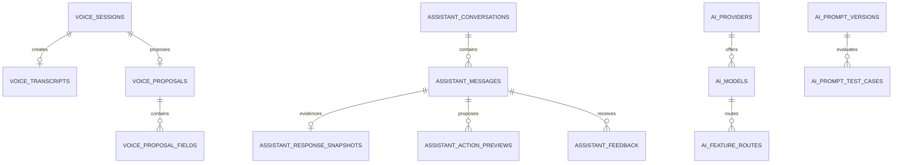

# Backend Feature Specification: Voice, OpenRouter AI & Financial Assistant

**Phase / Spec**: Phase 09 / SPEC-BE-009 of 014
**Working Branch**: `main`
**Feature Directory**: `apps/api/specs/009-voice-openrouter-financial-assistant`
**Base Revision**: `bdffc5a39dc4c863827dc750f464ddd844221425`
**Created**: 2026-09-03
**Status**: Complete
**Input**: Implement SPEC-BE-009 completely, including voice processing, the financial assistant, worker-only OpenRouter governance, deterministic confirmations, security, database controls, client integration, and evidence, without implementing SPEC-BE-010 or later.

## Objective and Scope

Deliver bilingual voice-to-proposal and financial-assistant capabilities that are
useful when an approved AI route is available and fail safely when it is not. AI
is advisory only: it may produce redacted explanations and deterministic action
previews, but every financial effect requires current user authorization,
ownership and version validation, explicit confirmation, and the existing
SPEC-BE-005 ledger commands.

This Spec owns the Voice and AI database objects, `/api/v1/voice`,
`/api/v1/assistant`, and `/api/v1/admin/ai` contracts, worker-only OpenRouter
gateway, route/prompt/safety governance, evaluations, quotas, cost controls,
temporary voice media lifecycle, phase-owned Mobile/Admin adapters, and all
associated jobs, events, tests, metrics, alerts, recovery, and evidence.

It does not own billing tables or final entitlement cutover (SPEC-BE-012),
reports (SPEC-BE-010), system-wide operations (SPEC-BE-013), or final cross-domain
production cutover and wholesale mock removal (SPEC-BE-014).

## Dependencies and Repository Baseline

- **Prior Specs**: SPEC-BE-001 through SPEC-BE-008.
- **Verified baseline**: local `main` and `origin/main` both resolve to
  `bdffc5a39dc4c863827dc750f464ddd844221425` after `git fetch origin --prune`.
- **Existing unrelated work**: `.agents/plugins/`, `apps/api/pnpm-lock.yaml`, and
  `apps/api/pnpm-workspace.yaml` are untracked and excluded unless proven
  necessary. They MUST remain unstaged and unmodified.
- **Required consumed boundaries**: platform configuration, API/worker split,
  Storage signing, outbox/queue, Clerk identity, exact Admin permissions and
  recent-MFA guard, accounts/categories, SPEC-BE-005 ledger commands,
  SPEC-BE-006 idempotency, and prior privacy/retention/audit registries.
- **Dependency evidence rule**: missing provider credentials, hosted alerts,
  release tags, registry signing, and external account approval are evidence
  gates, not reasons to leave locally executable implementation incomplete.
- **Governing documents**: Backend Constitution 2.0.0 and the complete Backend
  Master Plan.

## Owned Resources

### Database and Storage

- Public tables: `voice_sessions`, `voice_transcripts`, `voice_proposals`,
  `voice_proposal_fields`, `voice_category_preferences`, `assistant_consents`,
  `assistant_conversations`, `assistant_messages`,
  `assistant_response_snapshots`, `assistant_action_previews`,
  `assistant_feedback`, and `ai_response_reports`.
- Private tables: `ai_providers`, `ai_models`, `ai_feature_routes`,
  `ai_prompt_versions`, `ai_prompt_test_cases`, `ai_usage_events`,
  `ai_failure_events`, and `ai_safety_rules`.
- Private Storage bucket lifecycle: the existing `voice-temp` bucket; this Spec
  owns signed voice object issuance, validation, expiry, and purge behavior, not
  the foundation bucket definition.
- Functions/triggers: deterministic proposal validation, AI action confirmation,
  route/fallback validation, immutable/append-only enforcement, lifecycle and
  version guards, and retention registration required by the owned tables.

### APIs, Jobs, and Events

- API namespaces: `/api/v1/voice`, `/api/v1/assistant`, and
  `/api/v1/admin/ai`.
- Jobs: `voice.transcribe_extract`, `assistant.respond`, `ai.evaluate_route`,
  `ai.usage_rollup`, `ai.proposals.expire`, and `voice-media.purge`.
- Events: `voice.proposal_ready`, `voice.proposal_confirmed`,
  `voice.proposal_failed`, `assistant.response_ready`,
  `assistant.action_confirmed`, `assistant.action_rejected`,
  `ai.fallback_used`, `ai.budget_threshold`, and `ai.provider_failed`.
- Worker-only outbound integration: OpenRouter request construction, streaming,
  cancellation, structured response validation, approved retry, usage/cost
  recording, circuit breaking, and safe failure mapping.

### Explicitly Consumed, Not Owned

- Identity, Admin authorization, MFA, audit, retention orchestration, outbox,
  queues, Storage bucket creation, accounts, categories, currency reference data,
  transactions, postings, balances, ledger commands, sync, planning, tracking,
  and imports remain owned by SPEC-BE-001 through SPEC-BE-008.
- Entitlement plan tables and billing provider state remain SPEC-BE-012. Until
  that cutover, this Spec uses one explicit server-side default allowance of
  **five accepted AI work requests per user per rolling 24 hours**, shared by
  voice processing and assistant response jobs. Rejected-before-enqueue requests
  do not consume the allowance; an idempotent replay does not consume it again.
  The decision is exposed behind the same server-owned quota decision boundary
  that SPEC-BE-012 can later supply without changing public contracts.
- Final activation/removal of all production mock sources remains SPEC-BE-014.

## User Scenarios and Testing

### User Story 1 - Turn Voice Into a Reviewable Proposal (Priority: P1)

A signed-in customer records up to 120 seconds in Arabic or English, uploads it
to a private temporary location, and requests processing. The customer receives
a redacted transcript and a strict proposal whose fields show confidence and
source spans, or a safe explicit unavailable/failed state.

**Why this priority**: Voice entry is useful only when untrusted audio and model
output become bounded, inspectable data without creating money records.

**Independent Test**: Submit deterministic Arabic, English, noisy, over-duration,
missing-field, and malformed structured-output fixtures; observe one owner-scoped
session, one terminal proposal or safe failure, and no financial row mutation.

**Acceptance Scenarios**:

1. **Given** an authenticated customer and a valid Arabic or English recording,
   **When** the customer completes a signed upload and requests processing,
   **Then** one idempotent job produces a redacted transcript and version-1
   structured proposal with field confidence and source evidence.
2. **Given** audio longer than 120 seconds, an invalid object, unsupported media,
   expired upload, or wrong owner, **When** processing is requested, **Then** the
   request fails closed before provider disclosure and produces no proposal.
3. **Given** malformed provider output, **When** the approved one schema retry is
   exhausted, **Then** the session becomes safely failed, records only redacted
   failure metadata, and creates no financial effect.

### User Story 2 - Confirm or Reject a Voice Proposal (Priority: P1)

A customer reviews, edits only approved proposal fields, confirms or rejects the
proposal, and receives a deterministic result. Confirmation revalidates current
ownership, currency, amount, date, account, category, consent, quota, safety, and
version before invoking the existing ledger command exactly once.

**Why this priority**: Explicit confirmation and ledger-only execution are the
core financial safety boundary.

**Independent Test**: Exercise valid, edited, stale, expired, cross-owner,
concurrent, replayed, rejected, and invalid financial proposals; only one valid
confirmation reaches `LedgerService.createTransaction()` and its atomic database
command.

**Acceptance Scenarios**:

1. **Given** a valid unexpired owner proposal, **When** the owner confirms with
   the current expected version and idempotency key, **Then** exactly one
   SPEC-BE-005 transaction is created and the proposal records that transaction.
2. **Given** a replay of the same confirmation, **When** the request hash matches,
   **Then** the original result is returned without a second ledger command.
3. **Given** rejection, expiry, stale version, changed ownership, invalid edited
   fields, or a reused key with a different hash, **When** confirmation is
   attempted, **Then** execution is denied without partial effects.

### User Story 3 - Use a Consented Financial Assistant (Priority: P1)

A customer grants the current versioned assistant consent, starts or resumes a
conversation, sends a bounded question, and receives a streamed or non-streamed
redacted response with evidence references. The customer can revoke consent at
any time, after which new AI processing stops.

**Why this priority**: Consent and evidence are prerequisites for trustworthy
financial assistance.

**Independent Test**: Run consent grant/revoke, conversation ownership, message
streaming/non-streaming, outage, cancellation, evidence minimization, and replay
fixtures; revoked or absent consent prevents provider work while deterministic
finance endpoints remain available.

**Acceptance Scenarios**:

1. **Given** current active consent, **When** the owner asks a bounded question,
   **Then** the backend returns or streams one redacted response with a versioned
   evidence snapshot and no caller-controlled routing parameters.
2. **Given** absent, obsolete, or revoked consent, **When** a message is submitted,
   **Then** the request fails before provider disclosure and records no usage.
3. **Given** provider outage or no compliant route, **When** the customer asks a
   question, **Then** the assistant returns an explicit unavailable result and
   accounts, transactions, budgets, and other deterministic finance remain usable.

### User Story 4 - Review and Execute Assistant Action Previews (Priority: P1)

The assistant may propose a deterministic, expiring action preview. The customer
can inspect evidence, reject it, or confirm it with a current expected version.
AI never calls a tool, database, internal endpoint, or domain command directly.

**Why this priority**: Advice can become action only through a narrow auditable
authorization bridge.

**Independent Test**: Feed deterministic valid and adversarial action previews;
verify state transitions, expiry, ownership, reauthorization, replay, and exactly
one permitted domain command for a valid confirmation.

**Acceptance Scenarios**:

1. **Given** a validated preview, **When** the owner confirms before expiry with
   current authorization and version, **Then** the backend executes only the
   allowlisted owned domain command and audits the result.
2. **Given** prompt injection requesting SQL, tools, secrets, or internal APIs,
   **When** the response is processed, **Then** it is rejected as untrusted output
   and no privileged capability is exposed.
3. **Given** a rejected, expired, stale, or cross-owner preview, **When** execution
   is attempted, **Then** the request is deterministic, idempotent, and effect-free.

### User Story 5 - Govern Providers, Models, Routes, Prompts, and Safety (Priority: P2)

An authorized administrator reviews and changes redacted AI configuration through
exact `ai.*` permissions. Publishing a prompt/model route or changing privacy
requirements needs recent MFA, passing evaluations, and immutable audit evidence.

**Why this priority**: Model behavior cannot be safer than its administrative
control plane.

**Independent Test**: Verify exact permission and MFA matrices, route validation,
fallback equivalence, prompt-test publication gates, safe DTOs, version conflicts,
and audit/outbox evidence.

**Acceptance Scenarios**:

1. **Given** an authorized recently-MFA-verified administrator, **When** a route
   is enabled, **Then** the database rejects duplicate fallbacks, the primary in
   fallbacks, unapproved providers/models, missing capabilities, absent structured
   output, weaker ZDR/no-training/privacy, and invalid price/token limits.
2. **Given** a prompt version with a failing enabled evaluation, **When** publish
   is requested, **Then** publication is denied and the active version is unchanged.
3. **Given** missing permission, stale MFA, stale expected version, or secret/raw
   content in a request, **When** an Admin action is attempted, **Then** it fails
   closed and exposes no provider credential or sensitive content.

### User Story 6 - Operate AI Within Quota, Cost, and Outage Limits (Priority: P2)

Operators can observe bounded usage, cost, route health, failures, fallbacks,
budget thresholds, queue age, and media purge without seeing raw content or
high-cardinality sensitive labels. Budget exhaustion stops nonessential AI, not
finance.

**Why this priority**: Privacy-safe operational controls make provider use
bounded and recoverable.

**Independent Test**: Run deterministic normal, 70/85/95/100 percent budget,
quota, timeout, cancellation, schema retry, fallback, circuit-open, recovery,
worker crash, and purge scenarios without a real provider key.

**Acceptance Scenarios**:

1. **Given** usage crossing 70%, 85%, or 95% of the configured budget, **When**
   usage is rolled up, **Then** exactly one alert event per threshold/window is
   emitted with safe labels.
2. **Given** 100% budget use, quota exhaustion, an open circuit, or no compliant
   route, **When** work is requested, **Then** AI stops safely before an outbound
   call and deterministic finance remains healthy.
3. **Given** expired temporary audio or proposals, **When** retention jobs run or
   resume after failure, **Then** eligible objects/rows are purged or expired
   idempotently while retention holds and required audit evidence are preserved.

### Edge Cases

- Audio duration is validated from trusted media metadata and decoded evidence;
  claimed duration never overrides an observed value.
- Empty speech, noisy audio, mixed Arabic/English, unsupported language, invalid
  MIME/magic bytes, interrupted upload, duplicate finalize, and missing object
  produce explicit safe states.
- A transcript is stored redacted only; raw audio never enters database JSON,
  logs, traces, errors, tests, or event payloads.
- Missing/invalid amount, currency, date, account, category, or proposal type is
  never defaulted into an executable proposal.
- Zero, negative, fractional, or JavaScript-unsafe money and dates outside the
  accepted business range are rejected deterministically.
- Category preferences cannot target another user's category or an incompatible,
  inactive, archived, or merged category.
- Concurrent process/confirm/reject/expire operations resolve to one valid state;
  terminal states cannot regress.
- Consent revocation racing with a queued/running job prevents new disclosure and
  makes the job cancel or discard output before persistence.
- Stream disconnect cancels bounded provider work where supported; a completed
  durable response can be retrieved without duplicating the request.
- Provider errors, rate limits, malformed chunks, delayed first byte, full timeout,
  and cancellation produce classified safe failures without raw bodies.
- Fallback routing never relaxes ZDR, no-training, data-collection denial,
  structured-output, capability, provider allowlist, price, or token limits.
- Budget alerts are deduplicated per budget window; usage cannot bypass the hard
  stop through concurrency or replay.
- Missing OpenRouter key/configuration produces explicit feature unavailable,
  never fixture content and never a startup failure for deterministic finance.

## Database Design

### Owned Tables

All IDs are UUIDs generated server-side. Mutable rows carry `created_at`,
`updated_at`, and positive `version`; immutable rows carry `created_at`. Every
public user-owned table stores `user_id text` referencing `public.profiles(id)`
with restrictive deletion and forced RLS.

| Table                                 | Required fields and lifecycle                                                                                                                              | Required constraints and indexes                                                                                                                                    |
| ------------------------------------- | ---------------------------------------------------------------------------------------------------------------------------------------------------------- | ------------------------------------------------------------------------------------------------------------------------------------------------------------------- |
| `public.voice_sessions`               | `user_id`, `locale`, nullable `storage_ref`, `status`, `duration_ms`, `expires_at`, nullable `confirmed_at`                                                | locale `ar/en`; duration `1..120000`; status `uploaded/processing/proposed/confirmed/expired/failed`; `(user_id,status,created_at desc,id desc)` and expiry indexes |
| `public.voice_transcripts`            | immutable `user_id`, `session_id`, `provider`, `model`, `text_redacted`, nullable `confidence`, `language`                                                 | confidence `0..1`; one transcript/session; owner/session index; update/delete denied except retention function                                                      |
| `public.voice_proposals`              | `user_id`, `session_id`, `schema_version`, `proposal_type`, `payload`, `status`, `expires_at`, nullable `confirmed_at`, nullable `executed_transaction_id` | positive schema; closed type/status sets; one active proposal/session; owner/status/expiry indexes; payload schema validation                                       |
| `public.voice_proposal_fields`        | immutable `user_id`, `proposal_id`, `field_name`, `value_json`, nullable `confidence`, nullable `source_span`                                              | confidence `0..1`; closed field names; unique proposal/field; proposal index                                                                                        |
| `public.voice_category_preferences`   | `user_id`, `merchant_pattern`, `category_id`, `confidence`                                                                                                 | safe normalized pattern; confidence `0..1`; unique user/pattern; category compatibility/ownership trigger                                                           |
| `public.assistant_consents`           | immutable `user_id`, `policy_version`, `granted_at`, nullable `revoked_at`                                                                                 | unique user/policy; one active consent/user; valid interval; revocation only through guarded function                                                               |
| `public.assistant_conversations`      | `user_id`, nullable `title`, `status`, `last_message_at`, nullable `deleted_at`                                                                            | status `active/archived/deleted`; owner/time cursor index                                                                                                           |
| `public.assistant_messages`           | immutable `user_id`, `conversation_id`, `role`, `content_redacted`, nullable `prompt_version_id`, `operation_id`                                           | role `user/assistant/system`; bounded content; unique user/operation; conversation/time cursor index                                                                |
| `public.assistant_response_snapshots` | immutable `user_id`, `message_id`, `schema_version`, `evidence_refs`, `model`, `provider`                                                                  | positive schema; bounded allowlisted evidence array; one snapshot/message                                                                                           |
| `public.assistant_action_previews`    | `user_id`, `message_id`, `action_type`, `payload`, `status`, `expires_at`, nullable `confirmed_at`, nullable `executed_resource_id`                        | closed action/status sets; validated schema; one active message/action; owner/status/expiry indexes                                                                 |
| `public.assistant_feedback`           | immutable `user_id`, `message_id`, `rating`, nullable `reason`                                                                                             | rating `-1/1`; bounded reason; unique user/message                                                                                                                  |
| `public.ai_response_reports`          | `user_id`, `message_id`, `report_type`, `reason`, `status`, nullable `reviewed_at`                                                                         | closed report/status sets; unique user/message/type; owner/status/time index                                                                                        |
| `private.ai_providers`                | key, display name, approval, ZDR capability, training policy, retention review                                                                             | policy `unknown/no_training/may_train`; approval requires completed retention/privacy review; enabled index                                                         |
| `private.ai_models`                   | provider, model ID, capabilities, approval, max context, structured-output support, cost policy                                                            | positive context; closed capabilities; unique model ID; provider/approval index                                                                                     |
| `private.ai_feature_routes`           | workload, primary model, fallback IDs, provider allowlist, ZDR requirement, max price, limits, enabled, version                                            | unique workload; nonempty allowlist; complete route-validation trigger; enabled index                                                                               |
| `private.ai_prompt_versions`          | immutable workload/version/template/schema/status/approver/published time                                                                                  | positive versions; status `draft/testing/approved/retired`; unique workload/version; publication transition guard                                                   |
| `private.ai_prompt_test_cases`        | prompt version, redacted fixture, expected rules, enabled, version                                                                                         | bounded schema-valid JSON; prompt/enabled index                                                                                                                     |
| `private.ai_usage_events`             | immutable nullable user, workload/model/provider, token counts, estimated cost, latency, fallback flag, request ID, quota/budget window                    | nonnegative bounded values; user/time, workload/time, request indexes; no content                                                                                   |
| `private.ai_failure_events`           | immutable nullable user, workload, nullable model/provider, failure code, schema-failure flag, request ID                                                  | closed safe codes; workload/time and request indexes; no content                                                                                                    |
| `private.ai_safety_rules`             | key, workload, rule type, validated configuration, enabled, version                                                                                        | unique key; closed rule types; workload/enabled index                                                                                                               |

### Relationships and ERD

### RLS, Grants, and Authorization

- Force RLS on every public user-owned table. Owner policies derive identity from
  the verified Clerk JWT subject; `anon` receives no access.
- Owner reads are limited to safe redacted columns. Direct client writes to
  transcripts, proposal/previews execution state, evidence snapshots, provider/
  model/routes, prompts, usage/failures, or safety configuration are revoked.
- Mutations use guarded API/database commands that independently validate actor,
  object ownership, active consent, state transition, expected version, and
  idempotency.
- Private tables and raw Storage objects have no `anon` or `authenticated` grants.
  Worker access uses narrowly granted functions/role; the general API role cannot
  read provider configuration that is not required for a selected route.
- Admin routes require exact seeded `ai.*` permissions. Provider/model/route/
  prompt/safety publishing or privacy changes also require recent MFA, reason,
  expected version, immutable audit, and outbox evidence.
- Tests MUST include owner, non-owner, anonymous, ordinary authenticated, exact
  Admin permission, wrong Admin permission, stale MFA, API role, worker role, and
  service-role negative matrices.

## API Contracts

All routes inherit `/api/v1` validation, safe error, request/correlation ID,
content type, body/pagination limits, idempotency, and OpenAPI drift rules.

| Method           | Path                                    | Auth                                 | Request                                        | Success response                                   | Errors                                 |
| ---------------- | --------------------------------------- | ------------------------------------ | ---------------------------------------------- | -------------------------------------------------- | -------------------------------------- |
| POST             | `/voice/sessions`                       | active owner                         | locale, duration, content type/size/hash       | session plus short-lived signed upload instruction | validation, quota, unavailable         |
| POST             | `/voice/sessions/:id/finalize`          | owner                                | object hash/size/duration                      | finalized session/version                          | upload invalid/expired/owner mismatch  |
| POST             | `/voice/sessions/:id/process`           | owner + key                          | expected version                               | `202` stable job/session status                    | consent/quota/state/replay/unavailable |
| GET              | `/voice/sessions/:id`                   | owner                                | none                                           | redacted status/transcript metadata                | not found/forbidden                    |
| GET              | `/voice/sessions/:id/proposal`          | owner                                | none                                           | strict proposal and field evidence                 | not ready/expired                      |
| POST             | `/voice/proposals/:id/confirm`          | owner + key                          | expected version and allowlisted edited fields | ledger transaction reference and terminal proposal | stale/expired/invalid/replay conflict  |
| POST             | `/voice/proposals/:id/reject`           | owner + key                          | expected version and optional bounded reason   | rejected proposal/version                          | stale/terminal/replay conflict         |
| GET/PUT/DELETE   | `/assistant/consent`                    | active owner                         | current policy acknowledgement / revoke        | current consent state                              | policy mismatch/stale/replay           |
| GET/POST         | `/assistant/conversations`              | owner                                | bounded cursor / optional title                | page or created conversation                       | validation/quota                       |
| GET/PATCH/DELETE | `/assistant/conversations/:id`          | owner                                | expected version for mutation                  | detail/update/archive-delete result                | owner/stale/state                      |
| GET              | `/assistant/conversations/:id/messages` | owner                                | bounded cursor                                 | redacted message/evidence page                     | owner/not found                        |
| POST             | `/assistant/conversations/:id/messages` | active consent + key                 | content, context scope, response mode          | `202`, complete response, or server stream         | consent/quota/unavailable/cancelled    |
| POST             | `/assistant/previews/:id/confirm`       | owner + key                          | expected version                               | owned-domain result reference                      | stale/expired/unauthorized/invalid     |
| POST             | `/assistant/previews/:id/reject`        | owner + key                          | expected version and optional reason           | rejected preview/version                           | stale/terminal                         |
| PUT              | `/assistant/messages/:id/feedback`      | owner                                | rating and optional reason                     | immutable feedback                                 | duplicate/owner/validation             |
| POST             | `/assistant/messages/:id/reports`       | owner + key                          | report type/reason                             | report status                                      | duplicate/owner/validation             |
| GET/PATCH        | `/admin/ai/providers` and `/:id`        | exact `ai.providers.*`               | cursor/filter or expected-version update       | bounded redacted resource                          | permission/MFA/stale                   |
| GET/PATCH        | `/admin/ai/models` and `/:id`           | exact `ai.models.*`                  | cursor/filter or expected-version update       | bounded redacted resource                          | permission/MFA/route conflict          |
| GET/PATCH        | `/admin/ai/routes` and `/:id`           | exact `ai.routes.*`                  | cursor/filter or validated route update        | bounded route resource                             | permission/MFA/privacy/capability      |
| GET/POST         | `/admin/ai/prompts`                     | exact `ai.prompts.*`                 | cursor/filter or immutable draft               | bounded redacted prompt metadata                   | permission/validation                  |
| POST             | `/admin/ai/prompts/:id/evaluate`        | `ai.prompts.test`                    | expected version                               | `202` evaluation                                   | stale/no tests                         |
| POST             | `/admin/ai/prompts/:id/publish`         | `ai.prompts.publish` + MFA           | expected version/reason                        | published version                                  | evaluation/MFA/stale                   |
| GET              | `/admin/ai/usage` and `/failures`       | `ai.usage.read` / `ai.failures.read` | bounded filters/cursor                         | redacted aggregate/page                            | permission                             |
| GET/PATCH        | `/admin/ai/reports` and `/:id`          | `ai.reports.*`                       | cursor/filter or decision/version              | report page/result                                 | permission/stale                       |
| GET/POST/PATCH   | `/admin/ai/safety-rules`                | exact `ai.safety.*`                  | bounded list/draft/update                      | redacted versioned rule                            | permission/MFA/stale                   |

Clients cannot send model, provider, fallback, routing, ZDR, privacy, retention,
data-collection, price, token, or retry parameters.

## Functions, Views, and Triggers

- `private.validate_ai_proposal(workload, schema_version, payload, user_id)`
  validates the closed structured schema and current user/account/category/
  currency/date/amount/consent/quota/safety boundaries without provider trust.
- `private.confirm_ai_action(preview_id, expected_version, operation_id)` locks
  the owner preview, reauthorizes, validates current state/expiry and payload,
  invokes only the registered owned command, and atomically records audit/outbox
  and terminal execution reference.
- Route validation resolves every fallback and rejects duplicates, primary reuse,
  unapproved providers/models, invalid provider allowlists, missing capabilities,
  insufficient structured-output support, weaker ZDR/no-training/privacy, or
  invalid context/token/price controls before a route is enabled.
- Lifecycle triggers reject terminal-state regression, cross-session ownership,
  direct execution-reference edits, and invalid consent/proposal/preview timing.
- Append-only tables reject update/delete except narrowly scoped retention
  procedures that honor registered policy and holds.
- No public view, dynamic SQL, tool registry, or provider-selectable RPC is added.

## Queues, Jobs, and Events

- `voice.transcribe_extract`: validates finalized media and consent/quota, leases
  one session, calls the approved voice route, validates/redacts the result,
  persists transcript/proposal/fields, emits one terminal event, and deletes or
  schedules deletion of audio.
- `assistant.respond`: leases one message, rechecks consent/quota, builds a
  minimum-data aliased evidence envelope, handles stream/non-stream mode,
  validates/redacts output, persists response/snapshot/previews, and emits one
  terminal event.
- `ai.evaluate_route`: runs provider-independent prompt/schema/privacy/safety/
  fallback fixtures and optional credential-gated provider validation without
  promoting failed configuration.
- `ai.usage_rollup`: aggregates safe usage/cost/quota windows and emits deduplicated
  70/85/95 percent alerts; 100 percent is a hard nonessential-AI stop.
- `ai.proposals.expire`: atomically expires eligible voice proposals and assistant
  previews in bounded batches without regressing terminal state.
- `voice-media.purge`: deletes expired/unreferenced temporary media in bounded,
  idempotent batches, reconciles Storage/database references, and alerts on drift.
- Jobs use existing queue/outbox lease, fencing, retry, dead-letter, recovery, and
  graceful shutdown patterns. Provider schema failure receives at most one retry
  under the exact same approved privacy policy; other retry behavior is bounded
  by safe classified failure rules.
- Event payloads contain versioned IDs and safe status metadata only—never raw
  audio, transcript, prompt, completion, tokens, credentials, notes, merchant
  descriptions, or provider bodies.

## Business Rules

- Structured voice schema version 1 is exactly
  `{schemaVersion:1,type,amountMinor,currency,categoryId?,accountId?,date,merchant?,note?,confidence}`;
  unknown keys are rejected. Field confidence/source spans are stored separately.
- Voice proposals and assistant previews are drafts until deterministic validation;
  neither constitutes consent or authority.
- AI cannot execute tools, SQL, internal APIs, provider-selected callbacks, or
  financial mutations. Only explicit owner confirmation crosses into a registered
  domain command.
- Voice financial confirmation uses SPEC-BE-005 ledger commands only. No Phase 09
  repository or migration writes transactions, postings, balances, revisions, or
  ledger audit/outbox rows directly.
- Confirmation reruns current authorization, version, ownership, currency, amount,
  account/category status, consent, quota entitlement, safety, and expiry checks.
- Consent is versioned, explicit, independently revocable, and required before
  assistant disclosure. Revocation does not erase immutable required audit/usage
  evidence but blocks new provider work immediately.
- Evidence references are allowlisted, aliased, minimum necessary, versioned, and
  sufficient to reproduce the deterministic response context without storing raw
  financial descriptions.
- The same operation/replay key and request hash returns the original result; a
  mismatched hash fails. Concurrent terminal actions produce at most one effect.
- Provider/model/route/prompt/safety changes are optimistic and audited; passing
  evaluation is required before activation/publication.
- The temporary pre-billing quota is server-owned, deny-on-uncertainty, and cannot
  be overridden by clients or Admin request parameters.
- Core finance modules have no dependency on AI module readiness, pool, circuit,
  or provider configuration.

## Security and Privacy Requirements

- Meet OWASP ASVS 5.0 Level 2 plus applicable Level 3 finance/Admin/privacy
  controls, OWASP API Security Top 10:2023, OWASP Top 10:2025, and applicable
  MASVS 2.1 client integration controls.
- `OPENROUTER_API_KEY` and all provider credentials are worker-only runtime
  secrets. They never enter public environment values, source, migrations,
  fixtures, client bundles, Docker layers, screenshots, output, or logs.
- OpenRouter requests enforce approved provider/model routes,
  `data_collection: deny`, ZDR for sensitive workloads, no-training providers,
  disabled input/output logging where supported, exact token/context/price limits,
  and minimum necessary aliased data.
- Outbound requests use a fixed HTTPS allowlist, no arbitrary URL/redirect/tool,
  bounded body and decompression, DNS/private-network denial where applicable,
  separate connection pool, connection/first-byte/full timeouts, cancellation,
  concurrency limit, circuit breaker, and safe response-size limit.
- Prompt injection, indirect injection from evidence, SQL/tool/internal-API/SSRF
  attempts, schema smuggling, Unicode/control characters, and data-exfiltration
  fixtures MUST fail without authority or sensitive disclosure.
- DTOs use strict allowlists; errors and logs expose stable safe codes only.
  Raw prompt/completion/audio/token/credential/provider payload and unnecessary
  PII are forbidden in logs, traces, metrics, audit metadata, and events.
- Storage keys are server-generated and private. Upload signatures are short-lived,
  owner/session-bound, single-purpose, size/type/hash constrained, and unusable
  after finalize/expiry. Media is quarantined until validated.
- Release blocks on cross-user access, missing RLS negative coverage, direct
  financial mutation, provider/client secret exposure, unapproved/weaker fallback,
  raw-content leakage, prompt-injection authority, quota/budget bypass, or an
  exploitable Critical/High finding.

## Performance and Caching Requirements

- Voice session creation/finalization and job acceptance: P95 <=300 ms, P99 <=600
  ms, response <=50 KiB excluding the direct-to-Storage upload body.
- Voice/assistant status and cursor lists: P95 <=500 ms, P99 <=1 s, bounded to 100
  customer and 200 Admin rows and <=200/300 KiB respectively.
- Interactive assistant first byte: P95 <=5 s under deterministic stub and
  credentialed provider evidence when available; full response hard timeout 60 s.
- Background voice/assistant processing hard timeout 120 s; database statement
  timeout 2 s; provider connection timeout 3 s; cancellation releases work and
  pool capacity promptly.
- Hot owned-table queries MUST use intended owner/status/time/expiry indexes and
  remain P95 <=50 ms on production-like scale with no N+1 or unbounded scan.
- No Redis, shared user-response cache, raw prompt cache, or authorization cache.
  Only non-sensitive versioned reference prompt fragments may use bounded
  per-process caching. Provider caching is permitted only when the approved ZDR/
  no-training policy remains identical and never becomes application truth.
- Performance/stress evidence covers concurrent quota/budget claims, route
  selection, circuit transitions, streaming cancellation, queue backlog/recovery,
  proposal confirmation, and media purge with bounded memory/connections.

## Mobile and Admin Integration

- Mobile receives live Voice/Assistant adapters that preserve current service and
  state contracts while using phase-owned API contracts. Native device recording,
  microphone permissions, and local capture lifecycle remain unchanged.
- Development/test/demo may retain explicit deterministic fixtures. Release mode
  with missing or invalid AI/API/provider configuration MUST show a named
  feature-unavailable state and MUST NOT silently import or execute fixtures.
- Voice analyzer, transcript/proposal/evidence, assistant conversation/message/
  preview/feedback/report, and category-preference fixture ownership is mapped to
  the new API. Local unsent capture remains device-owned until signed upload.
- Admin AI repository operations map to `/api/v1/admin/ai` with exact existing
  Zod/UI contracts. MSW remains explicit test/development infrastructure and is
  not a production fallback.
- Clients receive no OpenRouter key, provider/model selection, service role,
  prompt template, private safety configuration, raw evidence, or internal error.
- SPEC-BE-014 retains final multi-domain production activation, shadow cohorts,
  and wholesale mock-import removal. Phase 09 supplies and tests only the owned
  live adapters, explicit unavailable state, and parity evidence.

## Functional Requirements

- **FR-001**: The system MUST create owner-bound signed temporary voice upload
  sessions with server-generated object keys, strict size/type/hash limits, and
  short expiry.
- **FR-002**: Voice duration MUST be verified and restricted to 1–120 seconds.
- **FR-003**: Voice processing MUST support Arabic and English, including safe
  explicit handling for noisy, empty, mixed, and unsupported audio.
- **FR-004**: Processing/finalization/replay MUST be idempotent and preserve one
  valid session state and at most one active proposal.
- **FR-005**: Stored transcripts MUST be redacted; raw audio/transcripts MUST NOT
  enter logs, events, errors, metrics, traces, or database provider payloads.
- **FR-006**: Voice proposals MUST use closed versioned schemas, reject unknown or
  missing required fields, and record per-field confidence and source spans.
- **FR-007**: Proposal validation MUST deterministically verify owner, currency,
  amount, date, account, category, consent, quota/entitlement, state, expiry, and
  safety before confirmation.
- **FR-008**: Voice confirmation MUST reauthorize and invoke exactly one
  SPEC-BE-005 ledger command; Phase 09 MUST NOT directly mutate financial tables.
- **FR-009**: Voice rejection, expiry, replay, concurrent terminal decisions, and
  stale versions MUST be deterministic and effect-free beyond owned audit/state.
- **FR-010**: Category preferences MUST be owner/category-compatible, bounded,
  and advisory only.
- **FR-011**: Assistant consent MUST be explicit, versioned, queryable, revocable,
  and enforced before provider disclosure or output persistence.
- **FR-012**: Conversations/messages MUST be owner-scoped, cursor-bounded,
  redacted, and protected by valid state transitions and operation replay.
- **FR-013**: Assistant responses MUST support streamed and non-streamed modes
  with equivalent final contracts, cancellation, and safe retrieval.
- **FR-014**: Every assistant response MUST retain a versioned, allowlisted,
  minimum-data evidence snapshot sufficient for review without raw disclosure.
- **FR-015**: Assistant action previews MUST be strict, versioned, deterministic,
  expiring, and incapable of direct execution.
- **FR-016**: Preview confirmation/rejection MUST validate owner, state, expiry,
  current authorization, expected version, consent, and idempotency exactly once.
- **FR-017**: Feedback and response reports MUST be owner-bound, bounded,
  deduplicated, auditable, and incapable of changing AI configuration directly.
- **FR-018**: All OpenRouter integration MUST execute in the worker boundary; API,
  Mobile, and Admin processes MUST NOT possess or use provider credentials.
- **FR-019**: Clients MUST NOT choose or influence provider, model, route,
  fallback, privacy, ZDR, price, token, or retry policy.
- **FR-020**: Provider/model/feature route records MUST be versioned, allowlisted,
  capability-validated, and activatable only with approved privacy evidence.
- **FR-021**: Enabled routes MUST reject duplicate/primary/unapproved/invalid or
  privacy-weaker fallbacks at the database boundary.
- **FR-022**: Sensitive workloads MUST enforce ZDR, no-training,
  `data_collection: deny`, structured output, and disabled raw logging.
- **FR-023**: Structured output MUST be independently validated; schema failure
  MAY retry once only under the identical approved privacy route.
- **FR-024**: When no compliant route exists, the system MUST return a safe
  unavailable state without weakening policy or fabricating output.
- **FR-025**: Prompt versions, schemas, tests, and safety rules MUST be immutable
  or optimistic/versioned and require passing evaluation before publication.
- **FR-026**: Sensitive AI configuration publication/privacy changes MUST require
  exact `ai.*` permission, recent MFA, reason, audit, and expected version.
- **FR-027**: AI input/output MUST be untrusted and MUST have no SQL, tool,
  internal API, arbitrary URL, secret, service-role, or financial authority.
- **FR-028**: Outbound disclosure MUST minimize and alias identifiers and exclude
  unrelated transactions, credentials, internal metadata, and unnecessary PII.
- **FR-029**: Usage/failure/report records MUST contain safe bounded metadata and
  MUST NOT contain raw prompts, completions, audio, tokens, or provider payloads.
- **FR-030**: Each accepted non-replay AI work request MUST atomically consume the
  applicable server quota; quota uncertainty or exhaustion MUST deny before call.
- **FR-031**: Before SPEC-BE-012, the server MUST enforce five accepted AI work
  requests per user per rolling 24 hours through a replaceable entitlement
  decision boundary; no client claim may increase it.
- **FR-032**: Budget rollup MUST emit deduplicated alerts at 70%, 85%, and 95%, and
  enforce a concurrency-safe hard nonessential-AI stop at 100%.
- **FR-033**: OpenRouter work MUST use a separate bounded connection pool,
  workload timeouts, cancellation, concurrency controls, circuit breaker, and
  outage isolation from deterministic finance.
- **FR-034**: The six named jobs MUST be leased, fenced, retry-safe, idempotent,
  dead-letter observable, recoverable, and graceful-shutdown safe.
- **FR-035**: The nine named events MUST be versioned, transactional where
  applicable, replay-safe, and limited to redacted allowlisted metadata.
- **FR-036**: Temporary voice media, expired proposals/previews, and retained AI
  metadata MUST follow explicit purge/retention/hold/reconciliation policies.
- **FR-037**: All public user-owned tables MUST force RLS with owner/non-owner/
  anonymous negative tests and minimum grants.
- **FR-038**: Private tables/functions/storage MUST deny clients; service-role and
  worker grants MUST be narrow, auditable, and unable to bypass financial rules.
- **FR-039**: All customer/Admin operations MUST appear in authoritative OpenAPI
  and internal job/event/worker contracts with strict schemas and stable errors.
- **FR-040**: Mobile release behavior MUST use live adapters or explicit
  unavailable state; it MUST NOT silently return voice/assistant fixture data.
- **FR-041**: Admin release behavior MUST use permissioned AI contracts; MSW/mock
  handlers MUST remain explicit test/development-only infrastructure.
- **FR-042**: Native microphone permission, recording, cancellation, and local
  media capture boundaries not owned by this Spec MUST remain intact.
- **FR-043**: Tests MUST cover Arabic/English/noisy audio, missing/invalid fields,
  financial values, ownership, consent, expiry, replay, injection, SSRF, leakage,
  privacy/ZDR, fallback, outage, circuit, quota, cost, budget, and schema cases.
- **FR-044**: Provider-independent deterministic fixtures MUST prove every locally
  executable branch; real provider validation runs only with approved credentials
  and an absent credential MUST remain an external pending gate.
- **FR-045**: The migration family MUST apply from empty and Phase 08/N-1 state,
  retain immutable checksums, validate rollback/forward-fix, and reconcile owned
  rows and Storage references.
- **FR-046**: Metrics, traces, alerts, and runbooks MUST cover route/provider/job/
  quota/budget/circuit/purge/recovery behavior without raw content or sensitive
  high-cardinality labels.
- **FR-047**: Unit, contract, OpenAPI, integration, E2E, pgTAP, RLS,
  authorization, security, migration, recovery, performance, stress, client, and
  container isolation gates MUST pass where locally executable.
- **FR-048**: SPEC-BE-010 and later tables, routes, jobs, events, reports,
  notifications, billing, operational dashboards, and final cutover resources
  MUST NOT be implemented by this phase.

## Tests and Verification Evidence

- Unit: strict DTOs/schemas, redaction/aliasing, state machines, route selection,
  provider request builder, structured validation, quota/budget claims, circuit,
  retry, cancellation, and safe error classification.
- Contract/OpenAPI: every customer/Admin route, streamed/non-streamed terminal
  equivalence, events/jobs, internal proposal/ledger bridge, and Mobile/Admin
  adapters with unique operation IDs and no caller routing fields.
- Database: fresh reset, migration order/checksum, constraints, indexes,
  functions/triggers, fallback rejection, RLS/grant matrices, append-only rows,
  concurrency, retention, and pgTAP.
- Integration/E2E: signed media flow, worker queues, bilingual/noisy fixtures,
  consent/revocation races, idempotency/replay, confirmation/rejection/expiry,
  SPEC-BE-005 mutation bridge, outage/recovery, streaming cancellation, and
  client feature-unavailable behavior.
- Security: prompt/indirect injection, tool/SQL/internal API, SSRF, BOLA/BFLA,
  mass assignment, log/error/event leakage, secrets/bundles/images, unsafe files,
  exact permissions/MFA, ZDR/no-training/data-collection, and dependency scans.
- Performance/stress: production-like owner/status/expiry query plans, concurrent
  quota/budget thresholds, route/circuit load, queue backlog/recovery, response
  time/cancellation, confirmation races, and media purge/reconciliation.
- Recovery: failed migration plus forward fix, N-1 application compatibility,
  provider outage, key rotation procedure, worker crash/lease replay, queue
  replay, circuit recovery, retention/purge interruption, backup/restore metadata,
  and deterministic-finance health throughout.
- Provider-backed: an approved OpenRouter credential may validate real supported
  models/providers and ZDR behavior. Without it, evidence explicitly remains
  pending and no local/provider-independent pass is relabeled.

## Migration and Rollback Strategy

- Create private provider/model/route/prompt/safety configuration and validation
  first; then public voice/assistant tables; then lifecycle/RLS/grants/functions;
  then retention/permission seeds and pgTAP suites.
- Use additive ordered migrations compatible with the Phase 08 image. Enable
  processing and confirmation only after schema, permission, evaluation, and
  ledger-bridge tests pass.
- Seed permissions, prompt fixtures, safety defaults, and disabled reviewed route
  candidates only. Never seed secrets, unreviewed live provider approval, raw
  user content, or fabricated usage.
- Migration checksums are immutable. A failed deployment is corrected forward;
  rollback disables Phase 09 routes/jobs and returns explicit unavailable states
  while preserving consent, conversation, proposal, usage, audit, and replay data.
- Temporary media continues to expire/purge during rollback. Destructive database
  reversal is test-environment-only and requires dependency/backup/reconciliation
  proof before any production consideration.

## Observability and Operations

- Metrics: request/first-byte/full latency, safe outcome, provider/model/workload,
  token/cost totals, quota/budget utilization, threshold events, fallback,
  structured-schema/evaluation failures, injection blocks, proposal/preview state,
  confirmation/rejection/expiry, circuit state, pool saturation, queue age/lease/
  retry/dead-letter, cancellation, and media purge/reconciliation.
- Metric labels are bounded workload/provider/model/status/error categories; no
  user/session/message/request IDs, prompt fragments, merchant/account/category,
  audio, transcript, amount, or evidence text.
- Structured logs contain request/correlation/job IDs and safe codes only. Alerts
  cover provider/circuit, budget thresholds/hard stop, queue age/dead letter,
  schema/evaluation regression, privacy/injection, purge drift, and unexpected
  confirmation failures, each linked to a recovery runbook.
- Finance liveness/readiness and latency evidence is captured during AI outage,
  saturation, circuit-open, and worker-recovery tests.

## Assumptions

- The five-request rolling-24-hour quota is the smallest explicit safe default
  before SPEC-BE-012 and is replaced only by server-derived entitlement data.
- The current OpenRouter candidate model IDs remain disabled candidates until
  current capability, provider, retention, ZDR, structured-output, and price
  evidence approves them; local tests do not imply provider approval.
- Signed upload uses the already provisioned private `voice-temp` bucket and the
  existing Storage abstraction; no second bucket or upload service is needed.
- Existing API/worker, outbox, idempotency, Admin guard/MFA, audit, privacy,
  metrics, and ledger boundaries are reused rather than duplicated.
- Explicit development/test/demo fixtures remain valid; only release-mode silent
  fallback is forbidden in this phase.

## Out of Scope

- Report generation, analytics, exports, or email delivery (SPEC-BE-010).
- Notifications, support, or content delivery (SPEC-BE-011).
- Stripe plans, billing tables, live entitlement cutover, or subscription UI
  changes (SPEC-BE-012).
- System-wide job inventory, provider-health dashboards, feature flags, backup/
  DR orchestration, or Redis (SPEC-BE-013).
- Final multi-domain production traffic waves, wholesale mock deletion, and
  release cutover (SPEC-BE-014).
- New financial mutation types, cross-currency transfer, autonomous agents,
  arbitrary tools, SQL generation/execution, web browsing, or caller-provided URLs.

## Acceptance Criteria

- **AC-001**: All 20 owned tables, complete constraints/indexes/triggers,
  retention entries, permissions, RLS, and grants apply cleanly from empty and
  Phase 08 state and pass all positive/negative database tests.
- **AC-002**: Signed media upload/finalize/process is owner-bound, rejects every
  invalid/expired/oversized/type/hash/duration case, and purges eligible media
  idempotently with no raw-content leakage.
- **AC-003**: Arabic and English clean/noisy fixtures produce the expected strict
  redacted proposals; missing/malformed/unsupported fixtures fail safely after at
  most one same-policy schema retry.
- **AC-004**: Every proposal field is schema-valid, confidence-bounded, source-
  evidenced, owner/account/category/currency/date/amount validated, and unknown
  keys or unsafe defaults are rejected.
- **AC-005**: Concurrent valid voice confirmation invokes one SPEC-BE-005 ledger
  command and replay returns the same result; stale/expired/rejected/cross-owner/
  invalid confirmation creates zero financial effects.
- **AC-006**: Consent grant/revoke/version/race tests prove no provider disclosure
  or persisted output occurs without current consent.
- **AC-007**: Streamed and non-streamed assistant requests yield equivalent final
  redacted messages/evidence/previews; disconnect/cancellation and replay are
  bounded and deterministic.
- **AC-008**: Preview confirmation/rejection/expiry/reauthorization/version tests
  produce at most one allowlisted owned-domain effect and zero direct AI/tool/SQL
  authority.
- **AC-009**: Every enabled route and fallback passes provider/model approval,
  capability, structured-output, ZDR, no-training, data-collection, allowlist,
  price, context, and token validation; every invalid database case is rejected.
- **AC-010**: Exact `ai.*` permission, recent MFA, expected version, evaluation,
  audit, and outbox matrices pass for every sensitive Admin change/publish path.
- **AC-011**: Prompt injection, indirect injection, tool, SQL, internal API, SSRF,
  exfiltration, schema-smuggling, and Unicode/control fixtures gain no authority
  and disclose no protected content.
- **AC-012**: The rolling quota is concurrency/replay safe; 70/85/95 alerts occur
  once per window and 100% stops outbound AI before call without affecting finance.
- **AC-013**: Provider outage, timeout, malformed stream, pool saturation,
  circuit-open/recovery, key absence, and no-compliant-route tests return explicit
  unavailable/failure states while core finance health and operations pass.
- **AC-014**: Voice/session job acceptance meets P95/P99 300/600 ms; bounded reads
  meet 500 ms/1 s; indexed database queries meet P95 50 ms; no unbounded/N+1
  query, sensitive cache, or resource leak is detected.
- **AC-015**: All six jobs pass disjoint leasing, fencing, retry, dead-letter,
  shutdown, crash recovery, and idempotent replay; all nine events pass schema,
  ordering, replay, and redaction tests.
- **AC-016**: OpenAPI/internal contracts parse and drift tests pass with every
  documented operation, strict DTO, stable error, event/job schema, and no
  caller-selected routing/privacy/price field.
- **AC-017**: Mobile Voice/Assistant and Admin AI adapters pass parity and explicit
  release-unavailable tests; native capture remains intact and production never
  silently returns fixtures or enables MSW.
- **AC-018**: Fresh unit, contract, OpenAPI, integration, E2E, pgTAP, RLS,
  authorization, security, migration, recovery, performance, stress, client,
  build/container, checksum, dependency, and secret/scope scans pass locally.
- **AC-019**: Every metric/alert/runbook/recovery path is present with bounded safe
  labels; raw content, credentials, tokens, full identifiers, and sensitive
  high-cardinality labels are absent from logs, traces, metrics, events, images,
  bundles, tests, and evidence.
- **AC-020**: All SPEC-BE-001–008 programmatic dependencies are usable; only
  genuine provider/hosted-alert/release-tag/registry external gates remain
  pending, and none is represented as passing.
- **AC-021**: The final resource/diff inventory contains no SPEC-BE-010 or later
  database object, server feature, job, event, report, notification, billing,
  operations dashboard, or final cutover implementation.

## Success Criteria

- **SC-001**: 100% of accepted voice and assistant financial actions remain
  reviewable before execution and produce exactly one authorized deterministic
  domain effect only after explicit confirmation.
- **SC-002**: 100% of Arabic/English, malformed, noisy, missing-field, and unsafe
  structured-output fixtures produce the documented proposal or explicit safe
  failure without fabricated fields.
- **SC-003**: 100% of absent/revoked/obsolete consent and cross-owner cases prevent
  provider disclosure and protected-data access.
- **SC-004**: 100% of invalid provider/model/route/fallback/privacy/capability/
  price/token combinations are rejected before activation or outbound use.
- **SC-005**: 100% of prompt-injection/tool/SQL/internal-API/SSRF/data-leakage
  fixtures gain no privileged capability and reveal no protected secret/content.
- **SC-006**: Quota, 70/85/95 alerts, 100% stop, replay, and concurrent-spend tests
  produce no overrun or duplicate threshold event in the measured window.
- **SC-007**: During complete AI outage/saturation/circuit-open tests, all sampled
  deterministic finance requests retain their baseline success and latency budget.
- **SC-008**: Temporary media, expired proposals/previews, and retention records
  reconcile with zero orphaned eligible object after purge/recovery tests.
- **SC-009**: Customer/Admin acceptance, database/query, job/recovery, and client
  behavior meet every documented P95/P99/payload/concurrency/security threshold.
- **SC-010**: Local and required remote gates pass on the pushed `main` commit;
  any credential-, hosted-, tag-, or registry-dependent proof remains explicitly
  pending until actually executed.

## Definition of Done

- [x] All owned schema, application, worker, contract, client-adapter, security,
      privacy, quota/cost, performance, observability, migration, rollback,
      recovery, and acceptance scope is implemented.
- [x] All generated tasks are complete and marked `[x]`; SpecKit analysis and
      convergence report no valid missing buildable work.
- [x] Clean-code and test-review findings are resolved; no Critical/High security
      or correctness finding remains.
- [x] Every locally executable command in the quickstart and evidence plan has a
      fresh passing result; external provider/host/release gates are named exactly.
- [x] Verified scoped commits are pushed directly to `origin/main`, every resulting
      remote workflow is monitored, and locally actionable failures are fixed
      forward without weakening gates.
- [x] Completion evidence records implementation/closeout SHAs, push/CI status,
      task/requirement/acceptance/success counts, test results, security/privacy/
      quota/cost/performance/recovery proof, and confirms SPEC-BE-010+ exclusion.

Verification listed in this document is required evidence, not a claim that it
has already been executed.
