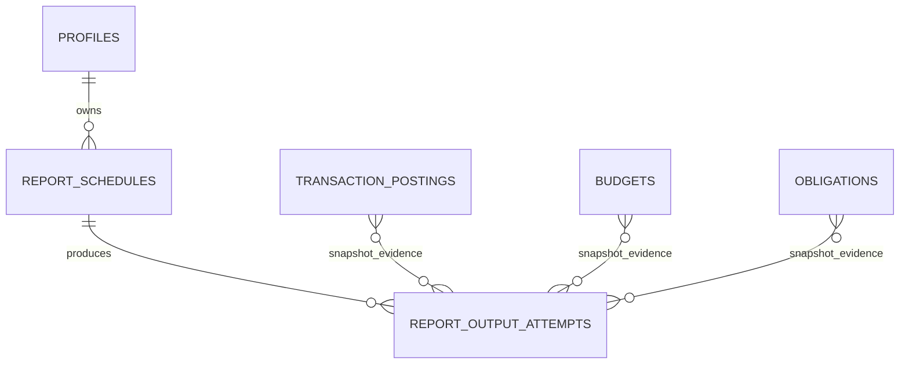

# Backend Feature Specification: Reports, Analytics, Exports & Email Delivery

**Phase / Spec**: Phase 10 / SPEC-BE-010 of 014
**Working Branch**: `main`
**Feature Directory**: `apps/api/specs/010-reports-analytics-exports-email`
**Base Revision**: `8d94126aef02550b56495522ab153de3834a3b66`
**Created**: 2026-09-03
**Status**: Draft
**Input**: "Fully implement SPEC-BE-010 reports, analytics, JSON/CSV/PDF exports, schedules, private downloads, and SMTP delivery while preserving the Phase 01-09 boundaries and excluding SPEC-BE-011+."

## Objective and Scope

Provide owner-consistent Home, dashboard, and report analytics derived from the
ledger and planning sources of truth; generate immutable versioned JSON, CSV,
and PDF report outputs; expose them through private expiring downloads; schedule
reports across IANA timezones; and deliver report links through authenticated
TLS SMTP with replay-safe retry behavior.

This Spec owns the report API/module, the two Phase 10 database tables, two
security-invoker analytics views, report snapshot capture, report/export/email
jobs and events, the `report-exports` object lifecycle, bounded Admin analytics,
the Mobile live report adapter, and Admin live overview/export adapters. It does
not own ledger or planning truth, identity, generic idempotency/outbox/queue,
support grants, notification delivery, platform-wide operations, or final live
client-provider selection.

## Dependencies and Repository Baseline

- **Prior Specs**: SPEC-BE-001 through SPEC-BE-009.
- **Current repository facts**: local `main` and `origin/main` both resolve to
  `8d94126aef02550b56495522ab153de3834a3b66`; the Backend Foundation run
  `33792560441` passed application, Mobile, database, image, secret, and
  redaction jobs; SPEC-BE-009 has 101/101 completed tasks.
- **Executable prerequisites verified**: platform configuration/database/
  outbox/worker/Storage conventions; Clerk owner and recent-auth context; exact
  Admin permission and support-grant checks; audit; account, currency, category,
  posting and balance truth; sync idempotency; planning views and ledgerVersion;
  tracking/AI evidence metadata; safe HTTP/errors/metrics; Mobile and Admin
  contract seams.
- **External prerequisite evidence**: real deployment SMTP credentials, verified
  sender/provider acceptance, hosted alert routing, and tag-only registry/SBOM/
  signature/provenance evidence are external. Their absence MUST NOT block safe
  local implementation or deterministic SMTP tests and MUST NOT be called pass.
- **Governing documents**: Backend Constitution 2.0.0 and the complete Backend
  Master Plan, including Sections 4-10, Phase 10, ownership index, and global
  Definition of Done.
- Existing untracked `.agents/plugins/`, `apps/api/pnpm-lock.yaml`, and
  `apps/api/pnpm-workspace.yaml` are unrelated and MUST remain untouched.

## Owned Resources

- Tables: `public.report_schedules`, `private.report_output_attempts`.
- Views: `public.v_monthly_financial_summary`,
  `public.v_category_spending_summary`, both `security_invoker`.
- Function: `private.capture_report_snapshot(...)` plus minimum guarded helpers
  required to claim/finalize/expire Phase 10 attempts and schedules.
- API: `/api/v1/dashboard/home`, `/api/v1/reports`,
  `/api/v1/report-schedules`, and bounded `/api/v1/admin/overview` analytics and
  `/api/v1/admin/exports` surfaces listed below.
- Jobs: `report.generate`, `report.email.deliver`,
  `report.schedule.enqueue`, `report.output.expire`; `analytics.refresh` only if
  measurements justify a Phase 10 materialized view. No materialized view is
  planned initially.
- Events: `report.requested`, `report.ready`,
  `report.delivery_succeeded`, `report.delivery_failed`, `report.expired`, and
  `export.ready`.
- Cache contracts: per-user Home and report aggregate caches using the Master
  Plan keys and TTLs. Caches are disposable projections, never truth.
- Storage: generated objects under the already-owned private `report-exports`
  bucket, with server-generated owner/attempt keys, short signed access, and
  expiry deletion.
- Runtime configuration: `EMAIL_SMTP_HOST`, `EMAIL_SMTP_PORT`,
  `EMAIL_SMTP_USERNAME`, `EMAIL_SMTP_PASSWORD`, and `EMAIL_FROM`.
- Contracts and clients: backend OpenAPI/internal/job/event contracts, Mobile
  report live adapter and encrypted metadata persistence, and Admin overview/
  analytics/export live adapters. Final production provider selection remains
  SPEC-BE-014.

Resources explicitly reused and not owned here are `v_account_balance_summary`
(SPEC-BE-005), salary/budget/obligation planning views (SPEC-BE-007),
idempotency/outbox/queue primitives (SPEC-BE-001/006), audit/RBAC/support grants
(SPEC-BE-003), private Storage foundations (SPEC-BE-001), and AI evidence
(SPEC-BE-009). No search, navigation, attention, notification, SMTP-provider,
generic job, or release-state table is created.

## User Scenarios and Testing

### User Story 1 - View reconciled financial summaries (Priority: P1)

An authenticated customer views Home and a selected report period with balances,
income, expense, planning progress, comparisons, freshness, and evidence that all
refer to one owner and one recorded financial version.

**Why this priority**: every generated output and Admin aggregate depends on the
same reporting truth.

**Independent Test**: seed empty, normal, and large owner ledgers/plans, request
Home and report summaries, and reconcile every amount and evidence ID to the
owned ledger/planning views while a concurrent mutation is attempted.

**Acceptance Scenarios**:

1. **Given** a normal owner ledger and plan, **When** Home and the same-period
   report are requested, **Then** shared totals match postings and planning truth
   at the returned `ledgerVersion`.
2. **Given** another user's data, **When** an owner requests a summary, **Then**
   no value, identifier, cache entry, timing detail, or error reveals that data.
3. **Given** an empty period, **When** a report is requested, **Then** the response
   is a valid empty report rather than invented data or an internal error.

### User Story 2 - Generate and securely download an immutable report (Priority: P1)

A customer requests JSON, CSV, or PDF output and receives a bounded asynchronous
attempt whose snapshot never changes during generation, retry, or concurrent
financial mutation.

**Why this priority**: immutable, private output is the core report deliverable.

**Independent Test**: request each format, mutate the ledger during generation,
verify exact snapshot reuse and safe rendering, then exercise owner/non-owner,
recent-auth, URL expiry, file expiry, and secure deletion.

**Acceptance Scenarios**:

1. **Given** an expensive report, **When** it is requested, **Then** the API
   returns `202` within 300 ms and bounded worker generation finishes from one
   repeatable-read snapshot.
2. **Given** cells beginning with `=`, `+`, `-`, `@`, tab, or carriage return,
   **When** CSV is generated, **Then** every dangerous spreadsheet cell is
   neutralized without corrupting ordinary data.
3. **Given** hostile text, markup, bidirectional controls, or template syntax,
   **When** PDF/HTML content is rendered, **Then** it is encoded as bounded text
   and cannot execute markup, template expressions, or external fetches.
4. **Given** an expired or foreign attempt, **When** a download is requested,
   **Then** no signed URL or object existence detail is disclosed.

### User Story 3 - Schedule timezone-correct report delivery (Priority: P1)

A customer creates, updates, pauses, resumes, or deletes a report schedule with a
verified normalized recipient and receives at most one output/delivery for each
scheduled period despite retries, lag, or worker replay.

**Why this priority**: schedules and email are explicit Phase 10 ownership.

**Independent Test**: calculate next runs around month/year and DST boundaries in
multiple IANA zones, enqueue repeated/late runs concurrently, and prove one
snapshot and one accepted SMTP message per schedule period.

**Acceptance Scenarios**:

1. **Given** a valid IANA timezone and supported frequency, **When** a schedule is
   saved with `expectedVersion`, **Then** its next run is deterministic and
   reflects local calendar boundaries and DST.
2. **Given** a stale version, unverified recipient, or missing recent auth for a
   recipient change, **When** a schedule is changed, **Then** it fails without
   partial update or recipient enumeration.
3. **Given** scheduler replay or lag, **When** due work is recovered, **Then** each
   due period is enqueued once and missed periods follow the bounded catch-up
   policy without a delivery storm.

### User Story 4 - Deliver private links through SMTP (Priority: P1)

A customer receives a minimal email with a private expiring link. The system
distinguishes accepted, rejected, timeout, retryable, terminal, and configuration
failures and records accepted-by-server status without claiming inbox receipt.

**Why this priority**: real email attempt semantics replace syntax-only
simulation while keeping financial details out of mail.

**Independent Test**: use a deterministic local TLS SMTP server to verify auth,
TLS, envelope, stable `Message-ID`, accept/reject/timeout, retry/dead-letter,
replay, and redacted logging without real credentials.

**Acceptance Scenarios**:

1. **Given** valid runtime configuration and a verified recipient, **When** SMTP
   accepts the message, **Then** the attempt becomes `delivered` and evidence says
   accepted by SMTP, not received in an inbox.
2. **Given** a retry or replay after ambiguous completion, **When** delivery is
   resumed, **Then** the same stable `Message-ID` and delivery fence prevent a
   second accepted send.
3. **Given** missing/invalid configuration or TLS/auth failure, **When** delivery
   runs, **Then** it fails closed with a safe code and no fallback transport.
4. **Given** a configured delivery-status webhook, **When** a stale, unsigned,
   invalid, or replayed payload arrives, **Then** it produces no state change.

### User Story 5 - Use bounded Admin analytics and exports (Priority: P2)

An authorized administrator views minimized aggregate overview analytics and
requests bounded exports; user-level report access additionally requires an
active purpose-bound support grant and immutable audit.

**Why this priority**: Admin parity is required but cannot weaken owner privacy.

**Independent Test**: exercise the exact permission/support-grant matrix with
bounded periods, platforms, pages, rows, and export sizes, including denied,
expired, revoked, and cross-user cases.

**Acceptance Scenarios**:

1. **Given** the exact aggregate permission, **When** overview analytics are
   requested, **Then** only minimized bounded aggregates are returned.
2. **Given** a user-level request without a valid support grant, **When** an Admin
   requests or downloads it, **Then** access is denied and audited without
   revealing whether a report exists.
3. **Given** caller-supplied SQL, dataset names, unrestricted user selectors, or
   excessive bounds, **When** an Admin request is submitted, **Then** it is
   rejected before query or job execution.

### Edge Cases

- Leap day, year boundary, short months, month-end delivery day, half-year and
  annual periods, DST gap/fold, timezone rule changes, and invalid IANA zones.
- Concurrent ledger/planning mutation during snapshot capture and cache
  invalidation; stale cache after a version change must miss safely.
- Zero income, negative net cash flow, missing comparison history, archived
  accounts/categories, reversed/deleted transactions, and partial planning data.
- Empty output, exact row/size limits, one-over-limit requests, slow queries,
  worker memory pressure, cancellation, process crash, lease expiry, and replay.
- SMTP partial writes, connection/TLS/auth failures, 4xx/5xx responses, timeout
  after DATA, duplicate scheduler events, permanent recipient rejection, and
  ambiguous provider acceptance.
- Deleted/paused schedules with already leased work, expired files with active
  URLs, deletion retry, foreign object keys, and failed Storage deletion.

## Database Design

### Owned Tables

`public.report_schedules` is mutable and includes the standard mutable UUID,
timestamps, positive `version`, and required owner FK plus:

- `report_type text not null` constrained to the documented supported report
  allowlist;
- `frequency text not null` constrained to `monthly`, `three_months`,
  `half_year`, or `annual`;
- `timezone text not null`, validated against installed IANA timezone names;
- `next_run_at timestamptz not null` and `last_run_at timestamptz null`;
- `delivery_channel text not null` constrained to `download` or `email`;
- `recipient text null`, normalized and required only for email;
- `enabled boolean not null default true`.

It has a unique constraint on `(user_id, report_type, frequency,
delivery_channel)`, an owner list index `(user_id, created_at desc, id desc)`,
and a partial scheduler index `(next_run_at, id) where enabled`.

`private.report_output_attempts` includes immutable UUID/creation time plus:

- `schedule_id uuid null` referencing `public.report_schedules(id)` with delete
  restricted while retained;
- `user_id text not null` referencing `public.profiles(id)`;
- `report_type text not null`, `period_start date not null`, and
  `period_end date not null` with `period_end >= period_start` and the configured
  maximum period enforced;
- `ledger_version bigint not null check (ledger_version >= 0)`;
- `snapshot jsonb not null` validated as a bounded versioned object containing
  `schemaVersion`, `generatedAt`, evidence/source versions, request format and
  owner-safe report content;
- `storage_ref text null`, always a server-generated private object key;
- `delivery_status text not null default 'queued'` constrained to `queued`,
  `generating`, `ready`, `sending`, `delivered`, `failed`, or `expired`;
- `provider_message_id text null`, `attempt_count integer not null default 0`
  with a nonnegative check, `error_code text null`, and
  `expires_at timestamptz not null` after creation.

Snapshot identity, period, owner, ledger version, and content are immutable after
capture. Guarded worker transitions may change only operational fields. A partial
unique index on `(schedule_id, period_start, period_end)` where `schedule_id is
not null` prevents duplicate scheduled output; indexes cover
`(user_id, created_at desc, id desc)`, active status/creation, expiry, and
schedule lookup. No provider credential, email body, signed URL, or raw SMTP
response is stored.

### Relationships and ERD

The three evidence relationships are logical references inside the immutable
snapshot and not additional join tables.

### RLS, Grants, and Authorization

- Enable and force RLS on `report_schedules`; authenticated owners may select
  only their rows and all mutations occur through guarded API/database paths.
- Revoke `anon` and ordinary `authenticated` access to
  `private.report_output_attempts`; owner-safe attempt projection is returned by
  the API after an explicit owner check.
- Revoke default/public schema grants before adding the minimum authenticated,
  API, worker, migration, and test grants.
- Views use `security_invoker`; caller RLS remains active. No view or function
  accepts an arbitrary user selector or relation/query text.
- Admin aggregate reads require exact report/analytics permission. User-level
  reads additionally call the existing support-grant check for resource/action,
  require recent authentication where sensitive, and append an audit event.
- pgTAP and live tests cover owner, non-owner, anonymous, ordinary Admin, exact
  Admin, active/expired/revoked support grant, API role, and worker access.

## API Contracts

All requests use the standard request ID, safe error envelope, strict DTO
allowlist, bounded parsing, and no-store/private cache headers where sensitive.
Mutations use `Idempotency-Key`; mutable schedule changes use `expectedVersion`.
Collection responses use bounded cursor pagination (`limit` default 25/max 100
for customers and default 50/max 200 for Admin).

| Method | Path | Auth | Request | Success response | Errors |
|---|---|---|---|---|---|
| GET | `/api/v1/dashboard/home?period&currency?` | owner | supported period and optional currency | balances and separately grouped income/expense, budget/obligation/savings, recent items, `ledgerVersion`, `schemaVersion`, `generatedAt`, evidence | invalid period/currency, unauthorized, too large |
| GET | `/api/v1/reports/summary?type&period&currency?` | owner | supported type/period and optional currency | versioned per-currency aggregates, data state, evidence/source versions | invalid type/period/currency, unavailable |
| POST | `/api/v1/reports` | owner + recent auth for sensitive export/email | `{type,periodStart,periodEnd,format,delivery,recipient?}` | `202 {attemptId,status,ledgerVersion,schemaVersion,generatedAt}` | idempotency, bounds, recipient/auth/config |
| GET | `/api/v1/reports/:attemptId` | owner | attempt UUID | safe status/metadata/error and fresh short-lived URL only when authorized/ready | not found, expired, recent auth |
| GET | `/api/v1/report-schedules` | owner | cursor/limit | safe schedule page | validation |
| POST | `/api/v1/report-schedules/verify-recipient` | owner + recent auth | normalized email + idempotency key | verification state without account/deliverability claim | validation/auth/conflict |
| POST | `/api/v1/report-schedules` | owner + recent auth for email | schedule fields | created schedule/version/next run | conflict, recipient/timezone |
| GET | `/api/v1/report-schedules/:id` | owner | schedule UUID | safe schedule | not found |
| PATCH | `/api/v1/report-schedules/:id` | owner + recent auth for recipient change | allowlisted fields + `expectedVersion` | updated schedule/version/next run | version/auth/verification |
| DELETE | `/api/v1/report-schedules/:id` | owner | `expectedVersion` | 204 | version/not found |
| POST | `/api/v1/reports/:id/retry-delivery` | owner + recent auth | idempotency key | attempt status reusing immutable snapshot | non-retryable, expired, duplicate |
| GET | `/api/v1/admin/overview` | `admin.overview.read` | platform/period/locale bounds | minimized overview aggregates and freshness | forbidden/bounds |
| GET | `/api/v1/admin/overview/platform-analytics` | `admin.overview.read` | platform/period bounds | bounded platform analytics | forbidden/bounds |
| GET | `/api/v1/admin/overview/activity` | exact activity permission | page/pageSize/platform/period | exact bounded existing activity projection | forbidden/bounds |
| POST | `/api/v1/admin/exports` | exact reports export permission + recent auth | server-known export type/filter/format | `202 {attemptId,status}` | forbidden/filter/size |
| GET | `/api/v1/admin/exports/:attemptId` | exact permission; support grant for user scope | attempt UUID | safe status and short-lived URL | forbidden/expired/not found |
| POST | `/api/v1/webhooks/report-delivery` | configured provider signature | raw bounded body + timestamp/signature | `202` only after freshness/signature/schema/idempotency checks | absent config/signature/replay/body |

OpenAPI, runtime DTOs, Mobile types, Admin schemas, internal contracts, event/job
contracts, error codes, pagination, and idempotency behavior MUST be drift-tested.

## Functions, Views, and Triggers

- `public.v_monthly_financial_summary`: owner-scoped monthly income, expense,
  net cash flow, transaction count, currency and maximum contributing
  `ledger_version`, based on current effective confirmed posting truth.
- `public.v_category_spending_summary`: owner-scoped period/category expense
  totals and counts, preserving archived category identity safely, based on
  current effective confirmed posting truth.
- Both views are `security_invoker`, contain no private/provider fields, use
  stable bounded query shapes and documented supporting indexes, and reconcile
  exactly to Phase 05 ledger semantics.
- `private.capture_report_snapshot(user_id, report_type, period_start,
  period_end, ledger_version, schema_version)` validates caller authority,
  report/type/period limits and the requested current version, reads all ledger
  and planning sources inside one repeatable-read transaction, persists one
  bounded immutable snapshot, and returns its attempt ID. A concurrent change
  either belongs wholly before or after the snapshot; mixed-version content is
  forbidden.
- Guarded schedule/attempt transition helpers enforce expected version, legal
  state changes, worker lease/fence, attempt limits, audit/outbox atomicity, and
  snapshot-field immutability. No generic dynamic SQL helper is added.

## Queues, Jobs, and Events

- `report.generate`: claims a bounded attempt, reuses its captured snapshot,
  streams JSON/CSV/PDF to private Storage, records size/hash/ref, emits ready,
  and retries only retryable failures under an expiring lease and fence.
- `report.email.deliver`: requires a ready immutable output, valid verified
  recipient, recent authorization evidence, valid SMTP config and TLS; sends one
  minimal link-only message with a stable attempt-derived `Message-ID`; records
  accepted/rejected/timeout/configuration outcome without raw provider content.
- `report.schedule.enqueue`: claims due schedules by indexed bounded batch,
  calculates deterministic periods/next runs, uses the schedule-period unique
  fence, handles bounded lag recovery, and cannot duplicate output or delivery.
- `report.output.expire`: deletes expired objects in bounded batches, marks
  attempts expired only after confirmed absence/deletion, retries failures, and
  alerts on backlog without exposing object keys.
- `analytics.refresh` remains absent unless retained measurements demonstrate a
  materialized view is required and its owner, source version, refresh,
  staleness, reconciliation, failure, and rollback contracts are approved.
- Jobs reuse the existing outbox/worker/idempotency patterns, exponential retry
  with jitter, maximum attempts, leases/fences, dead-letter evidence, recovery,
  and graceful shutdown. No new queue framework is introduced.
- Every event is versioned and contains IDs, state, safe reason, timestamps and
  correlation only; snapshots, recipient, signed URL, subject/body, financial
  values, SMTP responses, and provider data are excluded.

## Business Rules

- Supported report periods are monthly, three months, half-year, and annual;
  report types are a documented allowlist mapped to current Mobile/Admin needs.
- Period calculations use the schedule/user IANA timezone for calendar
  boundaries and store instants in UTC. Invalid/unknown zones fail validation.
- A delivery day beyond a short month resolves to that month's last local day;
  DST gaps move to the first valid instant and folds choose the earlier instant,
  consistently and under test.
- Recipient values are trimmed, normalized to lowercase domain/address form,
  bounded, free of control characters, and verified before activation. Responses
  never reveal whether a third-party address is registered or deliverable.
- Changing an email recipient requires recent authentication and fresh
  verification. Pausing/deleting a schedule stops future enqueueing but does not
  mutate retained snapshots or recall already accepted mail.
- Snapshot retries reuse identical bytes/content and evidence. Regeneration is a
  distinct explicit user request with a new idempotency key and attempt.
- JSON is schema-versioned UTF-8; CSV uses a fixed column allowlist, RFC-compatible
  quoting, and formula neutralization; PDF is deterministic bounded text with no
  active content, external resource, attachment, script, or form.
- Size, period, row, render-time, query-time, worker-memory, concurrency,
  recipient, and retry limits are configuration validated and enforced before
  and during work. Partial files are never exposed and are cleaned safely.
- `delivered` means accepted by the configured SMTP server. Inbox receipt,
  reading, and bounce truth are never inferred. There is no fallback transport.

## Security and Privacy Requirements

- Apply ASVS 5.0 L2 and applicable L3 finance/Admin/export controls, OWASP API
  Security Top 10:2023, OWASP Top 10:2025, and applicable MASVS 2.1 client
  integration/storage requirements with traceable evidence.
- Enforce object, property, and function authorization independently at API and
  database layers; deny mass assignment, BOLA/BFLA, recipient enumeration,
  arbitrary user/dataset selection, and cross-user cache/object access.
- Report snapshots/provider fields remain private. Safe DTOs minimize identifiers
  and never expose recipient, SMTP response, object key, audit internals, or
  signed URL outside a fresh authorized response.
- Sensitive exports and signed URLs require recent auth. Admin user-level access
  additionally requires exact permission, active support grant, reason, and
  immutable audit.
- Signed URLs are owner/attempt scoped, HTTPS-only, short-lived, not persisted by
  Mobile, never logged or cached, and invalid after object expiry.
- SMTP uses deployment-injected secrets only, required TLS with certificate and
  hostname validation, bounded timeouts, CRLF-safe envelope/header validation,
  fixed sender policy, and no credential/payload logging or fallback.
- A configured delivery-status webhook uses raw-body signature verification,
  timestamp/replay window, event uniqueness, constant-time comparison, strict
  schema, and idempotent state transition before effects.
- Security release blockers include cross-user access, unsafe CSV/PDF content,
  unsigned/replayed webhook acceptance, signed URL leakage, duplicate accepted
  delivery, missing RLS negative evidence, credential leakage, unbounded export,
  or an exploitable Critical/High finding.

## Performance and Caching Requirements

- Home uses `user:{clerkSub}:dashboard:{period}:{ledgerVersion}` with 30-60
  second TTL; report aggregates use
  `user:{clerkSub}:report:{type}:{period}:{ledgerVersion}` with five-minute TTL.
  Keys include verified owner and ledger version; invalidation follows ledger/
  planning/report events. Cache errors fall back to database and never grant
  access or change report truth.
- Home must meet P95 <=400 ms, P99 <=800 ms, compressed payload <=250 KB.
- Cached report summary must meet P95 <=800 ms, P99 <=1500 ms, compressed
  payload <=300 KB.
- Expensive report acceptance must return `202` within 300 ms and <=50 KB;
  work proceeds asynchronously with bounded concurrency, rows, bytes, memory,
  query/render/SMTP time, and streaming where applicable.
- Query plans for representative empty, normal, and large users must use the
  owned and reused indexes without unbounded scans/N+1. Performance tests retain
  P50/P95/P99, payload, rows, peak memory, throughput, errors, and dataset hash.
- No Redis, shared financial cache, or materialized view is introduced without
  measured evidence and an approved owner/security/failure/rollback plan.

## Mobile and Admin Integration

- Add a Mobile live `ReportsService` adapter matching the existing service and
  domain types, including summary/breakdown, schedule lifecycle, recipient
  verification, preview/output, retries, cursor attempts, error mapping, and
  operation/version behavior.
- Replace report mock behavior in live contract tests and provider-ready wiring;
  preserve the explicit mock/demo adapter. Production selection/removal of mock
  imports remains SPEC-BE-014 and is not performed here.
- Mobile may persist encrypted report summaries and download metadata; it MUST
  NOT persist signed URLs, provider fields, SMTP data, or credentials.
- Add Admin live repositories/schemas for current overview/platform analytics/
  activity and bounded export behavior, preserving existing UI contracts and
  explicit MSW test/dev mode. No broad unrelated Admin fixture family is changed.
- Shadow tests compare current fixture calculations with backend ledger/planning
  results over representative datasets. Any financial difference blocks parity;
  production clients are not silently switched.
- No report-ready in-app/push notification, preference, template, campaign, or
  notification delivery behavior from SPEC-BE-011 is added.

## Functional Requirements

- **FR-001**: All report/dashboard financial values MUST reconcile to Phase 05
  ledger and Phase 07 planning truth at an explicit `ledgerVersion`.
- **FR-002**: The backend MUST create only the two owned tables and two owned
  security-invoker views and MUST reuse all earlier-Spec resources.
- **FR-003**: Migrations MUST define complete constraints, indexes, forced RLS,
  revoked defaults, minimum grants, forward validation, rollback rehearsal, and
  immutable checksums.
- **FR-004**: Every summary/output MUST include `schemaVersion`, `generatedAt`,
  `ledgerVersion`, and bounded source/evidence metadata.
- **FR-005**: Snapshot capture MUST be repeatable-read consistent during
  concurrent financial/planning mutations and immutable after capture.
- **FR-006**: Home and report summary APIs MUST implement strict types, periods,
  safe errors, bounded responses, and owner isolation.
- **FR-007**: Report request/status/retry APIs MUST be idempotent, owner scoped,
  recent-auth protected where sensitive, and unable to regenerate implicitly.
- **FR-008**: Schedule CRUD MUST support optimistic concurrency, recipient
  verification, valid IANA zones, supported frequencies, correct boundaries,
  pause/delete behavior, and deterministic next-run calculation.
- **FR-009**: Scheduler enqueueing MUST be idempotent under concurrency, replay,
  lease expiry, lag, and recovery.
- **FR-010**: JSON, CSV, and PDF generation MUST be deterministic, bounded,
  injection-safe, and streamed where size warrants.
- **FR-011**: Generated objects MUST be private, owner-scoped, short-link
  accessible, expiry-bound, and securely deleted with reconciliation.
- **FR-012**: SMTP MUST use only required-TLS runtime configuration, verified
  sender/recipient, minimal safe content, stable Message-ID, no fallback, and
  exact acceptance/rejection/timeout/retry semantics.
- **FR-013**: Delivery and generation replay MUST NOT create duplicate output or
  duplicate accepted email.
- **FR-014**: Any configured delivery webhook MUST be signed, fresh, replay-safe,
  schema-valid, and idempotent.
- **FR-015**: Admin analytics/exports MUST use exact permissions, minimized
  aggregates, bounded server-known filters, support grants for user-level access,
  and immutable audit.
- **FR-016**: The two required cache families MUST include owner and
  `ledgerVersion`, obey required TTL/invalidation, and never become truth.
- **FR-017**: The specified P95/P99/acceptance/payload budgets MUST pass against
  representative production-like datasets without unbounded queries or memory.
- **FR-018**: Jobs MUST implement bounded claim, lease, fence, retry, dead-letter,
  audit, metrics, graceful shutdown, and recovery using existing primitives.
- **FR-019**: All six owned event contracts MUST be versioned, idempotent, and
  contain no sensitive financial, recipient, URL, provider, or credential data.
- **FR-020**: Mobile and Admin live adapters/contracts MUST reach parity without
  hidden fallback, signed-URL persistence, or final production cutover.
- **FR-021**: Metrics, alerts, dashboards, and runbooks MUST cover latency,
  cache, queue, generation, Storage, schedule lag, SMTP, expiry, reconciliation,
  security, rollback, and recovery using safe cardinality.
- **FR-022**: Local deterministic provider tests MUST cover SMTP TLS/auth/accept/
  reject/timeout/replay without inventing credentials or claiming provider proof.
- **FR-023**: All unit, contract, OpenAPI, integration, E2E, pgTAP, RLS,
  authorization, security, migration, recovery, performance, stress, Mobile, and
  Admin gates applicable to Phase 10 MUST pass before push.
- **FR-024**: SPEC-BE-011 and later tables, APIs, jobs, events, notifications,
  billing, operations, and production cutover MUST remain unimplemented.

## Tests and Verification Evidence

- Unit: period/timezone/DST, next run, state machines, email normalization,
  snapshot schemas, CSV/PDF escaping, Message-ID, limits, error mapping, caches.
- Contract/OpenAPI: every route/DTO/error/pagination/idempotency/internal/job/
  event contract plus Mobile `ReportsService` and Admin schema parity/drift.
- Database/pgTAP/RLS: tables, columns, checks, indexes, immutability, forced RLS,
  grants, views, capture function, owner/non-owner/Admin/worker/anonymous matrix.
- Integration/E2E: empty/normal/large ledger and planning golden reports,
  concurrent mutation snapshot consistency, schedule CRUD/enqueue/replay/lag,
  Storage/signing/expiry/delete, JSON/CSV/PDF, SMTP and webhook state flows.
- Security: BOLA/BFLA/property authorization, recipient enumeration, CSV/PDF/
  template/header injection, URL ownership/leakage, webhook spoof/replay, log and
  error redaction, oversized/resource exhaustion, secret/history/dependency/image
  scans, support grant/audit matrix.
- Performance/stress: Home/report budgets, 202 acceptance, query plans, payload,
  cache isolation/invalidation/staleness, worker memory/streaming, concurrent
  schedules, SMTP failure/recovery, expiry backlog, large representative data.
- Migration/recovery: clean reset/lint/checksum, forward/rollback/shadow, N-1,
  migration failure/forward fix, worker crash/lease/replay/dead-letter, Storage
  deletion reconciliation, backup/restore and report reconciliation.
- Clients: Mobile type/lint/unit/integration and encrypted persistence/no-URL
  tests; Admin type/lint/unit/build/focused E2E/accessibility and fixture shadow.
- Operations: executable metrics/alerts contracts, dashboard/runbook checks,
  local TLS SMTP harness, no-secret configuration validation, and exact evidence
  reports. Provider-backed SMTP acceptance and hosted alert routing remain
  pending until genuine external values/access exist.

## Migration and Rollback Strategy

1. Add the two `security_invoker` views and verify they reconcile to current
   ledger truth without changing Phase 05/07 resources.
2. Add schedule and private attempt tables, constraints, indexes, transition/
   snapshot guards, RLS and grants; update immutable checksum inventory.
3. Add required report permissions/events/contracts and enable API reads before
   schedule/delivery workers.
4. Shadow summaries/outputs against current Mobile/Admin fixtures on empty,
   normal and large datasets; any financial difference blocks enablement.
5. Enable generation, expiry, then scheduled SMTP delivery after deterministic
   local tests. Hosted configuration is runtime-only.

Rollback disables schedule claiming and SMTP delivery first, drains or safely
leases in-flight work, rolls the application image back under N-1-compatible
additive schema, preserves immutable snapshots, and allows ordinary expiry.
Database correction is forward-only; destructive reversal is test-only unless a
separate approved backup/restore/reconciliation procedure exists. Rollback and
recovery never regenerate a snapshot or duplicate accepted mail.

## Observability and Operations

- Metrics: Home/report P50/P95/P99/payload/query/cache, queue age/depth, attempts,
  generation latency/rows/bytes/peak memory/failures, Storage upload/delete/
  expiry, schedules due/lag/catch-up, SMTP TLS/auth/latency/accept/reject/timeout/
  retry/dead-letter, signed URL issuance, webhook rejection/replay, and
  reconciliation differences. Labels use bounded codes only.
- Structured logs/traces carry request/correlation/attempt IDs and safe state;
  they exclude user IDs where avoidable, amounts, transaction descriptions,
  recipient, message body, signed URL, object key, raw SMTP/webhook content, and
  all secrets.
- Alerts cover latency/payload/cache drift, query regression, queue/schedule lag,
  generation or expiry backlog, Storage failure, delivery failure rate, webhook
  attacks, duplicate fence violation, reconciliation drift, and security denials.
- Runbooks cover snapshot reconciliation, stalled generation, schedule lag,
  SMTP outage/credential rotation/ambiguous acceptance, signed URL incident,
  expiry failure, webhook compromise, migration forward fix, rollback, backup/
  restore, and external provider verification.

## Assumptions

- Existing Postgres/outbox/worker/Storage and local Docker/Supabase test
  infrastructure remain the implementation primitives; Redis and a new queue
  library are unnecessary unless measurements prove otherwise.
- The existing Mobile four period kinds are the initial schedule frequencies;
  unsupported custom cron or arbitrary ranges fail closed.
- Email recipient verification reuses authenticated identity/reverification and
  existing audit evidence; no separate verification table is introduced.
- Report output format and retry lineage live in the immutable versioned snapshot
  metadata because the Master Plan owns no additional columns or table for them.
- A minimal standards-compliant PDF renderer and SMTP client may use an existing
  vetted dependency only if native/runtime capabilities cannot meet correctness
  and tests; any dependency requires audit/lockfile/image verification.
- No materialized view or `analytics.refresh` implementation is needed unless
  retained query measurements fail a required budget.

## Out of Scope

- SPEC-BE-011 in-app/push notifications, notification preferences/templates/
  campaigns/deliveries, support, or content.
- SPEC-BE-012 billing/entitlements, SPEC-BE-013 generic operations/jobs/settings,
  and SPEC-BE-014 production client-provider cutover/mock removal.
- Arbitrary SQL, generic dataset/query builders, customer search/navigation/
  attention tables, shared report caches, or long-lived/public links.
- Inbox-read guarantees, deliverability scoring, bounce inference without a
  configured verified webhook, a secondary email transport, or invented SMTP
  credentials/provider evidence.
- New AI-generated summaries; an existing approved Phase 09 evidence summary may
  be referenced only through its public contract and failure cannot block report
  truth or delivery.

## Acceptance Criteria

- **AC-001**: Both owned tables, both views and capture function pass clean
  migration, lint, checksum, constraint, index, grant, RLS, rollback and N-1 gates.
- **AC-002**: Golden empty/normal/large reports reconcile exactly to ledger and
  planning sources at recorded versions, including concurrent mutation tests.
- **AC-003**: Home and cached summary meet all P95/P99 and payload budgets; report
  acceptance meets 300 ms; query plans and worker memory remain bounded.
- **AC-004**: JSON/CSV/PDF outputs pass row/size/encoding/injection/determinism and
  snapshot-reuse checks with no partial or foreign file exposure.
- **AC-005**: Owner/non-owner/Admin/support-grant matrices pass at API, database,
  cache, Storage, URL, schedule, attempt and export boundaries.
- **AC-006**: All timezone, DST, short-month, year-boundary, schedule-version,
  idempotency, lag and recovery cases produce one correct run per period.
- **AC-007**: Local TLS SMTP tests pass authentication, acceptance, rejection,
  timeout, retry, ambiguous completion, stable Message-ID, replay and redaction
  without claiming external acceptance.
- **AC-008**: Configured webhook signature, timestamp, schema, replay and
  idempotency tests pass; when no webhook is configured the route is absent or
  fails closed.
- **AC-009**: Report generation/delivery/expiry jobs pass crash, lease, retry,
  dead-letter, duplicate, graceful shutdown, and secure deletion recovery.
- **AC-010**: OpenAPI/internal/event/job contracts, Mobile live adapter and Admin
  overview/export adapters pass exact drift/parity tests without production
  provider cutover or signed-URL persistence.
- **AC-011**: Metrics, alerts, dashboards, runbooks, security/privacy/OWASP
  traceability, migration/rollback/recovery evidence and independent reviews are
  complete with no open Critical/High finding.
- **AC-012**: Every locally executable Phase 10 task and release gate passes,
  scoped commits reach `origin/main`, resulting remote CI is green, external-only
  gates are named honestly, and no SPEC-BE-011+ implementation is present.

## Success Criteria

- **SC-001**: 100% of tested Home/report values match the financial and planning
  source records at the stated version, with zero mixed-version snapshots.
- **SC-002**: 100% of owner-isolation tests prevent another customer from
  learning report, recipient, object, URL, schedule, or cache information.
- **SC-003**: Home responses meet 400/800 ms P95/P99 and 250 KB; cached summaries
  meet 800/1500 ms and 300 KB across retained representative runs.
- **SC-004**: 100% of expensive requests are accepted within 300 ms and process
  within documented row, byte, memory, concurrency, and timeout limits.
- **SC-005**: Every supported timezone/boundary fixture produces the expected
  next run and exactly one scheduled output per period under replay and lag.
- **SC-006**: Every dangerous CSV/PDF/template fixture is rendered inert, and no
  expired/foreign link or object is usable.
- **SC-007**: Every deterministic SMTP scenario yields the specified state and
  stable Message-ID with zero duplicate accepted sends and zero sensitive logs.
- **SC-008**: 100% of Admin analytics/export operations require the exact
  permission, and all user-level access additionally proves support grant/audit.
- **SC-009**: Mobile/Admin contract suites pass with no hidden live-to-mock
  fallback and no persisted signed URL.
- **SC-010**: All applicable local and remote release gates pass with exact
  evidence; only genuine provider/secret/hosted-alert/tag gates may remain named
  pending, and none is represented as a pass.

## Definition of Done

- [ ] All owned scope, tests, security, performance, observability, migration,
      rollback, recovery, reconciliation, client parity, and acceptance evidence
      required by this Spec passes.
- [ ] Every requirement, acceptance criterion, success criterion and task has
      current traceable evidence; `speckit-analyze` and post-implementation
      `speckit-converge` report no valid missing executable work.
- [ ] Local deterministic SMTP behavior is complete; missing real provider
      credentials leave only exact external provider proof pending.
- [ ] Clean-code and test reviews plus final security and verification gates have
      no unresolved release blocker.
- [ ] After local pre-push gates pass, narrow verified commits are pushed directly
      to `origin/main`; every resulting remote workflow is monitored and any
      locally actionable failure is fixed forward.
- [ ] Final implementation and closeout SHAs, task/acceptance/success counts,
      exact verification, reconciliation/performance/SMTP/security/privacy/
      recovery evidence, external gates, and SPEC-BE-011+ exclusion are recorded.
- [ ] The goal is marked complete only after every locally executable and required
      remote gate is genuinely green.

Verification listed in this document is required evidence, not a claim that it
has already been executed.
