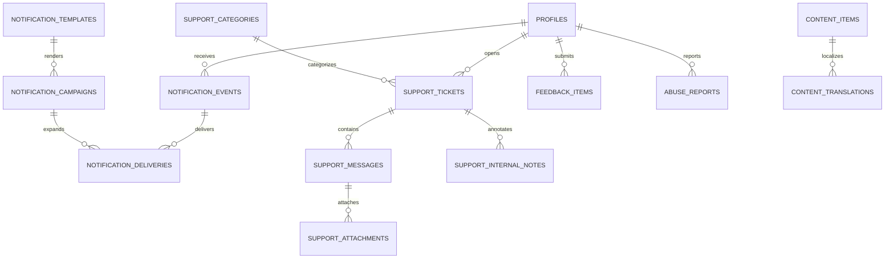

# Backend Feature Specification: Notifications, Support & Content

**Phase / Spec**: Phase 11 / SPEC-BE-011 of 014  
**Working Branch**: `main`  
**Feature Directory**: `apps/api/specs/011-notifications-support-content`  
**Base Revision**: `1bafdcb17ce50b76adb1c229bc5175eece55ca7b`  
**Created**: 2026-09-05  
**Status**: Ready for Implementation  
**Input**: "Fully implement SPEC-BE-011 notifications, campaigns, support, attachments, feedback, abuse reports, and localized content; replace applicable Mobile/Admin mocks; preserve prior-Spec ownership; exclude SPEC-BE-012 and later work."

## Objective and Scope

Provide private in-app, push, and email notification preferences and delivery;
safe bilingual templates; bounded campaigns; complete customer/Admin support
workflows; quarantined support attachments; product feedback and abuse-report
review; and Arabic/English published help content. Provider outages must remain
isolated from every financial and domain transaction.

This Spec owns rendering and delivery after an owning domain publishes an event.
It never originates or redefines the business events owned by SPEC-BE-005 through
SPEC-BE-010 or any future Spec. The current registry contains only SPEC-BE-005
through SPEC-BE-010 events; its public extension seam may consume a future owner's
event only after that owner publishes the contract. It owns the Phase 11 API, database resources,
workers, event contracts, deterministic local providers, and live-capable client
adapters. Final production adapter selection and removal of all repository mocks
remain SPEC-BE-014; Phase 11 removes applicable placeholder/no-op behavior inside
the owned adapters and proves parity without silently enabling production traffic.

## Dependencies and Repository Baseline

- **Prior Specs**: SPEC-BE-001 through SPEC-BE-010. Direct prerequisites are
  SPEC-BE-001 through SPEC-BE-003 for worker, Storage, profiles, devices, encrypted
  push tokens, RBAC, audit, support grants, file security, and outbox. Later prior
  domains supply only their already-owned event contracts.
- **Verified baseline**: after `git fetch --prune origin`, local `main` and
  `origin/main` both resolve to `1bafdcb17ce50b76adb1c229bc5175eece55ca7b`.
  Backend Foundation CI run 33910883029 passed and SPEC-BE-010 records 95/95
  completed tasks.
- **Implementation evidence inspected**: all ten prior feature packages contain
  `spec.md`, `plan.md`, and `tasks.md`; Specs 004-010 retain local, security,
  performance, recovery, client, convergence, and remote evidence. The current
  API exposes the established platform, identity, security, reference, ledger,
  sync, planning, tracking, AI, and reports modules and ordered migrations through
  Phase 10.
- **Protected unrelated paths**: `.agents/plugins/`, `apps/api/pnpm-lock.yaml`,
  `apps/api/pnpm-workspace.yaml`, and `apps/api/supabase/` are untracked and MUST
  remain unmodified, unstaged, and undeleted unless a concrete Phase 11 dependency
  is proven. Canonical migrations remain under root `supabase/`.
- **Client contracts inspected**: Mobile notification/support domain schemas,
  service capabilities, repositories, screens, mock services, platform push
  wrapper, and hardcoded article sources; Admin communications schemas,
  repository, handlers, permissions, pages, and Phase 007 OpenAPI contract.
- **Content scheduling decision**: the current Admin content contract supports
  immediate publish/retire but does not expose scheduled content publishing.
  Phase 11 therefore uses an immediate approved publish action and does not own
  or register `content.publish.schedule`. One-time campaign scheduling is in scope.
- **External gates**: genuine APNs/FCM/Expo credentials, controlled physical
  devices, hosted provider acceptance, and release-only registry/signature/
  provenance evidence may remain external. Deterministic local provider, contract,
  failure, retry, payload, and adapter tests remain mandatory and may not be
  reported as real provider delivery.
- **Governing documents**: Backend Constitution 2.0.0 and the complete Backend
  Master Plan, especially Sections 3-12, Phase 11, ownership index, and global DoD.

## Owned Resources

- Tables: `public.notification_events`, `public.notification_preferences`,
  `public.notification_templates`, `public.notification_campaigns`,
  `private.notification_deliveries`, `public.support_categories`,
  `public.support_tickets`, `public.support_messages`,
  `private.support_internal_notes`, `private.support_attachments`,
  `public.feedback_items`, `public.abuse_reports`, `public.content_items`, and
  `public.content_translations`.
- Functions/triggers: `private.create_notification_event(...)`, guarded helpers
  for template lifecycle, preference replacement, read/action transitions,
  campaign audience validation/claiming, ticket participation/state transitions,
  attachment finalization, abuse-report deduplication, content publication, and
  shared mutable-version/immutable-row enforcement using existing primitives.
- API namespaces: customer `/api/v1/notifications`, `/api/v1/support`,
  `/api/v1/content`, `/api/v1/feedback`, and `/api/v1/abuse-reports`; Admin
  `/api/v1/admin/communications`, `/api/v1/admin/notifications`,
  `/api/v1/admin/support`, `/api/v1/admin/feedback`,
  `/api/v1/admin/abuse-reports`, and `/api/v1/admin/content`.
- Jobs: `notification.dispatch`, `notification.delivery.retry`,
  `notification.campaign.expand`, `notification.expire`, and
  `support-attachment.scan`.
- Events: `notification.delivered`, `notification.failed`, `notification.read`,
  `notification.acted`, `support.ticket_opened`, `support.message_added`,
  `support.status_changed`, `content.published`, `content.retired`, and
  `feedback.received`, each as a versioned ID-only/safe-metadata envelope.
- Storage: quarantine/finalized object lifecycle inside the existing private
  `support-attachments` bucket. No new bucket is owned.
- Cache: locale/version-keyed published content with a five-minute TTL, explicit
  invalidation on publish/retire, database fallback, and no authorization cache.
- Providers: narrow push and email delivery contracts plus deterministic local
  providers; reuse encrypted token access and the Phase 10 SMTP transport instead
  of adding another provider or credential system.
- Clients: Phase 11 live-capable Mobile notification/support/content adapters and
  Admin communications repository handlers, while SPEC-BE-014 retains final
  production provider selection and broad mock removal.

Reused, not owned: profiles/devices/push tokens (002); RBAC, audit, recent MFA,
support-access grants, privacy orchestration, and permission keys (003); Storage,
outbox, queues, safe HTTP, logging, and metrics (001); idempotency primitives
(006); domain business events (005-010 and future 012); report SMTP configuration
(010); generic job inventory/operations (013); production cutover (014).

## User Scenarios and Testing

### User Story 1 - Receive private, preference-aware notifications (Priority: P1)

An authenticated customer receives an in-app event and, when permitted, a safe
push or email rendered in Arabic or English. The lock screen reveals no amount,
account, transaction description, token, or other sensitive financial detail.

**Why this priority**: delivery safety and outage isolation are the core Phase 11
trust boundary.

**Independent Test**: publish a versioned owned-domain event, vary locale,
preference matrix, quiet hours, timezone, DST boundary, token state, provider
outage, retry, and replay; prove one in-app event, deduplicated channel attempts,
safe provider payloads, and no impact on the source transaction.

**Acceptance Scenarios**:

1. **Given** a supported domain event and published bilingual template, **When**
   rendering runs, **Then** the customer receives the correct locale/version with
   only allowlisted variables and a safe fallback if the preferred locale is absent.
2. **Given** disabled push or current quiet hours, **When** delivery is evaluated,
   **Then** in-app storage remains available while push is suppressed or deferred
   according to policy and the reason is recorded without sensitive data.
3. **Given** a provider timeout or outage, **When** a financial/domain transaction
   commits, **Then** the transaction succeeds independently and delivery retries
   asynchronously without duplicate database effects.
4. **Given** a lock screen, **When** a push is shown, **Then** its title/body and
   route are safe and protected detail is fetched only after authentication.

### User Story 2 - Read and act on notifications (Priority: P1)

A customer lists unread/all notifications with an opaque cursor, opens protected
detail, marks an item read, and invokes only a server-published action before it
expires.

**Independent Test**: paginate equal timestamps, replay read/action commands,
use stale versions, expired items, foreign IDs, unknown action keys, and revoked
sessions, then verify deterministic state and safe errors.

**Acceptance Scenarios**:

1. **Given** more than one page, **When** pages are traversed, **Then** no item is
   skipped or duplicated and unread count matches visible owner rows.
2. **Given** a valid action, **When** it is invoked twice with one idempotency key,
   **Then** the original result is replayed and one `notification.acted` event exists.
3. **Given** a foreign, expired, or unsupported action, **When** it is requested,
   **Then** the response is a non-enumerating safe error with no target disclosure.

### User Story 3 - Govern templates and campaigns (Priority: P1)

An authorized content administrator creates, tests, publishes, and retires
versioned Arabic/English templates; previews a bounded audience; and creates,
approves, schedules, pauses, resumes, or cancels a one-time campaign.

**Independent Test**: exercise unknown variables, header/markup injection,
missing locale, stale versions, arbitrary SQL-shaped audience input, over-limit
audiences, stale previews, self-approval, duplicate expansion, batch replay,
rate limiting, pause, and cancellation.

**Acceptance Scenarios**:

1. **Given** an unpublished or failing template, **When** campaign approval is
   attempted, **Then** approval fails without delivery or partial audience state.
2. **Given** an audience over the configured separation threshold, **When** its
   creator attempts approval, **Then** the attempt is denied and audited.
3. **Given** a valid approved campaign, **When** expansion is replayed, **Then**
   bounded batches create at most one delivery per user/channel and respect pause
   or cancellation before each batch.
4. **Given** a past time, recurring rule, raw query, or unbounded filter, **When**
   scheduling is requested, **Then** validation rejects it before job creation.

### User Story 4 - Resolve customer support tickets safely (Priority: P1)

A customer lists categories, opens a ticket, adds messages and clean attachments,
reviews bounded history, closes eligible tickets, and reopens under explicit rules.
Authorized administrators assign, prioritize, reply, resolve, close, reopen, and
add private internal notes.

**Independent Test**: exercise owner/non-owner access, category state, customer
and Admin replies, every allowed/denied state transition, assignment permissions,
concurrent expected versions, close/reopen policy, cursor history, and every
customer/API/export/Realtime/log surface for internal-note leakage.

**Acceptance Scenarios**:

1. **Given** `waiting_customer`, **When** the customer replies, **Then** the ticket
   becomes `waiting_support`; an Admin reply to `waiting_support` becomes
   `waiting_customer` unless the ticket is resolved.
2. **Given** a closed ticket outside the allowed reopen window or a stale version,
   **When** reopen is attempted, **Then** no state changes and a safe error returns.
3. **Given** an internal Admin note, **When** any customer list/detail/export/
   Realtime/download/log path runs, **Then** the note and its existence are absent.
4. **Given** an Admin without the exact action permission or required recent MFA,
   **When** a privileged transition runs, **Then** it is denied and safely audited.

### User Story 5 - Upload support attachments through quarantine (Priority: P1)

A ticket participant receives a server-generated upload target, uploads a bounded
allowed file, finalizes with declared hash/size/type, waits for scanning, and may
download only after a clean result. Unsafe objects are rejected and securely
deleted.

**Independent Test**: submit path traversal names, foreign ticket/message IDs,
wrong keys, hashes, sizes, types, magic bytes, oversized/decompression payloads,
malware fixtures, scan failure/timeouts, replay, and cross-user downloads.

**Acceptance Scenarios**:

1. **Given** a user-supplied filename, **When** upload is initialized, **Then** the
   object key is generated by the server and the filename is display metadata only.
2. **Given** a pending, failed, rejected, or foreign attachment, **When** download
   is requested, **Then** no signed URL or existence information is returned.
3. **Given** a malicious or mismatched object, **When** scan/finalize runs, **Then**
   it is rejected, its object is deleted idempotently, and no message exposes it.

### User Story 6 - Submit feedback and report abuse (Priority: P2)

A customer submits bug, idea, experience, or other feedback and tracks only their
safe status. A customer can file one active abuse report per resource/reason scope
without learning resource ownership or another reporter's identity. Authorized
Admins assign, review, action, dismiss, and audit these records.

**Independent Test**: verify all types/states, owner isolation, duplicate-active
report races, invalid/foreign resources, Admin permission/MFA matrix, reporter
redaction, and safe status responses.

**Acceptance Scenarios**:

1. **Given** concurrent duplicate reports, **When** both commit, **Then** one active
   record exists and neither response discloses unauthorized resource details.
2. **Given** another customer's feedback/report, **When** a customer queries it,
   **Then** the response is indistinguishable from an unavailable resource.
3. **Given** a privileged review action, **When** it succeeds, **Then** assignment,
   state, reason, actor, version, and audit evidence are consistent.

### User Story 7 - Consume and publish localized content (Priority: P1)

A customer searches and reads only published articles, FAQs, policies, and
announcements in Arabic or English. Authorized content administrators create
translations, move drafts to review, publish immediately after approval, and retire
content without leaking draft or retired text.

**Independent Test**: exercise locale/type/search bounds, missing translations,
draft/review/published/retired lifecycle, concurrent publish, cache hit/invalidation,
RLS/API/search/Realtime behavior, and stored markup/injection strings.

**Acceptance Scenarios**:

1. **Given** draft or review content, **When** any customer read/search/cache/
   Realtime path runs, **Then** neither content nor existence metadata is exposed.
2. **Given** a published item, **When** locale/type/search is requested, **Then**
   only a bounded safe translation is returned with deterministic locale fallback.
3. **Given** publish or retire, **When** the action commits, **Then** the five-minute
   cache is invalidated by version and subsequent reads cannot serve stale drafts.

### Edge Cases

- Quiet-hour intervals crossing midnight, empty/full weekday sets, timezone rule
  changes, DST gap/fold, invalid IANA zone, clock skew, and locale fallback.
- Duplicate/out-of-order domain events, worker crash after provider acceptance,
  ambiguous timeout, expired/revoked tokens, partial multi-device success, token
  rotation, retry exhaustion, and provider recovery.
- Empty/past-expiry events, equal cursor timestamps, stale versions, deleted
  targets, invalid routes, action replay, and concurrent unread updates.
- Campaign zero audience, exactly/one over every bound, stale preview/template,
  creator/approver race, schedule lag, pause during a batch, cancel after partial
  delivery, rate-limit recovery, and duplicate user devices.
- Ticket close/reopen races, Admin/customer simultaneous replies, removed category,
  reassignment, resolved reply, deleted participant, and long histories.
- Zero-byte, over-limit, MIME/magic mismatch, filename controls/bidi/path content,
  hash mismatch, scan crash, quarantine expiry, malicious archive, and deletion retry.
- Feedback body bounds, invalid types, duplicate report races, missing resources,
  reporter enumeration, and audit failure rollback.
- Arabic RTL text, English fallback, missing/duplicate translation, empty search,
  wildcard/control characters, stale cache, and concurrent publish/retire.

## Database Design

### Owned Tables

All mutable roots include the Constitution's UUID/timestamps/version columns and
shared update trigger; immutable rows include UUID/created timestamp. Text and JSON
fields are bounded by checks and API schemas.

| Table | Complete Phase 11 fields | Required constraints and indexes |
|---|---|---|
| `public.notification_events` | mutable + owner; `type text`, `title text`, `body_safe text`, `data jsonb default '{}'`, `read_at`, `acted_at`, `expires_at` | bounded safe fields/object data; expiry after creation; owner/unread/time, owner/type/time, expiry indexes |
| `public.notification_preferences` | mutable + owner; `channel text`, `event_type text`, `enabled boolean default true`, `quiet_hours jsonb default '{}'` | channel `in_app/push/email`; validated timezone/window/weekdays; unique owner/channel/event; owner/channel index |
| `public.notification_templates` | mutable; `key text`, `locale text`, `channel text`, `template_version int`, `subject text?`, `body text`, `status text default 'draft'`, `published_at`, `created_by` | locales `ar/en`; positive version; draft/testing/published/retired; unique key/locale/channel/version; published lookup index |
| `public.notification_campaigns` | mutable; `name text`, `audience_definition jsonb`, `template_id`, `status text default 'draft'`, `scheduled_at`, `created_by`, `approved_by` | bounded audience schema; exact lifecycle; future one-time schedule; status/schedule index; separation check |
| `private.notification_deliveries` | immutable identity with controlled attempt fields; `event_id?`, `campaign_id?`, `user_id`, `channel`, `provider`, `status`, `attempt_count`, `provider_ref?`, `delivered_at?`, `error_code?`, `next_attempt_at?` | exactly one source; nonnegative attempts; queued/sending/delivered/failed/suppressed; unique source/user/channel; due/status and owner/time indexes |
| `public.support_categories` | mutable; `key`, `name`, `sort_order`, `active` | lowercase unique key; nonnegative order; active/order index |
| `public.support_tickets` | mutable + owner; `category_id`, `subject`, `status`, `priority`, `assigned_admin_id?`, `last_message_at`, `closed_at?` | status open/waiting_customer/waiting_support/resolved/closed; priority low/normal/high/urgent; owner/status/time and assignee/status indexes |
| `public.support_messages` | immutable; `ticket_id`, `sender_id`, `sender_type`, `body`, `created_at` | sender customer/admin/system; bounded body; participant/sender trigger; ticket/time cursor index |
| `private.support_internal_notes` | immutable; `ticket_id`, `admin_id`, `body`, `created_at` | bounded body; ticket/time index; no customer grant, policy, projection, publication, or export path |
| `private.support_attachments` | immutable identity with controlled scan fields; `message_id`, `storage_ref`, `filename_safe`, `content_type`, `size_bytes`, `scan_status`, `scanned_at?` | unique server key; configured size/type; pending/clean/rejected/failed; message/status index |
| `public.feedback_items` | mutable + owner; `type`, `subject?`, `body`, `status`, `assigned_admin_id?` | bug/idea/experience/other; new/reviewing/planned/resolved/closed; owner/time and status/time indexes |
| `public.abuse_reports` | mutable; `reporter_id`, `resource_type`, `resource_id`, `reason`, `status`, `reviewed_by?`, `reviewed_at?` | open/reviewing/actioned/dismissed; one active reporter/resource scope; status/time index |
| `public.content_items` | mutable; `key`, `type`, `status`, `published_at?`, `created_by` | unique lowercase key; article/faq/policy/announcement; draft/review/published/retired; type/status index |
| `public.content_translations` | mutable; `content_id`, `locale`, `title`, `body` | locale ar/en; unique content/locale; published lookup index |

### Relationships and ERD

### RLS, Grants, and Authorization

- Enable and force RLS on every user-owned public table. Owners may read only
  their rows; all server-managed state changes use guarded functions/API commands.
- Revoke direct client creation of notification events/deliveries, sender/admin/
  assignment/status fields, scan fields, campaign/template/content lifecycle, and
  feedback/abuse review fields.
- `private.notification_deliveries`, `private.support_internal_notes`, and
  `private.support_attachments` have no `anon`/`authenticated` schema/table grants.
- Customer ticket detail/message/attachment reads derive ownership through the
  ticket. A support grant never makes internal notes customer-readable and is not
  a substitute for the exact Admin permission.
- Admin routes require active Admin profile plus the existing exact
  `communications.*`, `notifications.*`, `support.*`, `feedback.*`, `abuse.*`,
  `content.*`, and `templates.*` permission keys. Approval, publishing, retry,
  assignment, priority, notes, abuse action, and retirement use recent MFA when
  required by the existing security policy and append audit evidence atomically.
- pgTAP and API tests cover owner, non-owner, anonymous, expired/revoked session,
  permitted Admin, wrong-role Admin, support-grant variants, and worker roles.

## API Contracts

All lists are bounded and use opaque stable cursors for append-heavy records.
Mutations require `Idempotency-Key`; mutable resources require `expectedVersion`.
DTOs are strict allowlists and all errors use the existing safe envelope.

| Method | Path | Auth | Request / outcome |
|---|---|---|---|
| GET | `/api/v1/notifications` | owner | cursor, type, unread, limit <=100 -> safe items, unread count, next cursor |
| GET | `/api/v1/notifications/:id` | owner | protected detail and allowlisted actions; no provider/token fields |
| POST | `/api/v1/notifications/:id/read` | owner | `{read,expectedVersion}` -> versioned item |
| POST | `/api/v1/notifications/:id/actions` | owner | `{actionKey,expectedVersion}` -> protected route/result |
| GET/PUT | `/api/v1/notifications/preferences` | owner | complete in_app/push/email x supported-event matrix with quiet hours/timezone |
| GET | `/api/v1/support/categories` | authenticated | active bounded categories |
| GET/POST | `/api/v1/support/tickets` | owner | cursor filters / `{categoryId,subject,message,attachmentUploadIds[]}` |
| GET | `/api/v1/support/tickets/:id` | participant | safe ticket, cursor messages, clean attachment metadata; never notes |
| POST | `/api/v1/support/tickets/:id/messages` | participant | `{body,attachmentUploadIds[],expectedVersion}` |
| POST | `/api/v1/support/tickets/:id/close` | owner | `{expectedVersion}` |
| POST | `/api/v1/support/tickets/:id/reopen` | owner | `{expectedVersion,reason}` under reopen policy |
| POST | `/api/v1/support/tickets/:id/attachments/uploads` | participant | display filename/type/size/hash -> server key and short signed upload |
| POST | `/api/v1/support/tickets/:id/attachments/finalize` | participant | upload ID, message/body, hash/size/type/version -> quarantined attachment |
| GET | `/api/v1/support/attachments/:id/download` | participant | short signed URL only when clean |
| POST/GET | `/api/v1/feedback` | owner | create typed feedback / bounded own statuses |
| GET | `/api/v1/feedback/:id` | owner | safe own detail/status |
| POST/GET | `/api/v1/abuse-reports` | owner | create report / bounded own safe statuses |
| GET | `/api/v1/content` | authenticated | locale/type/query/cursor -> published translations only |
| GET | `/api/v1/content/:key` | authenticated | published localized item only |
| * | `/api/v1/admin/communications/templates...` | exact template permission | create/test/publish/retire immutable versions and previews |
| * | `/api/v1/admin/notifications/campaigns...` | exact notification permission | create/preview/approve/schedule/pause/resume/cancel/status |
| GET/POST | `/api/v1/admin/notifications/deliveries...` | delivery permission | bounded redacted page and idempotent retry |
| * | `/api/v1/admin/support...` | exact support action permission | categories, tickets, assignment, priority, reply, note, status |
| * | `/api/v1/admin/feedback...` | exact feedback permission | bounded assignment/review/status actions |
| * | `/api/v1/admin/abuse-reports...` | exact abuse permission | bounded assignment/review/action/dismissal |
| * | `/api/v1/admin/content...` | exact content permission | items, translations, review, immediate publish, retire |

Responses never contain internal notes on customer routes, provider payloads,
provider credentials/references beyond masked safe status, token hashes/ciphertext,
audience SQL, scan internals/signatures, quarantine keys, raw filenames, reporter
identity, or unauthorized resource metadata.

## Functions, Views, and Triggers

- `private.create_notification_event(user,type,data)` validates the owned event
  schema, dedupe identity, safe variable allowlist, published template version,
  locale fallback, preference matrix, expiry, and quiet-hour decision; it inserts
  the in-app event and deduplicated delivery rows in one bounded transaction.
- Preference replacement validates the complete supported matrix; partial or
  unknown channel/event entries fail rather than silently inheriting behavior.
- Read/action functions lock the owner row, check expiry/version/action allowlist,
  replay idempotently, and enqueue only safe event metadata.
- Ticket functions enforce participants, explicit transitions, assignment/action
  permissions, close/reopen rules, immutable messages, and atomic audit/outbox.
- Attachment finalize verifies server key prefix, participant, object existence,
  content length, content type, declared/actual hash, ticket/message binding, and
  pending scan state before creating metadata.
- Content publication requires complete approved translations or a documented
  single-locale audience rule, encodes output as plain safe text, increments
  version, writes audit/outbox, and invalidates cache atomically.
- Triggers reject direct immutable-row updates/deletes, client-controlled versions,
  invalid transitions, mismatched sender ownership, and unsafe data shapes.

## Queues, Jobs, and Events

- `notification.dispatch`: claim at most the configured bounded batch with
  `SKIP LOCKED`, apply final preference/token/expiry checks, invoke one adapter,
  and persist deterministic success, suppression, or retry state.
- `notification.delivery.retry`: recover expired leases and due retryable failures
  with capped exponential backoff/jitter and terminal safe error classes.
- `notification.campaign.expand`: claim one campaign and expand a bounded batch of
  validated audience members; re-check pause/cancel/template/audience version and
  use the database unique key to prevent duplicate channel delivery.
- `notification.expire`: expire bounded event/delivery batches and retain only
  policy-required audit/metrics evidence.
- `support-attachment.scan`: stream quarantined bytes through the file-security
  scanner, validate magic/type/size/hash, release clean files, and idempotently
  reject/delete unsafe files. Failures do not expose or release the object.
- No `content.publish.schedule` job is created because the inspected Admin content
  contract has no scheduled-publish operation.
- Owned event envelopes have `schemaVersion`, event ID, aggregate type/ID,
  occurred time, correlation ID, and only allowlisted safe metadata. Realtime
  publishes invalidation/event IDs only, never bodies, notes, delivery state,
  audience definitions, or attachment metadata.

## Business Rules

- In-app events are stored unless the event is invalid/expired; push/email follow
  their preferences. Quiet hours never remove or hide the in-app event.
- Time decisions use the customer's valid IANA timezone and current timezone rules;
  gap/fold behavior is deterministic and covered by fixtures.
- Push payload is exactly event ID, safe title, safe body, and allowlisted route key.
- Template variables are declared per template key; unknown, missing required, or
  non-scalar values fail rendering. Output is escaped for its channel and CR/LF is
  forbidden in header-capable fields.
- Delivery is at least once; database uniqueness prevents duplicate logical
  delivery. Provider success after an ambiguous timeout is never called exactly once.
- Campaign audiences use a small documented JSON grammar over server-known
  locale/platform/activity selectors, bounded counts and preview expiry. Raw SQL,
  expressions, URLs, code, arbitrary fields, and recurring schedules are forbidden.
- Above the configured audience threshold, creator and approver must differ.
- Customer reply moves `waiting_customer` to `waiting_support`; Admin reply moves
  `waiting_support` to `waiting_customer` unless resolved. Closed tickets reject
  messages. Reopen is owner/Admin authorized, reasoned, versioned, and time-bounded.
- Internal notes are private operational data and are excluded by construction
  from customer projections, DTOs, exports, Realtime, logs, and downloads.
- Only ticket participants may initialize/finalize attachments; only `clean` files
  can be signed for download. Rejected objects are deleted and cannot be restored.
- Feedback owners see safe status only. Abuse reports disclose neither unauthorized
  resource existence nor reporter identity; one active duplicate scope is enforced
  by the database under concurrency.
- Customers see only published content. Retired or draft content is never served
  from database, API, search, cache, or Realtime.

## Security and Privacy Requirements

- Apply ASVS 5.0.0 L2 and applicable L3, OWASP API Top 10:2023, OWASP Top 10:2025,
  and applicable MASVS 2.1.0 controls with requirement-to-test traceability.
- Enforce BOLA, BFLA, property authorization, mass-assignment protection, safe
  pagination/search, request/upload limits, rate limits, timeouts, and fail-closed
  authentication on every route.
- Treat templates, message bodies, content, filenames, uploads, provider responses,
  and event data as hostile. Prevent stored/reflected XSS, header injection, control
  character spoofing, path traversal, MIME confusion, decompression bombs, malware,
  unsafe URL fetching, SQL/JSON injection, and log injection.
- Provider credentials and push-token plaintext/ciphertext never enter source,
  migrations, fixtures, test output, API responses, logs, metrics, Mobile/Admin
  storage, or event payloads. Token decryption is isolated to the dispatch adapter.
- No customer/Admin request accepts a target user, provider, token, object key,
  SQL audience, sender type, internal-note visibility override, scan result, or
  lifecycle field outside its exact allowlist.
- Privileged mutations require exact permissions, existing recent-MFA policy,
  reason where applicable, optimistic version, idempotency, and immutable audit.
- Cross-user access, customer-visible internal notes, unscanned downloads,
  lock-screen financial detail, missing RLS negative coverage, unsigned provider
  callbacks, or exploitable Critical/High findings are release blockers.

## Performance and Caching Requirements

- Notification and ticket list P95 <=400 ms and P99 <=800 ms at production-like
  owner cardinality, with bounded payloads <=200 KiB and no unbounded/N+1 query.
- Indexed database list/claim queries target P95 <=50 ms. Admin pages remain within
  the global <=500/1000 ms P95/P99 and <=300 KiB budgets.
- Campaign creation/scheduling returns within the global async-acceptance budget;
  expansion is always asynchronous, bounded, streaming, and memory-stable.
- Provider calls occur outside financial/domain transactions with 3/10-second
  connection/total bounds, circuit isolation, bounded concurrency, and backlog
  protection. Provider slowdown cannot exhaust the primary request pool.
- Published content cache key is `content:{locale}:{type}:{version}:{queryHash}`,
  TTL five minutes, only for published safe projections; publish/retire invalidates
  by version and cache failure falls back to RLS-safe database reads.
- Notifications, preferences, tickets, messages, notes, attachments, deliveries,
  feedback, abuse reports, and campaign audiences are private/no shared cache.
- Retain `EXPLAIN (ANALYZE, BUFFERS, FORMAT JSON)`, load, stress, backlog, provider
  outage, cache invalidation storm, and recovery evidence with P50/P95/P99.

## Mobile and Admin Integration

- Mobile: add live-capable notification list/detail/read/action/preference adapter,
  safe protected-route resolution, server unread state, push response handling,
  support category/ticket/message/attachment adapter, and published-content help
  adapter. Replace owned service-level fake success/no-op paths; keep platform
  permission UX and encrypted local projections. Production provider selection
  remains explicit and owned by SPEC-BE-014.
- Admin: align the existing communications repository and pages to Phase 11
  OpenAPI for templates, campaigns, delivery logs/retry, support, internal notes,
  feedback, abuse, and content. Replace applicable handler-level placeholder/no-op
  behavior with live-capable calls while preserving test-only MSW fixtures.
- No client stores provider credentials, device-token plaintext, internal notes,
  provider payloads, audience definitions containing private identifiers, upload
  quarantine keys, or long-lived signed URLs.
- Preserve current Mobile/Admin service signatures where practical; adapters map
  legacy state names explicitly and reject unknown states rather than fabricate data.

## Functional Requirements

- **FR-001**: The current Phase 11 implementation MUST consume only registered,
  versioned events already owned by SPEC-BE-005 through SPEC-BE-010 and MUST NOT
  register, originate, or redefine SPEC-BE-012+ events. Its public registry seam
  may be extended only after a future owning Spec publishes its event contract.
- **FR-002**: The system MUST create private owner notification events and complete
  in_app/push/email preference rows idempotently for all supported event types.
- **FR-003**: Quiet hours MUST use validated IANA timezone rules with deterministic
  DST gap/fold behavior and MUST never suppress in-app storage.
- **FR-004**: Arabic/English templates MUST be immutable by version after publish,
  select deterministically by locale, and use a documented safe fallback.
- **FR-005**: Rendering MUST reject unknown/missing variables, escape channel
  contexts, prevent stored XSS/header injection, and keep lock-screen text free of
  sensitive financial detail.
- **FR-006**: Push payloads MUST contain only event ID, safe title/body, and route
  key; protected detail MUST require fresh authenticated retrieval.
- **FR-007**: List, detail, read, unread count, action, expiry, and cursor flows
  MUST be owner-isolated, versioned, idempotent, bounded, and safe on replay.
- **FR-008**: Delivery MUST be at least once with database-level logical dedupe,
  bounded retries, suppression/expiry, provider circuit isolation, and deterministic
  local provider coverage.
- **FR-009**: Notification provider outages MUST NOT block or roll back any owning
  domain or financial transaction.
- **FR-010**: Authorized Admins MUST create, test, publish, and retire versioned
  templates with bilingual/channel validation and immutable audit.
- **FR-011**: Campaigns MUST support draft, preview, approval, one-time schedule,
  running, pause/resume, completion, and cancellation with optimistic versions.
- **FR-012**: Audience definitions MUST use only bounded server-known selectors;
  arbitrary SQL/code/URL selection and unbounded audience enumeration are forbidden.
- **FR-013**: Campaign expansion MUST be asynchronous, batched, rate-limited,
  replay-safe, pause/cancel-aware, and duplicate-safe per user/channel.
- **FR-014**: Campaigns above the configured threshold MUST have different creator
  and approver and retain safe preview/approval audit trails.
- **FR-015**: Support categories MUST be bounded, ordered, active-state aware, and
  exact-permission managed.
- **FR-016**: Customers MUST access only their tickets/messages/clean attachments;
  Admin actions MUST require exact permissions and, where policy requires, MFA.
- **FR-017**: Ticket assignment, priority, reply, resolve, close, reopen, and status
  changes MUST follow explicit versioned transitions with atomic audit/outbox.
- **FR-018**: Customer/Admin replies MUST implement the specified waiting-state
  transitions and closed/resolved rules without client-controlled sender/status.
- **FR-019**: Internal notes MUST be absent from every customer RLS, API, DTO,
  export, Realtime, log, cache, search, and download surface.
- **FR-020**: Ticket lists and histories MUST use stable bounded cursors and
  non-enumerating safe errors.
- **FR-021**: Attachment upload MUST use server-generated object keys and short
  signed upload/finalize commands that verify participant, ticket/message binding,
  hash, size, type, object state, and idempotency.
- **FR-022**: The scan worker MUST validate content and malware state before access,
  securely delete rejected objects, and deny pending/failed/rejected/cross-user files.
- **FR-023**: Filenames MUST be bounded safe display metadata only and MUST never
  influence object keys, paths, content type, headers, or authorization.
- **FR-024**: Customers MUST create bug/idea/experience/other feedback and view only
  their safe status; Admin review/assignment/status changes MUST be authorized/audited.
- **FR-025**: Abuse reporting MUST prevent concurrent duplicate-active reports and
  must not reveal unauthorized resources or reporter identities.
- **FR-026**: Content MUST support article/faq/policy/announcement types, Arabic/
  English translations, and draft/review/published/retired lifecycle.
- **FR-027**: Only published content MUST reach customer database/API/search/cache/
  Realtime surfaces; publish and retire MUST invalidate the five-minute cache.
- **FR-028**: Because the current Admin content contract has no scheduled publish,
  content MUST publish immediately only after an authorized approved action and no
  `content.publish.schedule` job may be added.
- **FR-029**: All customer/Admin DTOs MUST be strict allowlists and MUST exclude
  internal notes, provider/token data, audience SQL, scan internals, unsafe metadata,
  and unauthorized reporter/resource fields.
- **FR-030**: All Phase 11 tables, constraints, indexes, functions, triggers, grants,
  RLS, migrations, forward correction, and rollback/reapply checks MUST pass.
- **FR-031**: Exact communications/support/content/feedback/abuse/notification
  permissions, BOLA/BFLA, recent MFA, and privileged audit MUST be enforced.
- **FR-032**: Realtime MUST carry safe event/invalidation IDs only and all private
  Phase 11 data MUST remain private/no-store.
- **FR-033**: OpenAPI, internal, job, event, Mobile, and Admin contracts MUST agree
  on allowlists, versions, idempotency, cursors, lifecycle states, and safe errors.
- **FR-034**: Required metrics, alerts, shadow delivery, replay, recovery, migration,
  rollback, provider, privacy, and operational runbooks MUST have fresh evidence.
- **FR-035**: Every locally executable unit, contract, OpenAPI, integration, E2E,
  pgTAP, RLS, security, migration, recovery, performance, stress, Mobile, and Admin
  gate MUST pass before delivery.

## Tests and Verification Evidence

- Unit: preference matrix, timezone/DST/quiet hours, locale/template selection,
  fallback, renderer allowlists/escaping, redaction, route/action mapping, state
  machines, audience grammar/bounds, retry classification, cache keys/invalidation.
- Contract/OpenAPI: every customer/Admin route, strict request/response DTO,
  cursor/version/idempotency envelope, event/job schema, Mobile service mapper, and
  Admin repository/Zod parity; forbidden fields receive explicit negative tests.
- Database/pgTAP: schema, nullability/default/check/FK/index/unique constraints,
  triggers/functions, grants, owner/non-owner/Admin/worker/anonymous RLS, immutable
  rows, duplicate races, transition concurrency, internal-note and draft isolation.
- Integration/E2E: notification creation/delivery/retry/replay/outage, ticket/
  message/attachment lifecycle, scan/delete, feedback/abuse, content publish/retire,
  cache/Realtime privacy, Mobile/Admin flows, safe errors, audit/outbox atomicity.
- Security: BOLA/BFLA/property auth, mass assignment, injection/XSS/header/log,
  rate limits, secrets/tokens, lock-screen redaction, hostile uploads, MIME/magic/
  hash/size/path/decompression/malware, support-note leakage across every channel.
- Performance/stress: production-like notification/ticket lists <=400 ms P95,
  indexed plans, campaign batches/backlog, provider slowdown/outage, concurrent
  retries, attachment scans, content cache warm/cold/invalidation, bounded memory.
- Migration/recovery: clean reset, checksum/order, rollback then forward reapply,
  N-1 compatibility, injected migration/job/provider/storage failure, worker crash,
  queue replay, orphan quarantine cleanup, dedupe reconciliation, backup/restore.
- Provider: deterministic local push/email success, retryable/terminal failure,
  timeout, ambiguous acceptance, payload snapshot, token redaction, and recovery.
  Real provider/device evidence is explicitly labeled external until actually run.
- Reviews: SpecKit analysis/convergence, clean-code review, test-quality review,
  security diff/repository review, and verification-before-completion evidence.

## Migration and Rollback Strategy

1. Add template, preference, event, delivery, and guarded notification functions;
   then support/content roots, dependents, indexes, RLS/grants, deterministic seeds,
   and tests in ordered immutable migrations.
2. Reuse the existing private bucket and roles; do not alter prior migrations or
   the protected untracked `apps/api/supabase/` directory.
3. Seed reviewed bilingual templates, support categories, and help content only;
   never seed customer tickets, tokens, credentials, provider references, or real PII.
4. Run clean reset, checksum/order, pgTAP, rollback/reapply, N-1 compatibility,
   query-plan, migration-failure, forward-correction, and reconciliation tests.
5. Shadow delivery records outcomes without contacting real providers; then permit
   an explicit controlled-provider cohort only when credentials/devices exist.
6. Rollback disables dispatch/campaign/scan entry points and returns clients to
   prior adapters while preserving events, tickets, messages, content, delivery
   attempts, audit, and quarantine state. Database correction is forward-only;
   rejected objects remain deleted and replay stays idempotent.

## Observability and Operations

- Metrics: event/delivery queue depth/age/status/retry/suppression/expiry/provider
  latency, invalid/revoked tokens, unread/action rates, campaign expansion/progress,
  ticket age/response/status, attachment scan/backlog/failure/delete, feedback/
  abuse workflow, content cache hit/miss/invalidation, permission denials, and jobs.
- Labels are bounded enums/versions only; no user, ticket, notification, token,
  message, filename, resource, campaign, provider payload, or content text labels.
- Alerts: provider/circuit outage, retry/dead-letter/backlog age, campaign stall,
  scan failure/quarantine growth/deletion failure, ticket SLA age, audit/outbox
  failure, RLS/permission anomalies, content publication/cache drift, and job crash.
- Structured logs carry request/correlation/event/job IDs but redact bodies,
  templates, notes, filenames, tokens, provider payloads, audience/resource detail,
  and report identity. Safe error codes replace raw exceptions.
- Runbooks cover provider outage/recovery, delivery replay/dedupe, token revocation,
  campaign pause/cancel, attachment quarantine/malware/delete, note/draft privacy
  incident, cache purge, migration failure/forward fix, restore/reconciliation,
  and external provider/device validation.

## Assumptions

- Event types are registered from existing owner contracts. Phase 11 tests that
  SPEC-BE-012-shaped fixtures are rejected and leaves later registration to the
  future owning Spec after its event contract exists.
- Default locale is profile locale with deterministic `ar` then `en` published
  fallback; missing all published variants fails safely rather than inventing text.
- Push quiet-hours defer until the next allowed instant before event expiry; email
  follows the same matrix. Security-critical events may bypass quiet hours only if
  explicitly registered by the owning security contract and still use safe text.
- Campaigns are one channel each and one-time only, matching the current Admin
  contract. Multi-channel communication is separate campaigns.
- Reopen window, batch sizes, retry count, upload size/type allowlists, and approval
  threshold are validated deployment configuration with safe bounded defaults and
  cannot weaken authorization/privacy.
- Content is plain safe text under the current client contract; rich HTML/Markdown
  rendering is excluded.

## Out of Scope

- Stripe plans, subscriptions, entitlements, payment state, billing webhooks, or
  billing business events (SPEC-BE-012).
- Generic job inventory, provider-health administration, platform-wide caching/
  observability hardening, backup orchestration, and DR ownership (SPEC-BE-013).
- Final production client-provider selection, broad mock deletion, phased release
  cohorts, and whole-product cutover (SPEC-BE-014).
- New domain business events, cross-currency/financial changes, direct Mobile SMS
  capture, arbitrary audience SQL, recurring campaigns, rich content markup, or a
  second Storage/queue/idempotency/audit/auth/permission/provider system.

## Acceptance Criteria

- **AC-001**: Every registered fixture event produces one owner event and at most
  one logical delivery per channel under replay, concurrency, and worker recovery.
- **AC-002**: All preference, quiet-hour, timezone, DST, Arabic/English fallback,
  expiry, read, action, cursor, retry, suppression, and provider-outage tests pass.
- **AC-003**: Every push snapshot contains only event ID, safe title/body, and
  route key; zero sensitive finance/token/provider fields appear in payloads/logs.
- **AC-004**: Domain/financial commits remain successful and within their existing
  behavior while all notification providers are unavailable or slow.
- **AC-005**: Template and campaign lifecycle, variable escaping, audience bounds,
  preview/version, creator/approver separation, batching, rate limiting, pause,
  resume, cancellation, and dedupe tests pass.
- **AC-006**: Ticket ownership, assignments, priorities, all explicit transitions,
  reply rules, close/reopen, bounded lists/history, and safe-error tests pass.
- **AC-007**: Automated cross-surface checks find zero customer access to internal
  notes through RLS, API, DTO, export, Realtime, logs, cache, search, or downloads.
- **AC-008**: Hostile attachment key/name/hash/size/type/content/scan/replay and
  cross-user cases pass; only clean files receive short owner-authorized downloads.
- **AC-009**: Feedback and abuse types, owner isolation, duplicate-active race,
  Admin assignment/review/action/dismissal, audit, and disclosure tests pass.
- **AC-010**: Customers receive only published localized content; draft/review/
  retired isolation and five-minute cache invalidation tests pass across every path.
- **AC-011**: All 14 Phase 11 tables, constraints, indexes, functions, triggers,
  grants, RLS matrices, seeds, migrations, rollback/reapply, and recovery checks pass.
- **AC-012**: Exact Admin permission/MFA/audit, BOLA/BFLA/property authorization,
  injection, rate-limit, secret/redaction, Realtime, and Critical/High scan gates pass.
- **AC-013**: Notification/ticket list P95 <=400 ms, required indexed query plans
  pass, and campaign/scan/provider stress remains asynchronous and bounded.
- **AC-014**: Backend OpenAPI/internal/job/event, Mobile, and Admin contracts pass
  with no owned placeholder/no-op behavior and no unauthorized production cutover.
- **AC-015**: Migration, shadow delivery, replay, metrics, alerts, runbooks,
  rollback, restore, reconciliation, and provider evidence are current and truthful.
- **AC-016**: SPEC-BE-012 and later resources/events are absent from the Phase 11 diff.

## Success Criteria

- **SC-001**: 100% of tested lock-screen messages disclose no sensitive financial,
  account, token, provider, support, or internal-note information.
- **SC-002**: 100% of supported preference/timezone/DST combinations produce the
  documented store, defer, suppress, or deliver result.
- **SC-003**: Replaying each notification/campaign/attachment/feedback/abuse/content
  mutation 100 times creates no duplicate logical effect.
- **SC-004**: 100% of unauthorized owner/Admin/object/property/function attempts are
  denied without resource, reporter, note, draft, file, or provider disclosure.
- **SC-005**: Notification and ticket list P95 is <=400 ms and P99 <=800 ms on the
  specified production-like data; campaign expansion remains bounded in every run.
- **SC-006**: 100% of unsafe/mismatched/unscanned attachments are unavailable and
  rejected malware objects are deleted by the verified cleanup path.
- **SC-007**: 100% of customer content reads/search/cache results are published and
  locale-correct, with publish/retire visible after bounded invalidation.
- **SC-008**: A complete push/email provider outage causes zero failed or delayed
  source-domain transactions in the isolation stress test.
- **SC-009**: All locally executable Phase 11 gates pass with zero exploitable
  Critical/High findings and zero unapproved skipped/partial results.
- **SC-010**: Every FR and AC has traceable implementation/test/evidence, and all
  genuine external provider/device/release gates are named without simulated claims.

## Definition of Done

- [ ] `spec.md`, `plan.md`, `tasks.md`, research, data model, contracts,
      quickstart, checklists, traceability, runbooks, and evidence are complete and
      mutually consistent after SpecKit analysis and convergence.
- [ ] All owned backend/database/Mobile/Admin scope and every locally executable
      functional, security, privacy, performance, migration, recovery, and provider
      gate passes with fresh command evidence.
- [ ] Clean-code, test-quality, security, and final verification reviews have no
      unresolved release blocker.
- [ ] Verified narrow commits are pushed directly to `origin/main`; resulting
      remote workflows pass or every locally actionable failure is fixed forward.
- [ ] Only genuine real-provider/device/release evidence may remain external and is
      recorded without calling deterministic providers real delivery.
- [ ] SPEC-BE-012 and later Specs remain unimplemented.

Verification listed here is required evidence, not a claim that it has already run.
