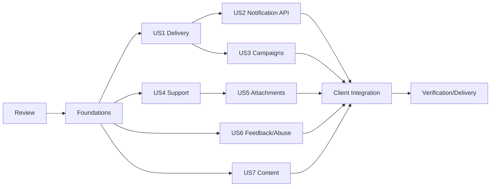

# Tasks: Notifications, Support & Content

**Input**: [spec.md](spec.md), [plan.md](plan.md), [research.md](research.md),
[data-model.md](data-model.md), [contracts/](contracts/), and
[quickstart.md](quickstart.md)  
**Tests**: Required for every changed behavior. Each implementation package begins
with a failing focused check and ends with fresh focused verification.  
**Scope**: SPEC-BE-011 only; direct synchronized `main`; preserve unrelated work.

## Phase 1: Existing Project, Dependency, and Contract Review

- [x] T001 Record fetched `main`/`origin/main` SHA, branch, remote, dirty state, protected untracked paths, Constitution version, Master Plan Phase 11 boundary, and CI 33910883029 evidence in `apps/api/specs/011-notifications-support-content/evidence/baseline.md`
- [x] T002 Inspect SPEC-BE-001 through SPEC-BE-010 implementation, task ledgers, migrations, tests, evidence, and remote closeouts; record exact reusable/local/external dependency status in `apps/api/specs/011-notifications-support-content/evidence/dependencies.md`
- [x] T003 [P] Inventory platform database/outbox/queue/worker/HTTP/Storage/config/observability patterns and record reused paths/contracts in `apps/api/specs/011-notifications-support-content/evidence/platform-patterns.md`
- [x] T004 [P] Inventory profile/device/push-token crypto, RBAC, MFA, audit, support-grant, idempotency, file-security, and privacy-export patterns in `apps/api/specs/011-notifications-support-content/evidence/security-patterns.md`
- [x] T005 [P] Inventory SPEC-BE-005 through SPEC-BE-010 event envelopes without modifying their owned business events in `apps/api/specs/011-notifications-support-content/evidence/domain-events.md`
- [x] T006 [P] Inventory Mobile notification/support/content contracts, repositories, mocks, platform push behavior, screens, tests, local persistence, and hardcoded articles in `apps/api/specs/011-notifications-support-content/evidence/mobile-baseline.md`
- [x] T007 [P] Inventory Admin communications contracts, OpenAPI, repositories, handlers, permissions, pages, tests, no-ops, campaign scheduling, and content immediate-publish behavior in `apps/api/specs/011-notifications-support-content/evidence/admin-baseline.md`
- [x] T008 Validate `contracts/openapi.yaml`, cross-reference its 46 operations against current clients, and record gaps without implementation in `apps/api/specs/011-notifications-support-content/evidence/contract-inventory.md`
- [x] T009 Run read-only `speckit-analyze` after this task ledger exists; after the report completes, resolve every critical artifact conflict before implementation and record the report/remediation in `apps/api/specs/011-notifications-support-content/evidence/artifact-analysis.md`
- [x] T010 Commit only the reviewed Phase 11 specification/plan/tasks artifacts with a narrow `docs(engagement): specify phase 11` commit and record the SHA in `apps/api/specs/011-notifications-support-content/evidence/commits.md`

## Phase 2: Foundational Database and Module Boundaries

- [x] T011 Add failing pgTAP structure/constraint/index/trigger tests for all 14 owned tables in `supabase/tests/044_phase11_notifications.sql`, `supabase/tests/045_phase11_support.sql`, and `supabase/tests/046_phase11_content_feedback.sql`
- [x] T012 Add failing ownership/scope tests forbidding SPEC-BE-012+ objects/events/jobs and duplicate prior-Spec infrastructure in `apps/api/test/security/engagement/engagement-scope.security.spec.ts`
- [x] T013 Implement ordered immutable notification/template/preference/campaign/delivery tables, constraints, indexes, version triggers, and reviewed seeds in `supabase/migrations/20260905010000_phase11_notifications.sql`
- [x] T014 Implement ordered support category/ticket/message/private-note/attachment tables, constraints, indexes, triggers, Storage policies, and reviewed category seeds in `supabase/migrations/20260905020000_phase11_support.sql`
- [x] T015 Implement ordered feedback/abuse/content/translation tables, constraints, indexes, triggers, and reviewed bilingual content seeds in `supabase/migrations/20260905030000_phase11_content_feedback.sql`
- [x] T016 Add failing pgTAP grants/RLS/function tests for customer, non-owner, anonymous, Admin, worker, note, attachment, feedback/abuse, and published/draft content matrices in `supabase/tests/047_phase11_rls_grants.sql`
- [x] T017 Implement guarded Phase 11 functions, least grants, forced RLS, exact existing permission reuse, and safe publication policies in `supabase/migrations/20260905040000_phase11_functions_access.sql`
- [x] T018 Update and verify immutable migration checksums in `supabase/migration-checksums.sha256`
- [x] T019 [P] Add failing environment/config tests for provider/scanner/batch/rate/retry/upload/reopen/approval bounds and secret redaction in `apps/api/test/unit/engagement/engagement-config.spec.ts`
- [x] T020 Implement only required validated Phase 11 runtime settings in `apps/api/src/platform/config/environment.schema.ts`, `apps/api/src/platform/config/environment.types.ts`, and `apps/api/.env.example`
- [x] T021 [P] Add failing module wiring and OpenAPI-tag tests in `apps/api/test/contract/engagement/engagement-module.contract-spec.ts`
- [x] T022 Create the minimum `apps/api/src/engagement/engagement.module.ts`, repository/DTO/schema/event/observability seams and wire them in `apps/api/src/app.module.ts` and `apps/api/src/worker.module.ts`
- [x] T023 Add Phase 11 focused npm commands without adding a dependency in `apps/api/package.json`
- [x] T024 Run clean reset, lint, all Phase 11 pgTAP, checksum, scope, config, and module tests; record exact results in `apps/api/specs/011-notifications-support-content/evidence/foundations.md`
- [x] T025 Commit the passing foundational migration/module boundary as a narrow `feat(engagement): add phase 11 foundations` commit and record its SHA in `apps/api/specs/011-notifications-support-content/evidence/commits.md`

## Phase 3: User Story 1 — Private, Preference-Aware Delivery (P1)

**Goal**: consume owned-domain events and create safe locale/preference-aware in-app/push/email delivery without blocking source transactions.  
**Independent test**: replay an owned event across locales, quiet hours/DST, token states, provider outcomes, and outages; prove safe payloads, logical dedupe, and source transaction isolation.

- [x] T026 [P] [US1] Add failing template registry, scalar-variable, locale/fallback, escaping, header-injection, output-bound, and lock-screen redaction tests in `apps/api/test/unit/engagement/notification-renderer.spec.ts`
- [x] T027 [P] [US1] Add failing full preference matrix, IANA zone, midnight, weekday, DST gap/fold, defer/expiry, and in-app preservation tests in `apps/api/test/unit/engagement/notification-policy.spec.ts`
- [x] T028 [P] [US1] Add failing source-event allowlist/version/future-SPEC-BE-012 exclusion and safe-event envelope tests in `apps/api/test/contract/engagement/notification-events.contract-spec.ts`
- [x] T029 [P] [US1] Add failing Expo, APNs, FCM, SMTP, and deterministic provider payload/result/timeout/secret-redaction tests in `apps/api/test/unit/engagement/notification-providers.spec.ts`
- [x] T030 [US1] Implement code-owned event/template/variable/route/sensitivity registry and safe bilingual renderer in `apps/api/src/engagement/notification.renderer.ts`
- [x] T031 [US1] Implement complete preference and quiet-hour/DST policy using native `Intl` with injected clock in `apps/api/src/engagement/notification.policy.ts`
- [x] T032 [US1] Implement strict source-event/provider/result schemas and safe DTO allowlists in `apps/api/src/engagement/engagement.schemas.ts` and `apps/api/src/engagement/engagement.dto.ts`
- [x] T033 [US1] Implement injected deterministic provider plus Expo/APNs/FCM adapters with token decryption limited to send scope in `apps/api/src/engagement/notification.providers.ts`
- [x] T034 [US1] Reuse/extract the minimum TLS-only Nodemailer transport behavior for notification email without changing Phase 10 semantics in `apps/api/src/engagement/notification.providers.ts` and `apps/api/src/reports/reports.smtp.ts`
- [x] T035 [P] [US1] Add failing live database integration tests for template selection, event/delivery atomic creation, preference suppression, unique dedupe, expiry, and concurrent replay in `apps/api/test/integration/engagement/notification-create.integration.spec.ts`
- [x] T036 [US1] Implement registered event consumption, template lookup, preference load, atomic in-app event/delivery creation, and safe outbox writes in `apps/api/src/engagement/engagement.repository.ts` and `apps/api/src/engagement/notification.service.ts`
- [x] T037 [P] [US1] Add failing worker tests for batch claim, lease/fence, provider acceptance/retry/terminal/ambiguous result, token revocation, expiry, circuit/backlog, and crash replay in `apps/api/test/integration/engagement/notification-dispatch.integration.spec.ts`
- [x] T038 [US1] Implement `notification.dispatch`, `notification.delivery.retry`, and `notification.expire` handlers with bounded claims/retries/suppression in `apps/api/src/engagement/engagement.worker.ts`
- [x] T039 [P] [US1] Add failing domain-transaction outage tests proving notification providers are never called inside ledger/planning/tracking/AI/report transactions in `apps/api/test/security/engagement/provider-isolation.security.spec.ts`
- [x] T040 [US1] Register Phase 11 worker consumers after source commit and preserve prior domain ownership in `apps/api/src/worker.module.ts` and `apps/api/src/engagement/engagement.worker.ts`
- [x] T041 [P] [US1] Add failing metric/log tests for bounded labels, safe error classes, no payload/token/content logging, and provider/circuit alerts in `apps/api/test/security/engagement/engagement-observability.security.spec.ts`
- [x] T042 [US1] Implement fixed-cardinality delivery/provider/unread metrics and redacted structured logging in `apps/api/src/engagement/engagement.observability.ts`
- [x] T043 [US1] Run all US1 unit/contract/integration/security/outage/replay tests and record results in `apps/api/specs/011-notifications-support-content/evidence/us1-delivery.md`
- [x] T044 [US1] Verify the exact lock-screen/provider payload snapshots contain only event ID, safe title/body, and route key; record redacted evidence in `apps/api/specs/011-notifications-support-content/evidence/provider-payloads.md`
- [x] T045 [US1] Commit the passing US1 delivery slice with a narrow `feat(notifications): add safe asynchronous delivery` commit and record its SHA in `apps/api/specs/011-notifications-support-content/evidence/commits.md`

## Phase 4: User Story 2 — Notification Read and Action Flows (P1)

**Goal**: provide owner-safe cursor list/detail/unread/read/action/expiry flows.  
**Independent test**: traverse equal-time pages and replay valid/invalid/expired/foreign/stale actions with no duplicate or disclosure.

- [x] T046 [P] [US2] Add failing HTTP/OpenAPI tests for list/detail/read/action/preferences routes, cursor/page bounds, strict DTOs, versions, idempotency, and safe errors in `apps/api/test/contract/engagement/notifications-http.contract-spec.ts`
- [x] T047 [P] [US2] Add failing live owner/non-owner pagination, equal timestamp, unread count, read/unread replay, expiry, and action atomicity tests in `apps/api/test/integration/engagement/notification-api.integration.spec.ts`
- [x] T048 [P] [US2] Add failing BOLA/property-auth/mass-assignment/revoked-session/route-key tests in `apps/api/test/security/engagement/notifications-api.security.spec.ts`
- [x] T049 [US2] Implement stable cursor list/detail/unread queries and guarded read/action/idempotency repository commands in `apps/api/src/engagement/engagement.repository.ts`
- [x] T050 [US2] Implement owner notification orchestration, protected target resolution, expiry/version/action checks, and safe results in `apps/api/src/engagement/notification.service.ts`
- [x] T051 [US2] Implement customer notification and preference endpoints in `apps/api/src/engagement/notification.controller.ts`
- [x] T052 [US2] Generate runtime decorators/schemas for every notification operation and make the OpenAPI drift check consume `apps/api/specs/011-notifications-support-content/contracts/openapi.yaml`
- [x] T053 [P] [US2] Add Realtime contract/security tests proving safe invalidation IDs only in `apps/api/test/security/engagement/engagement-realtime.security.spec.ts`
- [x] T054 [US2] Run all US2 contract/integration/security/Realtime tests and record results in `apps/api/specs/011-notifications-support-content/evidence/us2-notification-api.md`
- [x] T055 [US2] Commit the passing US2 API slice with a narrow `feat(notifications): add owner read and action APIs` commit and record its SHA in `apps/api/specs/011-notifications-support-content/evidence/commits.md`

## Phase 5: User Story 3 — Templates and Bounded Campaigns (P1)

**Goal**: exact-permission template lifecycle and independently approved, bounded, asynchronous one-time campaigns.  
**Independent test**: reject unsafe templates/audiences/self-approval/stale previews and prove replay-safe batches, rates, pause/resume/cancel.

- [x] T056 [P] [US3] Add failing template lifecycle/immutability/MFA/audit/variable/test/publish/retire integration tests in `apps/api/test/integration/engagement/templates-admin.integration.spec.ts`
- [x] T057 [P] [US3] Add failing audience grammar/bounds/aggregate-only preview/version/expiry/no-SQL tests in `apps/api/test/unit/engagement/campaign-audience.spec.ts`
- [x] T058 [P] [US3] Add failing campaign lifecycle/schedule/creator-approver/permission/MFA/audit/version/idempotency tests in `apps/api/test/integration/engagement/campaign-admin.integration.spec.ts`
- [x] T059 [P] [US3] Add failing 100k-audience keyset batch, duplicate-user, replay, pause-mid-batch, resume, cancel, rate, crash, and completion reconciliation tests in `apps/api/test/integration/engagement/campaign-worker.integration.spec.ts`
- [x] T060 [P] [US3] Add failing Admin OpenAPI/strict DTO/redacted preview/delivery status tests in `apps/api/test/contract/engagement/notifications-admin.contract-spec.ts`
- [x] T061 [US3] Implement guarded template create/test/publish/retire repository functions and immutable version reads in `apps/api/src/engagement/engagement.repository.ts`
- [x] T062 [US3] Implement strict bounded audience parser, aggregate preview hash/version/expiry, and keyset query builder with fixed server clauses in `apps/api/src/engagement/campaign.service.ts`
- [x] T063 [US3] Implement campaign create/approve/schedule/send/pause/resume/cancel orchestration and threshold separation in `apps/api/src/engagement/campaign.service.ts`
- [x] T064 [US3] Implement template/campaign/preview/delivery/retry Admin endpoints with exact permissions/MFA/audit in `apps/api/src/engagement/notification.admin.controller.ts`
- [x] T065 [US3] Implement bounded `notification.campaign.expand` claims, rates, version/pause/cancel checks, unique inserts, and completion reconciliation in `apps/api/src/engagement/engagement.worker.ts`
- [x] T066 [P] [US3] Add injection/BFLA/audience-enumeration/provider-field/self-approval negative tests in `apps/api/test/security/engagement/campaigns.security.spec.ts`
- [x] T067 [US3] Add campaign/template/delivery metrics and alerts without audience or user labels in `apps/api/src/engagement/engagement.observability.ts` and `ops/alerts/engagement-alerts.yml`
- [x] T068 [US3] Verify no arbitrary SQL, expression, URL, expanded-user list, recurring campaign, or `content.publish.schedule` job exists using `apps/api/test/security/engagement/engagement-scope.security.spec.ts`
- [x] T069 [US3] Run all US3 unit/contract/integration/security/batch/replay tests and record results in `apps/api/specs/011-notifications-support-content/evidence/us3-campaigns.md`
- [x] T070 [US3] Record safe preview/approval/audit evidence and campaign bounds/rate configuration in `apps/api/specs/011-notifications-support-content/evidence/campaign-governance.md`
- [x] T071 [US3] Commit the passing US3 campaign slice with a narrow `feat(campaigns): add bounded approved delivery` commit and record its SHA in `apps/api/specs/011-notifications-support-content/evidence/commits.md`

## Phase 6: User Story 4 — Customer and Admin Support (P1)

**Goal**: owner-safe tickets/messages with exact Admin assignment/priority/reply/note/status and explicit transitions.  
**Independent test**: execute every allowed/denied customer/Admin transition and prove internal notes absent from every customer channel.

- [x] T072 [P] [US4] Add failing support category/ticket/message/state/close/reopen pgTAP command tests in `supabase/tests/048_phase11_support_commands.sql`
- [x] T073 [P] [US4] Add failing customer support HTTP/OpenAPI/cursor/idempotency/version/safe-error tests in `apps/api/test/contract/engagement/support-http.contract-spec.ts`
- [x] T074 [P] [US4] Add failing Admin support category/ticket/assign/priority/reply/status/note OpenAPI and strict DTO tests in `apps/api/test/contract/engagement/support-admin.contract-spec.ts`
- [x] T075 [P] [US4] Add failing live owner/non-owner category/ticket/message/equal-time cursor/concurrent reply/close/reopen tests in `apps/api/test/integration/engagement/support-api.integration.spec.ts`
- [x] T076 [P] [US4] Add failing exact permission, recent-MFA, support-grant, assignment, priority, reply, resolve, close/reopen, audit/outbox atomicity tests in `apps/api/test/integration/engagement/support-admin.integration.spec.ts`
- [x] T077 [P] [US4] Add failing internal-note isolation tests across RLS, customer SQL/API/DTO/export/Realtime/log/cache/search/download and Admin-without-notes permission in `apps/api/test/security/engagement/internal-notes.security.spec.ts`
- [x] T078 [US4] Implement guarded category/ticket/message/list/detail/transition repository functions with stable cursors and exact locking in `apps/api/src/engagement/engagement.repository.ts`
- [x] T079 [US4] Implement ticket state machine, reply transitions, close/reopen, version/idempotency, safe mapping, and atomic audit/outbox in `apps/api/src/engagement/support.service.ts`
- [x] T080 [US4] Implement customer category/ticket/message/close/reopen endpoints with owner-only DTOs in `apps/api/src/engagement/support.controller.ts`
- [x] T081 [US4] Implement Admin category/ticket/assignment/priority/reply/status endpoints with exact permission/MFA/audit in `apps/api/src/engagement/support.admin.controller.ts`
- [x] T082 [US4] Implement dedicated Admin-only internal-note repository/DTO/endpoint without sharing customer serializers in `apps/api/src/engagement/support.admin.controller.ts` and `apps/api/src/engagement/engagement.repository.ts`
- [x] T083 [P] [US4] Add BOLA/BFLA/property/mass-assignment/sender/status/assignee/priority/internal-visibility injection tests in `apps/api/test/security/engagement/support-api.security.spec.ts`
- [x] T084 [US4] Add safe ticket response/age/status/permission-denial metrics and linked alerts in `apps/api/src/engagement/engagement.observability.ts` and `ops/alerts/engagement-alerts.yml`
- [x] T085 [US4] Run all US4 pgTAP/contract/integration/security/concurrency/Realtime/export tests and record results in `apps/api/specs/011-notifications-support-content/evidence/us4-support.md`
- [x] T086 [US4] Run a static response/log/export field scan and record zero internal-note leakage in `apps/api/specs/011-notifications-support-content/evidence/internal-note-isolation.md`
- [x] T087 [US4] Commit the passing US4 support slice with a narrow `feat(support): add private ticket workflows` commit and record its SHA in `apps/api/specs/011-notifications-support-content/evidence/commits.md`

## Phase 7: User Story 5 — Quarantined Attachments (P1)

**Goal**: signed server-key uploads, verified finalization, malware scanning, clean-only download, and secure rejection deletion.  
**Independent test**: exercise malicious/key/hash/size/type/magic/scan/replay/cross-user cases and prove only clean files are available.

- [x] T088 [P] [US5] Add failing server-key, signed upload, finalize, metadata/hash/size/type/participant, TTL, and clean-download Storage tests in `apps/api/test/security/engagement/support-storage.security.spec.ts`
- [x] T089 [P] [US5] Add failing scanner INSTREAM framing, byte/time/decompression bounds, clean/malware/mismatch/unavailable outcomes, and secret/log tests in `apps/api/test/unit/engagement/support-scanner.spec.ts`
- [x] T090 [P] [US5] Add failing live attachment initialize/finalize/scan/download/reject/delete/replay/orphan/crash integration tests in `apps/api/test/integration/engagement/support-attachments.integration.spec.ts`
- [x] T091 [P] [US5] Add failing filename control/bidi/path, MIME/magic mismatch, zero/oversize, hash mismatch, malicious fixture, pending/failed/rejected/foreign download tests in `apps/api/test/security/engagement/support-attachments.security.spec.ts`
- [x] T092 [US5] Implement strict existing-bucket key validation, signed upload/metadata/head/stream/sign/delete behavior in `apps/api/src/engagement/support.storage.ts`
- [x] T093 [US5] Implement injected deterministic scanner and bounded ClamAV INSTREAM adapter using `node:net` in `apps/api/src/engagement/support.scanner.ts`
- [x] T094 [US5] Implement participant-authorized upload initialization/finalize/message binding and clean-only download orchestration in `apps/api/src/engagement/support.service.ts` and `apps/api/src/engagement/support.controller.ts`
- [x] T095 [US5] Implement bounded `support-attachment.scan` claim/verify/scan/retry/reject/delete and orphan quarantine cleanup in `apps/api/src/engagement/engagement.worker.ts`
- [x] T096 [P] [US5] Add attachment API OpenAPI drift and forbidden scan/key/raw filename fields to `apps/api/test/contract/engagement/support-http.contract-spec.ts`
- [x] T097 [US5] Add scan/backlog/result/delete/reconciliation metrics and alerts without filename/object labels in `apps/api/src/engagement/engagement.observability.ts` and `ops/alerts/engagement-alerts.yml`
- [x] T098 [US5] Run all US5 unit/contract/integration/security/recovery tests and record results in `apps/api/specs/011-notifications-support-content/evidence/us5-attachments.md`
- [x] T099 [US5] Record clean/malware/mismatch/rejection/deletion evidence using synthetic fixtures only in `apps/api/specs/011-notifications-support-content/evidence/attachment-security.md`
- [x] T100 [US5] Commit the passing US5 attachment slice with a narrow `feat(support): quarantine and scan attachments` commit and record its SHA in `apps/api/specs/011-notifications-support-content/evidence/commits.md`

## Phase 8: User Story 6 — Feedback and Abuse Review (P2)

**Goal**: owner-safe typed feedback and non-disclosing, duplicate-safe abuse reporting with exact Admin workflows.  
**Independent test**: race duplicate reports and exercise owner/Admin state/permission/disclosure cases with consistent audit.

- [x] T101 [P] [US6] Add failing feedback/abuse pgTAP constraint, transition, duplicate-active race, RLS, and grants tests in `supabase/tests/049_phase11_feedback_abuse.sql`
- [x] T102 [P] [US6] Add failing customer/Admin feedback and abuse HTTP/OpenAPI/strict DTO/idempotency/version/safe receipt tests in `apps/api/test/contract/engagement/feedback-abuse.contract-spec.ts`
- [x] T103 [P] [US6] Add failing owner/non-owner/type/state/assignment/review/action/dismiss/audit/outbox integration tests in `apps/api/test/integration/engagement/feedback-abuse.integration.spec.ts`
- [x] T104 [P] [US6] Add failing BOLA/BFLA/resource/reporter enumeration, mass assignment, duplicate timing, wrong permission, and MFA tests in `apps/api/test/security/engagement/feedback-abuse.security.spec.ts`
- [x] T105 [US6] Implement owner-safe feedback/abuse list/detail/create and database duplicate-safe commands in `apps/api/src/engagement/engagement.repository.ts`
- [x] T106 [US6] Implement customer feedback/abuse endpoints and safe duplicate/unavailable receipts in `apps/api/src/engagement/feedback.controller.ts`
- [x] T107 [US6] Implement exact-permission/MFA/audit Admin assignment/review/action/dismiss endpoints in `apps/api/src/engagement/feedback.admin.controller.ts`
- [x] T108 [US6] Publish only `feedback.received` safe metadata and add bounded workflow/denial metrics in `apps/api/src/engagement/engagement.events.ts` and `apps/api/src/engagement/engagement.observability.ts`
- [x] T109 [US6] Run all US6 pgTAP/contract/integration/security/concurrency tests and record results in `apps/api/specs/011-notifications-support-content/evidence/us6-feedback-abuse.md`
- [x] T110 [US6] Record reporter/resource disclosure and duplicate-race evidence in `apps/api/specs/011-notifications-support-content/evidence/abuse-isolation.md`
- [x] T111 [US6] Commit the passing US6 moderation slice with a narrow `feat(feedback): add owner-safe review workflows` commit and record its SHA in `apps/api/specs/011-notifications-support-content/evidence/commits.md`

## Phase 9: User Story 7 — Published Localized Content (P1)

**Goal**: Arabic/English articles, FAQs, policies, and announcements with draft/review/immediate-publish/retire and published-only cached customer reads.  
**Independent test**: traverse locale/type/search/cache lifecycles and prove drafts/retired content absent from RLS/API/search/cache/Realtime.

- [x] T112 [P] [US7] Add failing content/translation lifecycle, locale completeness, key/type/state, RLS/grant, publish/retire tests in `supabase/tests/050_phase11_content_commands.sql`
- [x] T113 [P] [US7] Add failing customer published list/detail/locale/type/search/cursor/fallback/OpenAPI tests in `apps/api/test/contract/engagement/content-http.contract-spec.ts`
- [x] T114 [P] [US7] Add failing Admin create/translation/review/publish/retire/version/permission/MFA/audit OpenAPI tests in `apps/api/test/contract/engagement/content-admin.contract-spec.ts`
- [x] T115 [P] [US7] Add failing five-minute locale/type/version/query cache hit/miss/fallback/invalidation/storm tests in `apps/api/test/unit/engagement/content-cache.spec.ts`
- [x] T116 [P] [US7] Add failing live draft/review/published/retired, concurrent publish/retire, locale fallback, search, audit/outbox integration tests in `apps/api/test/integration/engagement/content.integration.spec.ts`
- [x] T117 [P] [US7] Add failing draft/retired leakage across RLS/API/search/cache/Realtime/log and stored-XSS/control/injection tests in `apps/api/test/security/engagement/content.security.spec.ts`
- [x] T118 [US7] Implement published-only locale/type/search/cursor repository queries and guarded Admin lifecycle functions in `apps/api/src/engagement/engagement.repository.ts`
- [x] T119 [US7] Implement native bounded locale/version content cache and invalidation with database fallback in `apps/api/src/engagement/content.service.ts`
- [x] T120 [US7] Implement published-only customer content endpoints in `apps/api/src/engagement/content.controller.ts`
- [x] T121 [US7] Implement exact-permission/MFA/audit Admin content/translation/review/immediate-publish/retire endpoints in `apps/api/src/engagement/content.admin.controller.ts`
- [x] T122 [US7] Publish safe `content.published/retired` invalidation envelopes and explicitly omit scheduled publishing in `apps/api/src/engagement/engagement.events.ts`
- [x] T123 [US7] Add cache/publication/search/permission metrics and alerts without content/user labels in `apps/api/src/engagement/engagement.observability.ts` and `ops/alerts/engagement-alerts.yml`
- [x] T124 [US7] Run all US7 pgTAP/unit/contract/integration/security/cache/Realtime tests and record results in `apps/api/specs/011-notifications-support-content/evidence/us7-content.md`
- [x] T125 [US7] Record published-only and no-schedule evidence in `apps/api/specs/011-notifications-support-content/evidence/content-isolation.md`
- [x] T126 [US7] Commit the passing US7 content slice with a narrow `feat(content): publish localized help safely` commit and record its SHA in `apps/api/specs/011-notifications-support-content/evidence/commits.md`

## Phase 10: Mobile and Admin Integration

- [x] T127 [P] Add failing Mobile live notification adapter tests for list/detail/read/action/preferences/cursors/idempotency/safe errors/protected routes in `apps/mobile/src/services/contracts/notifications-live-contract.test.ts`
- [x] T128 [P] Add failing Mobile live support/content adapter tests for categories/tickets/messages/uploads/downloads/drafts/published help/locale/offline errors in `apps/mobile/src/services/contracts/support-content-live-contract.test.ts`
- [x] T129 Implement one live-capable Mobile engagement adapter and capability wiring without changing production selection in `apps/mobile/src/services/live/engagement-service.ts` and `apps/mobile/src/services/contracts/assistant-notifications-service.ts`
- [x] T130 Replace applicable Mobile service-level placeholder/no-op notification/support/content paths while preserving platform permission UX and explicit mock/demo mode in `apps/mobile/src/features/notifications/`, `apps/mobile/src/features/support/`, and `apps/mobile/src/storage/`
- [x] T131 Remove hardcoded production help-article selection in favor of the published-content adapter while preserving test fixtures in `apps/mobile/src/features/support/support-queries.ts`
- [x] T132 [P] Add Mobile forbidden-persistence/static boundary tests for tokens/provider/note/quarantine/signed URLs/unsafe routes in `apps/mobile/scripts/check-assistant-notifications-boundaries.test.mjs`
- [x] T133 [P] Add failing Admin repository/Zod/OpenAPI tests for all Phase 11 operations, exact enums, cursors, safe fields, stale versions, and errors in `apps/admin-web/src/features/communications/repository.test.ts` and `apps/admin-web/src/features/communications/contracts.test.ts`
- [x] T134 Align Admin communications contracts/repository/hooks with the Phase 11 APIs and replace owned no-op handlers without enabling production MSW fallback in `apps/admin-web/src/features/communications/contracts.ts`, `apps/admin-web/src/features/communications/repository.ts`, and `apps/admin-web/src/features/communications/hooks.ts`
- [x] T135 [P] Extend Admin browser tests for templates/campaigns/deliveries/support/notes/attachments/feedback/abuse/content, exact roles, RTL/LTR, keyboard, and five viewports in `apps/admin-web/tests/e2e/support-content-notifications.spec.ts`
- [x] T136 Run focused Mobile type/lint/Jest and Admin type/lint/Vitest/build/Playwright/accessibility tests; record results and explicit Phase 14 provider-selection boundary in `apps/api/specs/011-notifications-support-content/evidence/client-integration.md`
- [x] T137 Commit the passing client-parity slice with a narrow `feat(clients): connect phase 11 engagement adapters` commit and record its SHA in `apps/api/specs/011-notifications-support-content/evidence/commits.md`

## Phase 11: Performance, Recovery, Operations, Reviews, and Delivery

- [x] T138 [P] Add production-like notification/ticket/campaign/content seeds and `EXPLAIN (ANALYZE, BUFFERS, FORMAT JSON)` assertions in `apps/api/test/performance/engagement/engagement-queries.sql`
- [x] T139 [P] Add notification/ticket list, 100k campaign expansion, provider slowdown/outage, scan backlog, cache cold/warm/invalidation, and recovery stress tests in `apps/api/test/performance/engagement/engagement.performance.spec.ts`
- [x] T140 Add/run `test:performance:engagement` and `test:stress:engagement`; prove list <=400/800 ms P95/P99, DB <=50 ms P95, Admin <=500/1000 ms, bounded payload/memory/batches, and record exact results in `apps/api/specs/011-notifications-support-content/evidence/performance.md`
- [x] T141 [P] Create fixed-cardinality Phase 11 dashboard panels in `ops/observability/engagement-dashboard.json`
- [x] T142 [P] Complete actionable Phase 11 alerts with thresholds/windows/severity/runbook links in `ops/alerts/engagement-alerts.yml`
- [x] T143 [P] Write provider outage/replay/token/campaign runbooks in `ops/runbooks/engagement-delivery.md` and `ops/runbooks/engagement-campaigns.md`
- [x] T144 [P] Write attachment quarantine/malware/delete and note/draft privacy incident runbooks in `ops/runbooks/engagement-files.md` and `ops/runbooks/engagement-privacy.md`
- [x] T145 [P] Write migration/rollback/reapply/restore/reconciliation and external provider/device validation runbooks in `ops/runbooks/engagement-recovery.md` and `ops/runbooks/engagement-providers.md`
- [x] T146 Run migration failure/forward fix, rollback/reapply, N-1 API/worker, queue/lease crash replay, provider/scanner/storage outage, orphan cleanup, backup/restore, and reconciliation rehearsals; record exact results in `apps/api/specs/011-notifications-support-content/evidence/recovery.md`
- [x] T147 Run deterministic Expo/APNs/FCM/email/scanner success/failure/timeout/ambiguous/recovery suites and record simulation-only results plus genuine external gates in `apps/api/specs/011-notifications-support-content/evidence/provider-validation.md`
- [x] T148 Run full API `verify`, db reset/lint/pgTAP, engagement performance/stress/recovery, container, dependency, secret, SAST, image/CVE/SBOM, Mobile, and Admin suites; record every exact command/result in `apps/api/specs/011-notifications-support-content/evidence/local-verification.md`
- [x] T149 Run `speckit-converge`, append every valid missing task to this file, complete each appended task, rerun affected verification, and record results in `apps/api/specs/011-notifications-support-content/evidence/convergence.md`
- [x] T150 Run Clean Code/SOLID/DRY/KISS/YAGNI and ownership review on the complete diff; fix findings and record evidence in `apps/api/specs/011-notifications-support-content/evidence/clean-code-review.md`
- [x] T151 Run test-quality review for false positives, mocked-away behavior, nondeterminism, missing negative assertions, and truthful provider claims; fix findings and record evidence in `apps/api/specs/011-notifications-support-content/evidence/test-review.md`
- [x] T152 Run security diff scan plus Phase 11 RLS/BOLA/BFLA/template/file/secret/privacy threat-boundary review; fix every Critical/High and record evidence in `apps/api/specs/011-notifications-support-content/evidence/security-review.md`
- [x] T153 Run verification-before-completion against all 35 FRs, 16 ACs, 10 SCs, task ledger, DoD, protected paths, and SPEC-BE-012+ exclusion; record traceability in `apps/api/specs/011-notifications-support-content/evidence/acceptance.md`
- [ ] T154 Commit the fully verified implementation/evidence as a narrow `test(engagement): verify phase 11` commit, push scoped commits directly to `origin/main` without force, and record push SHA/status in `apps/api/specs/011-notifications-support-content/evidence/commits.md`
- [ ] T155 Monitor every resulting remote workflow, diagnose/fix all locally actionable failures with forward commits, and record successful CI run/job URLs/results in `apps/api/specs/011-notifications-support-content/evidence/remote.md`
- [ ] T156 Create final closeout evidence with implementation/closeout SHAs, push/CI, task/FR/AC/SC counts, exact tests, domain/security/privacy/performance/recovery/provider evidence, genuine external gates, protected paths, and SPEC-BE-012+ exclusion in `apps/api/specs/011-notifications-support-content/evidence/phase11-closeout.md`
- [ ] T157 Commit and push the closeout-only successor on `main`, monitor its remote workflow, update non-self-referential SHA references as established by Phase 10, and mark the goal complete only after every locally executable blocker is green

## Dependencies

- Phase 1 -> Phase 2 -> all user stories.
- US1 (delivery core) -> US2 notification API and US3 campaigns.
- US4 support -> US5 attachments.
- US6 feedback/abuse and US7 content depend only on foundations and may proceed
  after Phase 2; final integration waits for all user stories.
- Phase 10 client integration waits for stable US1-US7 HTTP/OpenAPI contracts.
- Phase 11 performance/recovery/reviews/delivery waits for all implementation and
  client integration; convergence may append work before final reviews.

## Parallel Examples

- After foundations, US1 renderer/policy/provider tests are parallel; US4 support,
  US6 feedback/abuse, and US7 content test design can also proceed independently.
- Within US3, audience unit, lifecycle integration, worker batching, contract, and
  security tests touch separate files before implementation.
- Within US4/US5, customer contracts, Admin contracts, database integration,
  privacy security, Storage, and scanner tests are independent.
- Mobile and Admin contract tests run in parallel after stable server OpenAPI.
- Performance fixtures, dashboards, alerts, and runbooks are parallel before the
  integrated verification/review/commit sequence.

## Implementation Strategy

The first deliverable is the safe event-to-in-app/deterministic-provider slice
(US1), then owner read/action (US2). Campaigns, support/attachments, feedback/
abuse, and content follow as separately verified slices. No slice is declared
complete while its database, contract, security, and failure-path tests fail.

The minimum architecture remains one engagement module, existing platform
primitives, native runtime features, installed dependencies, and the 14 mandated
tables. Add an abstraction/file only for a distinct current trust boundary; do
not scaffold SPEC-BE-012+ or generic operations.

## Format Validation

All executable tasks use `- [ ] TNNN`, user-story tasks include `[USN]`, `[P]` is
used only for different-file independent work, and every task names an exact path.
