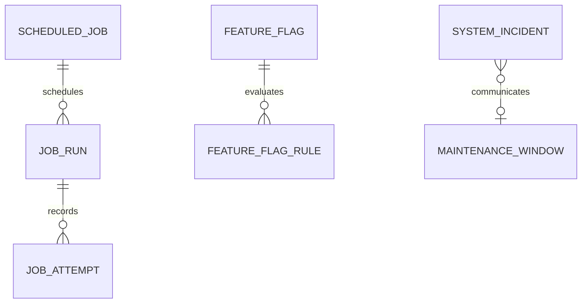

# Backend Feature Specification: Performance, Caching, Observability & Operations

**Phase / Spec**: Phase 13 / SPEC-BE-013 of 014
**Working Branch**: `main`
**Feature Directory**: `apps/api/specs/013-performance-caching-observability-operations`
**Base Revision**: `2e2bf13f409e4a891fc3d8072cf07a26d7685392`
**Created**: 2026-09-06
**Status**: Draft
**Input**: "Harden the Free-only Masarifi MVP with governed scheduling, operational visibility, safe configuration, performance and cache governance, and verified recovery for implemented Specs 001-011."

## Objective and Scope

Provide one production-operable control plane for the Free-only Masarifi MVP. Operators must be able to see service and provider health, queues, workers, governed schedules and execution history; manage incidents, safe versioned settings, feature flags, and maintenance windows; inspect bounded performance and recovery evidence; and expose only safe resolved configuration to Mobile.

SPEC-BE-013 owns scheduling governance and operational visibility. The domain Specs continue to own their business job behavior, financial rules, user data, provider calls, and domain reconciliation. This Spec validates the locally executable release requirements of SPEC-BE-001 through SPEC-BE-011. It does not activate reserved SPEC-BE-012 or implement SPEC-BE-014 cutover work.

The release profile is explicitly Free-only. Billing, Stripe, paid subscriptions, paid plans, upgrades, downgrades, checkout, paid entitlement, payment history, promotions, and billing reconciliation are excluded. The safe AI allowance remains five accepted AI work requests per user in a rolling 24-hour period unless a later approved configuration change remains within Free-only limits.

## Dependencies and Repository Baseline

- **Prior Specs**: SPEC-BE-001 through SPEC-BE-011; SPEC-BE-012 is reserved and deferred.
- **Current repository facts**: the client-remediation package is complete at `fcf7f7550088e83277bbf14afe7fd1a07f50a93f`; the Free-only governance checkpoint is `2e2bf13f409e4a891fc3d8072cf07a26d7685392`; GitHub Actions run `34023722052` passed; `main` and `origin/main` had zero divergence at specification start.
- **Existing platform capabilities reused**: private schemas, deny-by-default grants, RLS, Clerk identity, exact Admin permissions, recent-MFA enforcement, immutable audit, idempotency, queue/outbox claims, worker retry and lease patterns, bounded OpenTelemetry metrics, structured redacted logging, migration checksums, container gates, local Supabase recovery tests, and existing Admin repository seams.
- **Existing client boundary**: Admin operations and governance screens already call repository interfaces; test/demo fixtures remain test-only. Mobile uses typed capability-provider seams and must fail closed when a live capability is unavailable.
- **Protected user-owned paths**: `.agents/plugins/`, `apps/api/pnpm-lock.yaml`, `apps/api/pnpm-workspace.yaml`, `apps/api/supabase/`, and `apps/mobile/src/services/contracts/assistant-notifications-service.ts` are not owned by this Spec.
- **Governing documents**: Backend Constitution, Backend Master Plan, client-remediation plans, and the approved Free-only checkpoint.

## Owned Resources

SPEC-BE-013 owns:

- Private operational records for scheduled jobs, job runs, job attempts, provider health checks, system incidents, system settings, feature flags, feature-flag rules, and maintenance windows.
- Authoritative job registration and feature-flag evaluation contracts.
- The operational job family: `operations.provider-health`, `operations.capacity-evaluate`, `operations.cache-invalidate`, `operations.backup-verify`, `operations.restore-drill`, `operations.dr-rehearse`, `operations.maintenance-activate`, `operations.maintenance-complete`, and job-history retention.
- Scheduling metadata for implemented jobs owned by SPEC-BE-001 through SPEC-BE-011, without copying or redefining their business behavior.
- Bounded Admin operations, settings, feature-flag, maintenance, performance, and recovery read models plus allowlisted safe mutations.
- Safe Mobile-resolved configuration containing feature outcomes, maintenance status and public message, Free-only capability availability, and the AI allowance.
- Cross-domain performance budgets, cache inventory and invalidation evidence, operational metrics, dashboards, alerts, runbooks, backup/restore expectations, disaster-recovery procedure, and local recovery evidence.

The following remain owned elsewhere:

- Business job execution, user-facing domain state, and domain reconciliation remain with their originating Specs.
- Authentication, authorization, RLS, audit primitives, and support-access policy remain with SPEC-BE-002 and SPEC-BE-003.
- Queue/outbox transport and generic worker lifecycle remain with SPEC-BE-001.
- Ledger correctness and financial reconciliation remain with SPEC-BE-005.
- Offline mutation behavior remains with SPEC-BE-006.
- Provider-specific business calls remain with their domain Specs.
- Billing remains reserved to a future explicitly approved SPEC-BE-012 goal.
- Production cutover remains SPEC-BE-014.

No public table, Storage bucket, billing record, new provider integration, arbitrary job-execution endpoint, or downloadable backup is owned by this Spec.

## User Scenarios and Testing

### User Story 1 - Detect and Triage Operational Problems (Priority: P1)

An authorized operator sees a current, bounded summary of API, database, Storage, queue, worker, provider, incident, maintenance, and recovery health and can follow an actionable runbook without seeing secrets or customer data.

**Why this priority**: Safe diagnosis is required before production operation and reduces both outage duration and accidental disclosure.

**Independent Test**: Simulate healthy, degraded, unavailable, stale, and partial dependencies; verify stable statuses, bounded series, safe errors, freshness, incident links, and runbook references.

**Acceptance Scenarios**:

1. **Given** all core dependencies are healthy, **When** an authorized reader requests the health summary, **Then** every configured dependency reports a fresh status and core finance is available.
2. **Given** an optional provider is down, **When** health is requested, **Then** that provider is degraded or down while unrelated core finance remains available.
3. **Given** an internal provider error contains a credential, URL, payload, or personal value, **When** the check is recorded or returned, **Then** only an allowlisted safe error code is retained.
4. **Given** a series request exceeds its range or point limit, **When** it is submitted, **Then** it is rejected with a stable validation code and no unbounded query runs.

### User Story 2 - Govern Schedules and Execution History (Priority: P1)

An operator can inventory implemented jobs, inspect their ownership, schedule, status, bounded run and attempt history, and request only a declared-safe retry or cancellation.

**Why this priority**: Background work already exists across Specs 001-011 and needs one trustworthy operational view without duplicating business logic.

**Independent Test**: Register the full job inventory twice, claim work concurrently, complete and retry attempts, reject ownership conflicts, and verify safe history and audit records.

**Acceptance Scenarios**:

1. **Given** an existing job key, **When** its owner re-registers the same valid definition, **Then** registration is idempotent.
2. **Given** an existing job key, **When** another owner attempts registration, **Then** the operation fails and ownership is unchanged.
3. **Given** two workers claim the same due job, **When** claims race, **Then** at most one active attempt is created for that due execution.
4. **Given** a failed job that is not declared retry-safe, **When** an Admin requests retry, **Then** the request is rejected and audited.
5. **Given** a run result containing forbidden detail, **When** completion is recorded, **Then** the summary is rejected or reduced to the bounded safe form.

### User Story 3 - Manage Incidents and Maintenance Safely (Priority: P1)

An authorized operator can manage incident and maintenance lifecycles with optimistic versioning, recent MFA, reason text, immutable audit, and a safe public projection.

**Why this priority**: Operations need a controlled way to communicate service state without exposing internal diagnostics or allowing stale updates.

**Independent Test**: Exercise every valid transition, stale version, invalid time range, missing permission/MFA/reason, and concurrent mutation; verify public responses contain only safe messages.

**Acceptance Scenarios**:

1. **Given** a scheduled maintenance window, **When** its start time arrives, **Then** it becomes active once and Mobile receives only its bounded public scope and message.
2. **Given** an active maintenance window, **When** it ends, **Then** it becomes completed and no longer blocks unaffected capabilities.
3. **Given** a stale expected version, **When** an Admin updates an incident or maintenance window, **Then** the update fails without overwriting newer state.
4. **Given** an incident internal diagnosis, **When** Mobile requests status, **Then** no internal note, provider error, operator identity, or backup detail is returned.

### User Story 4 - Change Settings and Feature Flags Without Weakening Security (Priority: P1)

An authorized Admin can inspect safe setting metadata, update allowlisted settings, govern feature flags, and preview deterministic evaluation using validated synthetic context.

**Why this priority**: Runtime control is useful only when it fails safely and cannot become an authorization bypass or secret store.

**Independent Test**: Validate schemas, sensitivity, version conflicts, denylisted keys, deterministic priority, retirement, forged attributes, audit, and restricted-value redaction.

**Acceptance Scenarios**:

1. **Given** a restricted setting, **When** any API reads it, **Then** the value is never returned.
2. **Given** a setting value containing a secret-like field or forbidden control, **When** an update is attempted, **Then** it is rejected before persistence.
3. **Given** multiple matching active flag rules, **When** evaluation occurs, **Then** the lowest deterministic priority wins and the result includes the flag version.
4. **Given** missing, invalid, or client-forged audience attributes, **When** evaluation occurs, **Then** the fail-safe default is returned.
5. **Given** a flag intended to weaken authentication, authorization, RLS, audit, idempotency, financial integrity, webhook validation, encryption, or release gates, **When** it is created or activated, **Then** it is rejected.

### User Story 5 - Prove Performance and Cache Correctness (Priority: P2)

Release reviewers can verify that implemented domains meet approved latency, payload, query-plan, concurrency, and cache-invalidation budgets under cold and warm conditions without introducing a shared sensitive-data cache.

**Why this priority**: Performance must be demonstrated without trading away financial correctness or operational simplicity.

**Independent Test**: Run the production-like query-plan, load, stress, cold-cache, warm-cache, invalidation, sync-concurrency, and ledger-concurrency suites and compare results to versioned budgets.

**Acceptance Scenarios**:

1. **Given** a cacheable reference or public-content read, **When** its source version changes, **Then** stale content is not served beyond its declared bound.
2. **Given** a private financial write, **When** it completes, **Then** related projections and summaries cannot return a stale financial result beyond their approved behavior.
3. **Given** measured evidence that the existing process-local and database design meets budgets, **When** architecture is reviewed, **Then** no Redis or equivalent dependency is added.
4. **Given** a production-like data set, **When** governed list and series queries run, **Then** plans use bounded indexed access and avoid N+1 retrieval.

### User Story 6 - Verify Backup and Disaster Recovery (Priority: P2)

Release reviewers can verify current backup expectations, isolated restore behavior, application and RLS checks, reconciliation, replay, rollback, and disaster-recovery sequencing against an RPO no worse than 15 minutes and an RTO no worse than two hours.

**Why this priority**: A production-ready financial service must prove recoverability, not merely state that backups exist.

**Independent Test**: Run local corruption, backup/restore, migration forward-correction, image rollback, event replay, worker recovery, RPO/RTO evaluation, and full reconciliation checks; classify hosted-only evidence honestly.

**Acceptance Scenarios**:

1. **Given** a locally restorable backup artifact, **When** it is restored into isolation, **Then** schema, RLS, application reads, ledger invariants, domain reconciliation, and retained work replay pass.
2. **Given** a corrupt or incomplete artifact, **When** verification runs, **Then** restoration is rejected and no evidence is marked successful.
3. **Given** hosted PITR or provider evidence is unavailable locally, **When** closeout is prepared, **Then** the item remains explicitly external and is not converted into a pass.
4. **Given** an N-1 application image, **When** rollback compatibility is checked, **Then** additive schema changes preserve supported reads and a forward correction path exists.

### User Story 7 - Consume Honest Free-only Client Configuration (Priority: P1)

Mobile and Admin receive capability information that truthfully disables billing and paid flows while keeping core finance and the safe AI allowance independent.

**Why this priority**: Clients must not infer or forge paid entitlement in a Free-only release.

**Independent Test**: Request safe configuration as Mobile and Admin, validate the exact response allowlist, and prove billing routes, jobs, providers, metrics, and entitlements are absent.

**Acceptance Scenarios**:

1. **Given** the Free-only release, **When** safe capability metadata is requested, **Then** billing, checkout, subscription management, promotions, and paid entitlement are false or absent.
2. **Given** AI is enabled, **When** capability metadata is requested, **Then** the safe allowance is reported without implying a paid tier.
3. **Given** internal settings, feature rules, incidents, metrics, or backup records, **When** Mobile requests configuration, **Then** none are exposed.
4. **Given** explicit test/demo mode, **When** fixtures are used, **Then** they remain visibly mock-only and cannot be selected as production data.

### Edge Cases

- Missing, duplicate, invalid, timezone-ambiguous, excessively frequent, or overly long schedules fail closed.
- Job keys, owner Specs, job types, configuration keys, result summaries, error codes, worker identifiers, reasons, messages, and audience fields reject control characters, bidi controls, secret-like keys, excessive nesting, and size overflow.
- Clock skew, repeated scheduler ticks, worker restart, expired lease, attempt exhaustion, cancellation/completion races, and duplicate request keys preserve one authoritative outcome.
- Provider timeout, partial outage, stale last-success data, never-checked providers, and optional-provider absence produce distinct safe states.
- Incident resolution before start, maintenance end before start, overlapping global windows, cancel-after-complete, and activate-after-cancel are rejected.
- Retired flags always return their fail-safe default; equal priorities cannot exist for one flag; unknown flags fail safely.
- Synthetic preview context accepts only the same bounded server-derived attribute names and values used by real evaluation.
- Cache invalidation is idempotent; invalidation failure cannot corrupt source data; cache keys and values contain no PII, secrets, financial details, tokens, or raw provider responses.
- Empty result sets, stale observations, incomplete telemetry, and unavailable hosted evidence remain distinguishable from healthy zero values.
- Pagination and time-series requests at exact bounds succeed; requests beyond bounds fail before data access.

## Database Design

### Owned Tables

The detailed logical model is finalized during planning. The specification requires these observable records and invariants:

- **Scheduled job**: stable unique key; owner Spec limited to 001-011 or 013; job type; optional validated schedule and timezone; enabled state; bounded timeout, maximum attempts, safe configuration; declared retry/cancel safety; created/updated timestamps and version. Indexed by owner and enabled/type.
- **Job run**: optional scheduled-job link; job type and owner; queued/running/completed timestamps; queued/running/succeeded/failed/retrying/dead-lettered/canceled status; correlation ID; safe bounded result summary; version. Indexed by status/time, job/time, and correlation.
- **Job attempt**: run link; positive attempt number; bounded worker identifier; running/succeeded/failed status; start/completion timestamps; safe error code; next-attempt time. Unique by run and attempt; indexed for retry claims.
- **Provider health check**: allowlisted provider key and check type; up/degraded/down/unknown status; non-negative bounded latency; checked time; optional safe error code. No credential or raw response.
- **System incident**: bounded title; standard severity; open/investigating/monitoring/resolved lifecycle; start/resolution timestamps; safe optional public summary; optional Admin assignee; version. Indexed by status, severity, and time.
- **System setting**: stable unique key; schema-conforming bounded value; public/internal/restricted sensitivity; optimistic version; updater and timestamps. Restricted values are never returned.
- **Feature flag**: stable unique key; bounded description; fail-safe default; draft/active/retired lifecycle; version and timestamps; security-invariant denylist enforcement.
- **Feature-flag rule**: feature link; unique deterministic priority; bounded validated audience; enabled state and timestamps. Indexed by feature/enabled/priority.
- **Maintenance window**: start/end; bounded scope and public message; scheduled/active/completed/canceled lifecycle; Admin creator/updater; version and timestamps. Indexed by status/time.

All Phase 13 tables are private, API-only, deny by default, and unavailable to direct client roles.

### Relationships and ERD

Provider checks, settings, incidents, and maintenance windows remain independent bounded operational records. Audit events reference mutations without weakening audit immutability.

### RLS, Grants, and Authorization

- Default and client-role grants are revoked for every owned table, sequence, and function.
- Only the migration role may define objects; the worker receives the minimum job/check lifecycle functions; the API receives only allowlisted read and mutation functions.
- Direct table access by anonymous, authenticated, API, and worker roles is denied unless an exact minimum grant is specified.
- Admin reads require exact `operations.*` or mapped compatibility permissions. Sensitive mutations require exact mutation permission, recent MFA, bounded reason text, optimistic version, and immutable audit.
- Security-definer functions use a fixed empty search path, schema-qualified objects, strict validation, and explicit ownership and execute grants.
- Positive and negative tests cover owner, non-owner, missing permission, stale MFA, malformed claims, forged role/plan/entitlement, direct table access, and restricted-value reads.

## API Contracts

All lists use bounded filters, cursor or approved page sizes, stable ordering, freshness metadata, and safe stable errors. Exact wire schemas are defined in planning contracts.

| Method | Path | Auth | Request | Success response | Errors |
|---|---|---|---|---|---|
| GET | `/api/v1/admin/system-health/overview` | `operations.health.read` | bounded range/platform | health summary | auth, validation, unavailable |
| GET | `/api/v1/admin/system-health/providers` | `operations.providers.read` | bounded filters/page | provider page | auth, validation |
| GET | `/api/v1/admin/jobs/queues` | `operations.jobs.read` | bounded range | queue/worker summary | auth, validation |
| GET | `/api/v1/admin/jobs/scheduled` | `operations.jobs.read` | filters/page | scheduled-job page | auth, validation |
| GET | `/api/v1/admin/jobs/runs` | `operations.jobs.read` | filters/page | run page | auth, validation |
| GET | `/api/v1/admin/jobs/runs/{runId}` | `operations.jobs.read` | safe identifier | run plus attempts | auth, not found |
| POST | `/api/v1/admin/jobs/runs/{runId}/retry` | `operations.jobs.manage` + recent MFA | version, reason, idempotency key | accepted safe retry | conflict, ineligible |
| POST | `/api/v1/admin/jobs/runs/{runId}/cancel` | `operations.jobs.manage` + recent MFA | version, reason, idempotency key | canceled run | conflict, ineligible |
| GET/POST/PATCH | `/api/v1/admin/incidents...` | exact incident permission | bounded lifecycle contracts | incident projection | validation, conflict |
| GET/PATCH | `/api/v1/admin/settings...` | exact setting permission | allowlisted key/value/version/reason | safe metadata/value | redacted, conflict |
| GET/POST/PATCH | `/api/v1/admin/feature-flags...` | exact flag permission | allowlisted definition/rules/version/reason | safe flag projection | denylisted, conflict |
| POST | `/api/v1/admin/feature-flags/{key}/preview` | `operations.flags.read` | validated synthetic context | versioned result | validation |
| GET/POST/PATCH | `/api/v1/admin/maintenance...` | exact maintenance permission | bounded lifecycle/version/reason | maintenance projection | validation, conflict |
| GET | `/api/v1/admin/performance` | `operations.performance.read` | bounded range/series | P50/P95/P99 budget status | validation, unavailable |
| GET | `/api/v1/admin/recovery` | `operations.recovery.read` | none | redacted evidence metadata | unavailable |
| GET | `/api/v1/meta` | authenticated client | none | safe capabilities, maintenance and resolved flags | auth, unavailable |

No endpoint accepts client-supplied SQL, shell commands, URLs, migrations, backup restoration, provider requests, arbitrary payloads, cache keys, or arbitrary job types.

## Functions, Views, and Triggers

- **Job registration**: idempotently registers a stable key for one owner Spec, validates all bounded fields, forbids owner 012, and rejects ownership changes.
- **Feature evaluation**: resolves one key using active enabled rules in deterministic priority order, accepts only bounded server-derived context, returns fail-safe default and version, and treats retired/unknown/invalid context safely.
- **Concurrent claim/complete functions**: claim due runs and attempts without duplicate active ownership, enforce leases and attempt limits, and record retry/dead-letter outcomes.
- **Operational mutation functions**: enforce valid incident, setting, flag, and maintenance transitions with version checks and audit.
- **Immutability triggers**: job attempts and operational audit evidence cannot be rewritten in a way that erases history.
- Read projections redact restricted settings, internal incident details, provider internals, and backup contents at the source boundary.

## Queues, Jobs, and Events

- SPEC-BE-013 registers all implemented job metadata but invokes existing domain handlers rather than duplicating them.
- Only the nine Phase 13 jobs listed in Owned Resources may contain Phase 13 business behavior.
- Claims are bounded, lease-based, concurrency-safe, retry-limited, and idempotent. Exhausted attempts become visible dead letters without unsafe error text.
- Retry and cancel require a per-job declaration that the action is safe. Unknown or unsafe jobs reject the action.
- Job-history retention deletes only records past the approved window and preserves required audit/evidence references.
- Operational events contain identifiers, safe codes, status, version, and timestamps only. They exclude payloads, secrets, personal data, financial values, provider responses, and stack traces.

## Business Rules

- Only Specs 001-011 and 013 can own a registered Free-only job; owner 012 is always rejected.
- Registration cannot silently transfer ownership or expand retry/cancel safety.
- One due schedule produces at most one authoritative run; one attempt number exists at most once per run.
- Result summaries and errors are safe codes or bounded redacted text, never raw exceptions.
- Provider inventory includes only configured dependencies actually used by the Free-only system: database, Storage, identity, AI, email, and push as applicable. Stripe is forbidden.
- Settings cannot contain secrets or weaken a security, privacy, integrity, recovery, or release invariant.
- Feature flags are delivery controls, not authorization or entitlement controls.
- Server-derived audience context cannot accept arbitrary client roles, permissions, plans, entitlements, or identifiers.
- Core finance remains usable when optional AI, email, push, or identity-management provider diagnostics are degraded, subject only to authentication already required by existing contracts.
- Maintenance applies only to its declared bounded scope and does not fabricate a total outage.
- Free-only capability metadata always reports `billingAvailable: false` and no checkout, subscription-management, promotion, or paid-entitlement capability.
- No shared cache stores private financial, personal, security, provider, or authorization data.
- No new cache service is added unless measured evidence fails an approved budget and governance is revised explicitly.

## Security and Privacy Requirements

- Enforce deny-by-default data access, exact Admin permissions, recent MFA, reason text, idempotency keys, optimistic versions, immutable audit, fixed function search paths, and minimum explicit grants.
- Reject mass assignment through exact DTO/property allowlists and bounded schemas.
- Protect every identifier lookup and mutation from BOLA/BFLA; no supplied identifier changes authorization scope.
- Redact logs, metrics, responses, history, evidence references, provider checks, and incident projections.
- Permit only fixed low-cardinality metric labels. User, session, request, event, correlation, run, attempt, and resource identifiers are forbidden labels.
- Detect and reject secrets and secret-like keys in settings, flags, summaries, and public messages.
- Enforce safe timeouts and fixed destinations for provider health checks; no arbitrary network access or SSRF surface.
- Never expose backup contents, credentials, internal URLs, raw query text, raw provider output, stack traces, cache keys, Admin permissions, or internal incident notes.
- Preserve existing authentication, authorization, RLS, audit, idempotency, financial integrity, webhook validation, encryption, and release gates regardless of setting or flag state.
- Treat any violation of the preceding controls as a release blocker.

## Performance and Caching Requirements

- Maintain a versioned budget inventory for all implemented domains and operational endpoints, including bounded P50/P95/P99 response or execution targets, data volume, and timeout assumptions.
- Operational reads must use fixed maximum ranges, series points, result counts, page sizes, payload sizes, and timeouts. Default list size is 25; supported page sizes are 25, 50, and 100; a series contains at most 720 points.
- Production-like plan tests must prove indexed bounded access for job status/time, job key/time, correlation, retry, provider/time, incident status/severity/time, flag priority, and maintenance status/time paths.
- Cold and warm tests must prove declared reference, report-summary, Home-summary, and public-content cache behavior inherited from owning Specs.
- Invalidation must be deterministic and idempotent, with version-aware keys or source-version validation. Authorization and financial correctness never depend on stale cache state.
- Shared Redis or equivalent caching is not part of this release.
- Load and stress checks must cover API/database latency, queue depth/age, worker failure/retry, sync conflicts, ledger concurrency/reconciliation, planning, tracking/imports, AI, reports/email, engagement, operational reads, and governed scheduling.
- Performance evidence must distinguish healthy zero, unavailable data, incomplete data, and not-applicable billing measurements.

## Mobile and Admin Integration

- Existing Admin layouts and repository seams are retained. Live API contracts replace applicable operational fixtures for health, jobs, incidents, settings, feature flags, maintenance, performance, and recovery metadata.
- Test/demo fixtures remain behind explicit test/demo adapters and are never selected as production data.
- Admin mutations carry recent-MFA context, reason, expected version, and idempotency/submission key as required.
- Mobile receives only resolved safe feature outcomes, maintenance status and public message, Free-only capability booleans, and the configured safe AI allowance.
- Mobile never receives internal provider errors, metrics internals, job payloads, restricted settings, incident notes, backup details, cache keys, Admin permissions, rule definitions, or mock paid state.
- Existing user-owned Mobile contract work is preserved; Phase 13 integrates through a separate safe platform-meta boundary.
- Neither client may claim paid entitlement or expose a working checkout, upgrade, downgrade, cancellation, promotion, or payment-history flow in production.

## Functional Requirements

- **FR-001**: The system MUST maintain a complete governed inventory of implemented jobs owned by Specs 001-011 and 013.
- **FR-002**: The system MUST reject registration for owner Spec 012 and any unknown owner Spec.
- **FR-003**: Job registration MUST be idempotent for the same owner and compatible definition and MUST reject ownership conflicts.
- **FR-004**: Schedules, timezones, timeouts, attempts, configurations, retry safety, and cancel safety MUST be bounded and validated.
- **FR-005**: Concurrent scheduler and worker claims MUST create at most one authoritative active run and attempt for the same due work.
- **FR-006**: Every run and attempt MUST expose a bounded lifecycle, correlation, timestamps, and safe outcome without raw payloads or errors.
- **FR-007**: Retry, dead-letter, cancellation, lease recovery, and history retention MUST be deterministic, bounded, and audited where Admin initiated.
- **FR-008**: Admin retry and cancel MUST be available only for jobs that explicitly declare the action idempotent and safe.
- **FR-009**: The system MUST monitor only configured providers used by the Free-only MVP and MUST exclude Stripe and billing providers.
- **FR-010**: Provider checks MUST use fixed destinations and timeouts and persist only status, latency, timestamp, and safe code.
- **FR-011**: Optional provider outages MUST NOT make unrelated core finance unavailable.
- **FR-012**: Incidents MUST enforce the open, investigating, monitoring, and resolved lifecycle with valid timestamps and versions.
- **FR-013**: Maintenance windows MUST enforce scheduled, active, completed, and canceled lifecycles with valid bounded scope and public message.
- **FR-014**: Incident and maintenance mutations MUST require exact permission, recent MFA, reason, version, and audit.
- **FR-015**: Public incident and maintenance projections MUST exclude all internal detail.
- **FR-016**: Settings MUST use stable keys, bounded schema-valid values, sensitivity, versioning, updater metadata, and immutable audit.
- **FR-017**: Restricted setting values MUST never be returned through any API.
- **FR-018**: Settings MUST reject secrets and changes that weaken security, privacy, integrity, recovery, or release controls.
- **FR-019**: Feature flags MUST use stable keys, fail-safe defaults, draft/active/retired lifecycle, deterministic versioning, and audited mutations.
- **FR-020**: Feature rules MUST have unique deterministic priority and bounded allowlisted audience predicates.
- **FR-021**: Flag evaluation MUST accept only server-derived bounded context and MUST reject forged client role, permission, plan, entitlement, or arbitrary attributes.
- **FR-022**: Missing, retired, invalid, or nonmatching flags MUST return a fail-safe result with version semantics.
- **FR-023**: No feature flag or setting MAY weaken a security, privacy, financial, idempotency, encryption, webhook, recovery, or release invariant.
- **FR-024**: Operational APIs MUST enforce bounded filters, pagination, series, payloads, ordering, and timeouts.
- **FR-025**: Operational APIs MUST never execute client-supplied SQL, shell commands, URLs, migrations, restore operations, provider calls, cache keys, job types, or arbitrary payloads.
- **FR-026**: Admin reads and mutations MUST enforce exact `operations.*` permissions and BOLA/BFLA boundaries.
- **FR-027**: Sensitive Admin mutations MUST enforce recent MFA, reason, optimistic versioning, idempotency, and immutable audit.
- **FR-028**: Metrics MUST use fixed low-cardinality labels and MUST reject identifiers or unsafe values.
- **FR-029**: Every alert MUST have an actionable runbook and no sensitive annotation or high-cardinality label.
- **FR-030**: Observability MUST cover API/database latency and errors, queues, workers, providers, sync, ledger, planning, tracking, AI, reports/email, engagement, jobs, backup/restore, maintenance, incidents, and configuration changes.
- **FR-031**: Billing, payment, subscription, promotion, Stripe, entitlement, and billing-reconciliation metrics and alerts MUST be absent.
- **FR-032**: The system MUST retain a versioned cross-domain performance and cache inventory for Specs 001-011 and 013.
- **FR-033**: Performance verification MUST include production-like indexed plans, cold/warm behavior, invalidation, load, stress, financial concurrency, and sync concurrency.
- **FR-034**: Caches MUST be bounded, non-sensitive, correctly invalidated, and unable to authorize or determine financial truth.
- **FR-035**: Redis or another shared cache dependency MUST NOT be introduced without approved measured evidence and governance revision.
- **FR-036**: Backup evidence MUST cover encrypted database and Storage expectations, PITR status, verification time, and redacted references without backup contents.
- **FR-037**: Local restore drills MUST verify application compatibility, RLS, ledger and domain reconciliation, event/worker replay, and corruption rejection.
- **FR-038**: Disaster recovery MUST document dependency restoration, credential and traffic procedures, replay, primary return, and an RPO no worse than 15 minutes and RTO no worse than two hours.
- **FR-039**: Hosted-only backup/PITR/provider evidence MUST remain explicitly external until independently obtained.
- **FR-040**: Migration changes MUST be additive, ordered, checksum-protected, N-1 compatible, and forward-correctable.
- **FR-041**: Admin live adapters MUST consume the Phase 13 API contracts through existing repository seams without redesign.
- **FR-042**: Mobile MUST consume a separate safe platform-meta projection and fail closed when it is unavailable or invalid.
- **FR-043**: Safe platform metadata MUST report `billingAvailable: false`, no paid entitlement, no checkout, no subscription management, and no promotion capability.
- **FR-044**: Safe platform metadata MUST expose the Free-only AI allowance without implying a paid plan.
- **FR-045**: Production clients MUST NOT select mock billing/subscription data or expose functioning paid-flow actions.
- **FR-046**: Phase 13 MUST implement only its nine owned operations jobs and MUST reuse existing domain job handlers.
- **FR-047**: Direct client access to every Phase 13 table and internal function MUST be denied.
- **FR-048**: Logs, responses, events, result summaries, and evidence metadata MUST pass redaction tests.
- **FR-049**: Release evidence MUST distinguish local pass, remote pass, external/manual requirement, and not applicable.
- **FR-050**: SPEC-BE-013 completion MUST NOT claim SPEC-BE-012 billing readiness or SPEC-BE-014 production cutover readiness.

## Tests and Verification Evidence

Required evidence includes:

- Unit tests for schedule/timezone validation, safe summaries/errors, lifecycle rules, setting schemas/sensitivity, feature evaluation and denylist, maintenance projection, cache bounds/invalidation, metrics cardinality, RPO/RTO evaluation, and Free-only capability projection.
- Contract tests for every Admin and Mobile route, exact DTO field allowlists, safe errors, pagination/ranges, restricted redaction, and absence of billing capability.
- Integration tests for registration/ownership, concurrent claims, retry/dead-letter/cancel, provider timeouts, incident/settings/flags/maintenance versioning and audit, queue recovery, and adapter mappings.
- E2E and security tests for permissions, owner isolation, recent MFA, reason, mass assignment, BOLA/BFLA, direct table denial, fixed provider destinations, redaction, and no arbitrary execution.
- pgTAP tests for tables, constraints, indexes, grants, RLS, fixed-search-path functions, job ownership, concurrent claims, feature priority/fallback/retirement, forged context, lifecycle constraints, and audit.
- Performance tests for bounded P50/P95/P99 series, production-like query plans, load/stress, cold/warm caches, invalidation, sync/ledger concurrency, and absence of N+1 behavior.
- Recovery tests for corruption, isolated backup/restore, RLS/application verification, full domain reconciliation, worker/outbox replay, migration failure and forward correction, and N-1 image compatibility.
- Client verification for Admin typecheck/lint/build/Vitest/Playwright and Mobile typecheck/lint/quality/full Jest without touching protected user-owned work.
- Release verification for secret scanning, dependency scanning, container build/health/vulnerability scanning, Clean Code review, test review, security diff scan, independent code review, requirements traceability, path-scoped staged diff inspection, direct-main push, and successful remote CI.

## Migration and Rollback Strategy

- Add Phase 13 migrations after the existing remediation migrations in dependency order: types/tables, functions/claims, access/permission seeds, then operational seeds.
- Preserve every prior migration byte-for-byte and update the checksum manifest only for new files.
- Keep schema additions compatible with the prior application image and verify N-1 reads before release.
- Roll back the application image independently when schema compatibility allows. Never use destructive down migrations in production.
- Correct a faulty released migration with a new forward migration, reconcile affected operational projections, and retain audit/history.
- Test clean reset, upgrade from the prior schema, transactional migration failure, concurrent migrators, corruption detection, and forward correction.

## Observability and Operations

- Record bounded metrics for operations job outcomes/duration/backlog, provider state/latency, run and attempt outcomes, dead letters, cache hit/miss/invalidation, performance budgets, backup/restore freshness and duration, maintenance state, incidents, settings, and flag changes.
- Reuse existing domain metrics; Phase 13 aggregates them into safe operational views rather than reimplementing domain instrumentation.
- Use structured redacted logs with safe event names, codes, job keys, owner Specs, status, and duration. Never log values, payloads, raw errors, identifiers as metric labels, or backup content.
- Provide actionable alerts for API/database degradation, queue age/depth, worker/dead-letter failures, provider availability, domain failures, backup/restore freshness, maintenance transition failure, unresolved incidents, and configuration changes.
- Every alert links to a maintained runbook with detection, impact, safe diagnosis, mitigation, rollback, recovery, verification, and escalation.
- Dashboards and APIs distinguish stale, partial, unavailable, not applicable, and healthy states.

## Assumptions

- UTC is the persistence and scheduling reference; display timezones are explicit validated IANA zones and never inferred from a worker host.
- Existing process-local caches and database indexes are sufficient until measured evidence proves otherwise.
- Provider checks are shallow, fixed-destination checks that avoid billable or state-changing requests.
- Existing Admin permission aliases may be migrated to exact `operations.*` permissions while preserving only necessary compatibility during the same additive release.
- Existing test/demo billing artifacts can remain only where they are demonstrably isolated from production; Phase 13 proves the production capability boundary rather than building billing.
- Hosted encrypted backup, PITR, external notification, and provider-console evidence may require credentials and is classified separately after all local checks complete.
- Operational history retention defaults are finalized in planning within privacy, audit, and capacity limits.

## Out of Scope

- Stripe, billing customers, subscriptions, paid plans, paid entitlements, upgrades, downgrades, checkout, payment history, promotions, invoices, payment processing, billing reconciliation, and any billing provider health check.
- SPEC-BE-012 implementation or acceptance evidence.
- SPEC-BE-014 cutover, production deployment, DNS/traffic switch, store release, or billing wave.
- Rewriting domain business jobs, changing ledger truth, changing sync semantics, redesigning Admin or Mobile, or implementing unrelated client feedback.
- Redis or a new shared caching/service dependency without a separate approved evidence-based governance change.
- Arbitrary remote diagnostics, SQL consoles, shell consoles, migration consoles, backup download/restore endpoints, provider proxying, or arbitrary job payload execution.

## Acceptance Criteria

- **AC-001**: All implemented Specs 001-011 and 013 jobs appear once in the governed inventory with correct immutable ownership; zero SPEC-BE-012 jobs appear.
- **AC-002**: Re-registration is idempotent and every ownership-conflict case is rejected without mutation.
- **AC-003**: Concurrent claim tests produce zero duplicate active runs or attempt numbers.
- **AC-004**: Retry, exhaustion, dead-letter, cancellation, restart, and lease-recovery tests preserve one safe authoritative history.
- **AC-005**: Provider tests cover every configured Free-only dependency, reject arbitrary destinations, redact failures, and contain zero Stripe checks.
- **AC-006**: Every incident, setting, flag, and maintenance mutation enforces permission, recent MFA, reason, version, idempotency, and audit.
- **AC-007**: Restricted settings and internal operational details appear in zero API or log responses.
- **AC-008**: Feature evaluation is deterministic for priority, fallback, retirement, and version and rejects every forged or unknown context attribute.
- **AC-009**: Every security-invariant denylist test passes and no flag or setting can weaken an invariant.
- **AC-010**: Every list and series route rejects out-of-bound requests and returns no more than its documented maximum.
- **AC-011**: Metric-cardinality tests find zero user, session, request, event, run, attempt, or resource identifiers in labels.
- **AC-012**: Every configured alert has a resolvable actionable runbook and no billing metric or provider.
- **AC-013**: Production-like query-plan tests use the required bounded indexes and detect no N+1 operational path.
- **AC-014**: Cold-cache, warm-cache, and invalidation tests pass for every governed cache and store no sensitive key or value.
- **AC-015**: Load and stress suites satisfy the approved versioned domain budgets without Redis.
- **AC-016**: Local backup/restore, corruption rejection, application/RLS verification, reconciliation, replay, migration, and image rollback tests pass.
- **AC-017**: RPO evaluation is no worse than 15 minutes and RTO evaluation is no worse than two hours for the documented recovery scenario.
- **AC-018**: Admin repository contract tests pass against live Phase 13 response schemas without direct fixture access.
- **AC-019**: Mobile safe-config tests expose only resolved flags, safe maintenance, Free-only capabilities, and the AI allowance.
- **AC-020**: Production capability tests prove billing, paid entitlement, checkout, subscription management, promotions, billing jobs, Stripe providers, and billing metrics are absent.
- **AC-021**: Clean database reset, lint, full pgTAP, migration checksums, API, Mobile, Admin, performance, recovery, security, dependency, container, and secret-scan gates pass locally where executable.
- **AC-022**: Clean Code, test, security-diff, and independent code reviews have no unresolved material finding.
- **AC-023**: Every requirement and acceptance criterion links to evidence and every task is checked or accurately marked external-only.
- **AC-024**: Final `main` and `origin/main` match at the successful remote CI SHA while the five protected user-owned paths remain preserved.

## Success Criteria

- **SC-001**: An authorized operator can identify the affected service, provider, queue, worker, job, or incident and reach its runbook within two minutes using one bounded operational view.
- **SC-002**: Repeated or concurrent scheduling produces zero duplicate authoritative executions across the approved concurrency suite.
- **SC-003**: One hundred percent of sensitive operational mutations are version checked, reasoned, recently re-authenticated, and auditable.
- **SC-004**: Zero secrets, personal data, financial details, raw provider responses, stack traces, restricted settings, or backup contents are exposed in tested logs or responses.
- **SC-005**: One hundred percent of active alerts link to an actionable runbook and use bounded non-identifying dimensions.
- **SC-006**: All approved production-like latency, query, payload, load, stress, cache, and invalidation budgets pass without a new shared cache dependency.
- **SC-007**: The documented recovery procedure demonstrates an RPO of 15 minutes or less and an RTO of two hours or less in locally executable evidence.
- **SC-008**: Core finance remains available in every tested optional-provider outage scenario.
- **SC-009**: Mobile and Admin expose zero functioning paid-flow capability in the production profile and report billing unavailable honestly.
- **SC-010**: All locally executable release gates and the final required remote CI run pass at the same synchronized `main` SHA.

## Definition of Done

- [x] All owned scope, tests, security, performance, observability, migration, rollback, recovery, and acceptance evidence required by this Spec passes.
- [x] All requirements and acceptance criteria have explicit local, remote, external, or not-applicable evidence without fake passes.
- [x] Every SPEC-BE-013 task is checked after evidence exists and no material analyze/converge gap remains.
- [x] Clean Code, test, security-diff, and independent reviews have no unresolved material finding.
- [x] SPEC-BE-012 and SPEC-BE-014 remain unimplemented; the release profile is explicitly Free-only.
- [x] Protected user-owned paths remain unmodified by Phase 13 and excluded from staging.
- [x] After local pre-push gates pass, the verified Spec is committed and pushed directly to `main` so remote-only evidence can run.
- [x] The Spec is complete only after all local and remote release blockers pass; remote failures are corrected by forward-fix commits on `main`.

Verification listed in this document is required evidence, not a claim that it has already been executed.
