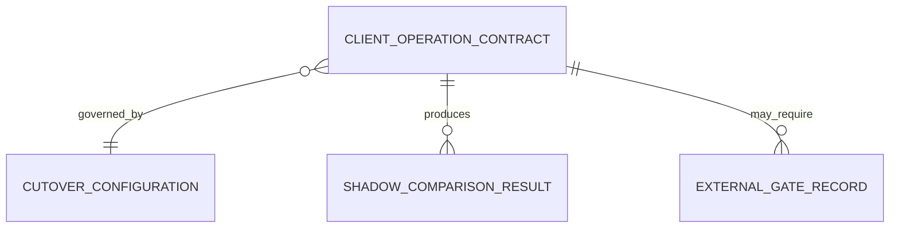

# Phase 14 Delivery Data Model

SPEC-BE-014 owns no database entity. The records below are version-controlled configuration or redacted evidence artifacts only.

## Client Operation Contract

| Field | Rule |
|---|---|
| `id` | Stable unique operation key: `<client>.<domain>.<operation>` |
| `wave` | Integer 1 through 9 |
| `feature` | Existing Mobile service or Admin repository feature |
| `mockSource` | Existing demo/test provider, fixture, handler, or `none` |
| `liveContract` | Existing method/path and owning Spec; `local-only` only for device-owned state |
| `requestMapper`, `responseMapper`, `errorPolicy` | Exact existing/new boundary and strict behavior |
| `authPolicy`, `permissionPolicy` | Clerk session and server-owned permission/MFA/recent-auth requirements |
| `pageSyncPolicy`, `offlinePolicy` | Cursor/page/sync and local preservation behavior |
| `unknownPolicy` | Explicit rejection or contract-authorized ignore rule |
| `shadowPolicy` | Redacted normalization/hash/count/difference rule |
| `cutoverPolicy`, `rollbackPolicy` | Versioned stage and accepted fallback version |
| `testEvidence`, `externalEvidence` | Fresh local proof and honest external gate |

Validation: every exact active client operation identifier appears once, although operations with identical policies may share one table row; grouped rows never use wildcards. Local/composite/development-only methods appear in the reviewed inventory with an explicit disposition. Billing calls appear only in the excluded-inventory section; no required policy field is empty.

## Cutover Configuration

| Field | Rule |
|---|---|
| `schemaVersion` | Positive integer; starts at 1 |
| `client` | `mobile` or `admin` |
| `mode` | `live`, `demo`, or `test`; production requires `live` |
| `wave` | Highest accepted wave, 0 through 9 |
| `stage` | `shadow`, `internal`, `bounded-write`, or `full` |
| `cohort` | Server-derived stable cohort identifier or `all` |
| `acceptedVersion` | Last fully accepted client/config/image version |
| `rollbackVersion` | Last accepted version capable of reading current data |
| `billingAvailable` | Literal `false` for this MVP |

State transition:

```text
shadow -> internal -> bounded-write -> full
   |          |             |          |
   +----------+-------------+----------+-> rollbackVersion
```

Any security, financial, contract, data-loss, performance, provider, or observability blocker transitions immediately to the recorded rollback version. A wave cannot advance while a previous wave is unaccepted.

## Shadow Comparison Result

| Field | Rule |
|---|---|
| `operationId`, `contractVersion`, `clientVersion`, `cohort` | Non-sensitive identifiers |
| `baselineCount`, `liveCount` | Bounded nonnegative counts |
| `baselineHash`, `liveHash` | Stable hash of contract-approved normalized data |
| `differenceCodes` | Allowlisted structural/business difference identifiers only |
| `financialDifferenceMinor` | Integer; must equal zero whenever present |
| `durationMs`, `observedAt` | Bounded duration and timestamp |
| `outcome` | `match`, `blocked`, or `not-comparable`; never a tolerated financial mismatch |

No request/response body, PII, prompt, source text, message, filename, financial description, or secret is retained.

## External Gate Record

| Field | Rule |
|---|---|
| `gate` | Exact provider/device/hosted/publication requirement |
| `status` | `open` or `passed`; never inferred |
| `missingAccessOrAction` | Exact credential, approval, device, deployment, signing, or owner step |
| `whyExternal` | Why local automation cannot prove it |
| `localEvidence` | Commands/artifacts already completed |
| `followUp` | Exact procedure after access is available |
| `owner`, `observedAt` | Responsible party and current observation time |

## Relationships



These relationships describe artifacts; they do not authorize persistent application tables.
