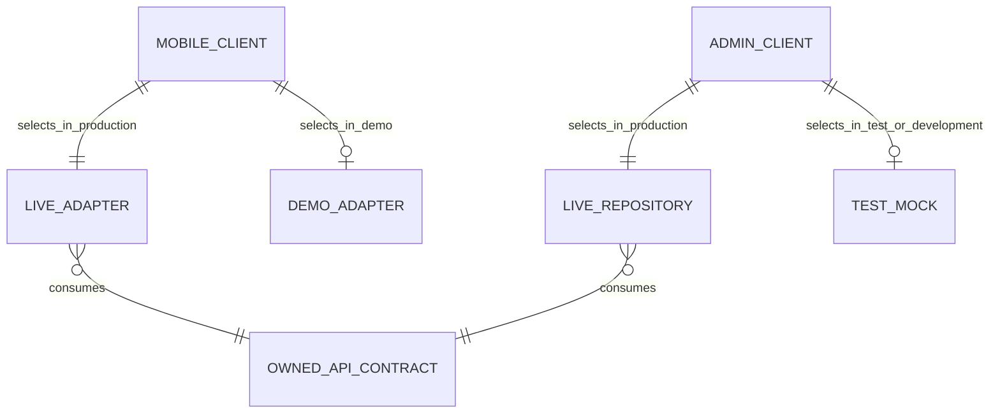

# Backend Feature Specification: Client Cutover, Mock Migration & Free-Only MVP Production Readiness

**Phase / Spec**: Phase 14 / SPEC-BE-014 of 014
**Working Branch**: `main`
**Feature Directory**: `apps/api/specs/014-client-cutover-mock-migration-production-readiness`
**Base Revision**: `65bc5fd2f8875c72c9885787e5c021e4c2576d09`
**Created**: 2026-09-08
**Status**: Artifacts under resolved analysis; production implementation blocked until documentation commit/CI
**Input**: "Cut over the existing Mobile and Admin clients to the accepted live backend in nine ordered waves, preserve local/offline data, isolate mocks from production, prove rollback and release readiness, and keep the initial MVP free-only."

## Objective and Scope

Masarifi's free-only MVP must use the accepted live backend for every active Mobile and Admin capability while retaining mocks only for explicit demo and test use. The cutover proceeds through nine ordered waves: Identity; Reference data and accounts; Ledger and sync; Planning; Tracking and imports; Voice and AI; Reports; Engagement; and Operations.

Each wave must prove contract parity, fail-closed provider selection, redacted shadow comparison, staged rollout, immediate rollback, Mobile local-data preservation, security, performance, and operational readiness before the next wave begins. The phase assembles evidence and corrects the smallest root cause in an existing owning Spec when a cutover exposes a defect. It creates no backend domain capability or persistent cutover data.

The release remains free-only. Billing is unavailable in production and SPEC-BE-012 remains reserved for a separately approved Post-MVP effort.

## Dependencies and Repository Baseline

- **Prior backend Specs**: SPEC-BE-001 through SPEC-BE-011 and SPEC-BE-013 are historically implemented, pushed, and remotely green at the verified baseline. Fresh Phase 14 acceptance is still blocked by the owner defects recorded in `research.md`. SPEC-BE-012 is not an active dependency.
- **Client remediation**: Category usage count, per-account automatic tracking, and credit-card terms/payoff remediation are complete, pushed, and remotely green.
- **Prior client Specs**: Their latest requirements and addenda remain authoritative for public behavior, but historical completion labels do not close unchecked implementation, device, accessibility, performance, usability, or provider evidence. Phase 14 carries every current local gap to completion and every genuinely external gate to the external ledger.
- **Current repository facts**: The active checkout is `main`; `main` and `origin/main` both resolve to `65bc5fd2f8875c72c9885787e5c021e4c2576d09`; the Phase 13 verification-fix revision is contained in `origin/main`; no second task is modifying this checkout.
- **Preserved work**: Pre-existing modified and untracked paths recorded during preflight remain user-owned and must be excluded through path- and hunk-scoped staging.
- **Governing documents**: Backend Constitution, Backend Master Plan, Client Remediation Plan, accepted Mobile/Admin specifications, and live contracts owned by prior Backend Specs.
- **Execution rule**: Every wave completes local verification, independent review, a direct `main` commit and push, and required remote CI before the next wave begins.

## Owned Resources

SPEC-BE-014 owns client adapter selection, client contract mappings, shadow comparison, cohort and cutover configuration, mock isolation, production fail-closed behavior, rollback controls, cutover evidence, and final release verification.

| Resource type | Ownership |
|---|---|
| Database tables, views, functions, triggers, grants, policies, migrations | None |
| Backend endpoints, DTOs, queues, jobs, workers, events, domain caches | None |
| Mobile and Admin live adapters and selectors | Owned for cutover |
| Demo/test adapters and fixtures | Owned only for production isolation and explicit-mode selection |
| Client contract manifest, cutover configuration, mock-removal report, release evidence | Owned |

Existing domain resources remain owned by SPEC-BE-001 through SPEC-BE-011 and SPEC-BE-013. A defect discovered during cutover is corrected in that owner's existing implementation and tests. A missing capability blocks the affected wave until the owning Spec and architecture are corrected; it is never replaced with a client calculation, fabricated response, hidden mock, or new Phase 14 backend resource.

## User Scenarios and Testing

### User Story 1 - Trusted Identity and Access (Priority: P1)

A customer or administrator enters Masarifi through verified identity, profile, preference, onboarding, device, session, and access flows whose authority comes from the server.

**Why this priority**: Every later live operation depends on authenticated identity and enforceable authorization.

**Independent Test**: In production mode, a valid identity can access only its allowed data and actions; invalid, revoked, stale, under-privileged, or misconfigured identity fails closed without mock fallback.

**Acceptance Scenarios**:

1. **Given** valid customer credentials, **When** the customer signs in and manages profile, preferences, devices, or sessions, **Then** the live service returns owner-scoped state and revocation takes effect.
2. **Given** an Admin action requiring exact permission, recent authentication, or MFA, **When** those conditions are missing, **Then** the action is denied even if the control is visible or enabled.
3. **Given** missing or invalid production identity configuration, **When** either client starts or builds, **Then** it fails closed and cannot select demo identity.

### User Story 2 - Complete Reference and Account Records (Priority: P1)

A customer manages currencies, supported countries, categories, and accounts without losing versions, tracking choices, category usage state, or credit-card terms.

**Why this priority**: Accounts and reference data define valid inputs for every financial command.

**Independent Test**: Create, read, update, archive, merge, and payoff-related round trips preserve every supported field and reject ownership or version conflicts explicitly.

**Acceptance Scenarios**:

1. **Given** an account with credit-card terms and a per-account tracking choice, **When** it is read and updated through the live adapter, **Then** all fields and versions round-trip unchanged except for the requested update.
2. **Given** a category in use, **When** archive or merge is requested, **Then** the authoritative usage count and conflict behavior match the accepted contract.
3. **Given** an unknown reference or account state, **When** it reaches a client mapper, **Then** the client reports an explicit contract failure rather than coercing it.

### User Story 3 - Lossless Ledger and Offline Sync (Priority: P1)

A customer creates and manages transactions, transfers, refunds, card payoffs, deletes, restores, and filters while online or reconnecting, with exact financial integrity and preserved local work.

**Why this priority**: Financial records and offline mutations cannot tolerate silent loss, rounding, duplication, or Last Write Wins.

**Independent Test**: A populated encrypted Mobile store with pending and conflicting mutations survives upgrade, interrupted upload, delta sync, retry, reconnect, tombstones, and rollback while ledger and report reconciliation remain exact.

**Acceptance Scenarios**:

1. **Given** a retried financial command, **When** the same operation is submitted again, **Then** idempotency returns the original result and creates no duplicate postings.
2. **Given** a financial version conflict, **When** synchronization occurs, **Then** the conflict is rejected or enters explicit review and local pending data remains available.
3. **Given** malformed money, missing required financial fields, an unknown state, or an unsupported error, **When** a mapper processes it, **Then** it fails explicitly without rounding, defaulting, or dropping data.

### User Story 4 - Reconciled Financial Planning (Priority: P1)

A customer uses salary, budgets, obligations, payments, savings goals, and projections with the same complete model and ledger-derived effects online and offline.

**Why this priority**: Planning decisions depend on exact amounts, schedules, links, and statuses.

**Independent Test**: Rich planning records round-trip through the live service, preserve offline drafts and pending work, and reconcile with source ledger transactions without duplicated automatic effects.

**Acceptance Scenarios**:

1. **Given** planning records containing optional and scheduled fields, **When** they are created, updated, synchronized, and read, **Then** every supported field retains its meaning and precision.
2. **Given** a linked ledger effect, **When** planning projections refresh, **Then** it is counted once and matches the accepted financial fixture.

### User Story 5 - Consent-Based Tracking and Imports (Priority: P1)

A customer or authorized administrator uses tracking preferences, rules, review, history, duplicate handling, imports, and parser operations only when consent, account gates, source support, and retention rules permit it.

**Why this priority**: Ingestion can expose private source material or create incorrect financial records if it fails open.

**Independent Test**: Unsupported or opted-out capture is unavailable, imports remain bounded and retained only as allowed, duplicate decisions are deterministic, and accepted results reach finance only through owned ledger commands.

**Acceptance Scenarios**:

1. **Given** tracking is disabled globally or for an account, **When** capture is attempted, **Then** no financial mutation or synthetic success occurs.
2. **Given** an unknown sender, format, parser state, or review decision, **When** it is processed, **Then** the flow fails explicitly or enters the defined review path.
3. **Given** an authorized duplicate resolution, **When** it is retried, **Then** the outcome is stable and no duplicate transaction is created.

### User Story 6 - Advisory Voice and AI (Priority: P1)

A customer uses voice processing and the assistant for evidence-bearing advice and previews while every financial action remains deterministic, confirmed, authorized, and server-executed.

**Why this priority**: AI output is untrusted and must never gain financial or authorization authority.

**Independent Test**: Conversations, evidence, proposals, preview and confirmation, quota, privacy, approved-action, and provider-outage cases succeed or fail safely without direct provider access from clients.

**Acceptance Scenarios**:

1. **Given** an AI proposal that could affect money, **When** the customer has not explicitly confirmed it, **Then** no financial command executes.
2. **Given** a malformed, unsupported, over-quota, privacy-ineligible, or unavailable provider response, **When** it is processed, **Then** core financial functions remain available and no fabricated answer appears.
3. **Given** the free-only MVP, **When** AI use is evaluated, **Then** the approved safe server-side default quota applies without a paid entitlement path.

### User Story 7 - Exact Reports and Authorized Delivery (Priority: P1)

A customer or administrator views summaries, charts, analytics, exports, and scheduled reports whose values exactly match the financial source of truth and whose delivery respects ownership and privacy.

**Why this priority**: Reports influence financial decisions and must not drift from the ledger.

**Independent Test**: Shadowed aggregates match exactly, time zones and filters are honored, exports are redacted and authorized, and delivery remains explicitly pending or unavailable until provider evidence exists.

**Acceptance Scenarios**:

1. **Given** the accepted financial fixture, **When** Mobile and Admin request any supported aggregate, **Then** values and source versions match the canonical report result with zero financial tolerance.
2. **Given** a scheduled report, **When** its local-time boundary occurs, **Then** generation uses the correct period and does not claim email delivery without provider confirmation.

### User Story 8 - Private Engagement and Support (Priority: P1)

A customer or administrator uses notifications, preferences, support, attachments, feedback, abuse reports, and published content without exposing financial or internal information.

**Why this priority**: Engagement crosses provider, lock-screen, file, and staff/customer trust boundaries.

**Independent Test**: Quiet hours, deduplication, owner isolation, internal-note isolation, attachment quarantine, published-only content, and redacted provider payloads behave identically through live clients.

**Acceptance Scenarios**:

1. **Given** quiet hours or duplicate delivery, **When** a notification is evaluated, **Then** it is suppressed or deduplicated according to the stored preference.
2. **Given** a customer ticket, **When** another customer reads it or an internal note is returned to a customer, **Then** access is denied and no internal content is disclosed.
3. **Given** an unscanned attachment or unpublished article, **When** a customer requests it, **Then** it remains unavailable.

### User Story 9 - Honest Operations and Release State (Priority: P1)

An authorized administrator observes health, providers, jobs, attempts, incidents, settings, flags, maintenance, performance, and recovery evidence without gaining arbitrary execution or seeing secrets.

**Why this priority**: Final cutover is safe only when operators can observe, stop, roll back, and recover it.

**Independent Test**: Exact Admin permissions and MFA guard every action, sensitive settings are redacted, flags cannot weaken trust controls, metrics remain bounded, and production reports billing unavailable with no active billing provider.

**Acceptance Scenarios**:

1. **Given** an operator without the exact permission or MFA state, **When** a privileged operational action is attempted, **Then** it is denied and audited.
2. **Given** a feature flag or setting change, **When** it would weaken authentication, authorization, RLS, audit, financial integrity, or production mock isolation, **Then** the change is rejected.
3. **Given** the free-only release, **When** capability and provider health are shown, **Then** `billingAvailable` is false and no Stripe or billing provider is active.

### Edge Cases

- A server adds an unknown field, state, enum, or error code: the relevant mapper fails explicitly and records a redacted contract difference.
- A shadow response differs only in presentation order: comparison follows the operation's documented normalization; financial values, identities, versions, and business states are never tolerance-normalized.
- A live write succeeds but the client loses the response: retry uses the same operation identity and resolves without duplicate effects.
- A rollback occurs after new server data exists: the last accepted client/image preserves that data and operation identities and can resume forward synchronization idempotently.
- A device upgrades with legacy floating-point money or incomplete financial rows: the item enters explicit review and remains recoverable; no silent conversion is allowed.
- A production build has demo/MSW enabled, lacks a valid API URL or identity configuration, or imports a forbidden direct provider secret: build or startup validation fails.
- A provider or hosted system is unavailable: all local controls and evidence complete, while the exact external gate remains open and is never recorded as passed.
- Concurrent work appears on the same checkout: the affected wave stops before staging until ownership is resolved without discarding either party's work.

## Database Design

### Owned Tables

None. SPEC-BE-014 must not add a table, migration, policy, grant, view, function, trigger, or persistent cutover store. Existing schemas are verified through their owning Specs.

### Relationships and ERD

These are delivery boundaries, not database entities.

### RLS, Grants, and Authorization

No new policy is owned. The release candidate must pass the complete existing owner, non-owner, Admin, worker, and anonymous RLS/grant matrix. Clients authenticate with verified Clerk tokens; they never provide authoritative roles, service keys, or provider secrets. Exact server permissions, recent authentication, MFA, and support-access grants remain independent checks.

## API Contracts

SPEC-BE-014 owns no endpoint or DTO. It consumes and verifies every active client operation already owned by SPEC-BE-001 through SPEC-BE-011 and SPEC-BE-013. Before implementation, a versioned client-contract manifest must identify each operation's feature, mock/demo source, live endpoint, request and response mapping, error behavior, authentication and permission boundary, pagination or sync behavior, offline behavior, unknown-state behavior, shadow method, cutover switch, rollback switch, test evidence, and external acceptance gate.

An OpenAPI or runtime mismatch is corrected in the existing owning Spec before the related adapter is accepted.

## Functions, Views, and Triggers

None owned. Client adapters may call only accepted public contracts. They must not directly write financial source tables or bypass domain commands.

## Queues, Jobs, and Events

None owned. Cutover verification may observe or invoke existing domain-owned jobs and replay procedures, but it must not add generic cutover jobs or events.

## Business Rules

- The nine waves execute strictly in order, and each wave is reviewed, committed, pushed, and remotely green before the next begins.
- Production Mobile selects `live` explicitly. `demo` is permitted only in an explicit demo build; test providers exist only in tests.
- Admin MSW is limited to test/development. A production build with MSW enabled fails, and unhandled mock requests fail instead of bypassing unexpectedly.
- No production service silently falls back to a mock, fabricates a response, discards an unknown field or state, or invents financial data.
- Every wave supports read shadow, internal cohort, bounded write cohort, full traffic, an observation window, and immediate rollback to the last accepted adapter or image.
- Shadow evidence contains only redacted counts, hashes, versions, and differences. Any financial difference stops the wave.
- Mobile SQLite records, pending mutations, conflicts, device-only preferences, drafts, temporary state, PIN/biometric material, and encryption guarantees survive cutover and rollback.
- `billingAvailable` is false. Production exposes no Stripe, checkout, paid entitlement, subscription management, promotions, payment history, billing reconciliation, or subscription mock.
- AI uses the approved safe server-side default quota and remains independent from billing.
- External evidence is recorded only after the real provider, hosted system, physical device, registry, signer, store, or responsible owner has completed it.

## Security and Privacy Requirements

- Production configuration fails closed for invalid API, identity, mode, mock, or security values.
- Bundles, images, logs, evidence, fixtures, and client configuration contain no server credentials, service-role key, database secret, Clerk secret, OpenRouter key, delivery credential, signing secret, raw prompt, financial content, or customer PII.
- Owner isolation, exact Admin authorization, recent authentication, MFA, audit, safe errors, rate limits, attachment safety, webhook verification, and provider outage isolation remain release blockers where applicable.
- Complete OWASP ASVS 5.0.0, OWASP API Security Top 10:2023, OWASP Top 10:2025, and applicable MASVS 2.1.0 traceability must identify current implementation and evidence.
- Production scans must detect mock/debug imports, unsafe URLs, direct OpenRouter or service-role access, secrets, vulnerable dependencies/images, and unresolved exploitable Critical or High findings.

## Performance and Caching Requirements

- Each live operation must meet the existing owning Spec's P95, P99, payload, pagination, timeout, query-plan, and cache requirements on production-like data.
- Sync, queues, workers, AI isolation, reports, and recovery must meet accepted throughput and bounded-work limits without N+1 or unbounded queries.
- Shadow comparison must add bounded work, redact content, and remain removable or disableable through wave configuration.
- No cache or new infrastructure is added without measured evidence and ownership in the relevant existing Spec.

## Mobile and Admin Integration

Mobile and Admin retain their accepted screens, accessibility behavior, loading, empty, error, retry, pagination, filter, offline, and local-state behavior while their existing service/repository boundaries select live providers in production. The latest Mobile addenda govern account/card fields, authoritative category preview, transaction recovery, rich report settings/snapshots, and multi-proposal voice/atomic effects. The approved free-only Phase 14 direction supersedes historical Free/Basic/Premium and mock-only delivery assumptions. Mapping is field-complete and strict at trust boundaries. Admin authorization remains server-owned; role headers, hidden controls, or disabled controls never grant authority.

## Functional Requirements

- **FR-001**: The release process MUST verify the prerequisite gate, synchronized `main` baseline, preserved user work, and exclusive checkout before any Phase 14 production implementation.
- **FR-002**: The phase MUST maintain a versioned, complete client-contract manifest for every operation in all nine waves.
- **FR-003**: Each production Mobile capability MUST select an available live provider explicitly and MUST fail build or startup validation for demo/mock selection, invalid API configuration, invalid identity configuration, silent fallback, unknown contract states, or forbidden direct provider access.
- **FR-004**: Each production Admin repository MUST use live server APIs; production MSW enablement MUST fail the build, and unhandled mock requests MUST fail.
- **FR-005**: Request, response, error, authentication, permission, pagination, sync, offline, and unknown-state mappings MUST preserve the full accepted contract and reject malformed or unsupported input explicitly.
- **FR-006**: Financial mapping and shadow comparison MUST use integer minor units, preserve versions and idempotency, reject Last Write Wins, and stop on any discrepancy.
- **FR-007**: Every active wave MUST provide redacted shadow comparison, staged cohorts, an observation window, and an immediate rollback switch that preserves committed server data and Mobile operation identities.
- **FR-008**: Cutover and rollback MUST preserve Mobile SQLite records, pending mutations, conflicts, drafts, device-only preferences, protected local material, and encryption requirements.
- **FR-009**: Identity cutover MUST prove Clerk-only tokens, owner isolation, revocation, recent authentication, exact Admin RBAC, and MFA behavior.
- **FR-010**: Reference/account cutover MUST prove field-complete round trips, versions, category usage/archive/merge, per-account tracking, account constraints, and credit-card/payoff fields.
- **FR-011**: Ledger/sync cutover MUST prove exact postings, idempotency, expected versions, pagination, tombstones, conflicts, retry/reconnect, and lossless offline synchronization.
- **FR-012**: Planning cutover MUST prove complete rich-model round trips, schedules, ledger effects, no duplicate effects, offline preservation, and numeric parity.
- **FR-013**: Tracking/import cutover MUST prove consent, account opt-out, supported-source failure behavior, parser corpus, retention, duplicate resolution, and ledger-command-only financial writes.
- **FR-014**: Voice/AI cutover MUST prove advisory-only output, explicit confirmation, evidence, privacy/ZDR policy, allowlisted actions, free default quota, and provider-outage isolation.
- **FR-015**: Report cutover MUST prove exact aggregate reconciliation, filter and timezone behavior, authorized redacted export, and honest delivery status.
- **FR-016**: Engagement cutover MUST prove quiet hours, deduplication, redacted delivery content, owner/internal-note isolation, attachment quarantine/scanning, and published-only content.
- **FR-017**: Operations cutover MUST prove exact permission/MFA gates, bounded operational actions, redacted settings, invariant-preserving flags, safe metrics, and inactive billing providers.
- **FR-018**: The phase MUST execute every locally available security, performance, recovery, rollback, database, API, Mobile, Admin, contract, bundle, mock-removal, dependency, image, review, and release gate required by the governing plans.
- **FR-019**: External gates MUST identify the exact unavailable credential, approval, device, provider, deployment, publication, signing, or store action; completed local evidence; and the exact follow-up procedure, without claiming a pass.
- **FR-020**: SPEC-BE-014 MUST create no database or backend domain resource and MUST NOT implement SPEC-BE-012, billing, Stripe, paid features, or later scope.

## Tests and Verification Evidence

Each wave requires failing contract-parity tests before its adapter change, focused unit/integration checks, production-mode selection checks, shadow/rollback evidence, data-preservation checks, security/performance gates, independent review, and required remote CI on the pushed `main` SHA.

Final verification covers the clean local database lifecycle; migration checksums; full RLS/grant matrix; API unit, contract, integration, E2E, security, performance, stress, recovery, and container checks; Mobile typecheck, lint, quality gates, full tests, integration and applicable E2E; Admin typecheck, lint, production build, full tests, and applicable route/viewport E2E; contract/schema drift; bundle/static, mock, secret, dependency and image scans; financial/report reconciliation; Clean Code review; test review; security diff review; and the final release checklist.

Provider, hosted-environment, device, publication, signing, and store checks remain explicit external gates until genuine evidence is obtained.

## Migration and Rollback Strategy

No Phase 14 backend schema or Supabase migration exists. Mobile-owned local storage may receive the minimum additive/idempotent owner-partition or encryption correction required to preserve existing records safely; that work remains a client-storage correction and cannot create a Phase 14 backend resource. Existing backend domain migrations are revalidated, including clean reset, failure/forward-correction, N-1 application compatibility, replay, restore, and checksums.

Each wave records the accepted adapter/configuration/image, changes cohorts through versioned configuration, preserves server data and client operation identities, and can switch immediately to the last accepted version. Forward synchronization after rollback must be idempotent and lossless. A security, financial, contract, data-loss, performance, provider, or observability failure stops or rolls back the wave.

## Observability and Operations

Each wave records client/provider version, cohort, redacted comparison counts/hashes/differences, latency/error/sync/queue/provider status, rollback state, and observation-window outcome using existing domain and platform telemetry. Metrics and logs must have safe cardinality and no customer content. The final release evidence links alerts, dashboards, runbooks, reconciliation, backup/restore, RPO/RTO, disaster recovery, storage recovery, provider health, and rollback proof.

## Assumptions

- The approved nine-wave order and direct-main workflow are final for this phase.
- Existing accepted APIs and domain behavior are the target; mismatches are defects in their owning Spec unless a capability is demonstrably absent.
- Demo and deterministic test modes remain useful and may remain in source when explicit mode boundaries prevent production selection and bundling risk is controlled.
- Hosted and physical-provider evidence may remain open only after all local work and exact follow-up procedures are complete.

## Out of Scope

- Stripe, billing, checkout, paid entitlement, subscription management, promotion codes, payment history, billing reconciliation, and SPEC-BE-012.
- New Phase 14 backend database tables, Supabase migrations, RLS policies, grants, endpoints, DTOs, functions, workers, jobs, events, or a generic cutover store. Proven owner defects or missing owner capability are corrected under the existing owning Spec before client acceptance.
- Client-side financial business rules, silent mock fallback, tolerance for financial discrepancies, and fabricated provider evidence.
- SPEC-BE-015 or any Post-MVP capability.

## Acceptance Criteria

- **AC-001**: All nine waves complete in order, each with local verification, independent review, a direct `main` push, and successful required remote CI before the next wave starts.
- **AC-002**: Production Mobile and Admin exercise all active free-only capabilities through live services with zero hidden mock/demo fallback.
- **AC-003**: The versioned contract manifest covers every active operation and links accepted tests and any honest external gate.
- **AC-004**: Mobile encrypted records, pending mutations, conflicts, drafts, and protected device state survive cutover and rollback without loss or duplication.
- **AC-005**: All financial and report shadow comparisons reconcile exactly; no financial mismatch is accepted.
- **AC-006**: Complete authorization, RLS/grant, security, privacy, performance, recovery, rollback, and disaster-recovery gates have current evidence with zero unresolved exploitable Critical or High finding.
- **AC-007**: Production capability metadata reports `billingAvailable: false`, and no Stripe, paid, subscription, promotion, payment-history, reconciliation, or billing mock path is active.
- **AC-008**: The mock-removal report proves every retained mock is unreachable from production and identifies its explicit demo/test owner.
- **AC-009**: Every local gate passes, each external gate is stated exactly and honestly, and the final pushed `main` SHA matches `origin/main` with required CI green.
- **AC-010**: All pre-existing unrelated user work remains present and excluded from Phase 14 commits unless a reviewed hunk is deliberately integrated.

## Success Criteria

- **SC-001**: 100% of active Mobile and Admin operations in the nine waves have a reviewed live mapping and evidence entry before release.
- **SC-002**: 100% of production-mode provider-selection checks reject mock/demo operation and invalid required configuration.
- **SC-003**: 100% of accepted financial and report comparison cases match exactly, with zero tolerated monetary difference and zero lost field.
- **SC-004**: A cutover and rollback rehearsal preserves all seeded local records and pending operations, with zero duplicate committed effect after reconnect.
- **SC-005**: Every current customer and Admin journey retains its documented loading, empty, error, retry, permission, pagination, accessibility, and offline behavior.
- **SC-006**: All locally executable release gates pass and every unavailable external gate has a named owner/action and reproducible follow-up procedure.
- **SC-007**: The final free-only capability view contains zero active billing provider or paid feature and clearly reports billing unavailable.

## Definition of Done

- [ ] All nine waves and every locally executable acceptance criterion pass in the required order.
- [ ] Specification, plan, tasks, research, client-contract manifest, quickstart, checklists, Constitution Check, rollback plan, mock-removal report, and cross-artifact analyses are complete.
- [ ] Contract, financial, security, performance, observability, migration, rollback, recovery, and external-gate evidence is current and honest.
- [ ] Every SPEC-BE-014 task is checked or accurately identified as an unavoidable external gate after local work is complete.
- [ ] Every wave commit and the final closeout are pushed directly to `main`; `main` and `origin/main` match and required remote CI succeeds.
- [ ] Existing unrelated user work remains preserved.
- [ ] SPEC-BE-012 and all billing/Post-MVP scope remain unimplemented.

Verification listed in this document is required evidence, not a claim that it has already been executed.
